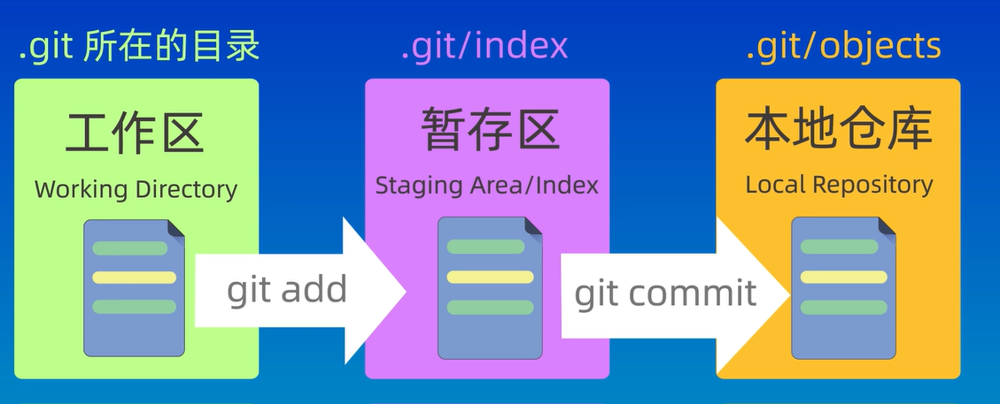
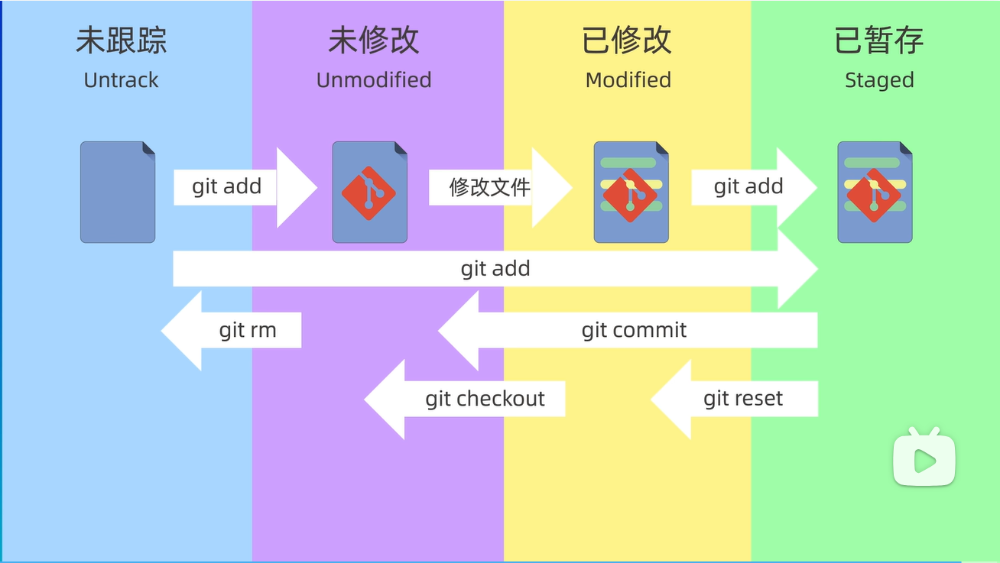
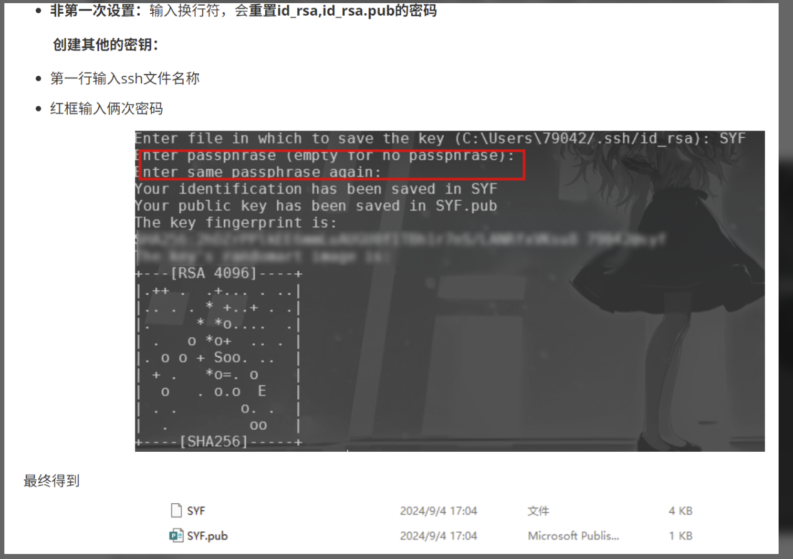

# Git - Summary

## Git 核心概念

1. **提交 (commit)**

   *   一次提交就是 **一个完整的代码快照**（+ 指向它的元数据）。
   
   
      *   提交形成一棵 **有向无环图（DAG）**，本质上是一个「历史记录树」。
   


2. **分支 (branch)**

   *   分支其实只是一个「指针」，指向某个提交。
   
   
      *   `HEAD` 再指向某个分支（也可能直接指向提交，称作 **游离 HEAD**）；**HEAD 表示最近/最后一次提交**
   
   
      *   **树结构** = 提交之间的关系 + 各个分支的指针。
   


3. **仓库 (repository)**

   *   完整的项目，包含完整的历史记录、分支信息及所有文件版本。
   
   
      *   本地仓库的第一个分支：`main`
   
   
      *   远程仓库的第一个分支：`origin/main`
   


## 配置与初始化

### 基本配置

```bash
git config --global user.name "Your Name"  # 配置全局用户名
git config --global user.email "your.email@example.com"  # 配置全局邮箱
```

### 仓库初始化

```bash
# 从本地文件夹创建仓库
mkdir project  # 创建项目文件夹
cd project
git init  # 初始化本地仓库（生成.git目录）

# 克隆远程仓库
git clone git@github.com:user/repo.git  # 克隆到默认文件夹
git clone git@github.com:user/repo.git custom\_name  # 克隆到自定义文件夹
git clone -o custom\_remote https://github.com/jquery/jquery.git  # 自定义远程主机名（默认远程主机名为origin）
```

> 注：删除`.git`目录后，文件夹将变回普通文件夹，失去版本控制功能。
>

## 工作区域与文件状态

### 工作区域



1.  **工作区**：实际操作的文件目录（可见的项目文件）。

2. **暂存区（索引）**：`git add` 后文件保存的区域，是下次提交的 “预备清单”。

   *   Git 提交实际读取暂存区内容，未添加到暂存区的修改不会被提交。
   
   
      *   作用：作为过渡层，避免误操作，保护工作区和版本库。
   


3. **版本库（本地仓库）**：工作区中的隐藏目录 `.git`，包含所有提交历史、分支指针、暂存区等核心数据。

```bash
# 查看工作区文件
ls;
# 查看暂存区文件
git ls-files;
```

### 文件状态



1.  **未跟踪**：新创建的文件，尚未被 Git 管理（未执行 `git add`，未跟踪与未修改的文件）。

2.  **已修改（modified）**：文件被修改，但未添加到暂存区。

3.  **已暂存（staged）**：修改已通过 `git add` 加入暂存区，等待提交。

4.  **已提交（committed）**：文件已被安全保存到本地版本库。

## 基本操作命令

### 本地仓库命令

1.  **提交管理**：控制文件从暂存到版本库的流程

```bash
# 添加文件到暂存区
git add <file>  # 添加单个文件
git add *.txt  # 添加指定类型的所有文件（如所有.txt）
git add .  # 添加当前目录下的所有修改（包括新增、修改、删除）

# 提交到版本库
git commit -m "提交说明"  # 提交暂存区所有文件到版本库
git commit --amend  # 修改最后一次(HEAD指向的)提交（适用于漏加文件或修正提交信息）
```

2. **分支管理**：创建、切换、删除开发线路

```bash
git branch <name>  # 创建分支
git switch <name>  # 切换到指定分支（新语法）
git checkout <name>  # 切换到指定分支（旧语法）
git checkout -b <name>  # 创建并立即切换到新分支

git branch -d <name>  # 删除已合并的分支（未合并则删除失败）
git branch -D <name>  # 强制删除分支（即使未合并，慎用）
```

3. **合并与变基**：融合不同分支的工作

   - `git merge <branch>`：将分支 `<branch>` 合并到当前分支，生成新的 `merge commit`

     *   保留合并记录，但历史树可能更复杂。

     *   若有冲突，需手动解决后执行 `git commit` 完成合并。


      *   `git rebase <branch>`：将当前分支的提交 “搬移” 到 `<branch>` 末尾，生成新的提交副本（原提交被丢弃）
          *   不产生 `merge commit`，历史树更简洁（线性历史）


      *   `git rebase -i HEAD~<num>`：交互式变基，对最近 `<num>` 次提交进行重排、合并或修改。


4. **版本控制**：回退或撤销历史提交

```bash
# 回退版本（本质是移动分支指针）
git reset --soft HEAD^  # 回退到上一版本，保留工作区和暂存区修改
git reset --hard HEAD^  # 回退到上一版本，丢弃工作区和暂存区修改（慎用，不可恢复）
git reset --mixed HEAD^  # 默认模式，保留工作区修改，清空暂存区

# 撤销提交（安全保留历史）
git revert HEAD  # 创建新提交，抵消当前HEAD的修改（不改变历史记录）

# 查看操作记录（用于找回误删的提交）
git reflog  # 显示所有分支的操作记录（包括reset、rebase等）
```

5. **查看信息**：获取仓库状态和历史

```bash
git status  # 查看工作区和暂存区的状态（哪些文件被修改、未跟踪等）

git log  # 查看提交历史（按时间倒序，最新提交在最前）
git log --oneline  # 简洁显示提交历史（每行一条，仅含哈希前缀和提交说明）
git log --graph #图形化显示历史提交树
```

6. **文件删除**：从版本库移除文件

```bash
rm <file>  # 仅从工作区删除文件（暂存区和版本库不受影响）

git rm <file>  # 从工作区和暂存区删除文件，需执行git commit完成版本库删除
git commit -m "remove <file>"  # 提交删除操作，彻底从版本库移除
```

### 远程仓库命令

1.  **基本操作**：同步本地与远程仓库

```bash
# 拉取远程更新（仅下载，不合并）

git fetch  # 下载所有远程分支的最新提交，更新远程跟踪分支（如origin/main）

git fetch  <remote/默认origin> <branch>  # 仅拉取指定远程分支的更新

# 拉取并合并远程更新
git pull  # 等价于 git fetch + git merge origin/<当前分支>（默认合并到当前分支）
git pull <remote> <branch>  # 拉取指定远程仓库的指定分支并合并到当前分支
git pull --rebase <branch>  # 等价于 git fetch + git rebase（以变基方式合并，无额外merge commit）

# 推送本地提交到远程
git push  # 推送当前分支到远程对应分支（需确保本地分支基于远程最新版本）
git push <remote> <local-branch>:<remote-branch>  # 推送本地分支到指定远程分支
git push -f  # 强制推送（覆盖远程版本，多人协作时慎用，可能丢失他人提交）
git push --force-with-lease  # 强制推送但先检查远程状态（若远程有新提交则推送失败，更安全）
```

2. **分支追踪**：关联本地分支与远程分支

```bash
git branch -u origin/main  # 设置当前分支追踪远程分支origin/main

git checkout -b <local-branch> origin/<remote-branch>  # 创建本地分支并直接追踪指定远程分支
```

3. **远程仓库管理**：添加或查看远程仓库

```bash
git remote add <remote-name> <url>  # 添加远程仓库（如git remote add origingit@github.com:user/repo.git）

git remote -v  # 查看所有远程仓库的地址（fetch和push地址）
```

## 高级技巧

1. **文件恢复**：丢弃工作区或暂存区的修改

   ```bash
   git checkout -- <file>  # 丢弃工作区对<file>的修改（恢复到暂存区或版本库状态）
   git restore <file>  # 新语法，功能同git checkout -- <file>
   ```

2. **标签管理**：标记重要版本（如发布版本）

   ```bash
   git tag v1.0  # 创建轻量标签（仅关联提交，无额外信息）
   git tag -a v1.0 -m "版本1.0发布"  # 创建带注释的标签（含详细说明）
   git push --tags  # 推送所有标签到远程仓库（标签不会随普通push自动上传）
   ```

3. **子模块**：在仓库中嵌入其他仓库（适用于依赖外部项目）

   ```bash
   git submodule add <url>  # 添加子模块（如嵌入第三方库）
   git submodule update --init --recursive  # 初始化并更新子模块（克隆仓库后需执行）
   ```

   

## SSH 配置与 GitHub 集成

### 生成 SSH 密钥

```bash
cd ~/.ssh  # 进入SSH配置目录（若无则创建：mkdir \~/.ssh）
ssh-keygen -t rsa -b 4096  # 生成RSA密钥对（-b 4096指定密钥长度）
# 首次设置直接按Enter（无密码）；非首次可自定义密钥文件名或重置密码
```

生成后在 `.ssh` 目录得到两个文件：

*   `id_rsa`：私钥（需妥善保管，不可泄露）

*   `id_rsa.pub`：公钥（用于配置到 GitHub 等平台）

**如果不是第一次设置：**



### 配置 SSH 代理

```bash
# 启动SSH代理
eval "$(ssh-agent -s)"  
# 将私钥添加到代理（避免每次操作重复输入密码）
ssh-add ~/.ssh/id_rsa  # 替换为实际私钥文件名
# 测试与GitHub的连接
ssh -T git@github.com  # 成功则返回"Hi <username>! ..."
```

### 多账户配置（通过 config 文件）

在 `~/.ssh/config` 中添加配置（无则创建该文件）：

```bash
# 配置1：默认GitHub账户
Host github.com
  HostName github.com
  PreferredAuthentications publickey
  IdentityFile ~/.ssh/id_rsa  # 对应私钥路径

# 配置2：其他GitHub账户（如工作账户）
Host github-work
  HostName github.com
  PreferredAuthentications publickey
  IdentityFile ~/.ssh/id_rsa_work  # 对应工作账户的私钥
```

### GitHub 配置SSH

1. **添加公钥到 GitHub**：

   - 复制公钥内容：`cat ~/.ssh/id_rsa.pub`
   - 登录 GitHub → 点击头像 → `Settings` → `SSH and GPG keys` → `New SSH key` → 粘贴公钥并保存。

2. **克隆与推送**：

   ```bash
   # 克隆仓库（使用SSH地址）
   git clone git@github.com:user/repo.git  
   
   # 推送本地提交
   git push origin main  # 推送main分支到远程origin/main
   ```
