> **高频考点总结**
>
> | **知识点**  | **关键问题**                                                 |
> | :---------- | :----------------------------------------------------------- |
> | **Slice**   | 扩容机制、与数组区别、传参时的深/浅拷贝                      |
> | **Map**     | 底层结构、渐进式扩容、并发安全方案                           |
> | **Channel** | 有/无缓冲区别、`nil`/`closed` 操作结果、多路复用（`select`） |
> | **GMP**     | 调度流程、`P` 的作用、`Work Stealing` 策略                   |
> | **GC**      | 三色标记流程、混合写屏障作用、触发条件（内存阈值）           |
> | **接口**    | `iface` vs `eface`、类型断言、接口的动态类型                 |
> | **锁**      | `Mutex` 饥饿模式、`RWMutex` 适用场景、自旋锁实现             |

# Go Summary

**基础语法：**

```css
Go基础语法
│
├── 值类型 vs 引用类型（map、slice、channel）### 引用类型每个类型都要总结
├── 结构体、方法、接口（interface） ###关键：接口 与 反射
├── defer、panic、recover（异常处理机制） ###异常处理这一块的面经少
├── 类型断言 vs 类型转换
└── 包导入、init函数、go mod 模块管理
### 这一部分，还可能考非算法题的手撕，比如：channel并发题
```

**并发模型：**

```css
Go 并发模型
│
├── Goroutine 轻量线程
│
├── Channel 通信机制
│   ├── 无缓冲 vs 有缓冲
│   ├── select 多路复用
│
├── sync 并发原语
│   ├── Mutex、RWMutex
│   ├── WaitGroup
│   ├── Once、Cond、Pool
│
├── GMP调度模型
│   ├── G：goroutine
│   ├── M：OS线程
│   └── P：调度器（1.5之后 M 不能多于 P）
│
└── 并发问题：死锁、资源竞争、原子操作
```

**内存模型：**

```go
Go 内存模型
│
├── 栈 vs 堆 分配
├── 内存逃逸分析
│
├── GC 垃圾回收机制
│   ├── 三色标记清除算法
│   ├── STW（Stop The World）
│   └── 写屏障
│
└── 性能分析工具
    ├── pprof
    └── go tool trace
```

## 语法基础

### 1.Go 是面向对象的语言吗？

答：Go 并不是传统意义上的面向对象语言，它**没有类和继承**，但通过结构体 + 方法 + 接口 + 组合，实现了封装、多态和代码复用，提供了更轻量灵活的 OOP 编程方式。

> 一般面向对象语言：类，封装，继承，多态
>
> 类：Go没有类，通过 结构体+方法代替
>
> 继承：Go 没有继承实现行为复用，通过 **结构体匿名嵌套** 实现 代码复用**；即：组合代替继承，实现代码复用**
>
> 封装：Go 通过 `struct` 和 `func`定义结构体和方法 ，**利用：值接收器 或者 指针接收器**，**实现结构体对数据和行为的封装**。
>
> 多态：Go 接口实现多态；但 `interface` 是鸭子（隐式）类型，只要实现接口方法集，就算实现了接口（不需要显式继承）。

### 2.Go与其他语言的区别？

| 特性维度       | Go                                    | C++                        | Java                     |
| -------------- | ------------------------------------- | -------------------------- | ------------------------ |
| **编译方式**   | 编译型，静态链接                      | 编译型（生成机器码）       | 编译为字节码，运行于 JVM |
| **面向对象**   | 支持封装/多态，无继承，组合代替继承   | 完整 OOP：封装/继承/多态   | 完整 OOP：封装/继承/多态 |
| **类/结构体**  | 无 class，使用 struct + 方法          | 有 struct 和 class         | 统一 class               |
| **接口系统**   | 接口为隐式实现（duck typing）         | 显式继承接口               | 显式继承接口             |
| **异常处理**   | **无 try-catch，使用 error 显式返回** | try-catch，或通过 RAII     | try-catch-finally        |
| **内存管理**   | 自动 GC                               | 手动管理（可使用智能指针） | 自动 GC                  |
| **并发模型**   | goroutine + channel（CSP）            | 基于线程和锁               | 基于线程和同步块         |
| **多线程支持** | 内建 goroutine，高效调度              | 手动线程管理，线程较重     | 内建线程类，线程中等重   |

### 3.Go使用的数据类型有哪些？

**整体分为：值类型 和 引用类型 两类。**

值类型：int float64 string  array  struct  pointer

> Go 的 字符类型 分为两种：
>
> byte 等同于uint8，对应ascii字符
> rune 等同于int32，对应unicode或utf-8字符

> **什么是值类型？** 赋值或函数传参时是**值的拷贝**，不会影响原值

引用类型：slice  map  channel  func  interface

> **什么是引用类型？**赋值或传参时是**引用（指针）复制**，多个变量指向同一块内存

### 4.Go的参数传递都是值传递！

**Go 引用类型 底层本质是：包含 指向底层数据结构指针的结构体。**因此，引用类型的传递 为 结构体的传递 为值传递

### 5.make和new的区别?

**相同点：**

- 都是用于 **内存分配**。

**不同点：**

| 项目       | `new`                                  | `make`                                                  |
| ---------- | -------------------------------------- | ------------------------------------------------------- |
| 用于类型   | 值类型（如 int、string、数组、结构体） | 引用类型（slice、map、chan）                            |
| 返回值类型 | 返回指向类型的 **指针** `*T`           | 返回类型的 **实例本身** `T`（不是指针）                 |
| 是否初始化 | 仅分配内存，**不做初始化**（零值）     | 分配内存并 **初始化内部结构和元信息**                   |
| 分配位置   | 一般作为全局变量，通常逃逸到堆         | 由逃逸分析决定(是否也在函数外使用到)，可能在 **栈或堆** |

### 6.for a,b := range, a(b)地址不发生变化

在 for a,b := range c 遍历中， **不同的a(b)的共用同一块内存地址**，即之后每次循环时遍历到的数据都是**以值覆盖的方式**赋给 a 和 b。

#### for range 中开协程，怎么传递i,v

**解决办法：在每次循环时，创建一个临时变量。**

```go
	s := []int{10, 20, 30}

	for _, v := range s {
		vCopy := v // ✅ 解决方法：创建局部变量
		go func() {
			fmt.Println(vCopy)
		}()
	}
```

### 7.defer 执行：return / panic+recover

- defer的执行顺序：`defer` 是栈结构执行

- defer 和 return 谁先谁后： 先return，后defer

  - **函数的返回值初始化 + 有名函数返回值遇见defer情况 ： defer 修改 有名函数返回值/临时变量指针（不能是本身）**

    > 见T10.

- `recover` 只能在 `defer` 中使用

  - 多个 `panic`：**最后一个生效**
  - **建议将 recover 写在最顶层的 defer 中**

  ```go
  func f() {
  	defer func() {
  		if r := recover(); r != nil {
  			fmt.Println("Recovered:", r)
  		}
  	}()
  
  	panic("main panic")
  }
  
  //defer 遇见多个panic:
  //(1)多个 defer 中如果有多个 panic，只有最后一个 panic 会被保留
  func f() {
  	defer func() {
  		panic("panic in defer 1")
  	}()
  
  	defer func() {
  		panic("panic in defer 2")
  	}()
  
  	panic("original panic")
  }
  //panic: panic in defer 1
  //(2) 想要捕获最早的 panic，应该在最后一个 defer 中执行 recover
  func f() {
      	defer func() {
  		panic("defer panic 1")
  	}()
      
  	defer func() {
  		if r := recover(); r != nil {
  			fmt.Println("recovered:", r)
  		}
  	}()
  
  	panic("original panic")
  }
  ```

### 8. Go可以/不可以(直接)比较的类型

在 Go 中，**不是所有类型都可以直接用 `==` 或 `!=` 比较**，只有**可比较（comparable）类型**才能比较。

**不可比较的类型：**

> **只能和 `nil` 比较是否为 nil**，不能彼此比较内容！

- slice
- map
- func

需要利用：`reflect.DeepEqual(s1, s2)`实现彼此比较

**可比较的类型**：除不可比较类型外的类型

- 基本类型：int、float、string、bool、uintptr等
- 指针
- channel
- 数组（元素也必须可比较）
- **结构体  （所有字段必须可比较）**
- interface（动态值可比较）


### 9.对slice中的元素取指针，放到一个新的数组中，新数组中的值是什么样的

```go
ptrs := []*int{}
for i := range nums {
    ptrs = append(ptrs, &nums[i]) //使用索引i，而不是值v
}
```

**新数组的值：**

- 每个元素是一个 `*int`
- 指向 nums 对应索引的元素

**易错：会导致所有指针都指向同一个循环变量地址，结果都是最后一个值**

```go
ptrs := []*int{}
for _, v := range nums { 
	ptrs = append(ptrs, &v) 
}
```


### 10.defer 中修改return的局部变量 ，会返回什么？

**返回「有名返回值」：**

```go
func foo() (result int) {
    defer func() {
        result++
    }()
    result = 1
    return
}
```

输出：2，defer 修改返回值


**返回「无名返回值」：**

```go
func bar() int {
    result := 1
    defer func() {
        result++
    }()
    return result
}

```

输出：1，defer 里不能修改返回值


### 11. 函数闭包

**闭包 就是 定义在一个函数内部的函数，并且它引用了外部函数的变量。**

- **闭包可以不传入外部参数，仍然可以访问外部变量**
- 当内部函数被返回或传出后，外部函数的局部变量依然会被「记住」并继续存在。
- 这样，这个「被返回的函数 + 被引用的变量」的整体就叫闭包。

**闭包解决的问题： **我们可以在函数调用之间持久化外部函数的变量，同时将该变量的外部函数与其他代码隔离


#### 并发闭包:向闭包（子协程）中传入循环变量（外部变量）T6.

```go
	// 让代码并发执行，最大效率地利用 CPU
	runtime.GOMAXPROCS(runtime.NumCPU())
    
	var wg sync.WaitGroup
	for i := 0; i < 10; i++ {
		wg.Add(1)
		go func() {
			fmt.Printf("%d ", i)
			wg.Done()
		}()
	}
	
	wg.Wait()
//实际输出：
10 10 10 10 10 10 10 10 10 10
```

外层for循环执行，遇到内层go,就启动协程，然后循环+1，但是启动内层协程速度要慢于多个外层循环+1。

可能等到最后一个循环+1,第一个内层go协程才开始运行，加上闭包影响，每个协程并发执行，但是访问的i都是同一个i,都是10.

**解决方案：** 外部变量通过函数参数传递

```go
	runtime.GOMAXPROCS(runtime.NumCPU())

	var wg sync.WaitGroup
	for i := 0; i < 5; i++ {
		wg.Add(1)
		go func(i int) {
			fmt.Println(i)
			wg.Done()
		}(i)
	}
	wg.Wait()
```


## 值类型

### 1. 指针运算：uintptr 与 unsafe.Pointer 

`unsafe.Pointer`：是一个 **通用指针类型**；可以与任意 `*T` 类型相互转换。

`uintptr`：本质是 uint 类型，表示**指针的地址值**，**用于地址运算**

> Go 中 `*T` 与 `unsafe.Pointer` 不能直接进行指针运算，需要利用 uinptr 实现指针地址值运算
>
> `*T` ---> `p0:=unsafe.Pointer(*T)`---->`uintptr(p0)进行加减运算，得到p1`---->`unsafe.Pointer(p1)`-----> `*T`

```go
func main() {
    arr := [3]int{10, 20, 30}
    p0 := unsafe.Pointer(&arr[0])
    p1 := uintptr(p0) + unsafe.Sizeof(arr[0]) 
    p1Ptr := (*int)(unsafe.Pointer(p1))
    fmt.Println("第二个元素是：", *p1Ptr) 
}
```


## 引用类型

### 1. slice

#### 1）数组和切片的异同

**区别：数组就是一块定长确定连续的内存，长度是类型的一部分； slice 实际上是一个结构体，包含三个字段：长度、容量、底层数组，类型与长度无关**

```go
// runtime/slice.go
type slice struct {
    array unsafe.Pointer // 元素指针
    len   int // 长度 
    cap   int // 容量
}
```

1. slice 的底层数据是数组，slice 是对数组的封装。
2. 数组是定长的，**其长度是类型的一部分**；长度定义好之后，不能再更改。
3. 而切片则非常灵活，它可以动态地扩容；**切片的类型和长度无关。**

**相同点：**  

1. 必须存储一组相同类型的数据
2. 都是通过下标来访问，并且有容量长度，长度通过 len 获取，容量通过 cap 获取 

> **【引申】 [3]int 和 [4]int 是同一个类型吗？**
>
> 不是。因为数组的长度是类型的一部分，这是与 slice 不同的一点。

#### 2）切片的扩容机制（特性）

新版扩容机制的目的：控制**让小的切片容量增长速度快一点，减少内存分配次数**；而**让大切片容量增长率小一点，更好地节省内存。**

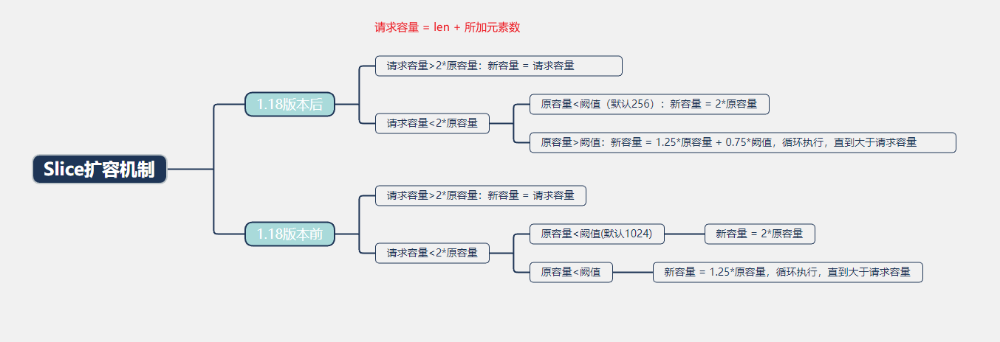


#### 3）切片使用需要注意的问题

**切片作为函数参数传递：**

> 数组作为参数和返回值时，函数内部的修改并**不会影响原数据**（**将数组的连续内存重新拷贝了一份**）

- 数据修改问题

  - 值传递后，修改切片的数据（而非修改拷贝），源数据也会被修改

- 值传递 或者 地址值传递 `append`问题：

  > 原因：append工作原理

  - 值传递，`s = append(s,...) return s` ，原切片 `s`不变 （作为参数传递，开辟了新内存，但指向相同的底层数据）
  - 地址值传递，`*s = append(*s,...) return s` ，原切片的地址 会被修改为 `*s` （直接将原数据的内存地址传递给函数）


**同一个 slice 上切片，它们底层数组是不是同一个？**

答：是的，同一个 slice 上继续切出来的新切片，**底层数组是同一个**,只是索引范围的视图不同


 **append 操作后，底层数组会变吗？**

答：如果 append 后，**容量（cap）足够**，那么 append 会直接在原数组上修改，不会新分配底层数组。

如果 append 后，容量不足，Go 会「自动分配」一个新的更大的底层数组，把旧的元素复制进去，返回一个新的切片。

> **【引申】 向一个nil的slice添加元素会发生什么？为什么？（append方法的工作原理）**
>
> 其实 `nil slice` 或者 `empty slice` 都是可以通过调用 append 函数来获得底层数组的扩容。**最终都是调用 `mallocgc` 来向 Go 的内存管理器申请到一块内存**，然后再赋给原来的`nil slice` 或 `empty slice`，然后摇身一变，成为“真正”的 `slice` 了。


### 2.map

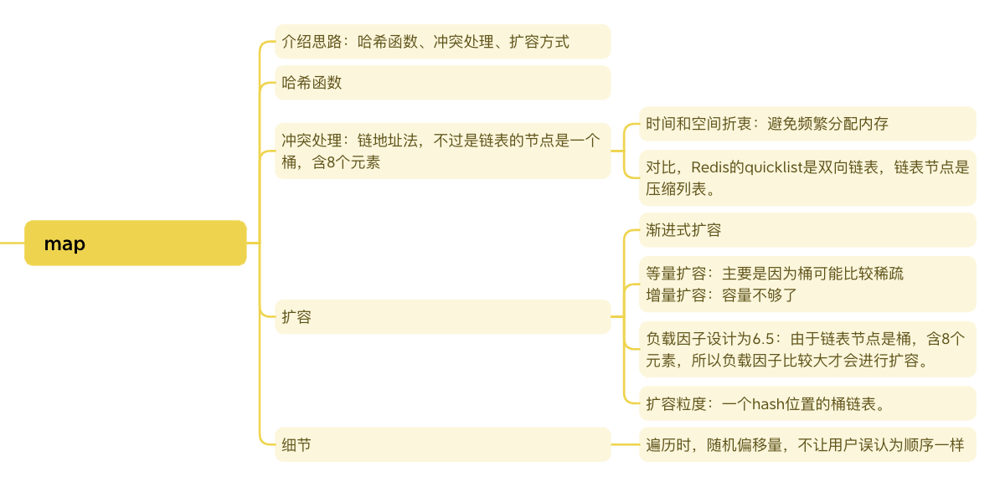

#### 1）设计原理

- 哈希表的设计原理取决于：哈希函数和冲突处理

  - **哈希函数分为：完全哈希函数（理论最优，值数目远大于键）；不均匀哈希函数（实际情况，键远大于值）**

  - 冲突：多个键有相同的值，会产生冲突问题。


  - **冲突处理的两种方式：开放寻址法 和 拉链法**

****

**开放寻址法：**

哈希表的数据结构是数组，因为数组的长度有限，选择插入位置的方式是直接对哈希返回的结果取模：

```go
index := hash("key") % array.len
```

1. 键存在，则修改值；
2. 键不存在，则在数组的下一空位插入当前键。

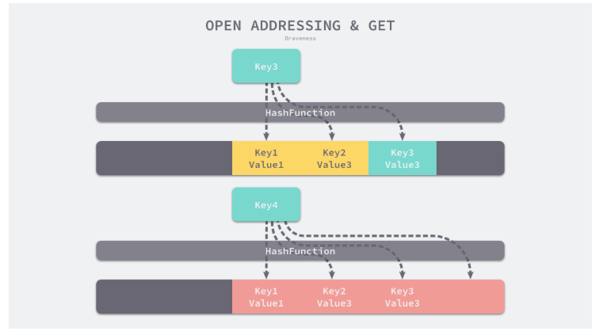

**读写效率与装载因子有关：**
$$
装载因子:=元素数量÷桶数量
$$
当装载率超过 70% 之后，哈希表的性能就会急剧下降，而一旦装载率达到 100%，整个哈希表就会完全失效，这时查找和插入任意元素的时间复杂度都是 O(n)的，这时需要遍历数组中的全部元素，所以在实现哈希表时一定要关注装载因子的变化。


**拉链法（普遍采用）：**

哈希表的数据结构是链表数组，每个链表的节点称为桶；选择桶的方式是直接对哈希返回的结果取模：

```go
index := hash("key") % array.len
```

选择了index桶后就可以遍历当前桶中的链表了，在遍历链表的过程中会遇到以下两种情况：

1. 存在键 — 更新键对应的值；
2. 不存在键 — 在链表的末尾追加新的键值对；

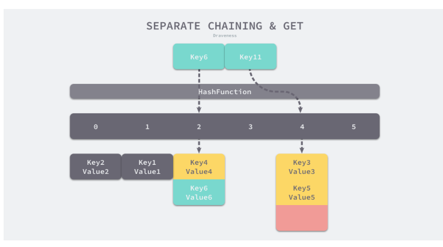

**读写效率：**
$$
装载因子:=元素数量÷桶数量
$$
与开放地址法一样，拉链法的装载因子越大，哈希的读写性能就越差。在一般情况下使用拉链法的哈希表装载因子都不会超过 1，当哈希表的装载因子较大时会触发哈希的扩容，创建更多的桶来存储哈希中的元素，保证性能不会出现严重的下降

****

#### 2）底层结构

```go
type hmap struct {
	count     int //`count` 表示当前哈希表中的元素数量；
	flags     uint8 
	B         uint8//`B` 表示当前哈希表持有的 `buckets` 数量，len(buckets) == 2^B；
	noverflow uint16
	hash0     uint32//`hash0` 表示随机粽子，初始化随机起点桶 和 offset

	buckets    unsafe.Pointer //`buckets`是bmap的指针
	oldbuckets unsafe.Pointer//`oldbuckets` 是哈希在扩容时用于保存之前 `buckets` 的字段，它的大小是当前 `buckets` 的一半；
	nevacuate  uintptr

	extra *mapextra //mapextra 存储单个桶溢出的数据
}

type mapextra struct {
	overflow    *[]*bmap
	oldoverflow *[]*bmap
	nextOverflow *bmap //溢出桶
}

type bmap struct {
    topbits  [8]uint8       // 存的是每个 key 哈希的「高 8 位」(tophash)
    keys     [8]keytype     
    values   [8]valuetype   
    pad      uintptr        
    overflow uintptr        // 指向下一个 overflow bucket
}
```

每一个 [`runtime.bmap`](https://draven.co/golang/tree/runtime.bmap) 都能存储 8 个键值对，当哈希表中存储的数据过多，单个桶已经装满时就会使用 `extra.nextOverflow` 中桶存储溢出的数据。

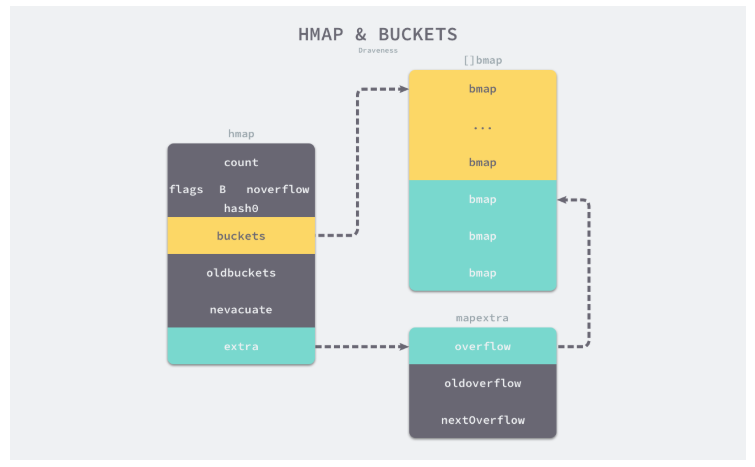

#### 3）初始化的底层

**字面值实现初始化：**

```go
hash := map[string]int{
	"1": 2,
	"3": 4,
	"5": 6,
}
```

当哈希表中的元素数量少于或者等于 25 个时，编译器会将字面量初始化的结构体转换成以下的代码，将所有的键值对一次加入到哈希表中：

```go
hash := make(map[string]int, 3)
hash["1"] = 2
hash["3"] = 4
hash["5"] = 6
```

一旦哈希表中元素的数量超过了 25 个，编译器会创建两个数组分别存储键和值，这些键值对会通过如下所示的 for 循环加入哈希：

```go
hash := make(map[string]int, 26)
vstatk := []string{"1", "2", "3", ... ， "26"}
vstatv := []int{1, 2, 3, ... , 26}
for i := 0; i < len(vstak); i++ {
    hash[vstatk[i]] = vstatv[i]
}
```

不过无论使用哪种方法，使用字面量初始化的过程都会**使用 Go 语言中的关键字 `make` 来创建新的哈希并通过最原始的 `[]` 语法向哈希追加元素。**


**运行时实现初始化：**

```go
h := make(map[string]int,3)
```

无论 `make` 是从哪里来的，只要我们使用 `make` 创建哈希，Go 语言编译器都会在[类型检查](https://draven.co/golang/docs/part1-prerequisite/ch02-compile/golang-typecheck/)期间将它们转换成 [`runtime.makemap`](https://draven.co/golang/tree/runtime.makemap)

```go
func makemap(t *maptype, hint int, h *hmap) *hmap {
	mem, overflow := math.MulUintptr(uintptr(hint), t.bucket.size)
	if overflow || mem > maxAlloc {
		hint = 0
	}

	if h == nil {
		h = new(hmap)
	}
	h.hash0 = fastrand()

	B := uint8(0)
	for overLoadFactor(hint, B) {
		B++
	}
	h.B = B

	if h.B != 0 {
		var nextOverflow *bmap
		h.buckets, nextOverflow = makeBucketArray(t, h.B, nil)
		if nextOverflow != nil {
			h.extra = new(mapextra)
			h.extra.nextOverflow = nextOverflow
		}
	}
	return h
}
```

`runtime.makemap` 会按照下面的步骤执行：

1. 计算哈希占用的内存是否溢出或者超出能分配的最大值；
2. 调用 [`runtime.fastrand`](https://draven.co/golang/tree/runtime.fastrand) 获取一个随机的哈希种子；
3. 根据传入的 `hint` 计算出需要的最小需要的桶的数量；
4. 使用 [`runtime.makeBucketArray`](https://draven.co/golang/tree/runtime.makeBucketArray) 创建用于保存桶的数组；
   - 当桶的数量小于 $2^4$时，由于数据较少、使用溢出桶的可能性较低，会省略创建的过程以减少额外开销；
   - 当桶的数量多于 $2^4$时，会额外创建 $2^{B-4}$个溢出桶；

#### 4）读写操作

**访问：**

```go
v     := hash[key] // => v     := *mapaccess1(maptype, hash, &key)
v, ok := hash[key] // => v, ok := mapaccess2(maptype, hash, &key)
```

**通过 `runtime.mapaccess` 先获得键的哈希值，再得到：`runtime.bucketMask`得到键所在哈希桶的位置 和 `bmap.tophash`键的位置**

假设我们计算 `key` 得到哈希值是：

```go
0xABCD1234
```

那么：

- **哈希值低几位用来确定桶的位置（如：`hash & bucketMask(h.B)`）；**
- **高 8 位是 `0xAB`，也就是 `tophash := byte(hash >> 24)`。**

根据低几位得到的桶位置，比较 `bmap.hashbits[8]`  和 高八位`tophash` 比较得到键位置。

**用于选择桶序号的是哈希的最低几位，而用于加速访问的是哈希的高 8 位，这种设计能够减少同一个桶中有大量相等 `tophash` 的概率影响性能。**

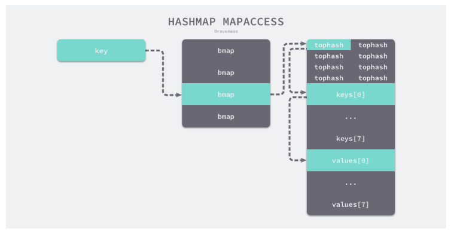

当发现桶中的 `tophash` 与传入键的 `tophash` 匹配之后，我们会通过指针和偏移量获取哈希中存储的键 `keys[0]~key[7]` ,依次与`key`比较，得到`key`的值

****

**写入：**

[`runtime.mapassign`](https://draven.co/golang/tree/runtime.mapassign) ：

根据哈希值，获得桶位置和hashmap，比较正常桶的hashmap[8] 

- **如果该键存在，直接返回 value 的地址；**
- 如果该键不存在，在溢出桶中继续比较

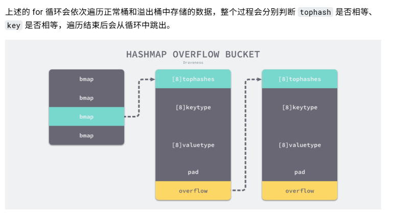

- **如果溢出桶中也不存在，哈希会为新键值对规划存储的内存地址**
  - 如果正常桶的位置已满，会调用 [`runtime.hmap.newoverflow`](https://draven.co/golang/tree/runtime.hmap.newoverflow) 创建新桶或者使用 [`runtime.hmap`](https://draven.co/golang/tree/runtime.hmap) 预先在 `overflow` 中创建好的桶来保存数据，新创建的桶不仅会被追加到已有桶的末尾，还会增加哈希表的 `overflow` 计数器。

- 插入成功后，只会返回内存地址（**键是否存在，都是返回地址**）
- **在编译时，通过汇编实现写入操作**（写入动作不是 runtime 执行的，而是 **编译器自己生成的写操作**）

****

**扩容：**

随着哈希表中元素的逐渐增加，哈希的性能会逐渐恶化，所以我们需要更多的桶和更大的内存保证哈希的读写性能；

[`runtime.mapassign`](https://draven.co/golang/tree/runtime.mapassign) 写入函数会在以下两种情况发生时触发哈希的扩容：

1. 装载因子已经超过 6.5；
   - 哈希在存储元素过多时会触发正常扩容操作，每次都会将桶的数量翻倍，称为**翻倍扩容**
2. 哈希使用了太多溢出桶；
   - 积累溢出桶可能会造成缓慢的内存泄漏，需要：创建新桶保存数据，垃圾回收会清理老的溢出桶并释放内存，称为**等量扩容 **

`runtime.hashGrow`:

**（翻倍）增量式扩容：**

采用**增量式扩容**：创建一组新桶和预创建的溢出桶，将原有的桶数组设置到 `oldbuckets` 上，新的空桶设置到 `buckets` 上，溢出桶也使用了相同的逻辑更新

**目的：避免一次性大量迁移造成卡顿**

- 新桶数组 `buckets` 是 2 倍大小
- 旧桶数组保存在 `oldbuckets` 字段中
- **（访问、）写入、删除操作时“顺便”迁移一些旧数据过来**

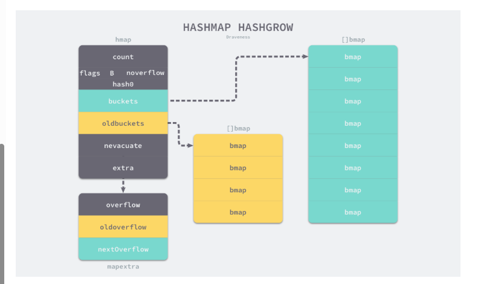

将一个旧桶中的数据分流到两个新桶，会创建两个用于保存分配上下文的 [`runtime.evacDst`](https://draven.co/golang/tree/runtime.evacDst) 结构体，这两个结构体分别指向了一个新桶

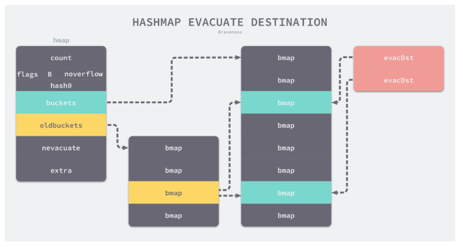

**等量扩容：**

如果这是等量扩容，那么旧桶与新桶之间是一对一的关系，所以两个 [`runtime.evacDst`](https://draven.co/golang/tree/runtime.evacDst) 只会初始化一个

****

**扩容时，访问：**

1. **先判断是否在扩容**（即 `h.oldbuckets != nil`）
2. 用 key 的 hash 计算旧桶 index `oldBucket := hash & oldBucketMask`
3. 如果旧桶没有被迁移（即 `!evacuated(oldBucket)`），**就从旧桶中取值**
4. 否则去新桶中找

**扩容时，写入：**

​	先growWork，再写入

1. 找到一个还没迁移的旧桶

2. 把这个桶里的 key-value 对迁移到新桶中去（每次写入都会调用一次 `growWork()`，推动一部分旧桶的数据迁移。）

3. 标记这个旧桶为“已迁移”（`tophash=top`）

   然后正常的**写入数据到新桶**

**扩容时，删除：**

1. 删除前也需要知道 key 是在哪个桶 → 这也会触发 **桶访问**
2. 如果正在扩容，那么在访问桶之前，也会调用 `growWork()`，进行一部分数据迁移

****

**删除：**

`delete` 关键字在编译期间，被转换成 [`runtime.mapdelete`](https://draven.co/golang/tree/runtime.mapdelete) 函数簇中的一员。

- 桶访问，找到指定的key

- 执行删除操作：标记的是`emptyOne`

  - 如果用的是 `emptyRest`（表示桶后面全空），**后续查找时就直接跳出**；
  - 而 `emptyOne` 表示“这里空了，但后面可能还有数据”，所以不能跳出。

  ```go
  *(*unsafe.Pointer)(k) = nil   // key 置空
  *(*unsafe.Pointer)(v) = nil   // value 置空
  b.tophash[i] = emptyOne       // 标记为“已删除”
  ```

****

**补充：tophash的正常值 和 标记值**

正常的 `tophash[i]`（也就是 hash 的高8位）值范围是 `≥ 4`

如果 `tophash[0] < 4`，说明这是一个特殊标记：

- `0`: emptyRest（从这开始，桶后面全空）
- `1`: emptyOne（已删除）
- `2`: evacuatedEmpty（该位置本身为空，但也迁移完毕）
- `3`: evacuatedX（该位置原本有 key，现在已经迁移走了）

#### 5）随机遍历

**map初始化：**

```go
r := uintptr(fastrand())
it.startBucket = r & bucketMask(h.B)
it.offset = uint8(r >> h.B & (bucketCnt - 1))
```

- `startBucket`：决定从哪个桶（bucket）开始遍历
- `offset`：决定在每个桶内部从哪个位置开始遍历 key/value 对（每桶有 8 个槽）

**随机遍历的顺序：**

1. 从 `startBucket` 开始
2. 在这个桶里，从 `offset` 位置开始，绕一圈遍历槽位
3. 然后处理该桶的溢出桶
4. 再处理下一个桶 `bucket + 1`
5. 最后如果回到起点 `startBucket`，遍历结束

**如果处在扩容阶段， 遍历时，考虑扩容时的桶访问：**

- 如果正在扩容，`mapiternext` 会判断该元素是否已被迁移（`tophash = 2 or 3`）

- 如果迁移了，调用 `mapaccess` 重新从新桶读取 key-value

  


### 3.sync.Map

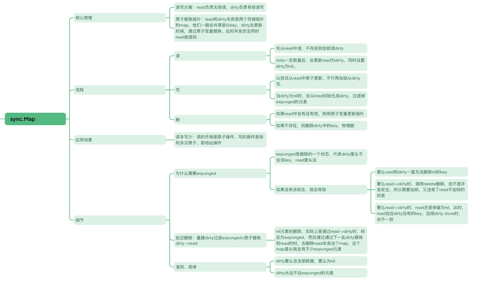

> **原子替换指针**是指使用 `atomic.CompareAndSwapPointer` 或 `atomic.StorePointer` 来**安全更新** `*entry` 中的 `p` 字段（一个 `unsafe.Pointer`），避免加锁情况下的数据竞争。

#### 1）数据结构/核心原理

- 解决并发读写 map 的思路
  1. 加一把大锁：锁的粒度比较大，影响效率
  2. 把一个 map 分成若干个小 map，对 key 进行哈希，只操作相应的小 map：现起来比较复杂，容易出错

​	`sync.Map`：通过空间换时间的方式，使用 read 和 dirty 两个 map 来进行读写分离

**数据结构：**

```go
type Map struct {
	mu Mutex
	read atomic.Value // 实际存储readOnly结构体；因为是atomic.Value类型，只读，所以并发是安全的。
	dirty map[interface{}]*entry //包含最新写入的数据。当misses计数达到一定值，将其赋值给read。
	misses int //计数作用。每次从read中读失败，则计数+1。
}

type readOnly struct {
    m  map[interface{}]*entry
    amended bool //Map.dirty的数据和 m 中的数据不一样的时候，为true(不会考虑 expunged 的 key！)
}

type entry struct {
	p unsafe.Pointer // *interface{}
}
```

1. `sync.Map` 通过 read 和 dirty 字段存储 `key-value`；

2. read 负责 无锁读取， dirty 负责 有锁读写

   - read 字段为 `atomic.Value`类型，允许并发读取，但read在修改时需要 `mu`保护；
   - read 字段 实际存储 `raedOnly`结构体，由 map 字段 和 是否与 dirty map 不同的amended 字段
   - dirty 字段 存储 map 字典，写入时需要有锁保护

3. **`read` 初始化：**通过 `atomic.Value` 延迟加载的，在首次写入或触发 `missLocked()` 时才初始化并存储第一个 `readOnly{}`。

4. **`dirty` 的初始化：**如果 `dirty` 为 nil，在第一次需要写入 read 中不存在的 key 时，通过 `dirtyLocked()` 显式创建。

   会新建一个新的 `dirty`， **`dirty` 是 `read` 的一个拷贝，但除掉了其中已被硬删除的 key。**

5. **read map 的 更新（promote）：**每当key从 read 中读取失败，`misses++` ；当 `misses >= len(dirty)` 后，触发「dirty 提升为 read」的操作。

   **提升过程：**

   - **dirty map 的所有 entry 浅拷贝到 read map 中，同时将 `misses = 0`，并置空 dirty map`  m.dirty = nil`。**
   - **软删除的nil，在promote之前，p == nil 修改成 p == expunged**

6. `read` 和 `dirty` map 的值类型都是 `*entry`，在初始写入时会共享同一 entry 指针。

   若该 key 被更新、删除，或被驱逐为 expunged 后，dirty 中可能会替换为新的 entry，此时不再共享。 

   > 例如：
   >
   > 如果 dirty 中的 entry 本身是从 read 中漏掉的（因为是新 key）：那它只存在于 dirty 中，read 中并没有，也不会共享指针。
   >
   > `Store("k", 2)`：如果 `read["k"]` 存在但被标记为 `expunged`：dirty 会新建 entry，不再与 read 共享。
   >
   > 但如果 `read["k"]` 是正常值（p != nil）：**（涉及：原子替换指针）**
   >
   > - dirty有这个key： **`atomic.CompareAndSwapPointer(&e.p, old, new)` 直接替换**
   >
   > - dirty 尚未存在 key：直接从 `read` 中取出 `*entry`；将它 **插入 dirty map**；
   >
   >   然后对这 **共享的 entry 执行 `atomic.StorePointer` 替换值**。

7. entry 类型包含通用类型的指针p，指向三个状态

   1. `p==nil`：软删除：read表有该键---->dirty表可能有，也可能没有；Store可以复活
   2. `p==expunged`：硬删除：read表有该键---->dirty表一定没有该键；Store会在 dirty 中新建 entry
   3. `p!=nil`：正常状态，存储正常数据


#### 2）读写操作

- 写操作：
  - 数据不共享 或 数据共享而逻辑不共享
  - dirty map 和 read map的初始化
- 读操作：
  - read map 更新：dirty promote read
- 删操作：
  - k 已被提升：read map 有，软删除：p==nil 间接删除
  - k 未被提升：read map 没有 而 dirty map 有：直接delete(dirty,k) 直接删除

****

**写入操作:** 

```go
var m sync.Map
m.Store("a", "1")//写入 a:1
```

```go
//Store源码
func (m *Map) Store(key, value interface{}) {
	// 如果 read map 中存在该 key  则尝试"直接更改"
	read, _ := m.read.Load().(readOnly)
	if e, ok := read.m[key]; ok && e.tryStore(&value) {
		return
	}

	m.mu.Lock()
	read, _ = m.read.Load().(readOnly)
	if e, ok := read.m[key]; ok {
		if e.unexpungeLocked() {
			// 如果 read map 中存在该 key，但 p == expunged，则说明 m.dirty != nil 并且 m.dirty 中不存在该 key 值 此时:
			//    a. 将 p 的状态由 expunged  更改为 nil
			//    b. dirty map 插入 key
			m.dirty[key] = e
		}
		// 更新 entry.p = value (read map 和 dirty map 指向同一个 entry)
		e.storeLocked(&value)
	} else if e, ok := m.dirty[key]; ok {
		// 如果 read map 中不存在该 key，但 dirty map 中存在该 key，直接写入更新 entry(read map 中仍然没有这个 key)
		e.storeLocked(&value)
	} else {
		// 如果 read map 和 dirty map 中都不存在该 key，则：
		//	  a. 如果 dirty map 为空，则需要创建 dirty map，并从 read map 中拷贝未删除的元素到新创建的 dirty map
		//    b. 更新 amended 字段，标识 dirty map 中存在 read map 中没有的 key
		//    c. 将 kv 写入 dirty map 中，read 不变
		if !read.amended {
		    // 到这里就意味着，当前的 key 是第一次被加到 dirty map 中。
			// store 之前先判断一下 dirty map 是否为空，如果为空，就把 read map 浅拷贝一次。
			m.dirtyLocked()
			m.read.Store(readOnly{m: read.m, amended: true})
		}
		// 写入新 key，在 dirty 中存储 value
		m.dirty[key] = newEntry(value)
	}
	m.mu.Unlock()
}
```

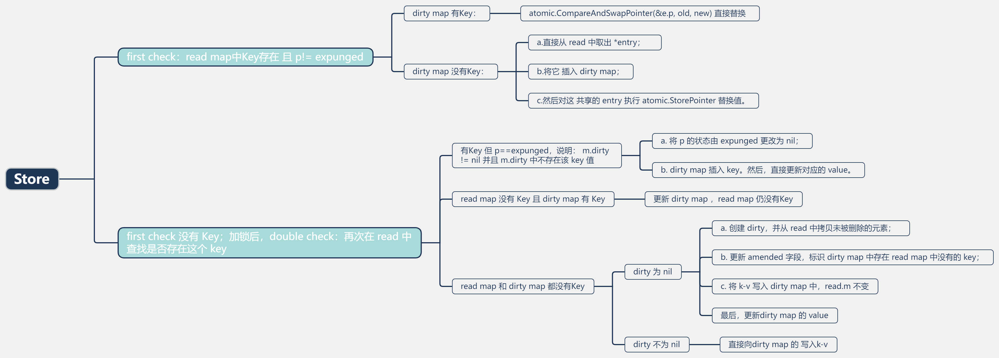

1. 无锁条件下，从 `read` 中找到 key，且对应 `entry.p != expunged`：

   说明该 entry 是有效的；使用原子操作 `atomic.StorePointer(&e.p, value)` 更新值；

2. 如果 `read` 中未命中或 `entry.p == expunged`：

   说明 key 不存在或被永久删除，需要进入锁保护区，加锁 `m.mu.Lock()`

3. double check：锁内再次查 `read`，如果 `read` 中此时能找到 key 且 `p == expunged`：

   说明该 entry 被驱逐；**dirty map 如果为nil，初始化dirty；**

   之后执行如下：

   - a. 将 entry.p 从 `expunged → nil`（逻辑复活）；
   - b. 将此 entry 插入到 dirty；
   - c. 使用原子方式设置 `entry.p = new(value)`；
   
    read 和 dirty 仍然共享相同的 `\*entry` 实例，但read.m[k]=nil

​	 完成后释放锁返回。

4. double check： `read` 中未找到，则查 dirty map ：dirty 中找到 key：

   直接更新 dirty 中的 entry.p；

​	完成后释放锁返回。

5. 若 `read` 和 `dirty` 中都未找到 key：说明 key 是第一次出现，

- a. 如果 dirty 为 `nil`：**初始化 dirty；从 read map 中拷贝所有非 expunged 的 entry 进去；**

- b. 将 amended 标记为 true；

- c. 将新 `entry{p: value}` 插入 dirty； read 不变；

  > **后续读取此 key 需要 fallback 到 dirty。**

**写入后数据不同步的表现：** 

1. **读写路径分离的典型表现**：键的第一次写入 read 和 map 产生不共享的key
2. **数据共享但逻辑不可见：**read.m["k"]=expunged写入后，dirty 和 read 虽然共享entry，但read.m["k"]=nil,dirty为正常状态

目的：有效分离读写路径

****

**读取操作：**

```go
if v, ok := m.Load("a"); ok {
		fmt.Printf("a:%v\n", v)
	}
```

```go
//Load源码
func (m *Map) Load(key interface{}) (value interface{}, ok bool) {
	read, _ := m.read.Load().(readOnly)
	e, ok := read.m[key]
	// 如果没在 read 中找到，并且 amended 为 true，即 dirty 中存在 read 中没有的 key
	if !ok && read.amended {
		m.mu.Lock() // dirty map 不是线程安全的，所以需要加上互斥锁
		// double check。避免在上锁的过程中 dirty map 提升为 read map。
		read, _ = m.read.Load().(readOnly)
		e, ok = read.m[key]
		// 仍然没有在 read 中找到这个 key，并且 amended 为 true
		if !ok && read.amended {
			e, ok = m.dirty[key] // 从 dirty 中找
			// 不管 dirty 中有没有找到，都要"记一笔"，因为在 dirty 提升为 read 之前，都会进入这条路径
			m.missLocked()
		}
		m.mu.Unlock()
	}
	if !ok { // 如果没找到，返回空，false
		return nil, false
	}
	return e.load()
}
```

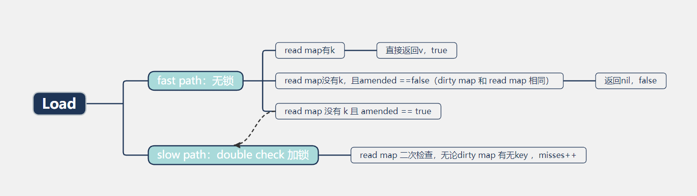

**补充：**

- `sync.Map.Load` 中**只有在 read map 根本找不到 key（`read.m[key]` 不存在） 且 `read.amended == true` 时，才会进入慢路径并执行 `misses++`。**

- 如果 key 存在于 read map 中，但对应的值是 **`nil`（逻辑删除）或 `expunged`（硬删除），不会触发 `misses++`**，

  而是直接从 `entry.load()` 返回 `nil, false`。

当 `misses > len(m.dirty)`，触发【dirty promote read】

```go
func (m *Map) missLocked() {
	m.misses++
	if m.misses < len(m.dirty) {
		return
	}
	// dirty map 晋升
	m.read.Store(readOnly{m: m.dirty})
	m.dirty = nil
	m.misses = 0
}
```

****

**删除操作：**

```go
//删除
	m.Delete("a")
	if _, ok := m.Load("a"); !ok {
		fmt.Println("a已经删除")
	}
```

```go
// Delete源码
func (m *Map) Delete(key interface{}) {
	read, _ := m.read.Load().(readOnly)
	e, ok := read.m[key]
	// 如果 read 中没有这个 key，且 dirty map 不为空
	if !ok && read.amended {
		m.mu.Lock()
		read, _ = m.read.Load().(readOnly)
		e, ok = read.m[key]
		if !ok && read.amended {
			delete(m.dirty, key) // 直接从 dirty 中删除这个 key
		}
		m.mu.Unlock()
	}
	if ok {
		e.delete() // 如果在 read 中找到了这个 key，将 p 置为 nil
	}
}
```

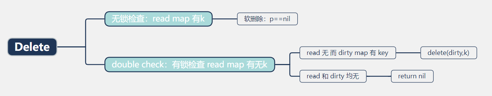

- 直接删除：如果k 在 read 中没有，说明：dirty[k]还未promote，直接从dirty中删除
- **间接（延迟）删除**：如果k 在 read 中有，说明：dirty[k]已经promote，先改为nil；再下一次提升前没写入，会修改为expunged；dirty再写入，就不会拷贝k

#### 3）sync.Map优缺点

优点：是官方出的；通过读写分离，降低锁时间来提高效率；

缺点：不适用于大量写的场景，写入时初始胡dirty map，读取时实现read map更新；当写多读少时，整体性能较差。 

适用场景：大量读，少量写


### 4.channel

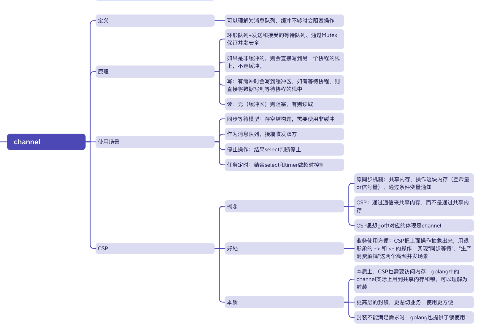

并发时线程间通信：

1. Go 语言中**能使用共享内存加互斥锁进行通信**，

2. 但是 Go 语言提供了一种不同的并发模型，即通信顺序进程（Communicating sequential processes，CSP）。

   Goroutine 和 Channel 分别对应 CSP 中的实体和传递信息的媒介，**Goroutine 之间会通过 Channel 传递数据。**

#### 1）底层结构

```go
type hchan struct {
	qcount   uint // Channel 中的元素个数
	dataqsiz uint // Channel 中的循环队列的长度
	buf      unsafe.Pointer // Channel 的缓冲区数据指针
	elemsize uint16 // 当前 Channel 能够收发的大小
	closed   uint32
	elemtype *_type // 当前 Channel 能够收发的元素类型
	sendx    uint // Channel 的发送操作处理到的位置
	recvx    uint // Channel 的接收操作处理到的位置
	
    //sendq 和 recvq 存储了当前 Channel 由于缓冲区空间不足而阻塞的 Goroutine 列表
    recvq    waitq
	sendq    waitq

	lock mutex
}

type waitq struct { // 等待队列使用双向链表
	first *sudog //`sudog` 是对 goroutine 的封装结构，里面包含 goroutine 地址、要收/发的元素地址等信息；
	last  *sudog
}
```

**`buf` 指向 底层存储数据的循环数组/队列；**

**`dataqsize`  ：存储 channel 的 容量，即循环数组的大小**

`sendx` 存储 下一次写入时的下标

`recvx` 存储 下一次接收时的下标

`sendq` 存储：写堵塞的goroutine队列，goroutine信息封装在`sudog`结构体

`recvq` 存储：读堵塞的goroutine队列


##### **无缓冲channel：**

- 无缓冲 channel 的**`dataqsiz`为 0**，所以 **底层的循环队列不能存储任何元素**。

- 由于不能存储任何元素，所以：**每次发送和接收必须 同时进行，才会真正「完成」数据的传递**

- **数据传递是同步的，发送操作和接收操作必须一一对应**

  即：**同步等待模型：**写之前必须有读，读之前必须有写。只有双方同时准备好，数据才能传输，确保同步。

  ​	**写（send）时**：如果没有 goroutine 正在读，发送方会 **阻塞**，一直等到有接收方来读。

  ​	**读（receive）时**：如果 channel 里没有数据，接收方会 **阻塞**，一直等到有发送方写入数据


```go
//无缓冲区 channel
func sync_wait() {
	ch := make(chan struct{}) // 容量 = 0

	go func() {
		ch <- struct{}{}
		fmt.Println("worker 2 ....")
	}()
	time.Sleep(1 * time.Second)
	fmt.Println("worker 1 ....")
	<-ch
	time.Sleep(1 * time.Second)
}
```

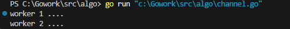

##### **有缓冲channel：**

- 有缓冲 channel 的 **`dataqsiz` > 0，底层的循环队列能够存储元素**
- **数据传输是异步的**，也就是说**发送操作和接收操作可以并发进行**
  - 写：**如果缓冲区未满，则发送操作不会阻塞**，直接将数据放入缓冲区。
  - 读：**如果缓冲区非空，则接收操作不会阻塞**，直接从缓冲区取出数据

```go
//有缓冲区 channel
func sync_wait() {
	ch := make(chan struct{}, 1) //容量 

	go func() {
		ch <- struct{}{}
		fmt.Println("worker 2 ....")
	}()
	time.Sleep(1 * time.Second)
	fmt.Println("worker 1 ....")
	<-ch
	time.Sleep(1 * time.Second)
}

```

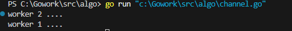

#### 2）使用场景

**一般使用：**

```go
//定义：
ch1 := make(chan int) // 无缓冲管道
ch2 := make(chan int,2) //有缓存管道
//读写：
ch1 <- v //发送
v := <-ch1 //接收
//关闭：
close(ch1)
v,ok:=<-ch1 //ch关闭后，可以接收，但不能发送
//遍历： 关闭管道；遍历管道
close(jobs)
for job := range jobs {
				fmt.Printf("Worker %d started job %d\n", id, job)
				time.Sleep(time.Second) // 模拟耗时任务
				fmt.Printf("Worker %d finished job %d\n", id, job)
				results <- job * 2
			}
// select 实现 ：channel 无阻塞发送（接受，同理）
select {
case ch <- 1:
    fmt.Println("发送成功")
default:
    fmt.Println("没人接收，不阻塞，直接走这里")
}

```

> `<-chan` 未关闭，空读取：阻塞；已关闭，空读取：返回零值,false

1. **对已经关闭的的`chan`进行读写，会怎么样？**

  - 读:

    `buffer`内有元素**还未读**: 会正确读到`chan`内的值且返回的第二个 bool 值为`true`。

    `buffer`内有元素**已经被读完**: `chan`内无值:返回 `channel` 元素的**零值**，但是第二个`bool`值一直为`false`。

  - 写: 已经关闭的`chan`会`panic`

2. **对未初始化的的`chan`进行读写，会怎么样？**

  - 读写**未初始化**的`chan`都会**阻塞**，而不是 `panic`

3. **对 无缓冲管道进行读写： 读写同步**；读之前没写，会读堵塞；写之前没读，会写堵塞

4. **对 有缓冲管道进行读写：读写异步**； 缓冲区空，读才堵塞；缓存区满，写才阻塞

5. `for v,ok := range chan`：

  - **遍历管道时，遍历前/中：一定要确保 `close(chan)`**，否则：读堵塞，造成死锁


****

##### **n 个 协程交替打印：**

**实现原理： 根据同步等待模型**

- 希望n个协程交替打印，就需要：n个管道；每个协程因为管道的读堵塞，陷入等待；
- 通过 for 创建 固定协程数，打印后，向下一个协程的管道写数据。

```go
func print_X() {
	const N = 4  //管道数量
	const M = 15 //打印数目
	chans := make([]chan struct{}, N)
	for i := 0; i < N; i++ {
		chans[i] = make(chan struct{})
	}

	var wg sync.WaitGroup
	var m int

	for i := 0; i < N; i++ {
		wg.Add(1)
		go func(id int) {
			defer wg.Done()
			for m < M {
				<-chans[id]
				if m == M {
					defer func() {
						next := (id + 1) % N
						close(chans[next]) //N 个 循环，恰好关N个：从打印M的worker的下一个开始,以打印M的worker结束（循环队列）
					}()
					return
				}
				// 之所以要在这里加，是运行到 m = 9 时，其他goroutine仍在阻塞，m++后close(chans[next])，所以下一个管道m=10
				// 当并发量 > 2，return 中 仍要加 defer
				m++
				fmt.Printf("worker %d finished %d\n", id+1, m)
				next := (id + 1) % N
				chans[next] <- struct{}{}
				if m == M {
					close(chans[next])
				}
			}
		}(i)
	}

	chans[0] <- struct{}{}
	wg.Wait()
	fmt.Println("All done")
}

```

**采用互斥锁+条件变量实现：**

```go
// 互斥锁+条件变量 实现 交替打印
func print_X_mutex() {
	const N = 5
	const M = 17
	var mu sync.Mutex
	var wg sync.WaitGroup
	cond := sync.NewCond(&mu) //用来创建一个条件变量（Cond）
	turn := 0                 // 表示当前该哪个协程执行
	var m int
	for i := 0; i < N; i++ {
		wg.Add(1)
		go func(id int) {
			defer wg.Done()
			for m < M {
				mu.Lock() 
				for id != turn { //之后考虑：等待队列
                    cond.Wait() //让当前 goroutine 等待条件满足，并且自动释放关联的锁；无需mu.Unlock()

				}
				if m == M {
					turn = (turn + 1) % N
					cond.Broadcast() //唤醒 所有 等待的goroutine；满足条件的，继续往下运行；但不自动释放锁，需要自己释放
                    mu.Unlock() // 释放锁:别漏，否则死锁（如果漏掉了 mu.Unlock()，当前 goroutine 退出时仍然持有锁，其他goroutine拿不到）
					return
				}
				/* 第二种写法：
					for id != turn && m< M { //之前考虑等待队列：第二个条件，限制何时结束的不要忘（循环终止条件，也要考虑到cond.Wait()）
						cond.Wait() 

					}
					if m == M {
						mu.Unlock()
						return
					}
				*/
				m++
				fmt.Printf("worker %d finished %d\n", id+1, m)
				turn = (turn + 1) % N
				cond.Broadcast() // 唤醒所有等待的 goroutine；区别：cond.Signal() 只会唤醒一个等待的 goroutine。
				mu.Unlock()
			}
		}(i)
	}
	wg.Wait()
	fmt.Println("All done")

}
```

****

##### **控制并发量的两种方式：**

1. **channel 信号量 控制 并发量：**

   信号量方式适合控制并发数，任务之间相互独立，**不关心具体哪个 goroutine 执行**。

```go
func sempahore() {
	var wg sync.WaitGroup
	sem := make(chan struct{}, 3)
	for i := 0; i < 10; i++ { //外层循环：任务（数）
		sem <- struct{}{}
		wg.Add(1)
		go func(i int) {
			defer wg.Done()
			fmt.Println(i)
			<-sem
		}(i)
	}
	wg.Wait()
}
```

2. **不同于：循环 固定 worker数**

   固定 worker 池适合需要明确 worker 身份、任务分发和结果收集的场景。

```go
for w := 1; w <= goCont; w++ { //外层循环：协程数
		wg.Add(1)
		go func(id int) {
			defer wg.Done()
			for job := range jobs {
				fmt.Printf("Worker %d started job %d\n", id, job)
				time.Sleep(time.Second) // 模拟耗时任务
				fmt.Printf("Worker %d finished job %d\n", id, job)
			}
		}(w)
	}
```

**消息队列：**

1. channel 实现 生产者 和 消费者
2. channel 实现 worker pool

**生产者 和 消费者 模式：**

- 有一个或者多个 生产者 生产任务，发送到 channel
- 有一个或者多个 消费者 从 channel 消费任务

```go
func producer_consumer() {
	var producer func(ch chan<- int, wg *sync.WaitGroup, id int)
	producer = func(ch chan<- int, wg *sync.WaitGroup, id int) {
		defer wg.Done()
		for i := 0; i < 5; i++ {
			num := rand.Intn(100)
			fmt.Printf("Producer %d produced: %d\n", id, num)
			ch <- num
			time.Sleep(time.Millisecond * time.Duration(rand.Intn(500)))
		}
	}
	var consumer func(ch <-chan int, wg *sync.WaitGroup, id int)
	consumer = func(ch <-chan int, wg *sync.WaitGroup, id int) {
		defer wg.Done()
		for num := range ch {
			fmt.Printf("Consumer %d consumed: %d\n", id, num)
			time.Sleep(time.Millisecond * time.Duration(rand.Intn(1000)))
		}
	}
	rand.Seed(time.Now().UnixNano())

	ch := make(chan int, 10)

	var producerWg sync.WaitGroup
	var consumerWg sync.WaitGroup

	// 启动生产者
	for i := 1; i <= 3; i++ {
		producerWg.Add(1)
		go producer(ch, &producerWg, i)
	}

	// 启动消费者
	for i := 1; i <= 2; i++ {
		consumerWg.Add(1)
		go consumer(ch, &consumerWg, i)
	}
	producerWg.Wait()	// 等待所有生产者完成
	close(ch)// 关闭 channel，通知消费者没有更多数据了
	consumerWg.Wait()// 等待所有消费者完成
}
```

**worker pool：** 

**「Go 的 worker pool 实际上是生产者-消费者模型的一个实现**。我们会**使用一个任务 channel 作为缓冲池，多个固定数量的 worker 从中并发消费任务，这样既能保证消费速度，也能控制最大并发数，防止 goroutine 暴涨**。它**本质就是多个 worker 从 channel 消费任务的 fan-out 模式**，只是加了池化管理。

- `jobs` 负责 任务分发 fan-out，`results` 负责 结果聚合 fan-in
- 固定数量的worker，将任务管道jobs分发执行
  - worker：循环固定 worker 池 或者 信号量控制并发量

-  **`jobs`发送任务完成后，及时关闭；才能`wg.Wait()`,等待任务被workers完成。否则，造成子go程死锁**

```go
func workers() {
	const workerCount = 3
	const jobCount = 5

	jobs := make(chan int, jobCount)
	results := make(chan int, jobCount)

	var wg sync.WaitGroup
	// 启动 workerCount 个 worker
	for w := 1; w <= workerCount; w++ {
		wg.Add(1)
		go func(id int) {
			defer wg.Done()
			for job := range jobs {
				fmt.Printf("Worker %d started job %d\n", id, job)
				time.Sleep(time.Second) // 模拟耗时任务
				fmt.Printf("Worker %d finished job %d\n", id, job)
				results <- job * 2
			}
		}(w)
	}
	// 发送任务：简化版的生产者
	for j := 1; j <= jobCount; j++ {
		jobs <- j
	}
	close(jobs) // 关闭 jobs，通知 worker 不再有任务
	wg.Wait()// 等待所有 worker 完成后关闭 results
    /*
    这里很关键：一定是先关闭jobs管道，再range jobs！！！ 否则worker协程陷入jobs管道的读堵塞
    */
	close(results)

	// 收集结果
	for res := range results {
		fmt.Printf("Result received: %d\n", res)
	}

	fmt.Println("All jobs done.")
}
```

****

##### **结合select 实现 超时控制 / 定时操作：**

```go
//channel 实现 超时控制
func time_out() {
	ch := make(chan int)
	select {
	case <-ch:
		fmt.Println("get msg")
	case <-time.After(1 * time.Second):
		fmt.Println("timeout")
	}
}
//chan 实现 定时操作：超时控制+for死循环
for {
		select {
		case data, ok := <-ch:
			if !ok {
				fmt.Println("通道已关闭")
				return
			}
			fmt.Printf("接收到数据: %d\n", data)
		case <-time.After(1 * time.Second):
			fmt.Println("1 秒超时")
		}
	}
```

****

#### 3）读写操作

##### **写操作：**

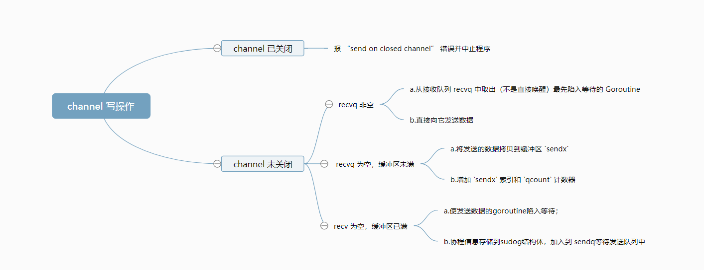

0. 发送数据前，先利用`hchan.lock`加锁
1. 如果channel已经close，报 “send on closed channel” 错误并中止程序。
2. 如果channel没有close：
   1. 直接发送：当存在等待的接收者时，通过 [`runtime.send`](https://draven.co/golang/tree/runtime.send) 直接将数据发送给阻塞的接收者；
   2. 缓存区：当缓冲区存在空余空间时，将发送的数据写入 Channel 的缓冲区；
   3. 阻塞发送：当不存在缓冲区或者缓冲区已满时，等待其他 Goroutine 从 Channel 接收数据；

****

**直接发送：**

recvq等待接收数据协程的等待队列非空，执行：从接收队列 `recvq` 中取出（不是直接唤醒）最先陷入等待的 Goroutine 并直接向它发送数据

```go
	if sg := c.recvq.dequeue(); sg != nil {
		send(c, sg, ep, func() { unlock(&c.lock) }, 3)
		return true
	}
```

```go
func send(c *hchan, sg *sudog, ep unsafe.Pointer, unlockf func(), skip int) {
	if sg.elem != nil {
		sendDirect(c.elemtype, sg, ep) //调用 runtime.sendDirect：将发送的数据直接拷贝到 `x = <-c` 表达式中变量 `x` 所在的内存地址上；
		sg.elem = nil
	}
	gp := sg.g
	unlockf()
	gp.param = unsafe.Pointer(sg)
	goready(gp, skip+1)
}
```

**取出最先陷入等待的协程，并没唤醒：**

 调用 [`runtime.goready`](https://draven.co/golang/tree/runtime.goready) ，**将等待接收数据的 Goroutine 标记成可运行状态 `Grunnable`** ；

**并把该 Goroutine 放到发送方所在的处理器的 `runnext` 上等待执行**，该处理器**在下一次调度时会立刻唤醒该Goroutine（数据的接收方）**

> 发送数据的过程只是将接收方的 Goroutine 放到了处理器的 `runnext` 中，程序没有立刻执行该 Goroutine

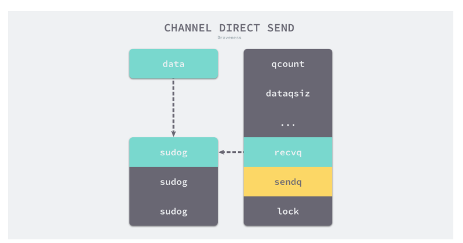

****

**缓冲区：**

**如果创建的 Channel 包含缓冲区并且 Channel 中的数据没有装满：将发送的数据拷贝到缓冲区 `sendx` ,增加 `sendx` 索引和 `qcount` 计数器**

```go
  if c.qcount < c.dataqsiz {
		qp := chanbuf(c, c.sendx)
		typedmemmove(c.elemtype, qp, ep)
		c.sendx++
		if c.sendx == c.dataqsiz {
			c.sendx = 0
		}
		c.qcount++
		unlock(&c.lock)
		return true
	}
```

1. 使用 [`runtime.chanbuf`](https://draven.co/golang/tree/runtime.chanbuf) 计算出下一个可以存储数据的位置 `sendx`

2. 然后通过 [`runtime.typedmemmove`](https://draven.co/golang/tree/runtime.typedmemmove) 将发送的数据拷贝到缓冲区中并增加 `sendx` 索引和 `qcount` 计数器：

   向 Channel 发送的数据会存储在 Channel 的 `sendx` 索引所在的位置并将 `sendx` 索引加一。

   因为这里的 `buf` 是一个循环数组，所以当 `sendx` 等于 `dataqsiz` 时会重新回到数组开始的位置

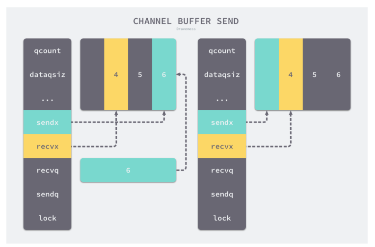

****

**写阻塞：**

**当 Channel 没有接收者能够处理数据/缓冲区已满时：使发送数据的goroutine陷入等待；协程信息存储到sudog结构体，加入到 `sendq`等待发送队列中**

```go
	if !block {
		unlock(&c.lock)
		return false
	}

	gp := getg()
	mysg := acquireSudog()
	mysg.elem = ep
	mysg.g = gp
	mysg.c = c
	gp.waiting = mysg
	c.sendq.enqueue(mysg)
	goparkunlock(&c.lock, waitReasonChanSend, traceEvGoBlockSend, 3)

	gp.waiting = nil
	gp.param = nil
	mysg.c = nil
	releaseSudog(mysg)
	return true
```

1. 调用 [`runtime.getg`](https://draven.co/golang/tree/runtime.getg) 获取发送数据使用的 Goroutine；
2. 执行 [`runtime.acquireSudog`](https://draven.co/golang/tree/runtime.acquireSudog) 获取 [`runtime.sudog`](https://draven.co/golang/tree/runtime.sudog) 结构并设置这一次阻塞发送的相关信息，例如发送的 Channel、是否在 select 中和待发送数据的内存地址等；
3. 将刚刚创建并初始化的 [`runtime.sudog`](https://draven.co/golang/tree/runtime.sudog) 加入发送等待队列，并设置到当前 Goroutine 的 `waiting` 上，表示 Goroutine 正在等待该 `sudog` 准备就绪；
4. 调用 [`runtime.goparkunlock`](https://draven.co/golang/tree/runtime.goparkunlock) 将当前的 Goroutine 陷入沉睡等待唤醒；
5. 被调度器唤醒后会执行一些收尾工作，将一些属性置零并且释放 [`runtime.sudog`](https://draven.co/golang/tree/runtime.sudog) 结构体；

****

##### 读操作： 

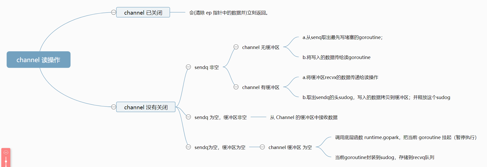

1. channel 已关闭：直接返回 v，ok；缓冲区有数据：`value,true` ; 缓冲区无数据：`零值,false`
2. channel 没有 关闭  且 缓冲区有数据
   1. 当存在等待的发送者时，通过 [`runtime.recv`](https://draven.co/golang/tree/runtime.recv) 从阻塞的发送者或者缓冲区中获取数据；
   2. 当缓冲区存在数据时，从 Channel 的缓冲区中接收数据；
   3. 当缓冲区中不存在数据时，等待其他 Goroutine 向 Channel 发送数据

****

**直接接受：**

channel 未关闭 且 senq 非空： 通过 [`runtime.recv`](https://draven.co/golang/tree/runtime.recv) 从阻塞的发送者或者缓冲区中获取数据；

- **如果 Channel 不存在缓冲区：写堵塞数据传给读操作**
  - 将 Channel sendq队列中 Goroutine 存储的数据 拷贝到 读操作变量的内存地址；
- **如果 Channel 存在缓冲区： 缓冲区数据传给读操作，写堵塞拷贝到缓冲区**
  - 将缓冲区中的数据拷贝到接收方的内存地址；
  - 将sendq头goroutine的数据拷贝到缓冲区中，释放一个阻塞的发送方；

****

**从缓冲区接受：**

channel 未关闭 且 sendq 为空，缓冲区非空： 从 Channel 的缓冲区中接收数据；

**如果接收数据的内存地址不为空**，那么会使用 [`runtime.typedmemmove`](https://draven.co/golang/tree/runtime.typedmemmove) **将缓冲区中的数据拷贝到内存中、清除队列中的数据并完成收尾工作**。

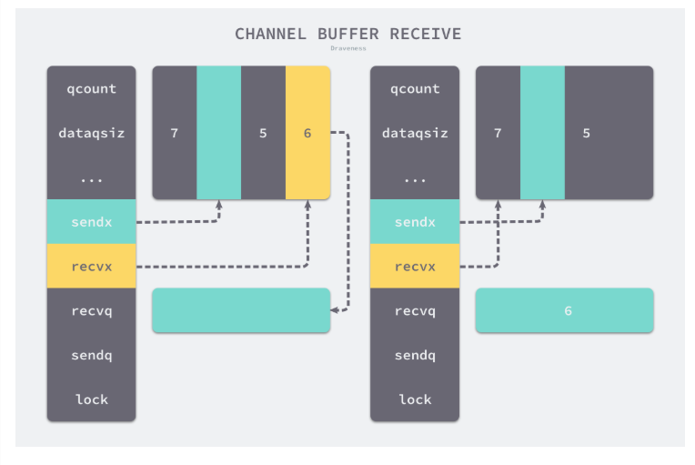

****

**读阻塞：**

sendq 为空且缓冲区为空/无缓冲区：

- 使用 [`runtime.sudog`](https://draven.co/golang/tree/runtime.sudog) 将当前 Goroutine **包装成一个处于等待状态的 Goroutine `*sudog` 并将其加入到接收队列中**。
- 完成入队之后，上述代码还会**调用 [`runtime.goparkunlock`](https://draven.co/golang/tree/runtime.goparkunlock) 立刻触发 Goroutine 的调度，让出处理器的使用权并等待调度器的调度**。

##### 关闭操作：

当 Channel 是一个空指针或者已经被关闭时，Go 语言运行时都会直接崩溃并抛出异常：

```go
func closechan(c *hchan) {
	if c == nil {
		panic(plainError("close of nil channel"))
	}

	lock(&c.lock)
	if c.closed != 0 {
		unlock(&c.lock)
		panic(plainError("close of closed channel"))
	}
```

关闭正常的channel：

- 将 `recvq` 和 `sendq` 两个队列中的数据加入到 Goroutine 列表 `gList` ： runtime 会「逐个唤醒」这个列表里的 goroutine；
  - `recvq`：读堵塞的goroutine，返回 `零值，false`
  - `sendq`：写堵塞的goroutine，`panic ：send on closed channel`
- 之后，runtime 会把存储goroutine信息的sudog 从队列中移除并清空，防止后续错误引用


## 并发

### 进程、线程、协程 

| 概念                  | 简述                                                     |
| --------------------- | -------------------------------------------------------- |
| **进程**（Process）   | 程序运行的实例，**资源的最小单位**，彼此**完全独立**     |
| **线程**（Thread）    | CPU 调度的最小单位，同一进程下的线程**共享资源**         |
| **协程**（Coroutine） | 用户态中的**轻量级线程**，由程序**自行调度切换**，更高效 |

**1.进程：**资源分配的最小单位；是操作系统对一个正在运行的程序的一种抽象

每个进程都有自己的独立内存空间，**拥有自己独立的地址空间、独立的堆和栈，既不共享堆，亦不共享栈**。

一个程序至少有一个进程，一个进程至少有一个线程。**进程切换只发生在内核态。**

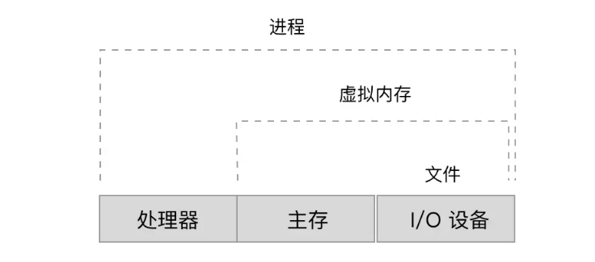

**为什么要有进程：是为了合理压榨 CPU 的性能和分配运行的时间片，不能 “闲着“。**

> 多进程就是指计算机系统可以同时执行多个进程，从一个进程到另外一个进程的转换是由操作系统内核管理的，一般是同时运行多个软件。


**2.线程：CPU 调度的最小单位**；一个进程可以由多个称为线程的执行单元组成。每个线程都运行在进程的上下文中，共享着同样的代码和全局数据

**线程拥有自己独立的栈和共享的堆，共享堆，不共享栈**，是由操作系统调度，**是操作系统调度（CPU调度）执行的最小单位**。

**对于进程和线程，都是有内核进行调度，有 CPU 时间片的概念，进行抢占式调度。**

内核由系统内核进行调度，系统为了实现并发，会不断地切换线程执行，由此会带来线程的上下文切换。

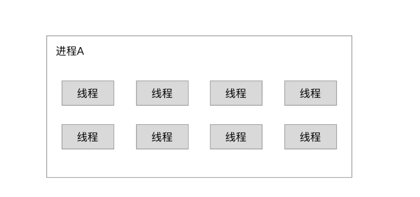

**为什么有了进程，还要线程呢？**

原因如下：

- 进程间的信息难以共享数据，父子进程并未共享内存，需要通过进程间通信（IPC），在进程间进行信息交换，性能开销较大。
- 创建进程（一般是调用 `fork` 方法）的性能开销较大。


**3.协程：协程（Coroutine）是用户态的轻量化线程。**

**协程线程一样共享堆，不共享栈，协程是由程序员在协程的代码中显示调度**。

协程 (用户态线程) 是对内核透明的，也就是系统完全不知道有协程的存在，完全由用户自己的程序进行调度。

在栈大小分配方便，且每个协程占用的默认占用内存很小，只有 2kb ，而线程需要 8mb；

相较于线程，**因为协程是对内核透明的，所以栈空间大小可以按需增大减小。**


**协程和进程的区别：** 二者概念表述后，讲核心区别

- 调度上：**进程，线程：操作系统内核调度**		**协程：用户程序中的协程调度器**
- 通信上：**线程：共享内存 / 同步原语 实现通信**	**协程：通常用 channel、函数调用等**

**协程与线程主要区别是它将不再被内核调度，而是交给了程序自己而线程是将自己交给内核调度，所以 golang 中就会有调度器的存在**


### GMP 模型概述

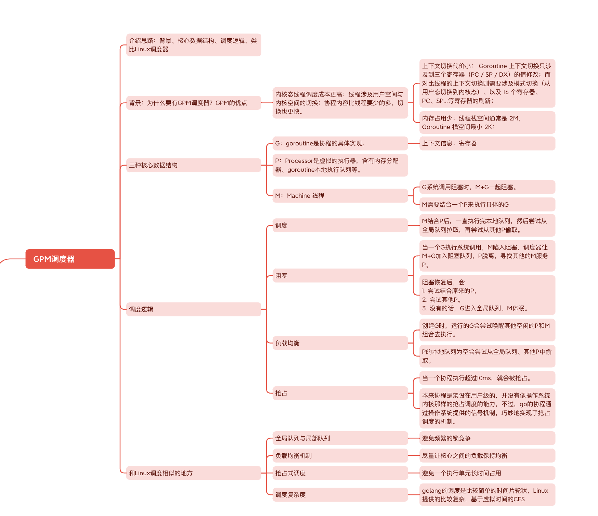

**Golang 底层采用混合型线程模型：内核空间的KSE 关联一个 用户空间的M，M通过P，绑定多个G；线程与协程关系是N:M**

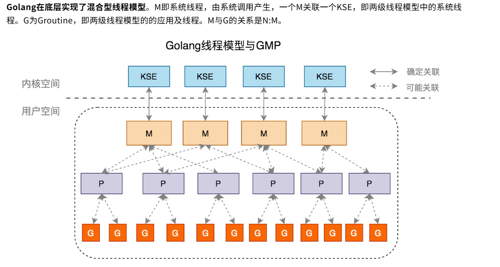

#### **1）三种核心数据结构：**

1. G —  Goroutine，Go协程，是**参与调度与执行的最小单位**
2. M —  Machine，Go runtime **对内核线程的抽象**（KSE：操作系统调度实体，真正的内核线程）
3. P —   Processor，指的是逻辑处理器（程序的调度器），P**关联了的本地可运行G的队列**(也称为LRQ)，最多可存放256个G

#### **2）调度流程**

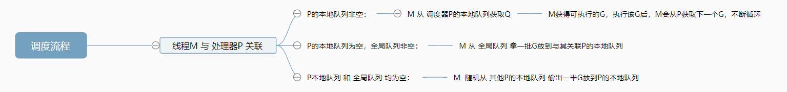

1. 线程M想运行任务就需得获取 处理器P，即与P关联。
2. 然从 处理器P 的本地队列(LRQ)获取 G
3. 若LRQ中没有可运行的G，M 会尝试从全局队列(GRQ)拿一批G放到P的本地队列，
4. 若全局队列也未找到可运行的G时候，M会随机从其他 P 的本地队列偷一半放到自己 P 的本地队列。
5. 拿到可运行的G之后，M 运行 G，G 执行之后，M 会从 P 获取下一个 G，不断重复下去。

6. 系统调用 & 阻塞

   1. 如果 G 在执行中发生阻塞（如 IO、锁等待），其绑定的 `M` 也会阻塞。


   2. 此时 `P` 会被解绑，并移交给其他可用的 `M` 或新建一个 `M` 来继续工作（**hand off 机制**）。

   3. 阻塞解除后，原来的 `M` 会尝试重新绑定空闲的 `P`。

#### **3）调度器的生命周期** 

**M0 是启动程序后的编号为 0 的主线程**

**G0（调度专用 goroutine） ：** 每个 M 都有一个对应的 G0（所以**不是全局唯一**）。


#### **4）GMP的数量**


#### **5）调度的流程状态（了解即可）**


#### 6）基于信号的抢占式调度 

**GO语言的调度分为两种：**

- **同步协作式调度：协程主动弃权**

  1. 主动用户让权：通过 `runtime.Gosched` 调用主动让出执行机会；

  2. 主动调度弃权：当发生执行栈分段时，检查自身的抢占标记，决定是否继续执行；

     > 当函数调用层级变多，需要更多栈空间时，会自动 **栈扩容**或称**执行栈分段**

- **异步抢占式调度：协程被动弃权**

  1. 被动监控抢占：当 G 阻塞在 M 上时（系统调用、channel 等），系统监控会将 P 从 M 上抢夺并分配给其他的 M 来执行其他的 G，而位于被抢夺 P 的 M 本地调度队列中 的 G 则可能会被偷取到其他 M 中。
  
  2. 被动 GC 抢占：当需要进行垃圾回收时，为了保证不具备主动抢占处理的函数执行时间过长，导致 导致垃圾回收迟迟不得执行而导致的高延迟，而强制停止 G 并转为执行垃圾回收。
  
     **抢占与 GC 紧密相关：垃圾回收要「Stop The World」时，必须抢占所有 Goroutine**

****

**基于信号的抢占式调度：**

抢占式调度，可以分为两种：

- **针对 协程阻塞导致M阻塞：抢占P**
  - 通过解绑 P 和 M，让其他 M 可以接手执行任务。
- **针对 运行太久的 Goroutine ： 抢占M**
  - Go 会通过**异步信号（ `SIGURG`）发给 M，打断 M 的执行**
  - 在 M 收到信号后，**M 插入「抢占逻辑」（`asyncPreempt`）的函数调用，停止当前 G**
  - 此时**，G 会被标记为可被调度，调度器就可以切换到别的 G**

**抢占流程：**

1. 系统监控线程（sysmon）检测到某个 M 运行太久，触发抢占。
2. 调用 `preemptM()`，向目标 M 发送 SIGURG。
3. 操作系统中断目标 M，进入信号处理回调 `sighandler()`。
4. 修改 M 的执行上下文，插入 `asyncPreempt()` 调用。
5. 当信号处理返回时，M 不再继续原用户代码，而是进入调度循环，进行上下文切换，执行其他 Goroutine。


##### 问题：协程死循环，怎么调度?  抢占M

循环里没有任何函数调用/阻塞

```go
for {
    x++
}
```

- Go 会通过**异步信号（ `SIGURG`）发给 M，打断 M 的执行**
- 在 M 收到信号后，**M 插入「抢占逻辑」（`asyncPreempt`）的函数调用，停止当前 G**
- 此时**，G 会被标记为可被调度，调度器就可以切换到别的 G**


##### 问题：协程阻塞，如何调度？ 抢占P

当 G 阻塞在 M 上时（系统调用、channel 等）:

调度器会把这个 goroutine 标记为 **waiting** 状态，并将它「挂起」，执行的协程设置安全点并阻塞；

并将 P 从 M 上抢夺并分配给其他的 M 来执行其他的 G。

****

#### 7）补充：

##### 问题：什么是协程泄漏 和 死锁？

**协程泄漏（Goroutine leak）** 指的是：

- **一个 goroutine** 启动后，因为一直阻塞或者无限循环，**一直无法退出**；
- **无法GC，导致内存中残留着越来越多的 goroutine**，最终资源耗尽。

**协程泄漏的解决方案：**

- context 请求超时/取消，释放协程资源
- select + timer.chan 定时管道，实现协程的无阻塞管道

为了发现死锁，我们使用 `sync.WaitGroup`，通过死锁发现协程阻塞


**协程死锁（Goroutine deadlock）** 指的是：

- **所有活跃的 goroutine 都处于 相互等待 状态**，没有任何 goroutine 能继续执行；
- **程序整体无法向前推进，完全卡死**，通常会被 Go 运行时直接报错：


### Context

#### **使用场景：**

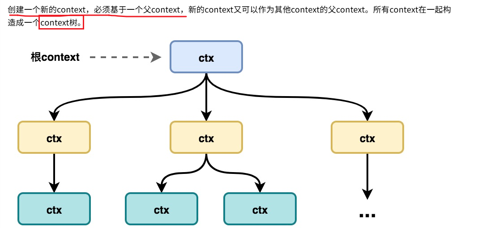

```go
ctx1 := context.Background()
ctx2,cancel := context.WithTimeout(ctx1,2*time.Second)
```

**1.请求超时或者取消时，用于释放执行任务的协程资源：**

**请求超时控制**

```go
func time_out() {
	// 创建一个带超时的上下文，超时时间 2 秒
	ctx, cancel := context.WithTimeout(context.Background(), 2*time.Second)
	defer cancel()

	// 启动一个耗时任务
	go func(ctx context.Context) {
		select {
		case <-time.After(5 * time.Second):
			fmt.Println("任务完成 ")
		case <-ctx.Done():
			fmt.Println("任务被取消，原因：", ctx.Err()) // context deadline exceeded
		default:
			fmt.Println("正在处理任务...\n")
			time.Sleep(500 * time.Millisecond)
		}
	}(ctx)

	time.Sleep(3 * time.Second)
	fmt.Println("主程序结束")
}
```

**请求取消控制**

```go
func context_cancel() {
	var worker func(ctx context.Context, id int)
	worker = func(ctx context.Context, id int) {
		for {
			select {
			case <-ctx.Done():
				fmt.Printf("Worker %d 收到取消信号，退出 \n", id)
				return
			default:
				fmt.Printf("Worker %d 正在处理任务...\n", id)
				time.Sleep(500 * time.Millisecond)
			}
		}
	}
	ctx, cancel := context.WithCancel(context.Background())

	for i := 1; i <= 3; i++ {
		go worker(ctx, i)
	}

	time.Sleep(2 * time.Second)
	fmt.Println("主线程决定取消所有任务！")
	cancel() //取消根上下文

	time.Sleep(1 * time.Second) // 再等一会，观察子 worker 全部退出
	fmt.Println("主程序结束 ")
}
```

**2.不同协程间，传递上下文**

```go
func deliver_ctx() {
	// 创建一个根 context
	ctx := context.Background()

	// 用 WithValue 携带一个 key-value
	ctx = context.WithValue(ctx, "traceID", "abc123456")
	ctx = context.WithValue(ctx, "user", "小明")

	// 定义内部函数 doSomething
	doSomething := func(ctx context.Context) {
		traceID := ctx.Value("traceID")
		fmt.Println("doSomething 正在处理，traceID:", traceID)
	}

	// 定义内部函数 processRequest
	processRequest := func(ctx context.Context) {
		traceID := ctx.Value("traceID")
		user := ctx.Value("user")
		fmt.Println("收到请求，traceID:", traceID, "用户:", user)

		// 继续调用内部函数
		doSomething(ctx)
	}

	// 调用内部函数
	processRequest(ctx)
}
```


#### 实现Context接口的类型：

**Context 接口**

```go
type Context interface {
    Deadline() (deadline time.Time, ok bool) //返回:绑定该context任务的执行超时时间，若未设置，则ok等于false
    Done() <-chan struct{} //当调用cancel方法或者任务执行超时时候，该通道会被关闭
    Err() error //Done通道未关闭则返回nil;context如果被取消，返回Canceled错误;如果超时则会返回DeadlineExceeded错误
    Value(key interface{}) interface{}  //根据key返回，存储在context中k-v数据
}
```

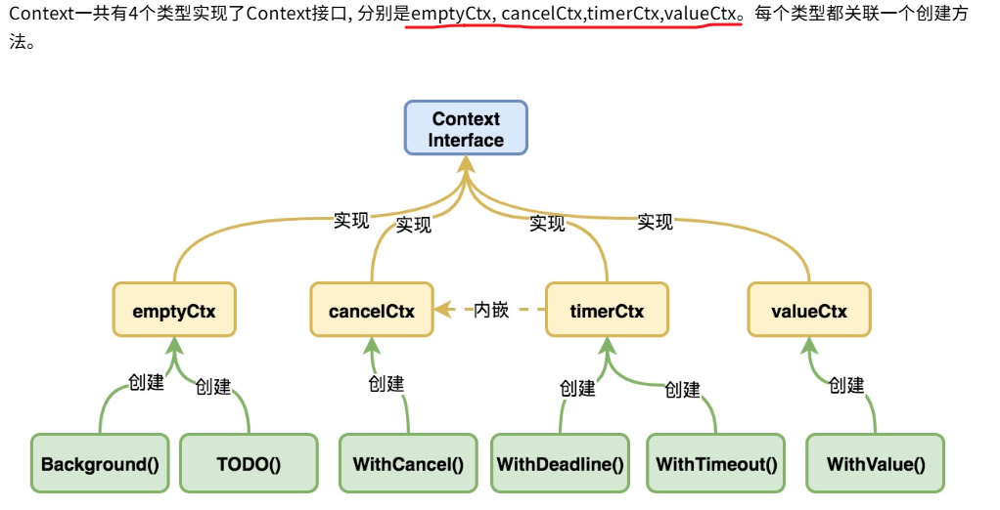

| 类型      | 创建方法                     | 功能                                  |
| --------- | ---------------------------- | ------------------------------------- |
| emptyCtx  | Background()/TODO()          | 用做context树的根节点                 |
| cancelCtx | WithCancel()                 | 可取消的context                       |
| timerCtx  | WithDeadline()/WithTimeout() | 可取消的context，过期或超时会自动取消 |
| valueCtx  | WithValue()                  | 可存储共享信息的context               |

**Context实现了两种方向的递归操作：**

| 递归方向 | 目的                                                         |
| -------- | ------------------------------------------------------------ |
| 向下递归 | 当**对父Context进去手动取消**操作，或超时取消时候，向下递归处理对实现了canceler接口的后代进行取消操作 |
| 向上递规 | 当**对Context查询Key信息**时候，若当前Context没有当前K-V信息时候，则向父辈递归查询，一直到查询到跟节点的emptyCtx，返回nil为止 |

#### 使用规范

1. 不要将Context作为结构体的一个字段存储，相反而**应该显示传递Context给每一个需要它的函数**，Context应该作为函数的第一个参数，并命名为ctx
2. **不要传递一个nil Context给一个函数，即使该函数能够接受它**。如果你不确定使用哪一个Context，那你就传递context.TODO
3. **context是并发安全的**，相同的Context能够传递给运行在不同goroutine的函数


### Sync

#### sync.Mutex

**底层结构：**

```go
type Mutex struct {
	state int32 //表示当前互斥锁的状态
	sema  uint32 //用于控制锁状态的信号量
}
```

**`state`表示状态，等待的协程数：**

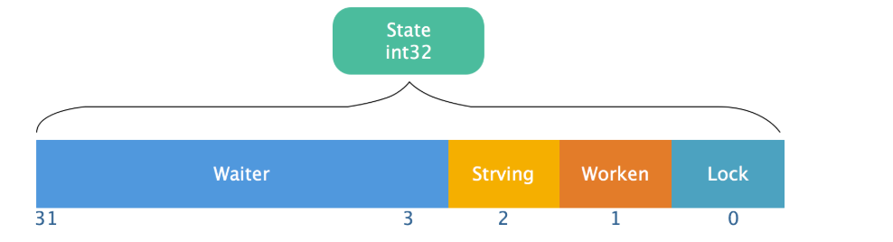

在默认情况下，互斥锁的所有状态位都是 0：

- `mutexLocked` — 当前协程是否占用锁（0：没有持有锁，1：持有锁）
- `mutexWoken` — 当前协程是否被唤醒（0：协程未被唤醒，1：协程已经唤醒）
- `mutexStarving` — 互斥锁是否进入饥饿模式（0：正常模式，1：饥饿模式）

**工作模式：正常模式与饥饿模式**

**正常模式：**

- 协程按照**不严格的先进先出**（FIFO），获取锁；刚被唤起的 Goroutine 与新创建的 Goroutine 会**发生锁竞争**时，大概率会获取不到锁
- 转换：一旦 Goroutine 超过 1ms 没有获取到锁，它就会将当前互斥锁**由正常模式切换为饥饿模式**，防止部分 Goroutine 被『饿死』

**饥饿模式：**

- 协程按照严格的FIFO，获取锁；互斥锁会直接交给等待队列最前面的 Goroutine。新的 Goroutine 不能获取锁、也不会进入自旋状态，它们只会在队列的末尾等待。
- 转换：果一个 Goroutine 获得了互斥锁并且它在队列的末尾或者它等待的时间少于 1ms，那么当前的互斥锁就会**由饥饿模式切换回正常模式**。

**具体操作：加锁和解锁**

**加锁：**

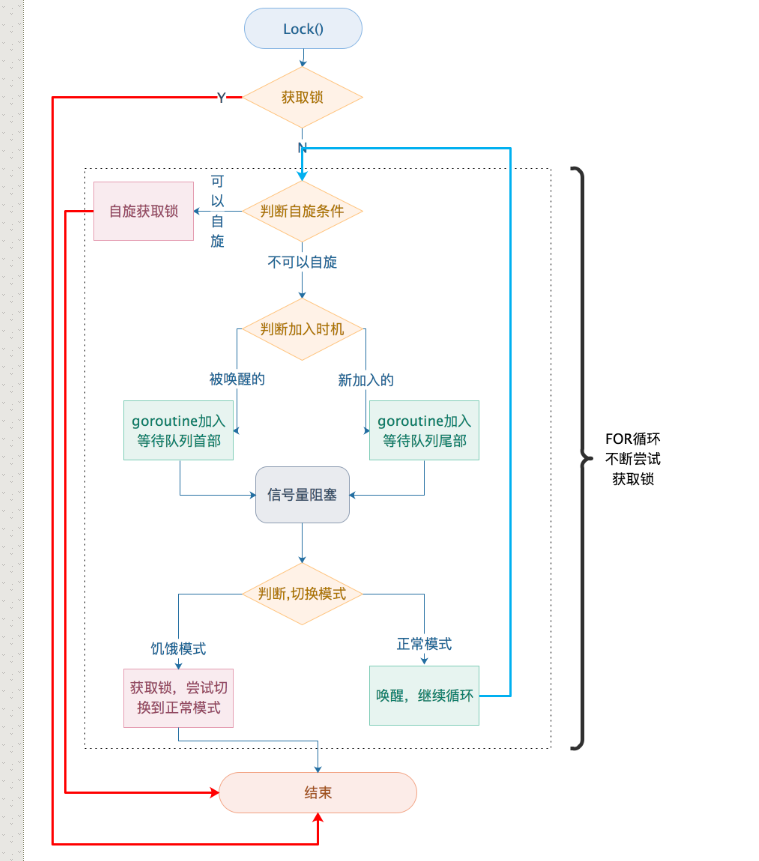

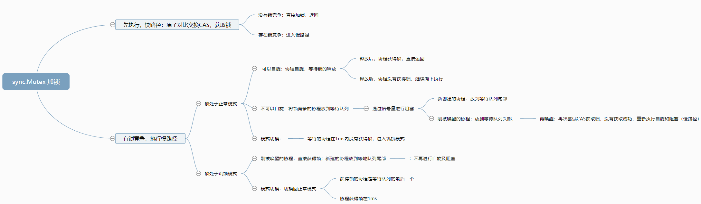

**解锁：**

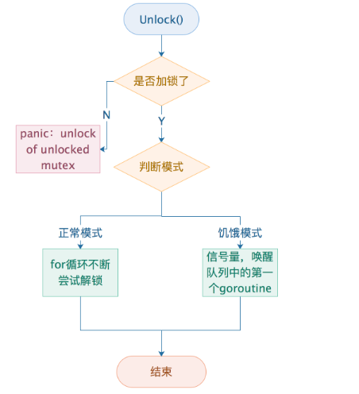

1. 首先判断如果之前是锁的状态是未加锁，`Unlock`将会触发`panic`；
2. 如果当前锁是正常模式，一个for循环，去不断尝试解锁；

3. 饥饿模式下，通过信号量，唤醒在饥饿模式下面`Lock`操作下队列中第一个`goroutine`。


#### sync.RWMutex

```go
type RWMutex struct {
	w           Mutex  //用于实现写锁
	writerSem   uint32 // 写等待信号量
	readerSem   uint32  // 读等待信号量
	readerCount int32 //当前正在执行的读操作数量
	readerWait  int32 //当写操作被阻塞时等待的读操作个数
}
```

- 写操作使用 `sync.RWMutex.Lock`和 `sync.RWMutex.Unlock`方法；
- 读操作使用 `sync.RWMutex.RLock` 和 `sync.RWMutex.RUnlock`方法；

**写锁的加锁和释放锁：**

`Lock()`：

1. **当前写协程加内部的互斥锁 `w.Lock()`**，使其他协程的写操作陷入自旋和阻塞。

   > **不允许：写写**

2. 读写锁的 `readerCount` 减去`rwmutexMaxReaders`**变为负数**，阻止其他协程的读操作。

3. 如果有其他 Goroutine 持有互斥锁的读锁，该 **写Goroutine 会调用进入休眠状态**；

   > **不允许：写读**

   等待所有带读锁的协程执行结束后，释放 `writerSem` 信号量将写协程唤醒；

`UnLock`：

1. 加回 `rwmutexMaxReaders`，把**`readerCount` 恢复，释放读锁**；
2. 通过 **for 循环释放所有因为获取读锁而陷入等待的 Goroutine**：
3. 调用 [`sync.Mutex.Unlock`](https://draven.co/golang/tree/sync.Mutex.Unlock) **释放写锁**；

**读锁的加锁和释放锁：**

> **允许并发读，但不允许读写/写读**

`RLock`：

1. 先把 `readerCount` 加 1。
2. 如果结果小于 0，说明**有写锁持有中**，当前读协程需要阻塞，等待写锁释放。
3. 如果结果大于0， 说明没有 Goroutine 获得写锁，当前方法会成功返回；

`RUnlock()`:

1. 把 `readerCount` 减 1。

2. 如果返回值大于等于零：读锁直接解锁成功；

3. 如果返回值小于零：有一个正在执行的写操作，在这时会调用[`sync.RWMutex.rUnlockSlow`](https://draven.co/golang/tree/sync.RWMutex.rUnlockSlow) 方法；

   > **对于读写/写读的处理：统一先读再写**
   >
   > 将写协程阻塞，记录 `readerWait`写阻塞时的读操作数目，等待所有读协程释放读锁后，再写

   1. 如果有写锁在等（`readerWait` > 0），需要把 `readerWait` 减 1。
   2. 当最后一个读协程释放后，触发 `writerSem`，唤醒写协程。


#### 乐观锁 与 悲观锁

- **乐观锁 `sync.atomic`：更新操作不加锁和释放锁，根据版本号判断是否**

  1. 读取值（拿到版本号）

  2. 修改值
  3. 提交更新时，判断版本号是否还等于最初读取的
  4. 如果相等，说明没人改过，更新成功
  5. 如果不相等，说明有并发修改，回滚或重试

- **悲观锁 `sync.Mutex`：更新操前都需要先加锁，执行完后再释放锁**

  - 加锁
  - 读取值，修改值，存储至指定内存
  - 释放锁

  

#### 如何实现协程池：参考channel 实现消息队列

协程池的结构：

1. 定义一个接口表示任务，每一个具体的任务实现这个接口。
2. 使用 channel 作为任务队列，当有任务需要执行时，将这个任务插入到队列中。
3. 开启固定的协程（worker）从任务队列中获取任务来执行。

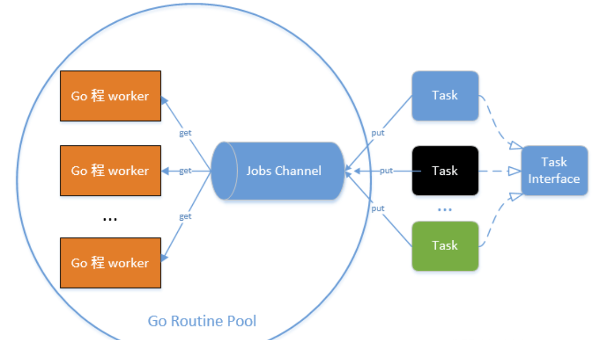


```go
package main

import (
  "fmt"
  "runtime"
  "sync"
  "time"
)

// Pool 协程池
type Pool struct {
  TaskChannel chan func() // fuc类型任务队列
  GoNum       int         // 任务数量
}

// NewPool 创建一个协程池
func NewPool(cap ...int) *Pool {
  // 获取 worker 数量
  var n int
  if len(cap) > 0 {
    n = cap[0]
  }
  if n == 0 {
    n = runtime.NumCPU() // 默认等于CPU线程数
  }
  // p 是 Pool的引用
  p := &Pool{
    TaskChannel: make(chan func()),
    GoNum:       n,
  }
  return p
}

// StartPool 启动协程池
func StartPool(p *Pool) {
  // 创建指定数量 worker 从任务队列取出任务执行
  for i := 0; i < p.GoNum; i++ {
    go func() {
      for task := range p.TaskChannel {
        task()
      }
    }()
  }
}

// Submit 提交任务
func (p *Pool) Submit(f func()) {
  p.TaskChannel <- f
}

func main() {
  p := NewPool()
  StartPool(p)
  var wg sync.WaitGroup
  wg.Add(3)
  task1 := func() {
    fmt.Println("eat cost 3 seconds")
    time.Sleep(3 * time.Second)
    wg.Done()
  }
  task2 := func() {
    defer wg.Done()
    fmt.Println("wash feet cost 3 seconds")
    time.Sleep(3 * time.Second)
  }
  task3 := func() {
    fmt.Println("watch tv cost 3 seconds")
    time.Sleep(3 * time.Second)
    wg.Done()
  }
  p.Submit(task1)
  p.Submit(task2)
  p.Submit(task3)
  // 等待所有任务执行完成
  wg.Wait()
}
```


## GC

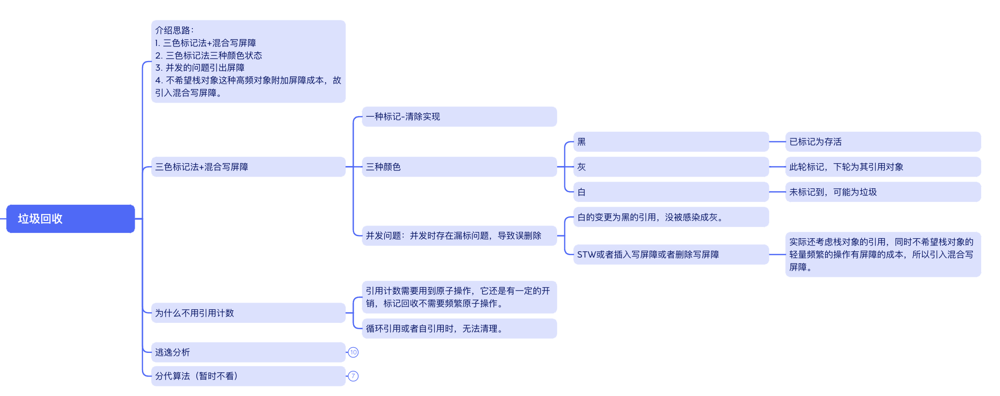

### 设计原理

#### 三色标记清除法：

**三色的含义：**

-  **黑色（Black）**：表示这个对象已扫描，有它引用的对象（即“活着”），且 **它的引用对象也都被处理过**。
-  **灰色（Gray）**：表示这个对象已扫描，有它的引用对象，但 **它引用的对象还没完全扫描完**，还需要继续检查。
-  **白色（White）**：
  -  表示**「还没被标记」**的对象；
  - 如果最后还保持白色，说明**没有被任何活对象引用**，它就是垃圾。

****

**三色标记的流程：**

- 初始化：**所有对象一开始都标记为 白色。**

- 根对象入队（变灰）：
  - **从 根对象（Root Set） 出发，先把它们标记为 灰色**，表示需要进一步检查。
  - 把这些灰色对象放进一个「待扫描队列」。

- 处理灰色对象：
  - 不断从队列中取出灰色对象，对它引用的对象进行检查：
    - **如果引用对象是白色，就标记为灰色，并加入待扫描队列**。
  - 当前灰色对象扫描完后，标记为黑色，表示对象检查完毕。

- 重复扫描：**一直重复上一步，直到没有灰色对象，队列空了，说明所有可达对象都已经被标记黑色**。

  清理白色对象：所有剩下的白色对象，就是没有被任何活着的对象引用的垃圾，可以安全回收


#### 混合写屏障：

> 在程序执行和垃圾回收并发时，程序可能会修改已经标记的对象的标记，从而修改三色标记的规则。
>
> **引入写屏障：保证程序运行时修改对象关系，三色标记的规则始终不变，保证准确度**

Golang采用混合式写屏障，包含 插入写屏障 和 删除写屏障：

- 插入写屏障：
  1. 垃圾收集器将根对象指向 A 对象标记成黑色并将 A 对象指向的对象 B 标记成灰色；
  2. 用户程序修改 A 对象的指针，将原本指向 B 对象的指针指向 C 对象，这时触发写屏障将 C 对象标记成灰色；
  3. 垃圾收集器依次遍历程序中的其他灰色对象，将它们分别标记成黑色；

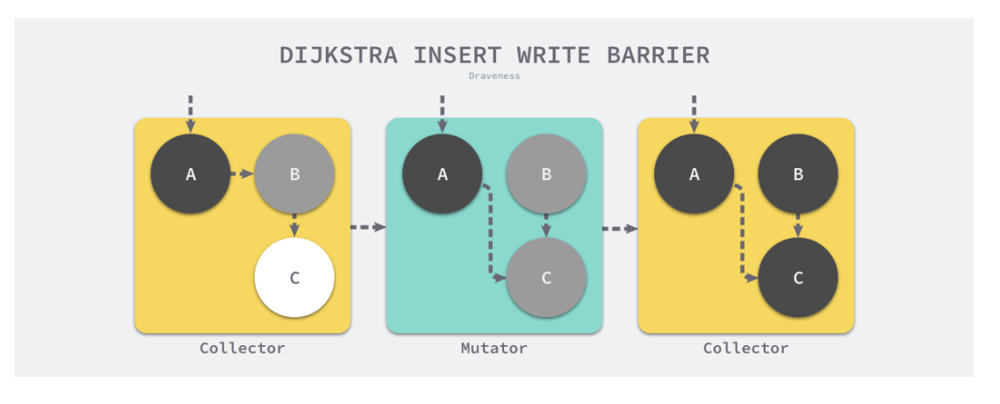

- 删除写屏障：
  1. 垃圾收集器将根对象指向 A 对象标记成黑色并将 A 对象指向的对象 B 标记成灰色；
  3. **用户程序将 B 对象原本指向 C 的指针删除，触发删除写屏障，白色的 C 对象被涂成灰色**；
  4. 垃圾收集器依次遍历程序中的其他灰色对象，将它们分别标记成黑色；

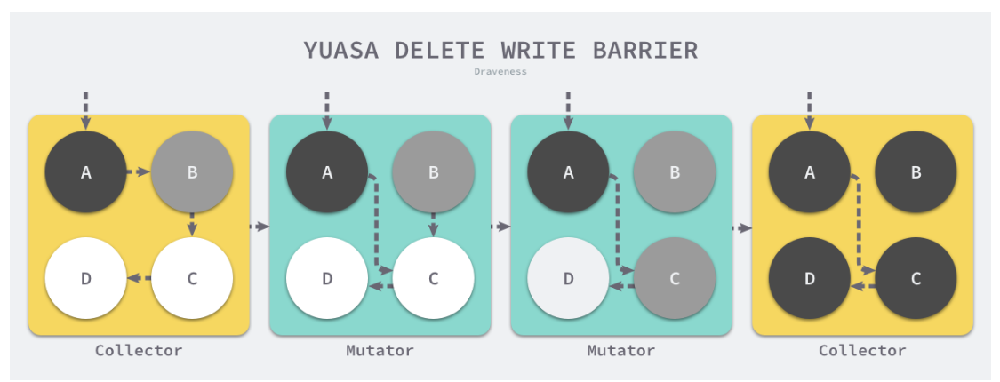


### 实现原理

#### GC触发时机：

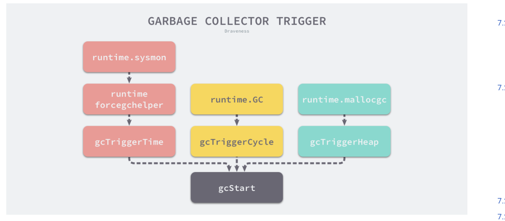

1. 主动触发：
   -  `gcTriggerCycle`：手动调用 `runtime.GC()`
2. 被动触发
   - `gcTriggerTime`：系统定时触发GC
   - `gcTriggerHeap`：当堆中存活对象的内存大小大于垃圾回收的阙值，新一轮的垃圾收集就会开始。


#### GC流程：

> 三色标记+混合写屏障

分为标记和清除两个阶段：

- **标记阶段：**

  - **标记初始化（STW）：**STW暂停程序；使得写屏障时处于安全点，STW结束

    垃圾收集器观察并等待每个goroutine进行函数调用， 等待函数调用是为了保证goroutine停止时处于安全点。

  - **标记阶段（并发）：**打开写屏障，进行三色标记法（具体见设计原理）；

    首先检查所有goroutine的堆栈，以找到堆内存的根指针；然后收集器必须从那些根指针遍历堆内存图，标记可以回收的内存。

    当存在新的内存分配时，会暂停分配内存过快的那些 goroutine，并将其转去执行一些辅助标记（Mark Assist）的工作，从而达到放缓继续分配、辅助 GC 的标记工作的目的

  - **标记终止阶段（STW）：**再次STW；把最后残余的灰色对象处理完，确保整个标记周期彻底完成；清理写屏障

- **清理阶段：**

  **清除阶段如果出现新对象：**清除阶段是扫描整个堆内存，可以知道当前清除到什么位置；如果新对象的指针位置已经被扫描过了，那么就不用作任何操作；如果在当前扫描的位置的后面，把该对象的颜色标记为黑色，这样就不会被误清除了

  | 阶段             | 说明                                                     | 赋值器状态 |
  | ---------------- | -------------------------------------------------------- | ---------- |
  | SweepTermination | 清扫终止阶段，为下一阶段的并发标记做准备工作，启动写屏障 | STW        |
  | Mark             | 扫描标记阶段，与赋值器并发执行，写屏障开启               | 并发       |
  | MarkTermination  | 标记终止阶段，保证一个周期内标记任务完成，停止写屏障     | STW        |
  | GCoff            | 内存清扫阶段，将需要回收的内存归还到堆中，写屏障关闭     | 并发       |
  | GCoff            | 内存归还阶段，将需要回收的内存归还给操作系统，写屏障关闭 | 并发       |

### 检查工具：`runtime/trace`

`trace.Start(*os.File)` 查看GC的过程

```go
package main

import (
	"os"
	"runtime"
	"runtime/trace"
)

func gcfinished() *int {
	p := 1
	runtime.SetFinalizer(&p, func(_ *int) {
		println("gc finished")
	})
	return &p
}
func allocate() {
	_ = make([]byte, int((1<<20)*0.25))
}
func main() {
	f, _ := os.Create("trace.out")
	defer f.Close()
	trace.Start(f)
	defer trace.Stop()
	gcfinished()
	// 当完成 GC 时停止分配
	for n := 1; n < 50; n++ {
		println("#allocate: ", n)
		allocate()
	}
	println("terminate")
}
```

运行程序

```bash
liangyaopei> 
> $ GODEBUG=gctrace=1 go run main.go                                                                       
gc 1 @0.005s 3%: 0.023+0.87+0.059 ms clock, 0.19+0.80/0.42/0+0.47 ms cpu, 4->4->0 MB, 5 MB goal, 8 P
```

栈分析

```bash
gc 1      : 第一个GC周期
@0.005s   : 从程序开始运行到第一次GC时间为0.001 秒
5%        : 此次GC过程中CPU 占用率

wall clock
0.023+0.87+0.059 ms clock
0.023 ms  : STW，Marking Start, 开启写屏障
0.87 ms   : Marking阶段
0.059 ms  : STW，Marking终止，关闭写屏障

CPU time
0.19+0.80/0.42/0+0.47 ms cpu
0.19 ms   : STW，Marking Start
0.80 ms  : 辅助标记时间
0.42 ms  : 并发标记时间
0 ms   : GC 空闲时间
0.47 ms   : Mark 终止时间

4->4->0 MB， 5 MB goal
4 MB      ：标记开始时，堆大小实际值
4 MB      ：标记结束时，堆大小实际值
0 MB      ：标记结束时，标记为存活对象大小
5 MB      ：标记结束时，堆大小预测值

8 P
8P       ：本次GC过程中使用的goroutine 数量
```
