# MySQL 八股文

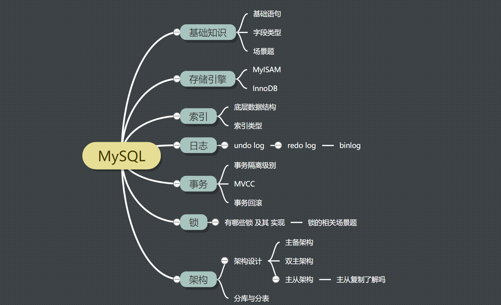

## 基础知识

### NOSQL 和 SQL 区别？

- SQL 数据库，指关系型数据库 
  - 存储结构化数据：数据逻辑上以行列二维表的形式存在，每一列代表数据的一种属性，每一行代表一个数据实体
  - 关系型数据库的数据之间存在关联性，水平扩展较难 ，需要解决跨服务器 JOIN，分布式事务等问题
- NoSQL，指非关系型数据库
  - 提供了不同于二维表的存储方式，存储方式可以是 JSON 文档、哈希表或者其他方式
  - NoSQL 数据之间无关系，这样就非常容易扩展，也无形之间，在架构的层面上带来了可扩展的能力

> 
>
> ### 数据库的三大范式
>
> 第一范式，确保表的每一列都是不可分割的基本数据单元
>
> 第二范式，要求表中的每一列都和主键直接相关
>
> 第三范式，非主键列应该只依赖于主键列
>
> 
>
> ### varchar 和 char 的区别？
>
> - varchar 是可变长度的字符类型
>   - 实际容量里，需要 1 到 2 个字节来表示字符串长度
> - char 是固定长度的字符类型，
>   - 当定义一个 `CHAR(10)` 字段时，不管实际存储的字符长度是多少，都只会占用 10 个字符的空间。
>   - 如果插入的数据小于 10 个字符，剩余的部分会用空格填充
>
> ### varchar(100) 和 varchar(10) 区别
>
> - VARCHAR(100)和 VARCHAR(10)都是变长类型，表示能存储最多 100 个字符和 10 个字符。因此，VARCHAR (100) 可以满足更大范围的字符存储需求，有更好的业务拓展性。而 VARCHAR(10)存储超过 10 个字符时，就需要修改表结构才可以。
>   - **虽说 VARCHAR(100)和 VARCHAR(10)能存储的字符范围不同，但二者存储相同的字符串，所占用磁盘的存储空间其实是一样的**
>   - **不过，VARCHAR(100) 会消耗更多的内存**。这是因为 **VARCHAR 类型在内存中操作时，通常会分配固定大小的内存块来保存值**，即使用字符类型中定义的长度。例如在进行排序的时候，VARCHAR(100)是按照 100 这个长度来进行的，也就会消耗更多内存
>
> 
>
> ### blob 和 text 的区别？
>
> - blob 用于存储二进制数据，比如图片、音频、视频、文件等；
>   - 但实际开发中，我们都会把这些文件存储到 OSS 或者文件服务器上，然后在数据库中存储文件的 URL
> - text 用于存储长文本数据，比如文章、评论、日志等
>
> #### 为什么不推荐使用 text
>
> 在日常开发中，很少使用 TEXT 类型，但偶尔会用到，而 BLOB 类型则基本不常用。
>
> 如果预期长度范围可以通过 VARCHAR 来满足，建议避免使用 TEXT。
>
> 1. **页外存储影响性能**
>     `TEXT` 类型在某些行格式（如 `DYNAMIC` 或 `COMPRESSED`）下会将数据存储在页外（overflow pages），只在主记录中存一个指针。这种结构在 **读取或更新时需要额外的 I/O 操作**，性能明显不如直接行内存储的 `VARCHAR`。
>
> 2. **限制多，问题多**
>
>    - `	TEXT` 字段无法加默认值；
>
>    - 使用 `GROUP_CONCAT` 聚合长文本时容易超出 `group_concat_max_len` 限制；
>
>    - 数据包传输可能超过 `max_allowed_packet` 限制，导致 insert/update 失败。
>
> 3. **表变大，缓存命中率下降**
>     TEXT 字段会让数据页膨胀，**降低 InnoDB buffer pool 命中率**，影响整个表的性能。
>
> 4. **查询效率差，索引支持弱**
>     `TEXT` 类型不支持前缀以外的索引，全文索引（FULLTEXT）虽然可以建，但不适用于复杂精确匹配。并且不能直接参与 GROUP BY、ORDER BY、JOIN 等操作，查询代价高
>
> 
>
> ### DATATIME 和 TIMESTAMP 区别？
>
> - DATETIME 直接存储日期和时间的完整值，与时区无关
>   - DATETIME 的默认值为 null，占用 8 个字节
> - TIMESTAMP 存储的是 Unix 时间戳，1970-01-01 00:00:01 UTC 以来的秒数，受时区影响
>   - TIMESTAMP 的默认值为当前时间 CURRENT_TIMESTAMP，占 4 个字节；实际开发中更常用，因为可以自动更新
>
> 
>
> ### 怎么存储 emoji？
>
> emoji（😊）是 4 个字节的 UTF-8 字符，需要使用 utf8mb4 字符集，不能使用 utf8 字符集（只支持最多 3 个字节的 UTF-8 字符）
>
> MySQL 8.0 已经默认支持 utf8mb4 字符集
>
> 
>
> ### 记录货币用什么类型？
>
> **电商、交易、账单等涉及货币的场景，建议使用 `DECIMAL` 类型**，因为 `DECIMAL` 类型是精确数值类型，不会出现浮点数计算误差。
>
> `DECIMAL(19,4)` 可以存储最多 19 位数字，其中 4 位是小数。
>
> ```mysql
> CREATE TABLE orders (
>     id INT AUTO_INCREMENT,
>     amount DECIMAL(19,4),
>     PRIMARY KEY (id)
> );
> ```
>
> **如果是银行，涉及到支付的场景，建议使用 `BIGINT` 类型**。可以将货币金额乘以一个固定因子，比如 100，表示以“分”为单位，然后存储为 `BIGINT`。这种方式既避免了浮点数问题，同时也提供了不错的性能。但在展示的时候需要除以相应的因子
>
> #### 为什么不推荐使用 FLOAT 或 DOUBLE？
>
> **因为 FLOAT 和 DOUBLE 都是浮点数类型，会存在精度问题。**
>
> 在许多编程语言中，`0.1 + 0.2` 的结果会是类似 `0.30000000000000004` 的值，而不是预期的 `0.3`
>


### delete, drop, truncate 区别？

- DROP 是物理删除，用来删除整张表，包括表结构，且不能回滚
- DELETE 支持行级删除，可以带 WHERE 条件，可以回滚。
- TRUNCATE 用于清空表中的所有数据，但会保留表结构，不能回滚


### in 和 exists 区别？

- 使用 IN 时，MySQL 会首先执行子查询，然后将子查询的结果集用于外部查询的条件。

  这意味着子查询的结果集需要全部加载到内存中。

  - `IN` 适用于子查询结果集较小的情况。如果子查询返回大量数据，`IN` 的性能可能会下降，因为它需要将整个结果集加载到内存。

```mysql
-- IN 的临时表可能成为性能瓶颈
SELECT * FROM users 
WHERE id IN (SELECT user_id FROM orders WHERE amount > 100);
```

-  EXISTS 会对外部查询的每一行，执行一次子查询。如果子查询返回任何行，则 `EXISTS` 条件为真。

  `EXISTS` 关注的是子查询是否返回行，而不是返回的具体值。

  -  EXISTS 适用于子查询结果集可能很大的情况。由于 `EXISTS` 只需要判断子查询是否返回行，而不需要加载整个结果集，

    因此在某些情况下性能更好，特别是当子查询可以使用索引时

```mysql
-- EXISTS 可以利用关联索引
SELECT * FROM users u
WHERE EXISTS (SELECT 1 FROM orders o 
            WHERE o.user_id = u.id AND o.amount > 100);
```


### UNION 与 UNION ALL 区别？

UNION 会自动去除合并后结果集中的重复行；

UNION ALL 不会去重，会将所有结果集合并起来


### count(1), count(*), count(列名) 区别

**在 InnoDB 引擎中：**

- `COUNT(1)` 和 `COUNT(*)` 没有区别，都是用来统计所有行，包括 NULL。
  - **如果表有索引，`COUNT(*)` 会直接用索引统计，而不是全表扫描，而 `COUNT(1)` 也会被 MySQL 优化为 `COUNT(*)`**

- `COUNT(列名)` 只统计列名不为 NULL 的行数

```go
-- 假设 users 表：
+----+-------+------------+
| id | name  | email      |
+----+-------+------------+
| 1  | 张三  | zhang@xx.com |
| 2  | 李四  | NULL       |
| 3  | 王二  | wang@xx.com |
+----+-------+------------+

-- COUNT(*)
SELECT COUNT(*) FROM users;
-- 结果：3  （统计所有行）

-- COUNT(1)
SELECT COUNT(1) FROM users;
-- 结果：3  （统计所有行）

-- COUNT(email)
SELECT COUNT(email) FROM users;
-- 结果：2  （NULL 不计入统计）
```


### NULL 与 `''` 的区别？

1. 含义:
   - `NULL` 代表一个不确定的值，它不等于任何值，包括它自身
   - `''` 表示一个空字符串，它是一个已知的值。
2. 存储空间:
   - `NULL` 的存储空间占用取决于数据库的实现，通常需要一些空间来标记该值为空。
   - `''` 的存储空间占用通常较小，因为它只存储一个空字符串的标志，不需要存储实际的字符。
3. 比较运算:
   - 任何值与 `NULL` 进行比较（例如 `=`, `!=`, `>`, `<` 等）的结果都是 `NULL`，表示结果不确定。要判断一个值是否为 `NULL`，必须使用 `IS NULL` 或 `IS NOT NULL`。
   - `''` 可以像其他字符串一样进行比较运算。例如，`'' = ''` 的结果是 `true`。
4. 聚合函数:
   - 大多数聚合函数（例如 `SUM`, `AVG`, `MIN`, `MAX`）会忽略 `NULL` 值。
   - `COUNT(*)` 会统计所有行数，包括包含 `NULL` 值的行。`COUNT(列名)` 会统计指定列中非 `NULL` 值的行数。
   - 空字符串 `''` 会被聚合函数计算在内。例如，`SUM` 会将其视为 0，`MIN` 和 `MAX` 会将其视为一个空字符串。

#### 不建议使用 NULL 作为列默认值？

虽然 MySQL 支持 `NULL`，但它的含义特殊、处理复杂，会带来存储、索引、查询、开发维护等多方面的问题，因此在设计表结构时，**能不用 NULL 就不用 NULL**，使用默认值更稳定、清晰、易维护。

1. 性能问题：

   - 对于可为 `NULL` 的列，InnoDB **需要额外的标志位来记录 `NULL` 状态**，会增加表的存储空间。

   - 若字段被建立索引，MySQL 需要额外存储一个字节以标识是否为 `NULL`

   - **MySQL 中支持在含有 `NULL` 值的列上使用索引, 但是 `Oracle` 不支持**.

     这就是我们平时所说的如果列上含有 `NULL` 那么将会使索引失效.

3. 查询结果容易出错：

   - **虽然 `select NULL=NULL` 的结果为 `false`，但是在我们使用 `distinct`, `group by`, `order by` 时, `NULL` 又被认为是相同值**

   - **在使用 `NOT IN`，如果存在 `NULL`，结果始终返回空集：**

     ```mysql
     SELECT * FROM table WHERE id NOT IN (1, 2, NULL); -- 始终返回空集
     ```

4. **任何有返回值的表达式中有 `NULL` 参与时, 都会得到另外一个 `NULL` 值：**

   ```mysql
   SELECT CONCAT('Hello', NULL); -- 返回 NULL
   ```

5. **使用 `count(*)` 或者 `count(null column)` 结果不同, `count(null column)` <= `count(*)`**

6. 代码处理逻辑复杂

   - 如果允许字段为 `NULL`，那么代码层就需要额外处理：

     ```go
     if value.Valid { ... } else { // 是 NULL }
     ```

   - 返回的值为 `NULL`，使用 `string`/`int` 等基本类型反序列时，会报错

 

### 查询语句的执行顺序？

先执行 FROM 确定主表，再执行 JOIN 连接，然后 WHERE 进行过滤，接着 GROUP BY 进行分组，HAVING 过滤聚合结果，SELECT 选择最终列，ORDER BY 排序，最后 LIMIT 限制返回行数。

| 执行顺序 | SQL 关键字 | 作用                           |
| -------- | ---------- | ------------------------------ |
| ①        | FROM       | 确定主表，准备数据             |
| ②        | ON         | 连接多个表的条件               |
| ③        | JOIN       | 执行 INNER JOIN / LEFT JOIN 等 |
| ④        | WHERE      | 过滤行数据（提高效率）         |
| ⑤        | GROUP BY   | 进行分组                       |
| ⑥        | HAVING     | 过滤聚合后的数据               |
| ⑦        | SELECT     | 选择最终返回的列               |
| ⑧        | DISTINCT   | 进行去重                       |
| ⑨        | ORDER BY   | 对最终结果排序                 |
| ⑩        | LIMIT      | 限制返回行数                   |

WHERE 先执行是为了减少数据量，HAVING 只能过滤聚合数据，ORDER BY 必须在 SELECT 之后排序最终结果，LIMIT 最后执行以减少数据传输。


### Delete，Update命令的特殊处理：

- delete 操作实际上不会立即直接删除，而是将 delete 对象打上 delete flag，标记为删除，最终的删除操作是 purge 线程完成的。
- update 分为两种情况：update 的列是否是主键列。
  - 如果不是主键列，在 undo log 中直接反向记录是如何 update 的。即 update 是直接进行的。
  - 如果是主键列，update 分两部执行：先删除该行，再插入一行目标行。


## 架构

### MySQL 的基础架构

MySQL 采用分层架构，主要包括连接层、服务层、和存储引擎层


1. **Server 层负责建立连接、分析和执行 SQL**。
   1. MySQL 大多数的核心功能模块都在这实现，主要包括连接器，查询缓存、解析器、预处理器、优化器、执行器等。
   2. 另外，所有的内置函数（如日期、时间、数学和加密函数等）和所有跨存储引擎的功能（如存储过程、触发器、视图等）都在 Server 层实现。

2. **存储引擎层负责数据的存储和提取**。
   1. 支持 InnoDB、MyISAM、Memory 等多个存储引擎，不同的存储引擎共用一个 Server 层。
   2. 现在最常用的存储引擎是 InnoDB，从 MySQL 5.5 版本开始， InnoDB 成为了 MySQL 的默认存储引擎。
   3. 我们常说的索引数据结构，就是由存储引擎层实现的，不同的存储引擎支持的索引类型也不相同，比如 InnoDB 支持索引类型是 B+树 ，且是默认使用，也就是说在数据表中创建的主键索引和二级索引默认使用的是 B+ 树索引。


### 执行一条SQL请求的过程是什么？

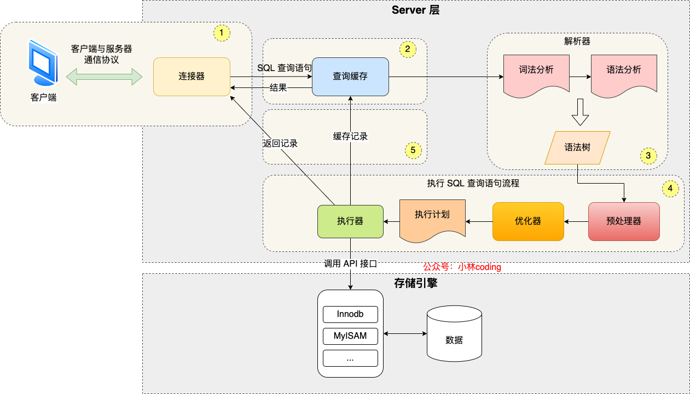

- **第一步：连接器**

  - 因为 MySQL 是基于 TCP 协议进行传输的，server 层与客户端进行 TCP 三次握手建立连接；
  - 校验客户端的用户名和密码，如果用户名或密码不对，则会报错；
  - 如果用户名和密码都对了，会读取该用户的权限，然后后面的权限逻辑判断都基于此时读取到的权限

- **第二部：查询缓存**

  - 如果 SQL 是查询语句（select 语句），MySQL 就会先去查询缓存（ Query Cache ）里查找缓存数据，看看之前有没有执行过这一条命令，这个查询缓存是以 key-value 形式保存在内存中的，key 为 SQL 查询语句，value 为 SQL 语句查询的结果

  - 如果查询的语句命中查询缓存，那么就会直接返回 value 给客户端。

    如果查询的语句没有命中查询缓存中，那么就要往下继续执行，等执行完后，查询的结果就会被存入查询缓存中

  - 对于更新比较频繁的表，查询缓存的命中率很低的；所以，MySQL 8.0 版本直接将查询缓存删掉了；

    也就是说 MySQL 8.0 开始，执行一条 SQL 查询语句，不会再走到查询缓存这个阶段了。

- **第三步：解析器 解析 SQL**

  - 词法分析：MySQL 会根据你输入的字符串识别出关键字出来
  - 语法分析：根据词法分析的结果，语法解析器会根据语法规则，判断你输入的这个 SQL 语句是否满足 MySQL 语法
    - 如果没问题就会构建出 SQL 语法树，这样方便后面模块获取 SQL 类型、表名、字段名、 where 条件等等
    - 如果我们输入的 SQL 语句语法不对，就会在解析器这个阶段报错

  > ### SQL 的语法树解析
  >
  > SQL 语法树解析是将 SQL 查询语句转换成抽象语法树 AST 的过程，是数据库引擎处理查询的第一步，也是防止 SQL 注入的重要手段。
  >
  > 通常分为 3 个阶段。
  >
  > 第一个阶段，词法分析：拆解 SQL 语句，识别关键字、表名、列名等
  >
  > 第二个阶段，语法分析：检查 SQL 是否符合语法规则，并构建抽象语法
  >
  > 第三个阶段，语义分析：检查表、列是否存在，进行权限验证等

- **第四步：执行器 执行 SQL**
  - 预处理阶段：预处理器
    - 检查表或字段是否存在；
    - 将 `select *` 中的 `*` 符号扩展为表上的所有列。
  - 优化阶段：优化器
    - 优化器主要负责将 SQL 查询语句的执行方案确定下来
    - 基于查询成本的考虑， 选择查询成本最小的执行计划；
  - 执行阶段：根据执行方案，执行 SQL 查询语句；从存储引擎读取记录，返回给客户端；


### 执行一条DML请求的过程？

> DML：删除，更新，插入 的 更新操作


1. **SQL 解析与执行计划生成**

   解析 SQL → 词法分析+语法分析，构成语法树 → 优化器选择执行计划（走主键索引）→  执行器执行

2. **查询索引B+对应的数据页，查找buffer pool**

   根据主键在 聚簇索引 B+ 树 中查找 id=1 所在记录页；

   如果数据页不在 buffer pool → 从磁盘加载到内存

3. **加记录锁**

   对命中的记录加 行级锁（Record Lock），类型为 X 锁

4. **更新前，写 Undo Log**

   在更新前，将旧值写入 Undo Log（用于支持事务回滚）

5. **修改内存页（Buffer Pool），标记为脏页**

   直接在 buffer pool 中修改该记录，标记为“脏页”

6. **写 Redo Log（物理日志）到 redo-log buffer，二阶段提交：标记为 `prepare` 状态，WAL刷盘**

   将更新操作记录到 redo log buffer；标记状态为 prepare，WAL刷盘（保证 crash-safe）

​	更新操作完成

7. **写 Binlog（sql日志）到 binlog buffer**

   MySQL Server 层记录本次更新的 binlog，写入到binlog buffer中

8. **提交事务，两阶段提交： binlog 刷盘，redo log 状态修改为 `commit` **

   先写 binlog文件，刷盘（sync_binlog=1）

   调用 InnoDB 提交接口 → 将 redo log 状态更新为 commit（无需刷盘）

9. **释放行锁，事务结束**

   锁释放，结果返回客户端，更新操作完成！


## 存储引擎

### MySQL 支持的存储引擎

- InnoDB：InnoDB 是 MySQL 的默认存储引擎，具有 ACID 事务支持、行级锁、外键约束等特性。它适用于高并发的读写操作，支持较好的数据完整性和并发控制。
- MyISAM：MyISAM 是 MySQL 的另一种常见的存储引擎，具有较低的存储空间和内存消耗，适用于大量读操作的场景。然而，MyISAM 不支持事务、行级锁和外键约束，因此在并发写入和数据完整性方面有一定的限制。
- Memory：Memory 引擎将数据存储在内存中，适用于对性能要求较高的读操作，但是在服务器重启或崩溃时数据会丢失。它不支持事务、行级锁和外键约束

### innodb 与 MyISAM 的区别

- **事务**：InnoDB 支持事务，MyISAM 不支持事务，这是 MySQL 将默认存储引擎从 MyISAM 变成 InnoDB 的重要原因之一。
- **索引结构**：InnoDB 是聚簇索引，MyISAM 是非聚簇索引。
  - 聚簇索引的文件存放在主键索引的叶子节点上，因此 InnoDB 必须要有主键，通过主键索引效率很高。但是辅助索引需要两次查询，先查询到主键，然后再通过主键查询到数据。因此，主键不应该过大，因为主键太大，其他索引也都会很大。
  - 而 MyISAM 是非聚簇索引，数据文件是分离的，索引保存的是数据文件的指针。主键索引和辅助索引是独立的。
- **锁粒度**：InnoDB 最小的锁粒度是行锁，MyISAM 最小的锁粒度是表锁。
  - MyISAM 一个更新语句会锁住整张表，导致其他查询和更新都会被阻塞，因此并发访问受限。
- **count 的效率**：
  - InnoDB 不保存表的具体行数，执行 select count(*) from table 时需要全表扫描。
  - 而 MyISAM 用一个变量保存了整个表的行数，执行上述语句时只需要读出该变量即可，速度很快

#### 为什么 InnoDB 是默认引擎？

- 事务支持：InnoDB 引擎提供了对事务的支持，可以进行 ACID（原子性、一致性、隔离性、持久性）属性的操作；
  - Myisam 存储引擎是不支持事务的。
- 并发性能：InnoDB 引擎采用了行级锁定的机制，可以提供更好的并发性能；
  - Myisam 存储引擎只支持表锁，锁的粒度比较大。
- 崩溃恢复：InnoDB 引擎通过 redolog 日志实现了崩溃恢复，可以在数据库发生异常情况（如断电）时，通过日志文件进行恢复，保证数据的持久性和一致性；
  - Myisam 是不支持崩溃恢复的。


### MySQL 一行记录的存储结构

#### 数据存储在哪个文件？

- `db.opt`：用来 **存储当前数据库的默认字符集和字符校验规则**。
- `表名.frm`：**表结构** 会存在.frm 文件；
  - 在 MySQL 中建立一张表都会生成一个.frm 文件，该文件是用来保存每个表的元数据信息的，主要包含表结构定义
- `表名.ibd`：**表数据** 会保存在.ibd 文件；
  - 表数据既可以存在共享表空间文件（文件名：ibdata1）里，也可以存放在独占表空间文件（文件名：表名字.ibd）。
  - 这个行为是由参数 innodb_file_per_table 控制的，若设置了参数 innodb_file_per_table 为 1，则会将存储的数据、索引等信息单独存储在一个独占表空间。
  - 从 MySQL 5.6.6 版本开始， MySQL 中每一张表的数据都存放在一个独立的 .ibd 文件

#### 表空间文件的结构

**表空间由段（segment）、区（extent）、页（page）、行（row）组成**，InnoDB 存储引擎的逻辑存储结构如下：


1. 行：

   - **记录是按照行来存储**：数据库表中的记录都是按行（row）进行存放的，每行记录根据不同的行格式，有不同的存储结构

2. 页：

   - **InnoDB 的数据是按「页」为单位来读写的**：当需要读一条记录的时候，是以页为单位，将其整体读入内存

   - **默认每个页的大小为 16KB**，也就是最多能保证 16KB 的连续存储空间：页是 InnoDB 存储引擎磁盘管理的最小单元

     意味着数据库每次读写都是以 16KB 为单位的，**一次最少从磁盘中读取 16K 的内容到内存中，一次最少把内存中的 16K 内容刷新到磁盘中**

   - 数据表中的行记录是用「数据页」来管理的

3. 区：

   -  InnoDB 存储引擎是用 B+ 树来组织数据的：B+ 树中每一层都是通过双向链表连接起来的

     如果是以页为单位来分配存储空间，那么 **链表中相邻的两个页之间的物理位置并不是连续的，可能离得非常远，那么磁盘查询时就会有大量的随机 I/O，随机 I/O 是非常慢的**

   - 为了解决随机 I/O：**在表中数据量大的时候，为某个索引分配空间的时候就不再按照页为单位分配了，而是按照区（extent）为单位分配。每个区的大小为 1MB，对于 16KB 的页来说，连续的 64 个页会被划为一个区，这样就使得链表中相邻的页的物理位置也相邻，就能使用顺序 I/O 了**

4. 段：

   - 表空间是由各个段（segment）组成的，段是由多个区（extent）组成的。段一般分为数据段、索引段和回滚段等：
     - 索引段：存放 B + 树的非叶子节点的区的集合；
     - 数据段：存放 B + 树的叶子节点的区的集合；
     - 回滚段：存放的是回滚数据的区的集合，如：MVCC 利用了回滚段实现了多版本查询数据

#### InnoDB 的行格式

**行格式（row_format），就是一条记录的存储结构。**

InnoDB 提供了 4 种行格式，分别是 Redundant、Compact、Dynamic 和 Compressed 行格式。

- ~~Redundant 是很古老的行格式了， MySQL 5.0 版本之前用的行格式，现在基本没人用了。~~
- 由于 Redundant 不是一种紧凑的行格式，所以 MySQL 5.0 之后引入了 Compact 行记录存储方式，Compact 是一种紧凑的行格式，设计的初衷就是为了让一个数据页中可以存放更多的行记录，从 MySQL 5.1 版本之后，行格式默认设置成 Compact。
- Dynamic 和 Compressed 两个都是紧凑的行格式，它们的行格式都和 Compact 差不多，因为都是基于 Compact 改进一点东西。从 **MySQL5.7 版本之后，默认使用 Dynamic 行格式**

#### Compact 行格式


一条完整的记录分为「记录的额外信息」和「记录的真实数据」两个部分：

- 记录的额外信息包含 3 个部分：变长字段长度列表、NULL 值列表、记录头信息

  - 变长字段长度列表：

    - 变长字段的真实数据占用的字节数会按照列的顺序 **逆序存放**

      「变长字段长度列表」中的信息之所以要逆序存放，是因为这样可以 **使得位置靠前的记录的真实数据和数据对应的字段长度信息可以同时在一个 CPU Cache Line 中，这样就可以提高 CPU Cache 的命中率**。

    - **NULL 是不会存放在行格式中记录的真实数据部分里的**，所以「变长字段长度列表」里不需要保存值为 NULL 的变长字段的长度

    - **当数据表没有变长字段的时候，比如全部都是 int 类型的字段，这时候表里的行格式就不会有「变长字段长度列表」了**

  - NULL 值列表：NULL 值都放到记录的真实数据中会比较浪费空间，所以 Compact 行格式把这些值为 NULL 的列存储到 NULL 值列表中

    - 如果存在允许 NULL 值的列，则 **每个列对应一个二进制位（bit），二进制位按照列的顺序逆序排列**。

      - 二进制位的值为 `1` 时，代表该列的值为 NULL。
      - 二进制位的值为 `0` 时，代表该列的值不为 NULL

    - **当数据表的字段都定义成 NOT NULL 的时候，这时候表里的行格式就不会有 NULL 值列表了**

    - NULL 值列表必须用整数个字节的位表示（1 字节 8 位），如果使用的二进制位个数不足整数个字节，则在字节的高位补 `0`

      当一条记录有 9 个字段值都是 NULL，那么就会创建 2 字节空间的「NULL 值列表」，以此类推

  - 记录头信息：说几个比较重要的

    - delete_mask ：标识此条数据是否被删除。从这里可以知道，**我们执行 detele 删除记录的时候，并不会真正的删除记录，只是将这个记录的 delete_mask 标记为 1**。

    - next_record：下一条记录的位置。**从这里可以知道，记录与记录之间是通过链表组织的**。

      **指向的是下一条记录的「记录头信息」和「真实数据」之间的位置**，这样的好处是 **向左读就是记录头信息，向右读就是真实数据**，比较方便。

    - record_type：表示当前记录的类型，0 表示普通记录，1 表示 B+树非叶子节点记录，2 表示最小记录，3 表示最大记录

- 记录的真实信息：除了我们定义的字段，还有三个隐藏字段，分别为：row_id、trx_id、roll_pointer
  - row_id：如果我们建表的时候指定了主键或者唯一约束列，那么就没有 row_id 隐藏字段了。如果既没有指定主键，又没有唯一约束，那么 InnoDB 就会为记录添加 row_id 隐藏字段。row_id 不是必需的，占用 6 个字节。
  - trx_id：事务 id，表示这个数据是由哪个事务生成的。 trx_id 是必需的，占用 6 个字节。
  - roll_pointer：这条记录上一个版本的指针。roll_pointer 是必需的，占用 7 个字节。

#### varchar(n)中 n 允许的最大值

**MySQL 规定除了 TEXT、BLOBs 这种大对象类型之外，其他所有的列（不包括隐藏列和记录头信息）占用的字节长度加起来不能超过 65535(64KB-1) 个字节**

存储字段类型为 varchar(n) 的数据时，其实分成了三个部分来存储：

- 真实数据
- 真实数据占用的字节数：变长字段长度列表
- NULL 标识，如果不允许为 NULL，这部分不需要

每个变长字段的「变长字段长度」需要用多少字节表示？具体情况分为：

- 条件一：如果变长字段允许存储的最大字节数小于等于 255 字节，就会用 1 字节表示「变长字段长度」；
- 条件二：如果变长字段允许存储的最大字节数大于 255 字节，就会用 2 字节表示「变长字段长度」；

故：

**在数据库表只有一个 varchar(n) 字段且字符集是 ascii 的情况下，varchar(n) 中 n 最大值 = 65535 - 2 - 1 = 65532**

在 UTF-8 字符集下，一个字符最多需要三个字节，varchar(n) 的 n 最大取值就是 65532/3 = 21844

#### 行溢出，MySQL 怎么处理

MySQL 中磁盘和内存交互的基本单位是页，一个页的大小一般是 `16KB`，也就是 `16384字节`，而一个 varchar(n) 类型的列最多可以存储 `65532字节`，一些大对象如 TEXT、BLOB 可能存储更多的数据，这时一个页可能就存不了一条记录。这个时候就会 **发生行溢出，多的数据就会存到另外的「溢出页」中**

**Compact 行格式：** 当发生行溢出时，在记录的真实数据处只会保存该列的一部分数据，而把剩余的数据放在「溢出页」中，然后真实数据处用 20 字节存储指向溢出页的地址，从而可以找到剩余数据所在的页。大致如下图所示。


Compressed 和 Dynamic 这两个行格式：采用完全的行溢出方式，记录的真实数据处不会存储该列的一部分数据，只存储 20 个字节的指针来指向溢出页


### InnoDB 的 Buffer Pool

Buffer Pool 是 InnoDB 存储引擎中的一个内存缓冲区，它会将经常使用的数据页、索引页加载进内存：

- 当读取数据时，如果数据存在于 Buffer Pool 中，客户端就会直接读取 Buffer Pool 中的数据，否则再去磁盘中读取。
  - 如果没有命中，就从磁盘读取，并加载到 Buffer Pool，此时可能会触发页淘汰，将不常用的页移出 Buffer Pool。
- 当修改数据时，首先是修改 Buffer Pool 中数据所在的页，然后将其页设置为脏页，最后由后台线程将脏页写入到磁盘

#### InnoDB 对 LRU 算法的优化

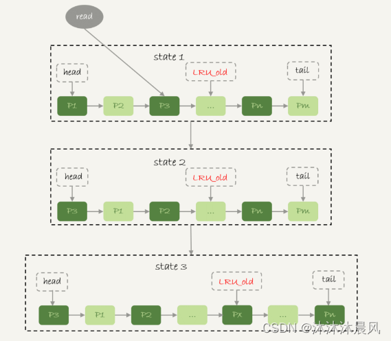 

在 InnoDB 实现上，按照 5:3 的比例把整个 LRU 链表分成了 young 区域和 old 区域：

- 图中 LRU_old 指向的就是 old 区域的第一个位置，是整个链表的 5/8 处。
- 也就是说，靠近链表头部的 5/8 是 young 区域，靠近链表尾部的 3/8 是 old 区域。

改进后的 LRU 算法执行流程：

1. 状态 1，要访问数据页 P3，由于 P3 在 young 区域，因此和优化前的 LRU 算法一样，将其移到链表头部，变成状态 2。
2. 之后要访问一个新的不存在于当前链表的数据页，这时候依然是淘汰掉数据页 Pm，但是新插入的数据页 Px，是放在 LRU_old 处。
3. 处于 old 区域的数据页，每次被访问的时候都要做下面这个判断：
   - 若这个数据页在 LRU 链表中存在的时间 **超过了 1 秒**，就把它移动到链表头部；
   - 如果这个数据页在 LRU 链表中存在的时间 **短于 1 秒**，位置保持不变；
   - 1 秒这个时间，是由参数 `innodb_old_blocks_time` 控制的。其默认值是 1000，单位毫秒。

#### 如何管理空闲页？

为了能够快速找到空闲的缓存页，可以使用链表结构，将空闲缓存页的「控制块」作为链表的节点，这个链表称为 **Free 链表**


- Free 链表上除了有控制块，还有一个头节点，该头节点包含链表的头节点地址，尾节点地址，以及当前链表中节点的数量等信息。

- Free 链表节点是一个一个的控制块，而每个控制块包含着对应缓存页的地址，所以相当于 Free 链表节点都对应一个空闲的缓存页

有了 Free 链表后，每当需要从磁盘中加载一个页到 Buffer Pool 中时，就**从 Free链表中取一个空闲的缓存页，并且把该缓存页对应的控制块的信息填上，然后把该缓存页对应的控制块从 Free 链表中移除**


#### 如何管理脏页？

为了能快速知道哪些缓存页是脏的，于是就设计出 **Flush 链表**：

它跟 Free 链表类似的，链表的节点也是控制块，区别在于 Flush 链表的元素都是脏页。


#### 脏页什么时候会被刷入磁盘？

下面几种情况会触发脏页的刷新：

1. 当 **redo log 日志满了**的情况下，会主动触发脏页刷新到磁盘；
2. **Buffer Pool 空间不足**时，需要将一部分数据页淘汰掉，如果淘汰的是脏页，需要先将脏页同步到磁盘；
3. MySQL 认为空闲时，**后台线程**会定期将适量的脏页刷入到磁盘；
4. **MySQL 正常关闭**之前，会把所有的脏页刷入到磁盘；


## 索引

### 什么是索引？

索引的定义就是帮助存储引擎快速获取数据的一种数据结构，形象的说就是 **索引是数据的目录**，可以减少扫描的数据量，提高查询效率

#### 有无索引的查询

- **如果查询的时候，没有用到索引就会全表扫描**，这时候查询的时间复杂度是 O（n）
- **如果用到了索引，那么查询的时候，可以基于二分查找算法，通过索引快速定位到目标数据**， mysql 索引的数据结构一般是 b+树，其搜索复杂度为 O(logdN)，其中 d 表示节点允许的最大子节点个数为 d 个

### 索引底层的数据结构

#### 为什么不采用二叉查找树 BST？

二叉查找树（Binary Search Tree）是一种基于二叉树的数据结构，它具有以下特点：

1. 左子树所有节点的值均小于根节点的值。
2. 右子树所有节点的值均大于根节点的值。
3. 左右子树也分别为二叉查找树

**二叉查找树的性能非常依赖于它的平衡程度，这就导致其不适合作为 MySQL 底层索引的数据结构**

- 当二叉查找树是平衡的时候，也就是树的每个节点的左右子树深度相差不超过 1 的时候，查询的时间复杂度为 O(log2(N))，具有比较高的效率。
- 然而，当二叉查找树不平衡时，例如在最坏情况下（有序插入节点），树会退化成线性链表（也被称为斜树），导致查询效率急剧下降，时间复杂退化为 O(N)

#### 为什么不采用 AVL？

AVL 树的特点是保证任何节点的左右子树高度之差不超过 1，因此也被称为高度平衡二叉树，它的查找、插入和删除在平均和最坏情况下的时间复杂度都是 O(logn)；AVL 树采用了旋转操作来保持平衡。主要有四种旋转操作：LL 旋转、RR 旋转、LR 旋转和 RL 旋转。其中 LL 旋转和 RR 旋转分别用于处理左左和右右失衡，而 LR 旋转和 RL 旋转则用于处理左右和右左失衡

- 由于 AVL 树需要频繁地进行旋转操作来保持平衡，因此会有较大的计算开销进而降低了数据库写操作的性能。
- 并且， 在使用 AVL 树时，每个树节点仅存储一个数据，而每次进行磁盘 IO 时只能读取一个节点的数据，如果需要查询的数据分布在多个节点上，那么就需要进行多次磁盘 IO。**磁盘 IO 是一项耗时的操作，在设计数据库索引时，我们需要优先考虑如何最大限度地减少磁盘 IO 操作的次数**


#### 为什么不采用红黑树？

红黑树是一种自平衡二叉查找树，通过在插入和删除节点时进行颜色变换和旋转操作，使得树始终保持平衡状态，它具有以下特点：

1. 每个节点非红即黑；
2. 根节点总是黑色的；
3. 每个叶子节点都是黑色的空节点（NIL 节点）；
4. 如果节点是红色的，则它的子节点必须是黑色的（反之不一定）；
5. 从任意节点到它的叶子节点或空子节点的每条路径，必须包含相同数目的黑色节点（即相同的黑色高度）。

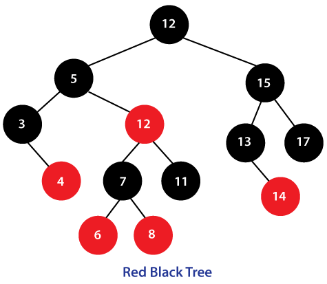

- 和 AVL 树不同的是，红黑树并不追求严格的平衡，而是大致的平衡。正因如此，红黑树的查询效率稍有下降，**因为红黑树的平衡性相对较弱，可能会导致树的高度较高，这可能会导致一些数据需要进行多次磁盘 IO 操作才能查询到，这也是 MySQL 没有选择红黑树的主要原因。**
- 也正因如此，红黑树的插入和删除操作效率大大提高了，因为红黑树在插入和删除节点时只需进行 O(1) 次数的旋转和变色操作，即可保持基本平衡状态，而不需要像 AVL 树一样进行 O(logn) 次数的旋转操作


#### Hash 表

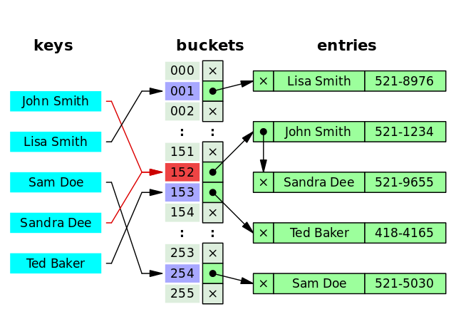

- MySQL 的 InnoDB 存储引擎不直接支持常规的哈希索引，但是，InnoDB 存储引擎中存在一种特殊的“自适应哈希索引”。
  - 自适应哈希索引的每个哈希桶实际上是一个小型的 B+Tree 结构。这个 B+Tree 结构可以存储多个键值对，而不仅仅是一个键。
  - 这有助于减少哈希冲突链（链地址法，解决哈希冲突）的长度，提高了索引的效率。

##### **为什么不直接使用？**

**主要是因为 Hash 索引不支持顺序和范围查询**。

通过哈希算法，我们可以快速找到 key 对应的 index，找到了 index 也就找到了对应的 value；

但如果我们要对表中的数据进行排序或者进行范围查询，那 Hash 索引可就不行了。并且，每次 IO 只能取一个。

试想一种情况：

```mysql
SELECT * FROM tb1 WHERE id < 500;
```

Hash 索引是根据 hash 算法来定位的，id：1~499，每个都需要进行一次 hash 计算来定位


#### B 树 & B+树

B 树也称 B- 树，全称为 **多路平衡查找树**，B+ 树是 B 树的一种变体。B 树和 B+ 树中的 B 是 `Balanced`（平衡）的意思。

##### 什么是 B+树？

B+Tree 是一种多叉树，叶子节点才存放数据，非叶子节点只存放索引，而且每个节点里的数据是 **按主键顺序存放** 的。

- 每一层父节点的索引值都会出现在下层子节点的索引值中，因此在叶子节点中，包括了所有的索引值信息；
- 并且每一个叶子节点都有两个指针，分别指向下一个叶子节点和上一个叶子节点，形成一个双向链表

##### **B 树 和 B+ 树区别？**

- 在 B+树中，数据都存储在叶子节点上，而非叶子节点只存储索引信息；而 B 树的非叶子节点既存储索引信息也存储部分数据。
- B+树的叶子节点使用链表相连，便于范围查询和顺序访问；B 树的叶子节点没有链表连接。
- B+树的查找性能更稳定，每次查找都需要查找到叶子节点；而 B 树的查找可能会在非叶子节点找到数据，性能相对不稳定。

****

[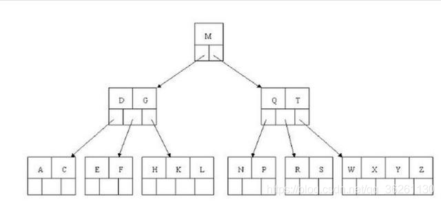](https://img2020.cnblogs.com/blog/2457032/202109/2457032-20210905214916903-837451450.png)

B 树的查询流程：如上图我要从找到 E 字母，查找流程如下：

　　1）获取根节点的关键字进行比较，当前根节点关键字为 M，E < M（26 个字母顺序），所以往找到指向左边的子节点（二分法规则，左小右大，左边放小于当前节点值的子节点、右边放大于当前节点值的子节点）。

　　2）拿到关键字 D 和 G，D < E < G 所以直接找到 D 和 G 中间的节点。

　　3）拿到 E 和 F，因为 E = E 所以直接返回关键字和指针信息（如果树结构里面没有包含所要查找的节点则返回 null）。

　　4）通过指针信息取出这条记录的所有信息。

##### B+树的叶子节点链表是单向还是双向？

双向的，为了实现倒序遍历或者排序。

- B+ 树的叶子节点之间是用「双向链表」进行连接，这样的好处是既能向右遍历，也能向左遍历。
- B+ 树点节点内容是数据页，数据页里存放了用户的记录以及各种信息，每个数据页默认大小是 16 KB。

Innodb 根据索引类型不同，分为聚集和二级索引。他们区别在于，聚集索引的叶子节点存放的是实际数据，所有完整的用户记录都存放在聚集索引的叶子节点，而二级索引的叶子节点存放的是主键值，而不是实际数据。

因为表的数据都是存放在聚集索引的叶子节点里，所以 InnoDB 存储引擎一定会为表创建一个聚集索引，且由于数据在物理上只会保存一份，所以聚簇索引只能有一个，而二级索引可以创建多个。

##### MySQL 为什么用 B+树结构？和其他结构比的优点？

- **B+Tree vs B Tree：**
  - B+ 树的非叶子节点不存放实际的记录数据，仅存放索引，因此数据量相同的情况下，相比存储即存索引又存记录的 B 树，B+树的非叶子节点可以存放更多的索引，因此 **B+ 树可以比 B 树更「矮胖」，查询底层节点的磁盘 I/O 次数会更少**。
  - B+ 树有大量的冗余节点（所有非叶子节点都是冗余索引），这些冗余索引让 **B+ 树在插入、删除的效率都更高，比如删除根节点的时候，不会像 B 树那样会发生复杂的树的变化**；
  - **B+ 树叶子节点之间用链表连接了起来，有利于范围查询，而 B 树要实现范围查询，因此只能通过树的遍历来完成范围查询，这会涉及多个节点的磁盘 I/O 操作，范围查询效率不如 B+ 树**
- **B+Tree vs 二叉树：** 对于有 N 个叶子节点的 B+Tree，其搜索复杂度为 O(logdN)，其中 d 表示节点允许的最大子节点个数为 d 个。在实际的应用当中， d 值是大于 100 的，这样就保证了，即使数据达到千万级别时，B+Tree 的高度依然维持在 3~4 层左右，也就是说一次数据查询操作只需要做 3~4 次的磁盘 I/O 操作就能查询到目标数据。而二叉树的每个父节点的儿子节点个数只能是 2 个，意味着其搜索复杂度为 O(logN)，这已经比 B+Tree 高出不少，因此二叉树检索到目标数据所经历的磁盘 I/O 次数要更多。
- **B+Tree vs Hash：** Hash 在做等值查询的时候效率贼快，搜索复杂度为 O(1)。但是 Hash 表不适合做范围查询，它更适合做等值的查询，这也是 B+Tree 索引要比 Hash 表索引有着更广泛的适用场景的原因

##### 一颗 B+树能存储多少数据？

一棵 B+ 树能存多少数据，取决于它的分支因子和高度。

在 InnoDB 中，页的默认大小为 16KB，当主键为 bigint 时，3 层 B+ 树通常可以存储约 2000 万条数据。

```
最大记录数 = 叶子节点容量*(分支因子)^(树高度-1)
```

**如果单行数据大小为 1KB，那么每页（叶子节点）可存储约 16 行（16KB/1KB）数据**


### 索引类型总结 TODO

我们可以按照四个角度来分类索引。

- 按「数据结构」分类：**B+tree 索引、Hash 索引、Full-text 索引**。
- 按「物理存储」分类：**聚簇索引（主键索引）、二级索引（辅助索引）**。
- 按「字段特性」分类：**主键索引、唯一索引、普通索引、前缀索引**。
- 按「字段个数」分类：**单列索引、联合索引**

- 数据结构划分：

  - B+Tree 索引：MySQL 里默认和最常用的索引类型。只有叶子节点存储 value，非叶子节点只有指针和 key。
    - **存储引擎 MyISAM 和 InnoDB 实现 BTree 索引都是使用 B+Tree，但二者实现方式不一样**

  - 哈希索引：类似键值对的形式，一次即可定位。

  - 全文索引：对文本的内容进行分词，进行搜索。目前只有 `CHAR`、`VARCHAR`、`TEXT` 列上可以创建全文索引。一般不会使用，效率较低，通常使用搜索引擎如 ElasticSearch 代替。

- 存储方式划分：
  - 聚簇索引（主键索引）：索引结构和数据一起存放的索引，**InnoDB 中的主键索引就属于聚簇索引**。
  - 非聚簇索引（二级索引）：索引结构和数据分开存放的索引，**二级索引（辅助索引）就属于非聚簇索引**。
    - **MySQL 的 MyISAM 引擎，不管主键还是非主键，使用的都是非聚簇索引**

- 应用划分：
  - 主键索引：加速查询 + 列值唯一（不可以有 NULL）+ 表中只有一个。
  - 普通索引：仅加速查询。
  - 唯一索引：加速查询 + 列值唯一（可以有 NULL）。
  - 覆盖索引：一个索引包含（或者说覆盖）所有需要查询的字段的值。
  - 联合索引：多列值组成一个索引，专门用于组合搜索，其效率大于索引合并。
  - 全文索引：对文本的内容进行分词，进行搜索。目前只有 `CHAR`、`VARCHAR`、`TEXT` 列上可以创建全文索引。一般不会使用，效率较低，通常使用搜索引擎如 ElasticSearch 代替。
  - 前缀索引：对文本的前几个字符创建索引，相比普通索引建立的数据更小，因为只取前几个字符。

#### 聚簇与非聚簇索引

在创建表时，**InnoDB 存储引擎** 会根据不同的场景选择不同的列作为索引：

- 如果有主键，**默认会使用主键作为聚簇索引的索引键**；
- 如果没有主键，就选择第一个不允许 NULL 值且唯一索引的列作为聚簇索引的索引键；
- 在上面两个都没有的情况下，InnoDB 将自动生成一个隐式自增的主键索引 row_id(占用 6 个字节) 列作为聚簇索引的索引键

除主键索引外的其他索引，都属于辅助索引，也称：非聚簇索引。**创建的主键索引和辅助索引默认使用的是 B+Tree 索引**。

##### 聚簇与非聚簇的区别？

**从 B+树看：聚簇索引 和 非聚簇索引 存储方式的区别**

- **聚簇索引的 B+Tree 的叶子节点存放的是实际数据**，所有完整的用户记录都存放在主键索引的 B+Tree 的叶子节点里；

  

- **非聚簇索引的 B+Tree 的叶子节点存放的是主键值**，而不是实际数据

  

##### 回表 与 覆盖索引

**通过聚簇索引查询的过程：聚簇索引 B+树的叶子节点存储索引及其实际数据**


```sql
select * from product where id= 5;
```

这条语句使用了主键索引查询 id 号为 5 的商品。查询过程是这样的，B+Tree 会自顶向下逐层进行查找：

- 将 5 与根节点的索引数据 (1，10，20) 比较，5 在 1 和 10 之间，所以根据 B+Tree 的搜索逻辑，找到第二层的索引数据 (1，4，7)；
- 在第二层的索引数据 (1，4，7)中进行查找，因为 5 在 4 和 7 之间，所以找到第三层的索引数据（4，5，6）；
- 在叶子节点的索引数据（4，5，6）中进行查找，然后我们找到了索引值为 5 的行数据。

数据库的索引和数据都是存储在硬盘的，我们可以把读取一个节点当作一次磁盘 I/O 操作。

那么上面的整个查询过程一共经历了 3 个节点，也就是进行了 3 次 I/O 操作。

**通过非聚簇索引查询的过程：非聚簇索引 B+树的叶子节点 存储 索引的主键值**


```sql
select * from product where product_no = '0002';
```

- **回表，要查两个 B+Tree 才能查到数据**：
  - 先检二级索引中的 B+Tree 的索引值，找到对应的叶子节点，然后获取主键值，然后再通过主键索引中的 B+Tree 树查询到对应的叶子节点，然后获取整行数据

```sql
select id from product where product_no = '0002';
```

当查询的数据是能在二级索引的 B+Tree 的叶子节点里查询到，这时就不用再查主键索引查，比如下面这条查询语句：

- **覆盖索引，只需要查一个 B+Tree** ：

  - 当查询的数据是能在二级索引的 B+Tree 的叶子节点里查询到，就不用再查主键索引查

  

#### 联合索引

通过将多个字段组合成一个索引，该索引就被称为联合索引。

```mysql
CREATE INDEX index_product_no_name ON product(product_no, name);
```

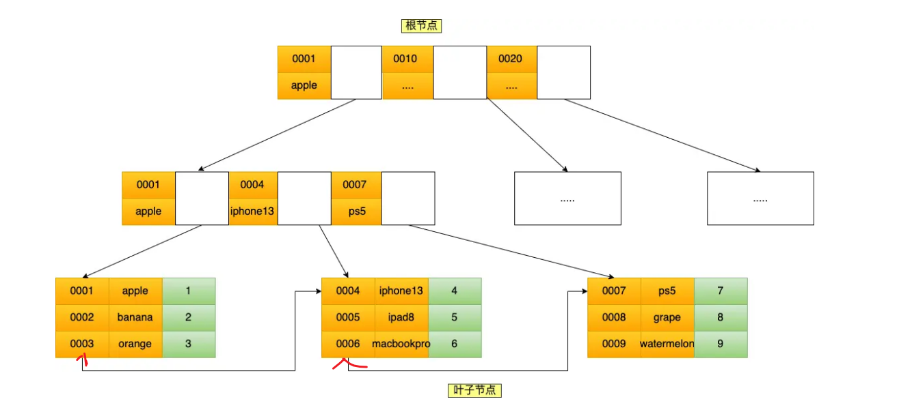

由图可知：假设 `(a, b, c)` 联合索引

- **叶子节点的索引排序**：按照先按 a 排序，在 a 相同的情况再按 b 排序，在 b 相同的情况再按 c 排序

  - **相对 a，b 和 c 是全局无序，局部相对有序的**

- **想要右侧的联合索引有效，需要保证：利用的索引 key 是有序的**

  也就是说：**只有在 a 相同的情况才，b 才是有序的**，比如 a 等于 2 的时候，b 的值为（7，8），这时就是有序的，这个有序状态是局部的，因此，执行 `where a = 2 and b = 7` 是 a 和 b 字段能用到联合索引的，也就是联合索引生效

- 遵循最左匹配原则，联合索引生效；**联合索引是非聚簇索引，B+树的叶子节点返回主键值**，有：索引覆盖，回表的两种查询方式

##### 最左前缀匹配原则

最左前缀匹配原则指的是在使用联合索引时，MySQL 会根据索引中的字段顺序，从左到右依次匹配查询条件中的字段。

如果查询条件与索引中的最左侧字段相匹配，那么 MySQL 就会使用索引来过滤数据，这样可以提高查询效率

- 联合索引的最左匹配原则，在遇到范围查询（如 >、<）的时候，就会停止匹配，
  - 也就是 **范围查询的字段可以用到联合索引**，
  - **但是在范围查询字段的后面的字段无法用到联合索引**。
- 注意，**对于 >=、<=、BETWEEN、like 前缀匹配的范围查询，并不会停止匹配**

举例：

1. `select * from t_table where a > 1 and b = 2`，联合索引（a, b）哪一个字段用到了联合索引的 B+Tree？

   **在符合 a > 1 条件的二级索引记录的范围里，b 字段的值是无序的**；

   **这条查询语句只有 a 字段用到了联合索引进行索引查询，而 b 字段并没有使用到联合索引**

2. `select * from t_table where a >= 1 and b = 2`，联合索引（a, b）哪一个字段用到了联合索引的 B+Tree？

   **对于符合 a = 1 的二级索引记录的范围里，b 字段的值是「有序」的**；

    **这条查询语句 a 和 b 字段都用到了联合索引进行索引查询**

3. `SELECT * FROM t_table WHERE a BETWEEN 2 AND 8 AND b = 2`，联合索引（a, b）哪一个字段用到了联合索引的 B+Tree？

   BETWEEN 包含了 value1 和 value2 边界值，类似于 >= and =<

   **这条查询语句 a 和 b 字段都用到了联合索引进行索引查询**

4. `SELECT * FROM t_user WHERE name like 'j%' and age = 22`，联合索引（name, age）哪一个字段用到了联合索引的 B+Tree？

   **对于符合 name = j 的二级索引记录的范围里，age 字段的值是「有序」的**；

   **这条查询语句 a 和 b 字段都用到了联合索引进行索引查询**

##### 索引下推

`select * from table where a > 1 and b = 2` 语句的时候，只有 a 字段能用到索引，那在联合索引的 B+Tree 找到第一个满足条件的主键值（ID 为 2）后，**还需要判断其他条件是否满足（看 b 是否等于 2），那是在联合索引里判断？还是回主键索引去判断呢？**

- 在 MySQL 5.6 之前，只能从 ID2 （主键值）开始一个个回表，到「主键索引」上找出数据行，再对比 b 字段值。
- 而 MySQL 5.6 引入的 **索引下推优化，可以在联合索引遍历过程中，对联合索引中包含的字段先做判断，直接过滤掉不满足条件的记录，减少回表次数**


## 事务

### ACID 

**事务的 4 个特性：**

- 原子性（Atomicity）：
  - 一个事务中的所有操作，要么全部完成，要么全部不完成，不会结束在中间某个环节，而且事务在执行过程中发生错误，会被回滚到事务开始前的状态
- 一致性（Consistency）：
  - 是指事务操作前和操作后，数据满足完整性约束，数据库保持一致性状态。比如，用户 A 和用户 B 在银行分别有 800 元和 600 元，总共 1400 元，用户 A 给用户 B 转账 200 元，分为两个步骤，从 A 的账户扣除 200 元和对 B 的账户增加 200 元。
  - **一致性就是要求上述步骤操作后，最后的结果是用户 A 还有 600 元，用户 B 有 800 元，总共 1400 元，而不会出现用户 A 扣除了 200 元，但用户 B 未增加的情况（该情况，用户 A 和 B 均为 600 元，总共 1200 元）**。
- **隔离性（Isolation）**：数据库允许多个并发事务同时对其数据进行读写和修改的能力，隔离性可以防止多个事务并发执行时由于交叉执行而导致数据的不一致，因为 **多个事务同时使用相同的数据时，不会相互干扰，每个事务都有一个完整的数据空间，对其他并发事务是隔离的**。
- 持久性（Durability）：
  - 事务处理结束后，对数据的修改就是永久的，即便系统故障也不会丢失。

#### InnoDB 如何 实现事务：日志，MVCC，锁

- 持久性是通过 redo log （重做日志）来保证的；
- 原子性是通过 undo log（回滚日志） 来保证的；
- 隔离性是通过 MVCC（多版本并发控制）+ 锁机制来保证的；
- **一致性则是通过持久性+原子性+隔离性来保证；**一致性通过其他三个特性保证


### 隔离性

#### 并发事务的问题

在同时处理多个事务的时候，就可能出现脏读（dirty read）、不可重复读（non-repeatable read）、幻读（phantom read）的问题

1. **脏读：** 如果一个事务读到了另一个事务还未提交的数据，而另一个事务可能触发回滚，则读到的数据为过期数据

   **即，读到其他事务未提交的数据**

   

2. **不可重复读：** 在一个事务内多次读取同一个数据，出现前后两次读到的数据不一样的情况

   **即，前后读取的数据不一致**

   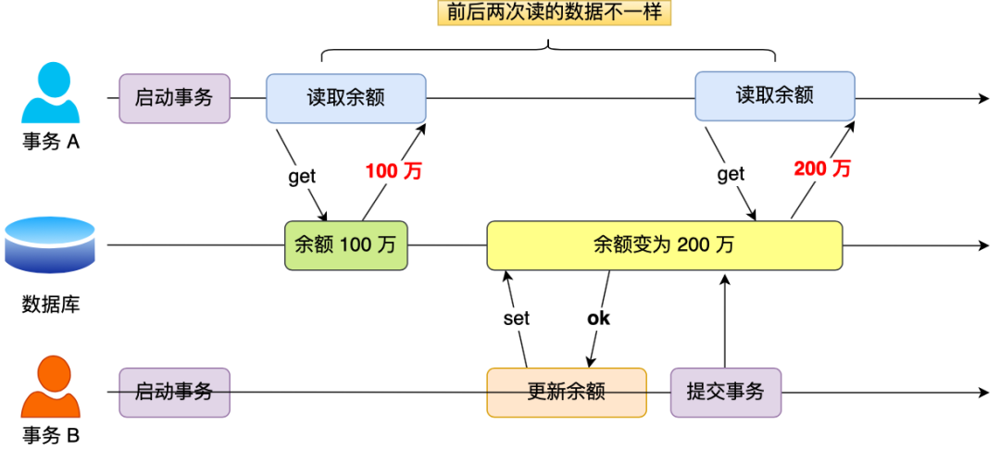

3. **幻读：** 在一个事务内多次执行相同的符合要求的 SQL 查询，出现了前后两次查询到的记录不一样的情况

   **即，前后查询的记录结果不一致**

   

#### 事务隔离级别

- **读未提交**：指一个事务还没提交时，它做的变更就能被其他事务看到；
- **读提交**：指一个事务提交之后，它做的变更才能被其他事务看到；
- **可重复读**：指一个事务执行过程中看到的数据，一直跟这个事务启动时看到的数据是一致的
  - **MySQL InnoDB 引擎的默认隔离级别**；
- **串行化**：会对记录加上读写锁，在多个事务对这条记录进行读写操作时，如果发生了读写冲突的时候，后访问的事务必须等前一个事务执行完成，才能继续执行

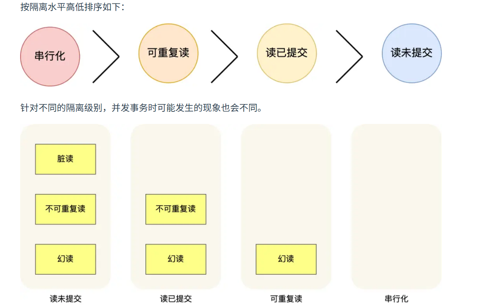

### **四种隔离级别具体是如何实现的呢？**

- 对于「读未提交」隔离级别的事务来说，因为可以读到未提交事务修改的数据，所以 **直接读取最新的数据就好了**；

- 对于「串行化」隔离级别的事务来说，通过 **加读写锁的方式来避免并行访问**；

- 对于「读提交」和「可重复读」隔离级别的事务来说，**通过 Read View 来实现的**
  - 「读提交」隔离级别是在「事务在每次读取数据时」，都会重新生成一个 Read View，
  - 而可重复读」隔离级别是「启动事务时」生成一个 Read View，然后整个事务期间都在用这个 Read View

#### 可重复读/读已提交的工作原理

##### Read View 在 MVCC 如何工作？

构成 Read View 的 四个字段：


聚簇索引的两个隐藏列：

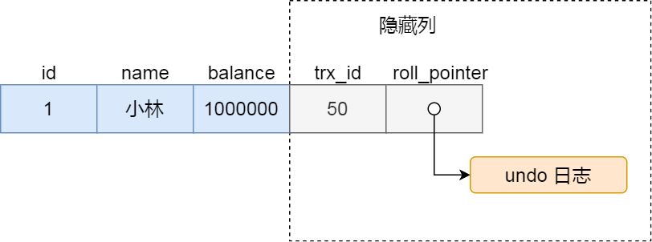


- `trx_id`：当前记录正在执行事务的 id；
- `roll_pointer`：旧版本记录的指针，指向 undo log 日志的旧日志数据

**一个事务去访问记录的时候，需要判断记录的可见性：**

- 如果记录的 trx_id 值小于 Read View 中的 `min_trx_id` 值，表示这个版本的记录是在创建 Read View **前** 已经提交的事务生成的，所以该版本的记录对当前事务 **可见**。
- 如果记录的 trx_id 值大于等于 Read View 中的 `max_trx_id` 值，表示这个版本的记录是在创建 Read View **后** 才启动的事务生成的，所以该版本的记录对当前事务 **不可见**。
- **如果记录的 trx_id 值在 Read View 的 `min_trx_id` 和 `max_trx_id` 之间，需要判断 trx_id 是否在 m_ids 列表中**：
  - 如果记录的 trx_id **在** `m_ids` 列表中，表示生成该版本记录的活跃事务依然活跃着（还没提交事务），所以该版本的记录对当前事务 **不可见**。
  - 如果记录的 trx_id **不在** `m_ids` 列表中，表示生成该版本记录的活跃事务已经被提交，所以该版本的记录对当前事务 **可见**。


##### 可重复读的工作原理

**可重复读隔离级别：启动事务时生成一个 Read View，然后整个事务期间都在用这个 Read View。**

**即：可重复读隔离级别下，读取记录的版本由事务执行前，已提交事务决定**

举例：

1. 事务 B 读取小林的账户余额记录，读到余额是 100 万；
2. 事务 A 将小林的账户余额记录修改成 200 万，并没有提交事务；
3. 事务 B 读取小林的账户余额记录，读到余额还是 100 万；
4. 事务 A 提交事务；
5. 事务 B 读取小林的账户余额记录，读到余额依然还是 100 万；


事务 B 执行最后一次读操作时，虽然事务 A 已提交，但事务 B 的创建是在第一次读时创建，事务 B 的 `m_ids` 仍认为事务 A 还未执行完毕；

所以：B 读取为事务 A 执行前的数据。


##### 读已提交的工作原理

**读提交隔离级别：在每次读取数据时，都会生成一个新的 Read View。**

**即：读已提交隔离级别下，读取记录的版本由最新已提交事务的版本决定**（读未提交：读取的是最新修改的数据，无论事务是否提交）

- 事务 B 读取数据（创建 Read View），小林的账户余额为 100 万；
- 事务 A 修改数据（还没提交事务），将小林的账户余额从 100 万修改成了 200 万；
- 事务 B 读取数据（创建 Read View），小林的账户余额为 100 万；
- 事务 A 提交事务；
- 事务 B 读取数据（创建 Read View），小林的账户余额为 200 万；


事务 B 最后一次读操作，会新建 Read View 文件，事务 A 已提交，不在 `m_ids` 中，所以事务 A 提交后的数据，可读。


### 可重复读隔离级别完全解决幻读了？

当同一个查询在不同的时间产生不同的结果集时，事务中就会出现所谓的幻象问题；

MySQL InnoDB 引擎的默认隔离级别虽然是「可重复读」，但是它很大程度上避免幻读现象，解决的方案有两种：

- 针对 **快照读（普通 select 语句：读历史版本，不加锁）**：通过 **MVCC 方式解决了幻读**

- 针对 **当前读（select ... for update 等语句：读最新数据，要加锁）**：通过 **next-key lock（记录锁+间隙锁）方式解决了幻读**

#### 如何解决快照读 

普通查询(快照读)，由 MVCC（多版本并发控制）实现的，实现的方式是：

- 开始事务后（执行 begin 语句后），在执行第一个查询语句后，会创建一个 Read View，
- **后续的查询语句利用这个 Read View，通过这个 Read View 就可以在 undo log 版本链找到事务开始时的数据，所以事务过程中每次查询的数据都是一样的**，即使中途有其他事务插入了新纪录，是查询不出来这条数据的，所以就很好了避免幻读问题。


#### 如何解决当前读

**MySQL 里除了普通查询是快照读，其他都是当前读**：比如 update、insert、delete，这些语句执行前都会查询最新版本的数据，然后再做进一步的操作


- 事务 A 执行了这面这条锁定读语句后，就在对表中的记录加上 id 范围为 (2, +∞] 的 next-key lock：

  next-key lock 是间隙锁+记录锁的组合

  - **记录锁：行锁，针对满足 `WHERE` 条件的“已有行”本身加的锁**
    -  `Where age BETWEEN 20 AND 30`，age = 20/30 的两个记录无法被其他事务访问
  - **间隙锁：区间锁，锁住“两个行锁记录之间的间隙”，或起始/结束边界前后的一段区间**
    - ` Where age BETWEEN 20 AND 30`，即使 age = 26 还没有数据，别人也不能插入 age = 26 的 记录
    - 防止其他事务 **插入** 落入你查询条件范围内的记录

- 然后，事务 B 在执行插入语句的时候，判断到插入的位置被事务 A 加了 next-key lock，于是事物 B 会生成一个插入意向锁，同时进入等待状态，直到事务 A 提交了事务。这就避免了由于事务 B 插入新记录而导致事务 A 发生幻读的现象


#### 没有解决幻读的场景

可重复读隔离级别下虽然很大程度上避免了幻读，但是还是没有能完全解决幻读

**场景 1:** 重复快照读的事务 A，查询间隙时后续事务 B 发生了插入操作，并提交


- 事务 A 先执行第一次查询，得到空；

- 之后，事务 B 开始，插入记录；（A.trx_id < B.trx_id）

- 事务 A，修改事务 B 插入的记录，将该记录的事务 id 修改为 A

  对于事务 A 的 Read View 中的 `m_ids`，不包含 B.trx_id，所以 **事务 A 误认为 B 是事务 A 开始前已提交的事务**（与实际不符）

- 查询到最新已提交事务版本的记录，发生幻读

**场景 2：** 事务 A 先快照读，后才当前读；在两个读的间隙其他事务修改并提交

- T1 时刻：事务 A 先执行「快照读语句」：select * from t_test where id > 100 得到了 3 条记录。
- T2 时刻：事务 B 往插入一个 id = 200 的记录并提交；
- T3 时刻：事务 A 再执行「当前读语句」 select * from t_test where id > 100 for update 就会得到 4 条记录，此时也发生了幻读现象。

**要避免这类特殊场景下发生幻读的现象的话，就是尽量在开启事务之后，优先执行 select ... for update 这类当前读的语句**，因为它会对记录加 next-key lock，从而避免其他事务插入一条新记


### MVCC

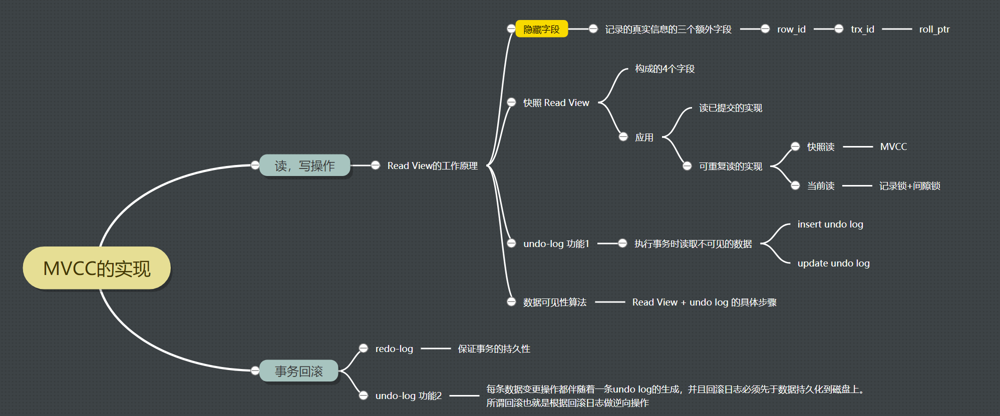

MVCC 是一种并发控制机制，通过版本链的形式，在多个并发事务同时读写数据库时保持数据的一致性和隔离性

1. 对于读写：
   - 当一个事务执行读操作时，会使用快照读；读取过程 Read View 的 可见记录（详见 5.3.1.1）
   - 当一个事务执行写操作时，它会生成一个新的数据版本，并将修改后的数据写入数据库
2. 对于事务的提交和回滚：
   - 当一个事务提交时，它所做的修改将成为数据库的最新版本，并且对其他事务可见
   - 当一个事务回滚时，它所做的修改将被撤销，对其他事务不可见

#### 一致性读操作

一致性读操作分为：锁定读（当前读，加锁） 和 非锁定读（当前读，MVCC）

**锁定读/当前读：**

- `select ... lock in share mode`
- `select ... for update`
- `insert`、`update`、`delete` 操作

**在锁定读下，读取的是数据的最新版本，这种读也被称为 `当前读（current read）`**，通过 `Next-key Lock` 记录锁+间隙锁实现。

**MVCC 非锁定读/快照读：** `普通select语句`

- 如果读取的行正在执行 `DELETE` 或 `UPDATE` 操作，这时读取操作不会去等待行上锁的释放。

- 相反地，**`InnoDB` 存储引擎会去读取行的一个快照数据，对于这种读取历史数据的方式，我们叫它快照读 (snapshot read)**

  **快照读，实际读取的是：当前事务外，最新已提交事务的数据（逻辑上，当前事务开始前，最新版本的数据）**


#### MVCC 实现原理

##### 记录的可见性

详见 5.3.1.1 介绍了 trx_id 和 Read View 的 min_trx_id 和 max_trx_id 实现 记录可见性的原理


##### undo-log 记录旧版本数据

- 当事务回滚时，`undo-log` 用于将数据恢复到修改前的样子（详见事务回滚）
- 另一个作用是 `MVCC` ，当读取记录时，若该记录被其他事务占用或当前版本对该事务不可见，则可以通过 `undo log` 读取之前的版本数据，以此实现非锁定读（快照读）
  - 在 `InnoDB` 存储引擎中 `undo log` 分为两种：`insert undo log` 和 `update undo log`：
    - `insert undo log` 可以在事务提交后直接删除。不需要进行 `purge` 操作
    - `update undo log` 不能在事务提交时就进行删除。提交时放入 `undo log` 链表，等待 `purge线程` 进行最后的删除

1. **`insert undo log`**：指在 `insert` 操作中产生的 `undo log`。因为 `insert` 操作的记录只对事务本身可见，对其他事务不可见，故 `insert undo log可` 以在事务提交后直接删除。不需要进行 `purge` 操作

   **`insert` 时的数据初始状态：**

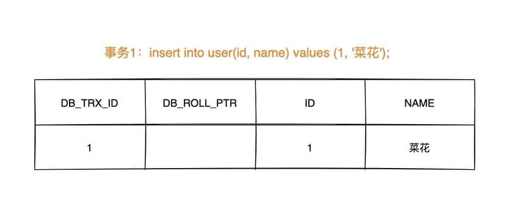

2. **`update undo log`**：`update` 或 `delete` 操作中产生的 `undo log`。该 `undo log` 可能需要提供 `MVCC` 机制，因此不能在事务提交时就进行删除。提交时放入 `undo log` 链表，等待 `purge线程` 进行最后的删除

   **数据第一次被修改时：**


​	**数据第二次被修改时：**


不同事务或者相同事务的对同一记录行的修改，会使该记录行的 `undo log` 成为一条链表，链首就是最新的记录，链尾就是最早的旧记录

##### 数据可见性算法

1. 如果记录 `DB_TRX_ID < m_up_limit_id`，那么表明最新修改该行的事务（DB_TRX_ID）在当前事务创建快照之前就提交了，

   所以该记录行的值对当前事务是可见的

2. 如果 `DB_TRX_ID >= m_low_limit_id`，那么表明最新修改该行的事务（DB_TRX_ID）在当前事务创建快照之后才修改该行，

   所以该记录行的值对当前事务不可见。跳到步骤 5

3. m_ids 为空，则表明在当前事务创建快照之前，修改该行的事务就已经提交了，所以该记录行的值对当前事务是可见的

4. 如果 `m_up_limit_id <= DB_TRX_ID < m_low_limit_id`，表明最新修改该行的事务（DB_TRX_ID）在当前事务创建快照的时候可能处于“活动状态”或者“已提交状态”；

   - 如果在活跃事务列表 m_ids 中能找到 DB_TRX_ID，表明：① 在当前事务创建快照前，该记录行的值被事务 ID 为 DB_TRX_ID 的事务修改了，但没有提交；或者 ② 在当前事务创建快照后，该记录行的值被事务 ID 为 DB_TRX_ID 的事务修改了。这些情况下，这个记录行的值对当前事务都是不可见的。跳到步骤 5
   - 在活跃事务列表中找不到，则表明“id 为 trx_id 的事务”在修改“该记录行的值”后，在“当前事务”创建快照前就已经提交了，所以记录行对当前事务可见

5. **在该记录行的 `DB_ROLL_PTR` 指针所指向的 `undo log` 取出快照记录**，

   **用快照记录的 `DB_TRX_ID` 跳到步骤 1 重新开始判断，直到找到满足的快照版本或返回空**

#### 补充：

1. 读已提交的实现 和 可重复读的实现 是 不同隔离机制 对 MVCC 快照读 的 不同实现（详见 5.3.1.2 , 5.3.1.3）
   - 读已提交：每次读操作 创建 Read Viewda
   - 可重复读：每次事务时，才创建 Read View
2. 可重复读解决并发时幻读的问题上：（详见 5.4）
   - 对于当前读，MVCC
   - 对于当前读，Next-Key Lock 记录锁+间隙锁
   - 解决了绝大多数幻读：但没解决所有幻读
     - 先快照度，后当前读，之间发生修改
     - 快照读，实际读取的是：当前事务外，最新已提交事务的数据（逻辑上，当前事务开始前，最新版本的数据）引发的幻读


### 事务回滚的实现

#### undo-log 事务回滚

事务回滚 与 redo-log 和 undo-log 日志密切相关：

- redo log 用于保证事务持久性；

- undo log 则是事务原子性和隔离性实现的基础。

  - undo log 保持原子性的原因：

    - 当事务对数据库进行修改时，InnDB 会生成对应的 undo log；

      **每条数据变更操作都伴随着一条 undo log 的生成，并且回滚日志必须先于数据持久化到磁盘上。**

    - 如果事务失败或者调用了 rollback，导致事务回滚，便可以利用 undo log 中的信息将数据回滚到修改之前的样子。

      **回滚流程：** undo log 属于逻辑日志，它记录的是 sql 执行相关的信息。当发生回滚时，InnoDB 会根据 undo log 的内容做与之前相反的工作：对于每个 insert，回滚时会执行 delete；对于每个 delete，回滚时会执行 insert；对于每个 update，回滚时会执行一个相反的 update，把数据改回去。

      **即，所谓回滚就是根据回滚日志做逆向操作**

  - undo log 保持隔离性：详见 5.5.2.2 undo log 记录旧版本数据


## 锁

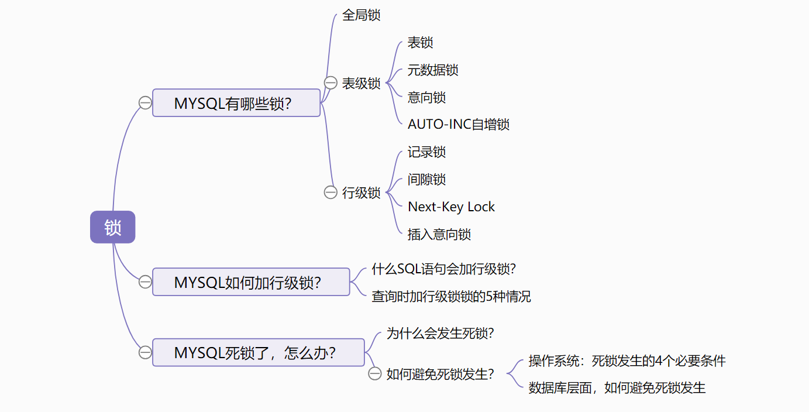

### MySQL 有哪些锁？

#### 全局锁： 

`flush tables with read lock`

执行后，**整个数据库就处于只读状态了**，这时其他线程执行以下操作，都会被阻塞：

- 对数据的增删改操作，比如 insert、delete、update 等语句；
- 对表结构的更改操作，比如 alter table、drop table 等语句。

如果要释放全局锁，则要执行 `unlock tables`

#### 表级锁：

##### **表锁：**

```mysql
//读锁（共享表锁）
lock tables t_test read;
//写锁 （独占表锁）
lock tables t_test write;
//释放
unlock tables
```

- 本线程（会话）可以读 t_test 表的数据，但是不能写 t_test 表的数据，同时 **本线程不能访问其他表**
- 其他线程可以对 t_test 表进行读操作，但是也不能对 t_test 表进行写操作，这时候写操作会发生阻塞

##### 元数据锁： 

我们不需要显示的使用 MDL，因为当我们对数据库表进行操作时，会自动给这个表加上 MDL：

- 对一张表进行 CRUD 操作时，加的是 **MDL 读锁**；
- 对一张表做结构变更操作的时候，加的是 **MDL 写锁**

MDL 是在事务提交后才会释放，这意味着 **事务执行期间，MDL 是一直持有的**；

申请 MDL 锁的操作会形成一个队列，队列中 **写锁获取优先级高于读锁**，一旦出现 MDL 写锁等待，会阻塞后续该表的所有 CRUD 操作

##### **意向锁：**

```sql
//先在表上加上意向共享锁，然后对读取的记录加共享锁
select ... lock in share mode;
//先表上加上意向独占锁，然后对读取的记录加独占锁
select ... for update;
```

分为：意向共享锁（IS）和意向独占（IX）锁，**不会和行级的共享锁和独占锁发生冲突**，**而且意向锁之间也不会发生冲突**，

**只会和共享表锁（lock tables ... read）和独占表锁（lock tables ... write）发生冲突**。

- 在使用 InnoDB 引擎的表里对某些记录加上「共享锁」之前，需要先在表级别加上一个「意向共享锁」；
- 在使用 InnoDB 引擎的表里对某些纪录加上「独占锁」之前，需要先在表级别加上一个「意向独占锁」；

**意向锁的目的是为了快速判断表里是否有记录被加锁，避免加表锁时一行行查是否有行锁**


##### **自增锁 AUTO-INC：**

- AUTO-INC 锁是特殊的表锁机制，锁 **不是再一个事务提交后才释放，而是再执行完插入语句后就会立即释放**；

  **在插入数据时，会加一个表级别的 AUTO-INC 锁**，然后为被 `AUTO_INCREMENT` 修饰的字段赋值递增的值，等插入语句执行完成后，才会把 AUTO-INC 锁释放掉。

  **AUTO-INC 锁再对大量数据进行插入的时候，会影响插入性能，因为另一个事务中的插入会被阻塞**

-  所以，InnoDB 存储引擎提供了一种 **轻量级的锁** 来实现自增；

  一样也是在插入数据的时候，会为被 `AUTO_INCREMENT` 修饰的字段加上轻量级锁，**然后给该字段赋值一个自增的值，就把这个轻量级锁释放了，而不需要等待整个插入语句执行完后才释放锁**。

- InnoDB 存储引擎提供了个 innodb_autoinc_lock_mode 的系统变量，是用来控制选择用 AUTO-INC 锁，还是轻量级的锁：

  当 innodb_autoinc_lock_mode = 0，就采用 AUTO-INC 锁，语句执行结束后才释放锁；

  当 innodb_autoinc_lock_mode = 2，就采用轻量级锁，申请自增主键后就释放锁，并不需要等语句执行后才释放。

  当 innodb_autoinc_lock_mode = 1：

  - 普通 insert 语句，轻量级锁；

  - 类似 insert … select 这样的批量插入数据的语句，自增锁还是要等语句结束后才被释放；

- 在主从复制时，可能出现主从不一致的问题：

  > binlog_format 三种模式：
  >
  > - statement：记录原始 SQL 语句（性能好，但 **副作用大**）
  > - row：记录每一行的变更数据（数据最准确，但日志大）
  > - mixed：自动选择 statement 或 row

  - 主库：使用 `innodb_autoinc_lock_mode = 2`；使用 `binlog_format = statement`；多个 session 并发向带有自增主键的表插入数据

    多个会话（Session A、B）并发插入时，由于锁在 **分配完 ID 就释放**，ID 分配可能交错，导致：

    ```mysql
    Session A：INSERT INTO t2 VALUES (3,5,5)
    Session B：INSERT INTO t2 VALUES (1,1,1), (2,2,2), (4,3,3), (5,4,4)
    ```

    **最终主库的数据自增值是错开的（非连续的）**

  - 从库：会 **串行** 执行 binlog 中的 SQL，Session A 和 B 不会并发执行。但 **binlog 中记录的是 原始 SQL（statement 格式），而不是主库实际分配的自增值；**

    **所以在从库执行这两个 SQL 时，自增值会重新分配，导致主从数据不一致**。

  **解决主从不一致：**

  ```mysql
  innodb_autoinc_lock_mode = 2
  binlog_format = row
  ```

  记录的是实际变更的每一行数据，从库直接使用这些 ID，不会出错

#### 行级锁：

InnoDB 引擎是支持行级锁的，而 MyISAM 引擎并不支持行级锁

```mysql
//对读取的记录加共享锁
select ... lock in share mode;
//对读取的记录加独占锁
select ... for update;
```

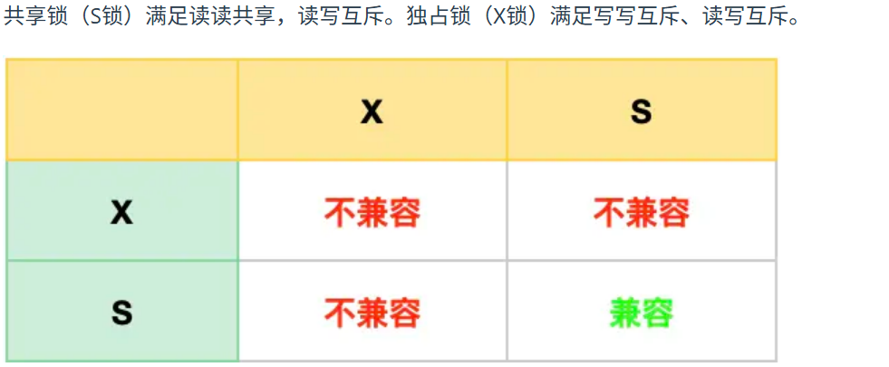

##### **Record Lock 记录锁：**


##### **Gap Lock 间隙锁：**


##### **Next-Key Lock 临键锁：** 

Record Lock + Gap Lock 的组合，锁定一个范围，并且锁定记录本身

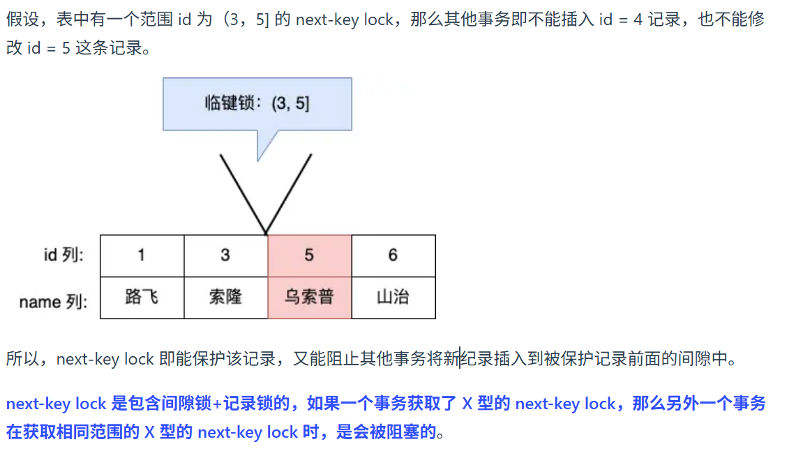

##### 插入意向锁：

插入意向锁名字虽然有意向锁，但是它并 **不是意向锁，它是一种特殊的间隙锁，属于行级别锁**

- **一个事务在插入一条记录的时候，需要判断插入位置是否已被其他事务加了间隙锁（next-key lock 也包含间隙锁）；**

  **如果有的话，插入操作就会发生阻塞**，直到拥有间隙锁的那个事务提交为止（释放间隙锁的时刻），

  在此期间会生成一个 **插入意向锁**，表明有事务想在某个区间插入新记录，但是现在处于等待状态

- MySQL 加锁时，是先生成锁结构，然后设置锁的状态，如果锁状态是等待状态，

  并不是意味着事务成功获取到了锁，只有当锁状态为正常状态时，才代表事务成功获取到了锁


#### 锁的兼容性对照表

MySQL InnoDB 常见的锁类型

| 锁类型                    | 中文名     | 说明                                    |
| ------------------------- | ---------- | --------------------------------------- |
| **Record Lock**           | 记录锁     | 锁住一条特定记录（行）                  |
| **Gap Lock**              | 间隙锁     | 锁住两条记录之间的空隙（防止插入）      |
| **Next-Key Lock**         | 临键锁     | Record Lock + Gap Lock                  |
| **Insert Intention Lock** | 插入意向锁 | 插入时在 gap 上加的锁，用于声明插入意图 |
| **意向共享锁（IS）**      | 表意向锁   | 声明事务 **将对某些记录加 S 锁**         |
| **意向排他锁（IX）**      | 表意向锁   | 声明事务 **将对某些记录加 X 锁**         |
| **共享锁（S）**           | 共享锁     | 允许其他事务读，但不写                  |
| **排他锁（X）**           | 排他锁     | 只允许本事务读写，其他事务不能读写      |

**锁的兼容表：**

| 当前锁 \ 请求锁      | IS   | IX   | S    | X    | Gap  | Insert Intention |
| -------------------- | ---- | ---- | ---- | ---- | ---- | ---------------- |
| **IS**               | ✔    | ✔    | ✔    | ✘    | ✔    | ✔                |
| **IX**               | ✔    | ✔    | ✘    | ✘    | ✔    | ✔                |
| **S**                | ✔    | ✘    | ✔    | ✘    | ✔    | ✔                |
| **X**                | ✘    | ✘    | ✘    | ✘    | ✘    | ✘                |
| **Gap**              | ✔    | ✔    | ✔    | ✘    | ✔    | ✘                |
| **Insert Intention** | ✔    | ✔    | ✔    | ✘    | ✘    | ✔                |

不兼容，发生阻塞。


### MySQL 如何实现加锁？

#### 什么 SQL 语句会加行级锁？

##### 当前读

1. 对读取的记录加共享锁(S 型锁)
   `select ... lock in share mode;`
2. 对读取的记录加独占锁(X 型锁)
   `select ... for update;`

##### 插入，更新，删除

1. 对操作的记录加独占锁(X 型锁)

   `update table .... where id = 1;`

2. 对操作的记录加独占锁(X 型锁)
   `delete from table where id = 1;`

3. 对间隙锁之间的记录加插入意向锁

   `INSERT INTO user(id) VALUES (1);`

   

#### MySQL 怎么加行级锁的？

**MySQL 加锁的对象是索引，加锁的基本单位是 next-key lock**：

- 它是由记录锁和间隙锁组合而成的，**next-key lock 是前开后闭 `(,]` 区间，而间隙锁是前开后开 `(,)` 区间**
- **分为 5 种情况：划分原则**
  - 对于 **等值查询，需要退化成 { 记录锁 } 或者 { 间隙锁 }**
  - 对于 **范围查询，符合条件的范围通过 next-key 锁**，但终止条件需要判断是否符合：
    - **终止条件不符合 或者 没有等号，则退化成 { 间隙锁 }**
  - 对 **于非主键查询，查询到的条件，还需要对主键加上 { 记录锁 }**
  - **查询条件 没有 索引，则全表扫描，对表中所有记录加上 next-key 锁**


##### **唯一索引（主键索引）等值查询：**

- 查询的记录「存在」：在索引树上定位到这一条记录后，将该记录的索引中的 **next-key lock 会退化成「记录锁」**。

  ```mysql
  mysql> begin;
  Query OK, 0 rows affected (0.00 sec)
  
  mysql> select * from user where id = 1 for update;
  +----+--------+-----+
  | id | name   | age |
  +----+--------+-----+
  |  1 | 路飞   |  19 |
  +----+--------+-----+
  1 row in set (0.02 sec)
  ```

  

- 查询的记录「不存在」：在索引树找到第一条大于该查询记录的记录后，**next-key lock 会退化成「间隙锁」**

  ```mysql
  mysql> begin;
  Query OK, 0 rows affected (0.00 sec)
  
  mysql> select * from user where id = 2 for update;
  Empty set (0.03 sec)
  ```

  

##### **唯一索引（主键索引）范围查询：**

1. 情况一：针对「大于等于」的范围查询：先进行”等于 " 条件的等值查询；

   ​		再对于大于条件的范围查询，对于查询到的记录，采用 next-key lock 不发生 退化

   大于：

   ```mysql
   mysql> begin;
   Query OK, 0 rows affected (0.00 sec)
   
   mysql> select * from user where id > 15 for update;
   +----+-----------+-----+
   | id | name      | age |
   +----+-----------+-----+
   | 20 | 香克斯    |  39 |
   +----+-----------+-----+
   1 row in set (0.01 sec)
   ```

   

   大于等于：等于的情况单独拿出，等值查询

   ```mysql
   mysql> begin;
   Query OK, 0 rows affected (0.00 sec)
   
   mysql> select * from user where id >= 15 for update;
   +----+-----------+-----+
   | id | name      | age |
   +----+-----------+-----+
   | 15 | 乌索普    |  20 |
   | 20 | 香克斯    |  39 |
   +----+-----------+-----+
   2 rows in set (0.00 sec)
   ```

   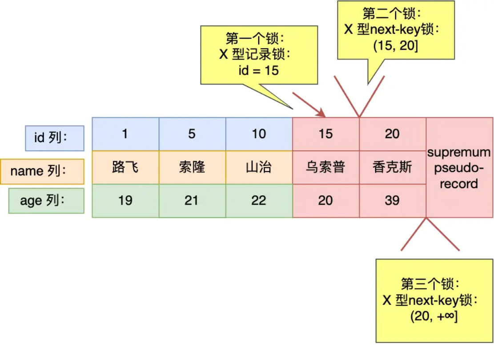

2. 情况二：针对「小于或者小于等于」的范围查询，要看条件值的记录是否存在于表中：

   - 当 **条件值的记录不在表** 中：那么不管是「小于」还是「小于等于」条件的范围查询：

     - **扫描到终止范围查询的记录时，该记录的索引的 next-key 锁会退化成 { 间隙锁 }**，
     - **其他扫描到的记录，都是在这些记录的索引上加 next-key 锁。**

     ```mysql
     mysql> begin;
     Query OK, 0 rows affected (0.00 sec)
     
     mysql> select * from user where id < 6 for update;
     +----+--------+-----+
     | id | name   | age |
     +----+--------+-----+
     |  1 | 路飞   |  19 |
     |  5 | 索隆   |  21 |
     +----+--------+-----+
     3 rows in set (0.00 sec)
     ```

     

     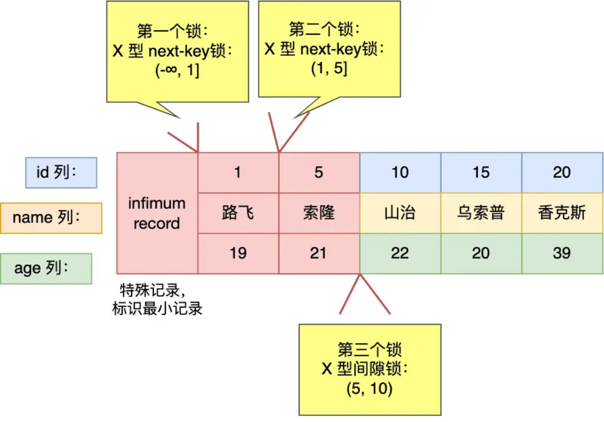

   - 当 **条件值的记录在表** 中，

     - 如果是「小于」条件的范围查询，
       - **扫描到终止范围查询的记录时，该记录的索引的 next-key 锁会退化成 {间隙锁}**，
       - **其他扫描到的记录，都是在这些记录的索引上加 next-key 锁。**

     - 如果「小于等于」条件的范围查询，
       - **扫描到终止范围查询的记录时，该记录的索引 next-key 锁不会退化，**
       - **其他扫描到的记录，都是在这些记录的索引上加 next-key 锁。**

     小于等于：

     ```mysql
     mysql> begin;
     Query OK, 0 rows affected (0.00 sec)
     
     mysql> select * from user where id <= 5 for update;
     +----+--------+-----+
     | id | name   | age |
     +----+--------+-----+
     |  1 | 路飞   |  19 |
     |  5 | 索隆   |  21 |
     +----+--------+-----+
     2 rows in set (0.00 sec)
     ```

     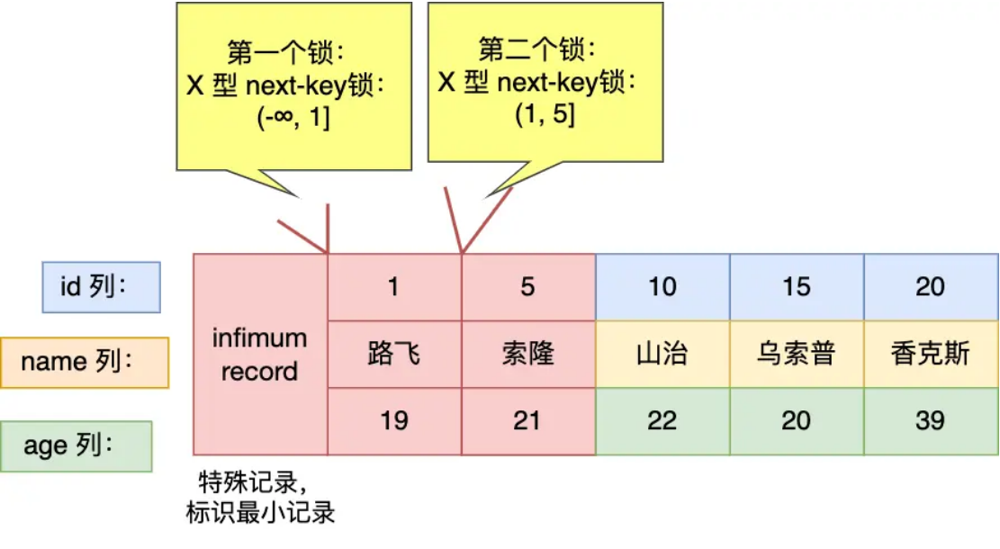

     小于：

     ```mysql
     select * from user where id < 5 for update;
     ```

     

     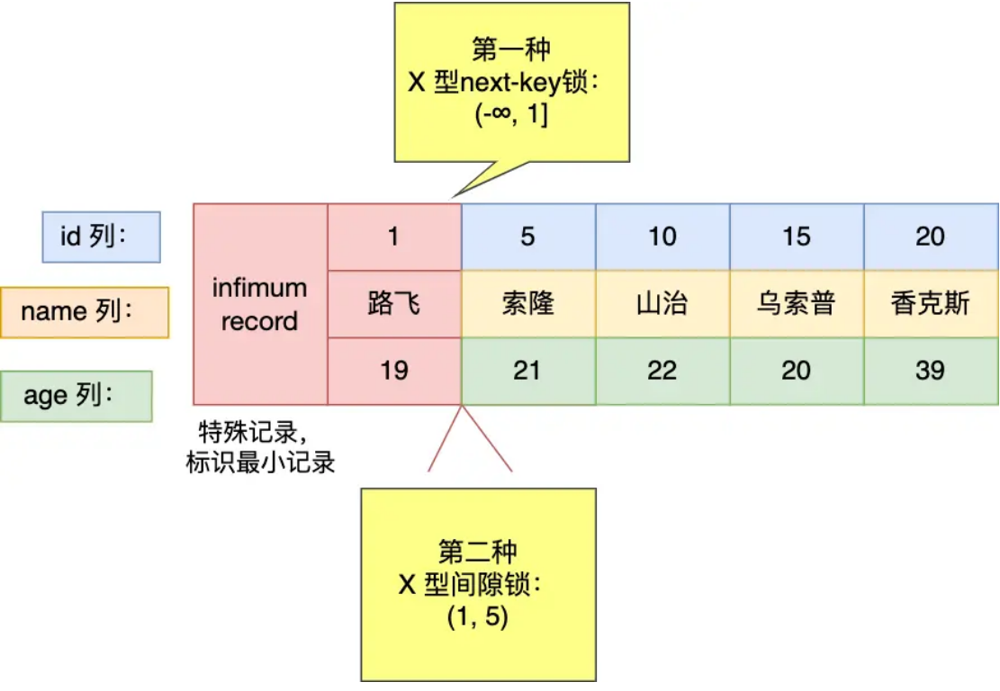

##### 非唯一索引等值查询：

- 当 **查询的记录「存在」** 时：由于 **不是唯一索引，所以肯定存在索引值相同的记录**。

  - **非唯一索引等值查询的过程是一个扫描的过程，直到扫描到第一个不符合条件的二级索引记录就停止扫描；**
  - **然后在扫描的过程中，对{左侧及扫描到的二级索引记录}加：next-key 锁；**
  - **而{对于第一个不符合条件的二级索引记录}，该二级索引的 next-key 锁会退化成 {间隙锁}；**
  - **同时，在{符合查询条件的记录 的 主键索引}上加{记录锁}**。

  ```mysql
  mysql> begin;
  Query OK, 0 rows affected (0.00 sec)
  
  mysql> select * from user where age = 22 for update;
  +----+--------+-----+
  | id | name   | age |
  +----+--------+-----+
  | 10 | 山治   |  22 |
  +----+--------+-----+
  1 row in set (0.00 sec)
  ```

  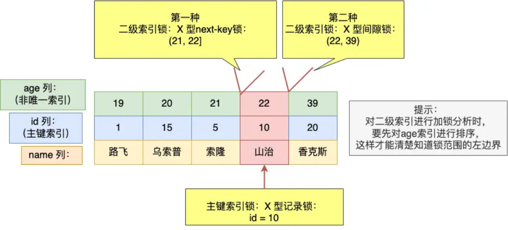

- 当查询的记录「不存在」时：

  - **扫描到第一条不符合条件的二级索引记录，该二级索引的 next-key 锁会退化成间隙锁。**

    即，查询记录的范围内，左侧最后一个不同的记录 与 右侧第一个不同的记录，构成间隙锁。

  ```mysql
  mysql> begin;
  Query OK, 0 rows affected (0.00 sec)
  
  mysql> select * from user where age = 25 for update;
  Empty set (0.00 sec)
  ```

  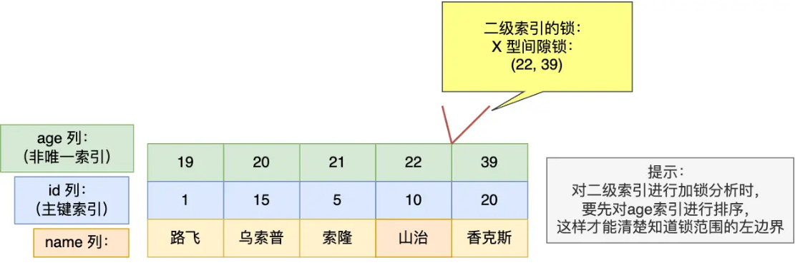

##### **非唯一索引的范围查询：**

- 非唯一索引和主键索引的范围查询的加锁大致相同：

  不同之处在于：**非唯一索引范围查询，索引的 next-key lock 不会有退化为间隙锁和记录锁的情况**，

  **不同于：主键索引范围查询的小于或小于等于，条件处记录不存在，next-key 在条件出退化成 { 间隙锁 }，**

  **也不会产生幻读，只是没优化，没有主键那么精细**

  ```sql
  mysql> begin;
  Query OK, 0 rows affected (0.00 sec)
  
  mysql> select * from user where age >= 22  for update;
  +----+-----------+-----+
  | id | name      | age |
  +----+-----------+-----+
  | 10 | 山治      |  22 |
  | 20 | 香克斯    |  39 |
  +----+-----------+-----+
  2 rows in set (0.01 sec)
  ```

  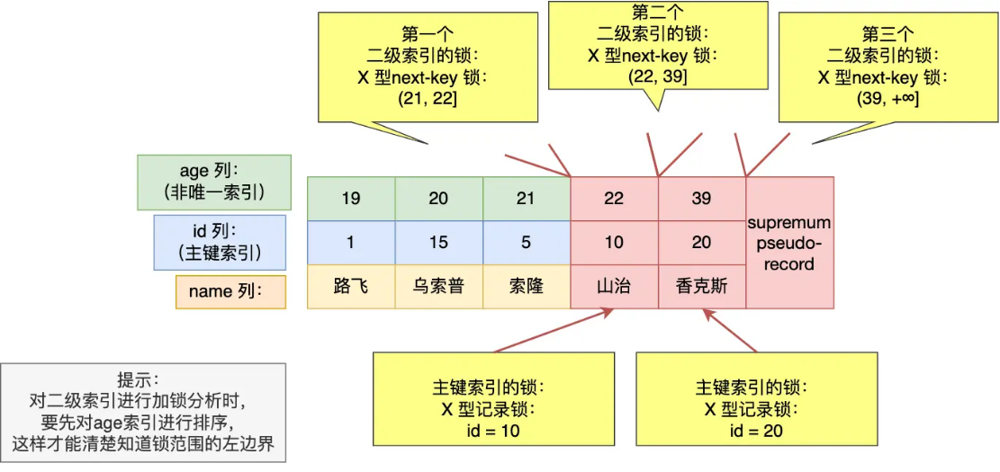

##### **没有加索引的查询：**

- 如果锁定读查询语句，没有使用索引列作为查询条件，或者查询语句没有走索引查询，导致扫描是全表扫描。

  MySQL 会 **全表扫描**，然后 **对满足条件的每一行加 next-key lock**

- 因此，在线上 **在执行 update、delete、select ... for update 等具有加锁性质的语句，**

  一定要检查语句是否走了索引，如果是全表扫描的话，会对满足要求的每一个索引加 next-key 锁，相当于把整个表锁住了

​	

### MySQL 发生了死锁，怎么办？

#### 发生死锁的原因及场景场景

**发生原因**：死锁通常出现 **在多个事务同时竞争相同资源，并互相等待对方释放资源** 的情况下

**常见死锁发生的场景：**	select ... for update 后 insert

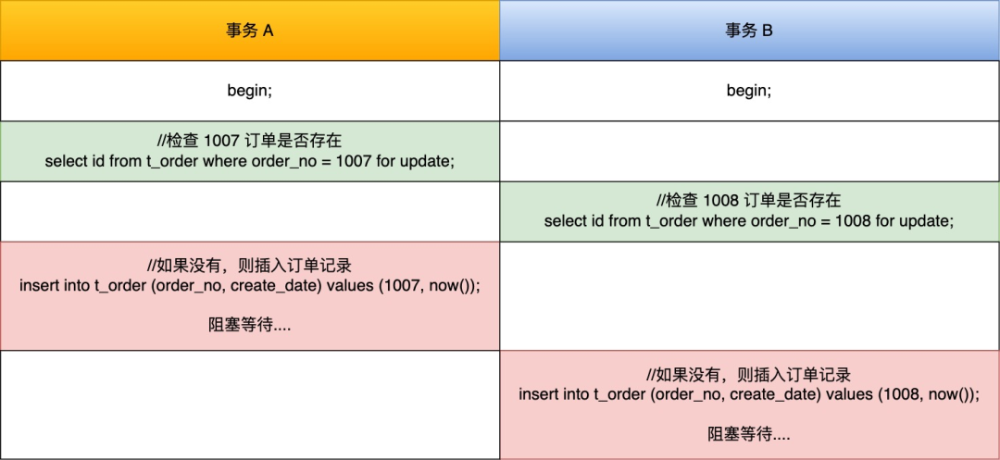

多事务查询相同不存在的记录并插入，查询语句都加上了 `(1006, +∞]` 的 next-key 锁，插入时互相等待释放 → 死锁。


#### 数据库层面，避免死锁

在数据库层面，有两种策略通过「打破循环等待条件」来解除死锁状态：

- **设置事务等待锁的超时时间**：

  当 **一个事务的等待时间超过该值后，就对这个事务进行回滚，于是锁就释放了，另一个事务就可以继续执行了**。在 InnoDB 中，参数 `innodb_lock_wait_timeout` 是用来设置超时时间的，默认值时 50 秒。

  当发生超时后，就出现下面这个提示：

  

- **开启主动死锁检测**：

  **主动死锁检测在发现死锁后，主动回滚死锁链条中的某一个事务，让其他事务得以继续执行**。将参数 `innodb_deadlock_detect` 设置为 on，表示开启这个逻辑，默认就开启。

  当检测到死锁后，就会出现下面这个提示：


### 补充：Insert 语句怎么加行级锁 

INSERT 语句通常**不会立即生成锁结构**，而是依靠：

- **聚簇索引记录的 trx_id 隐藏列**作为隐式锁保护
- **只有发生冲突时，才转换为显式锁**

**场景一：间隙锁环境下的 INSERT**

1. 情况1：存在间隙锁时

   ```sql
   -- 事务A：创建间隙锁
   SELECT * FROM users WHERE id > 10 AND id < 20 FOR UPDATE;
   
   -- 事务B：尝试插入
   INSERT INTO users(id, name) VALUES(15, '张三');  -- 被阻塞
   ```

   **锁机制：**

   - 事务B会申请**插入意向锁(Insert Intention Lock)**

   - 插入意向锁与间隙锁**冲突**，状态设为**等待**

   - INSERT语句被**阻塞**

2. 情况2：无间隙锁时

   ```sql
   -- 事务B：直接插入
   INSERT INTO users(id, name) VALUES(15, '张三');  -- 立即执行
   ```

   **锁机制：**

   - 申请插入意向锁，**无冲突，立即获得**

   - 插入成功后，对新记录使用**隐式锁**保护

**场景二：唯一索引冲突**

1. 主键冲突

```sql
-- 现有数据：id=10, name='李四'

-- 事务A：插入重复主键
INSERT INTO users(id, name) VALUES(10, '王五');  -- 第一个事务
事务主键索引锁结果
事务A(首个)对现有记录id=10加 X型记录锁(显式)报错：Duplicate entry
事务B(后续)尝试对现有记录id=10加 S型记录锁阻塞：等待事务A释放X锁
```

2. 唯一二级索引冲突

```sql
-- 现有数据：email='test@example.com'(id=10)

-- 事务A：插入重复唯一索引
INSERT INTO users(id, name, email) VALUES(20, '张三', 'test@example.com');
事务唯一二级索引锁结果
事务A(首个)现有记录的隐式锁转为X型记录锁报错：Duplicate entry
事务B(后续)尝试对现有记录加 S型Next-Key锁阻塞：等待事务A释放锁
```

3， 普通二级索引（非唯一）

```sql
-- 事务A、B同时插入相同的普通索引值
INSERT INTO users(id, name, age) VALUES(20, '张三', 25);
INSERT INTO users(id, name, age) VALUES(21, '李四', 25);  -- age是普通索引
```

| 索引类型         | 第一个事务                                        | 之后事务                                                     |
| ---------------- | ------------------------------------------------- | ------------------------------------------------------------ |
| **主键**         | 对**已存在记录**加 X型记录锁(显式)<br/>→ 报错     | 阻塞：尝试对**已存在记录**加 S型记录锁                       |
| **唯一二级索引** | 对**已存在记录**的隐式锁转为 X型记录锁<br/>→ 报错 | 阻塞：尝试对**已存在记录**加 S型Next-Key锁（取巧设计，对业务影响不大） |
| **普通二级索引** | 隐式锁保护**新插入记录**<br/>→ 成功               | 隐式锁保护**新插入记录**<br/>→ 成功                          |


## 日志

### undo-log

undo-log，回滚日志，用于保证事务 ACID 特性中的原子性；

#### undo-log 的两种作用：

1. **实现事务回滚，保障事务的原子性**：
   - 事务处理过程中，如果出现了错误或者用户执 行了 ROLLBACK 语句，MySQL 可以利用 undo log 中的历史数据将数据恢复到事务开始之前的状态。
2. **实现 MVCC（多版本并发控制）关键因素之一**：
   - MVCC 是通过 ReadView + undo log 实现的。undo log 为每条记录保存多份历史数据，MySQL 在执行快照读的时候，会根据事务的 Read View 里的信息，顺着 undo log 的版本链找到满足其可见性的记录

##### 事务回滚

每当 InnoDB 引擎对一条记录进行操作（修改、删除、新增）时，要把回滚时需要的信息都记录到 undo log 里：

- 在 **插入** 一条记录时，要把这条记录的主键值记下来，这样之后回滚时只需要把这个主键值对应的记录 **删掉** 就好了；
- 在 **删除** 一条记录时，要把这条记录中的内容都记下来，这样之后回滚时再把由这些内容组成的记录 **插入** 到表中就好了；
- 在 **更新** 一条记录时，要把被更新的列的旧值记下来，这样之后回滚时再把这些列 **更新为旧值** 就好了。

**在发生回滚时，就读取 undo log 里的数据，然后做原先相反操作，**以此保证：事务的原子性。


##### undo log 参与实现 MVCC

快照读（普通 select 语句）是通过 Read View + undo log 来实现的，读提交和可重复的实现区别：在于创建 Read View 的时机不同

- 「读提交」隔离级别是在每个 select 都会生成一个新的 Read View
  - 读的数据是每次读操作前的最新版本记录  
- 「可重复读」隔离级别是启动事务时生成一个 Read View，然后整个事务期间都在用这个 Read View
  - 读的数据是每次事务开始前的最新版本记录


**实现方式：一条记录的每一次更新操作产生的 undo log 格式都有一个 roll_pointer 指针和一个 trx_id 事务 id，构成版本链**

- 通过 trx_id 可以知道该记录是被哪个事务修改的；
- 通过 roll_pointer 指针可以将这些 undo log 串成一个链表，这个链表就被称为版本链；

版本链如下图：


### undo-log 存储在 Buffer Pool

#### 什么是 Buffer Pool

MySQL 的数据都是存在磁盘中的；当查询/更新记录时，得先要从磁盘读取该记录；查询到的记录，会存储在 Buffer Pool 中，提高数据库的读写性能。


1. **当读取数据时**：如果数据存在于 Buffer Pool 中，客户端就会 **直接读取 Buffer Pool 中的数据，否则再去磁盘中读取**。

2. **当修改数据时**：如果数据存在于 Buffer Pool 中，那 **直接修改 Buffer Pool 中数据所在的页，然后将其页设置为脏页**；

   为了减少磁盘 I/O，**不会立即将脏页写入磁盘**，后续由后台线程选择一个合适的时机将脏页写入到磁盘


#### 查询一条记录，整页缓存

- **InnoDB 会为 Buffer Pool 申请一片连续的内存空间，然后按照默认的 `16KB` 的大小划分出一个个的页， Buffer Pool 中的页就叫做缓存页**；

- 当我们查询一条记录时，I **nnoDB 是会把整个页的数据加载到 Buffer Pool 中**，将页加载到 Buffer Pool 后，再 **通过页里的「页目录」去定位到某条具体的记录**。


#### undo-log 存储在 Buffer Pool

> Buffer Pool 除了缓存「索引页」和「数据页」，还包括了 Undo 页，插入缓存、自适应哈希索引、锁信息等等

undo-log 回滚日志，存储在 InnoDB 存储引起的 Buffer Pool 中的 undo 页，不直接写到磁盘当中；


undo 页：开启事务后，InnoDB 层更新记录前，首先要记录相应的 undo log；undo log 会写入 Buffer Pool 中的 Undo 页面


### redo-log

#### redo-log & undo-log 区别

1. **什么是 redo log？**

   **redo log（重做日志）**：是 Innodb 存储引擎层生成的日志，实现了事务中的**持久性**，主要**用于掉电等故障恢复**；

   redo log 是物理日志，**记录了某个数据页做了什么修改**，比如**对 XXX 表空间中的 YYY 数据页 ZZZ 偏移量的地方做了AAA 更新**，每当执行一个事务就会产生这样的一条或者多条物理日志。

   **在事务提交时，只要先将 redo log 持久化到磁盘即可，可以不需要等到将缓存在 Buffer Pool 里的脏页数据持久化到磁盘**。

   当系统崩溃时，虽然脏页数据没有持久化，但是 redo log 已经持久化，接着 MySQL 重启后，可以根据 redo log 的内容，将所有数据恢复到最新的状态。


2. **被修改 Undo 页面，需要记录对应 redo log 吗？**

   需要的。开启事务后，InnoDB 层更新记录前，首先要记录相应的 undo log，如果是更新操作，需要把被更新的列的旧值记下来，也就是要生成一条 undo log，undo log 会写入 Buffer Pool 中的 Undo 页面。

   不过，**在内存修改该 Undo 页面后，也是需要记录对应的 redo log，因为undo log也要实现持久性的保护**。


3. **redo log 和 undo log 区别在哪？**

   这两种日志是属于 InnoDB 存储引擎的日志，它们的区别在于：

   - redo log 记录了此次事务「**修改后**」的数据状态，记录的是更新**之后**的值，**主要用于事务崩溃恢复，保证事务的持久性**。

   - undo log 记录了此次事务「**修改前**」的数据状态，记录的是更新**之前**的值，**主要用于事务回滚，保证事务的原子性**。


#### redo-log  实现 事务崩溃恢复

1. **事务崩溃为什么需要恢复：**Buffer Pool 是基于内存的，而内存总是不可靠，万一断电重启，还没来得及落盘的脏页数据就会丢失

2. **如何实现事务崩溃恢复：**

   **redo log是物理日志，记录事务对物理页的修改，**通过 WAL 技术 在事务提交后更新到磁盘，实现 **crash-safe**（崩溃恢复）；

   InnoDB 就可以保证即使数据库发生异常重启，之前已提交的记录都不会丢失。

   1. redo-log：

      事务执行更新记录时，InnoDB 引擎就会先更新内存（同时标记为脏页），

      **然后将本次对这个页的修改以 redo log 的形式记录下来**；

   2. WAL技术：

      InnoDB 引擎会在适当的时候，由后台线程将缓存在 Buffer Pool 的脏页刷新到磁盘里，这就是 WAL 

      **WAL 技术指的是， MySQL 的写操作并不是立刻写到磁盘上，而是先写日志，然后在合适的时间再写到磁盘上**

      在事务提交时，只要先将 redo log 持久化到磁盘即可，可以不需要等到将缓存在 Buffer Pool 里的脏页数据持久化到磁盘

      WAL流程：

3. **redo-log 写入磁盘采用顺序写（追加）；**区别于：磁盘写入数据 通常 采用 随机写：

   - **WAL 技术实现了：MySQL 的写操作从磁盘的「随机写」变成了「顺序写」**，磁盘的「顺序写 」比「随机写」 高效的多，因此 redo log 写入磁盘的开销更小，提升语句的执行性能。

   - **实现原因： MySQL 的写操作并不是立刻更新到磁盘上，而是先记录在日志上，然后在合适的时间再更新到磁盘上 。**

4. **redo-log 不直接写入磁盘，而是先写到 redo log buffer**：

   


#### redo log 什么时候刷盘？

1. MySQL 正常关闭时；
2. 当 redo log buffer 中记录的写入量大于 redo log buffer 内存空间的一半时，会触发落盘；
3. InnoDB 的后台线程每隔 1 秒，将 redo log buffer 持久化到磁盘。
4. 每次事务提交时都将缓存在 redo log buffer 里的 redo log 直接持久化到磁盘


#### redo-log 循环写实现物理存储


1. **默认情况下， InnoDB 存储引擎有 1 个重做日志文件组( redo log Group），「重做日志文件组」由有 2 个 redo log 文件组成**，这两个 redo 日志的文件名叫 ：`ib_logfile0` 和 `ib_logfile1` ；在重做日志组中，每个 redo log File 的大小是固定且一致的。

2. **重做日志文件组是以循环写的方式工作的，从头开始写，写到末尾就又回到开头，相当于一个环形**：

   即， InnoDB 存储引擎会先写 ib_logfile0 文件，当 ib_logfile0 文件被写满的时候，会切换至 ib_logfile1 文件，当 ib_logfile1 文件也被写满时，会切换回 ib_logfile0 文件。

3. **当redo log 写满，MySQL发生阻塞：将redo-log buffer的脏页刷写到磁盘，并重新标记 redo log 哪些记录可以被覆盖**

InnoDB 用 write pos 表示 redo log 当前记录写到的位置，用 checkpoint 表示当前要擦除的位置，如下图：


图中的：

- write pos 和 checkpoint 的移动都是顺时针方向；
- write pos ～ checkpoint 之间的部分（图中的红色部分），用来记录新的更新操作；
- check point ～ write pos 之间的部分（图中蓝色部分）：待落盘的脏数据页记录；

如果 write pos 追上了 checkpoint，就意味着 **redo log 文件满了，这时 MySQL 不能再执行新的更新操作，也就是说 MySQL 会被阻塞**（因此所以针对并发量大的系统，适当设置 redo log 的文件大小非常重要）：

- 此时**会停下来将 Buffer Pool 中的脏页刷新到磁盘中，然后标记 redo log 哪些记录可以被擦除，接着对旧的 redo log 记录进行擦除，等擦除完旧记录腾出了空间，checkpoint 就会往后移动（图中顺时针）**，然后 MySQL 恢复正常运行，继续执行新的更新操作。

  即：**一次 checkpoint 的过程就是脏页刷新到磁盘中变成干净页，然后标记 redo log 哪些记录可以被覆盖的过程**


### binlog

**binlog （归档日志）**：是 Server 层生成的日志，主要**用于数据备份和主从复制**

- MySQL 在完成一条更新操作后，Server 层还会生成一条 binlog，

  等之后事务提交的时候，会将该事物执行过程中产生的所有 binlog 统一写 入 binlog 文件。

- binlog 文件是**记录了所有数据库表结构变更和表数据修改的日志**，**不会记录查询类的操作**，比如 SELECT 和 SHOW 操作。

#### binlog 与 redo-log 区别：

1、适用对象不同：

- **binlog 是 MySQL 的 Server 层实现的日志**，所有存储引擎都可以使用；
- **redo log 是 Innodb 存储引擎实现的日志**；

2、文件格式不同：

- **binlog 有 3 种格式类型，分别是 STATEMENT（默认格式）、ROW、 MIXED**，区别如下：
  - **STATEMENT：每一条修改数据的 SQL 都会被记录到 binlog 中**（相当于记录了逻辑操作，所以针对这种格式， binlog 可以称为逻辑日志），主从复制中 slave 端再根据 SQL 语句重现。但 STATEMENT 有动态函数的问题，比如你用了 uuid 或者 now 这些函数，你在主库上执行的结果并不是你在从库执行的结果，这种随时在变的函数会导致复制的数据不一致；
  - **ROW：记录行数据最终被修改成什么样了**（这种格式的日志，就不能称为逻辑日志了），不会出现 STATEMENT 下动态函数的问题。但 ROW 的缺点是每行数据的变化结果都会被记录，比如执行批量 update 语句，更新多少行数据就会产生多少条记录，使 binlog 文件过大，而在 STATEMENT 格式下只会记录一个 update 语句而已；
  - MIXED：包含了 STATEMENT 和 ROW 模式，它会根据不同的情况自动使用 ROW 模式和 STATEMENT 模式；
- **redo log 是物理日志，记录的是在某个物理数据页做了什么修改**，比如对 XXX 表空间中的 YYY 数据页 ZZZ 偏移量的地方做了AAA 更新；

3、写入方式不同：

- **binlog 是追加写，写满一个文件，就创建一个新的文件继续写，不会覆盖以前的日志**，保存的是全量的日志。
- **redo log 是循环写，日志空间大小是固定，全部写满就从头开始**，保存未被刷入磁盘的脏页日志。

4、用途不同：

- **binlog 用于备份恢复、主从复制**；
- **redo log 用于掉电等故障恢复**。

##### 如果不小心整个数据库的数据被删除了，能使用 redo log 文件恢复数据吗？

不可以使用 redo log 文件恢复，只能使用 binlog 文件恢复。

- 因为 redo log 文件是循环写，是会边写边擦除日志的，只记录未被刷入磁盘的数据的物理日志，

  已经刷入磁盘的数据都会从 redo log 文件里擦除。

- binlog 文件保存的是全量的日志，也就是保存了所有数据变更的情况，理论上只要记录在 binlog 上的数据，都可以恢复，

所以如果不小心整个数据库的数据被删除了，得用 binlog 文件恢复数据。


#### binlog 实现 主从复制


MySQL 集群的主从复制过程梳理成 3 个阶段：

- **写入 Binlog**：主库写 binlog 日志，提交事务，并更新本地存储数据。
- **同步 Binlog**：把 binlog 复制到所有从库上，每个从库把 binlog 写到暂存日志中。
- **回放 Binlog**：回放 binlog，并更新存储引擎中的数据。

具体详细过程如下：

- MySQL 主库在收到客户端提交事务的请求之后；

  会先**写入 binlog，再提交事务，更新存储引擎中的数据**；

  事务提交完成后，返回给客户端“操作成功”的响应。

- 从库会创建一个专门的 I/O 线程，连接主库的 log dump 线程，来接收主库的 binlog 日志，

  再把 **binlog 信息写入 relay log 中继日志**里，

  再返回给主库“复制成功”的响应。

- 从库会创建一个用于回放 binlog 的线程，去读 relay log 中继日志，

  然后**回放 binlog 更新存储引擎中的数据，最终实现主从的数据一致性**。

> 从库是不是越多越好？

不是的：从库数量增加，从库连接上来的 I/O 线程也比较多，**主库也要创建同样多的 log dump 线程来处理复制的请求，对主库资源消耗比较高，同时还受限于主库的网络带宽**。

在实际使用中，一个主库一般跟 2～3 个从库（1 套数据库，1 主 2 从 1 备主），这就是一主多从的 MySQL 集群结构。

> MySQL 主从复制还有哪些模型？

主要有三种：

1. **同步复制**：MySQL **主库提交事务的线程要等待所有从库的复制成功响应，才返回客户端结果**。这种方式在实际项目中，基本上没法用，原因有两个：一是性能很差，因为要复制到所有节点才返回响应；二是可用性也很差，主库和所有从库任何一个数据库出问题，都会影响业务。
2. **异步复制**（默认模型）：MySQL **主库提交事务的线程并不会等待 binlog 同步到各从库，就返回客户端结果**。这种模式一旦主库宕机，数据就会发生丢失。
3. **半同步复制**：MySQL 5.7 版本之后增加的一种复制方式，介于两者之间，事务线程不用等待所有的从库复制成功响应，只要一部分复制成功响应回来就行，比如一主二从的集群，只要数据成功复制到任意一个从库上，主库的事务线程就可以返回给客户端。这种**半同步复制的方式，兼顾了异步复制和同步复制的优点，即使出现主库宕机，至少还有一个从库有最新的数据，不存在数据丢失的风险**


#### binlog 什么时候刷盘？

##### binlog 先存储在 server层的binlog cache

1. **事务执行过程中，先把日志写到 binlog cache（Server 层的 cache）；事务提交的时候，再把 binlog cache 写到 binlog 文件中**。

2. **一个事务的 binlog 是不能被拆开的**，因此无论这个事务有多大（比如有很多条语句），也**要保证一次性写入**。

   这是因为有一个线程只能同时有一个事务在执行的设定，所以每当执行一个 begin/start transaction 的时候，就会默认提交上一个事务，这样如果一个事务的 binlog 被拆开的时候，在备库执行就会被当做多个事务分段自行，这样破坏了原子性，是有问题的。

   > 例如：6.1.2.3 自增锁AUTO-INC ：**并发事务，在主从复制时，binlog需要采用ROW格式**


##### 什么时候 binlog cache 会写到 binlog 文件？

**在事务提交的时候，执行器把 binlog cache 里的完整事务写入到 binlog 文件中，并清空 binlog cache**。如下图：

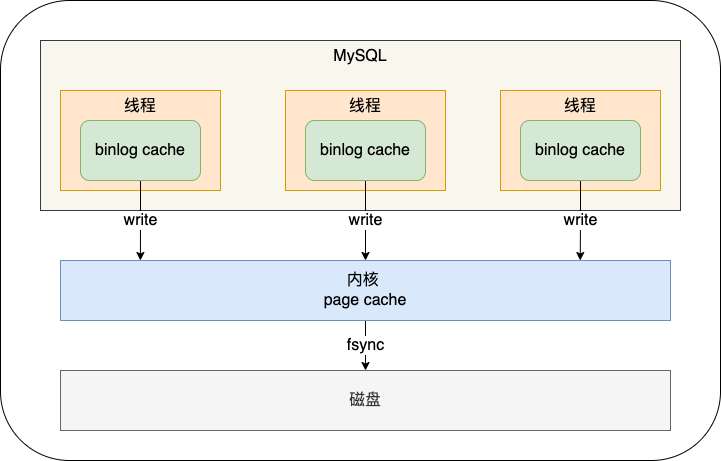

**虽然每个线程有自己 binlog cache，但是最终都写到同一个 binlog 文件**：

-  **write：把日志写入到 binlog 文件，但是并没有把数据持久化到磁盘，因为数据还缓存在文件系统的 page cache 里**

   write 的写入速度还是比较快的，因为不涉及磁盘 I/O。

-  **fsync：将数据持久化到磁盘的操作**，这里就会涉及磁盘 I/O，所以频繁的 fsync 会导致磁盘的 I/O 升高。


### 总结：执行一条Update语句的过程

更新一条记录 `UPDATE t_user SET name = 'xiaolin' WHERE id = 1;` 的流程如下:

1. 执行器负责具体执行，会**调用存储引擎的接口，通过主键索引树搜索获取 id = 1 这一行记录**：
   - 如果 id=1 这一行所在的数据页本来就在 **buffer pool** 中，就直接返回给执行器更新；
   - 如果记录不在 buffer pool，将数据页从磁盘读入到 buffer pool，返回记录给执行器。
2. 执行器得到聚簇索引记录后，会看一下**更新前的记录和更新后的记录是否一样**：
   - 如果一样的话就不进行后续更新流程；
   - 如果不一样的话就把更新前的记录和更新后的记录都当作参数传给 InnoDB 层，让 InnoDB 真正的执行更新记录的操作；
3. **开启事务， InnoDB 层更新记录前，首先要记录相应的 undo log**，因为这是更新操作，需要把被更新的列的旧值记下来，也就是要生成一条 undo log，undo log 会写入 Buffer Pool 中的 Undo 页面，不过在内存修改该 Undo 页面后，需要记录对应的 redo log。
4. **InnoDB 层开始更新记录，会先更新内存（同时标记为脏页），然后将记录写到 redo log 里面**，这个时候更新就算完成了。为了减少磁盘I/O，不会立即将脏页写入磁盘，后续由后台线程选择一个合适的时机将脏页写入到磁盘。这就是 **WAL 技术**，MySQL 的写操作并不是立刻写到磁盘上，而是**先写 redo 日志，然后在合适的时间再将修改的行数据写到磁盘上**。
5. 至此，一条记录更新完了。
6. **在一条更新语句执行完成后，然后开始记录该语句对应的 binlog，此时记录的 binlog 会被保存到 binlog cache**，并没有刷新到硬盘上的 binlog 文件，**在事务提交时才会统一将该事务运行过程中的所有 binlog 刷新到硬盘**。
7. 事务提交，剩下的就是「两阶段提交」的事情了，接下来就讲这个

#### 两阶段提交

> 为什么需要两阶段提交？

事务提交后，**redo log 和 binlog 都要持久化到磁盘，但是这两个是独立的逻辑，可能出现半成功的状态**，

这样就造成两份日志之间的逻辑不一致，如下：

1. 如果在将 redo log 刷入到磁盘之后， MySQL 突然宕机了，而 binlog 还没有来得及写入
2. 如果在将 binlog 刷入到磁盘之后， MySQL 突然宕机了，而 redo log 还没有来得及写入

##### 两阶段提交的过程

**两阶段提交把单个事务的提交拆分成了 2 个阶段，分别是「准备（Prepare）阶段」和「提交（Commit）阶段」**，

每个阶段都由协调者（Coordinator）和参与者（Participant）共同完成。

> 注意，不要把提交（Commit）阶段和 commit 语句混淆了，commit 语句执行的时候，会包含提交（Commit）阶段

当客户端执行 commit 语句或者在自动提交的情况下，MySQL 内部开启一个 XA 事务，**分两阶段来完成 XA 事务的提交**，如下图：


事务的提交过程有两个阶段，就是**将 redo log 的写入拆成了两个步骤：prepare 和 commit，中间再穿插写入binlog**，具体如下：

- **prepare 阶段**：将 XID（内部 XA 事务的 ID） 写入到 redo log，同时将 redo log 对应的事务状态设置为 prepare，然后将 redo log 持久化到磁盘（innodb_flush_log_at_trx_commit = 1 的作用）；
  - **prepare阶段，更新buffer pool中数据，并标记为脏页时，写redo-log到redo-log  buffer，标记为prepare状态**
- **commit 阶段**：把 XID 写入到 binlog，然后将 binlog 持久化到磁盘（sync_binlog = 1 的作用），接着调用引擎的提交事务接口，将 redo log 状态设置为 commit，此时该状态并不需要持久化到磁盘，只需要 write 到文件系统的 page cache 中就够了，因为只要 binlog 写磁盘成功，就算 redo log 的状态还是 prepare 也没有关系，一样会被认为事务已经执行成功
  - **commit阶段，执行 `commit` 语句时，binlog cache 刷写到 binlog日志，并将redo-log日志修改为commit状态**
