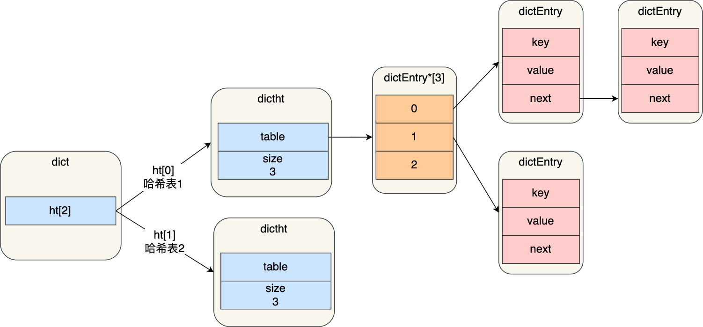

# Redis八股文

## 场景题：

### 什么是大热key，及其解决方案

大key：

1. **大 key 的定义：**通常认为字符串类型的key对应的value值占用空间大于1M，或者集合类型的k元素数量超过1万个；

   实际根据业务来看

2. 大 key 带来的问题：

   1. **性能下降：**大Key会占用大量内存空间，导致**内存碎片增加**，进而影响Redis的性能；

   2. **阻塞其他操作**：对大Key的操作会**消耗更多的CPU时间和内存资源**，甚至会导致Redis实例阻塞。

      - 例如，使用DEL命令删除一个大Key时，可能会导致Redis实例在一段时间内无法响应其他客户端请求，从而影响系统的响应时间和吞吐量。

   3. **网络拥塞：**每次获取大key产生的网络流量较大，可能造成机器或局域网的带宽被打满，同时波及其他服务。

      - 例如：一个大key占用空间是1MB，每秒访问1000次，就有1000MB的流量。

   4. **主从同步延迟：**当Redis实例配置了主从同步时，大Key可能导致主从同步延迟。

      - 由于大Key占用较多内存，同步过程中需要传输大量数据，这会导致主从之间的网络传输延迟增加，进而影响数据一致性。

   5. **数据倾斜**：在Redis集群模式中，某个数据分片的内存使用率远超其他数据分片，**无法使数据分片的内存资源达到均衡；**

      另外也可能造成Redis内存达到maxmemory参数定义的上限导致重要的key被逐出，甚至**引发内存溢出**

3. **大Key问题的解决方案：**
   1. 拆分大 Key → 多个小 Key
   2. 异步删除（`UNLINK` 代替 `DEL`）大Key
   3. 对过期数据进行定期清：堆积大量过期数据会造成大Key的产生，可以通过定时任务的方式对失效数据进行清理
   4. 监控Redis的内存水位：通过监控系统设置合理的Redis内存报警阈值进行提醒
   5. 业务侧压缩（如 JSON gzip）

****

热Key：https://www.cnblogs.com/wzh2010/p/17904849.html

1. 热Key的定义：在某个时间窗口内，访问频率极高的 Key（读写 QPS每s访问次数 占 Redis 总流量的显著比例）

2. 热Key的问题

   1. **单点访问频率过高**：

      Hot Key会导致大部分的访问流量集中在某一个Redis实例上，使得该实例的负载过高，可能会导致该实例崩溃，影响线上业务。

   2. **分片服务瘫痪**：

      Redis集群会分很多个分片，每个分片有其要处理的数据范围。当某一个分片被频繁请求，该分片服务就可能会瘫痪。

   3. **Redis分布式集群优势弱化**：如果请求不够均衡，过于单点，那么Redis分布式集群的优势也必然被弱化。

   4. **引发缓存击穿**：如果缓n存请求不到，就会去请求数据库。如果请求过于集中，Redis承载不了，就会有大量请求打到数据库。此时，可能引发数据库服务瘫痪，进而引发系统雪崩。我们在之前的文章中，大量讨论到 缓存击穿、缓存雪崩、缓存穿透

3. 热Key的解决方案：
   1. **缓存预热**：比如双11开启活动前，热点新闻爆出之后，预先加载一些热key的数据到缓存中，以减少对数据库的冲击
   2. **缓存击穿处理**：
      - 短暂降级之备选缓存
      - 短暂降级之空初始值
   3. **分布式缓存**：通过分布式缓存系统来分散请求负载，避免单一节点压力过大。现在的Redis高可用部署模式最常见的是主从和Cluster，无论哪一种，都会降低单点带来的影响。
   4. **限流和降级**
   5. **定期清理过期数据**：避免过多的热key占用缓存空间，从而减少缓存分片服务的压力
   6. **使用二级缓存**：本地缓存来实现二级缓存，减少Redis的读请求，可以先从本地缓存中取，取不到再去redis中去取，Redis再取不到采取数据库中取。


### 缓存击穿 & 缓存雪崩的解决方案

https://www.cnblogs.com/wzh2010/p/16929808.html


## 数据类型

### 有哪些 & 应用场景

**Redis 常见的五种数据类型：String（字符串），Hash（哈希），List（列表），Set（集合）及 Zset(sorted set：有序集合)**。


| 类型   | 小数据           | 大数据          |
| ------ | ---------------- | --------------- |
| String | sds + embstr/raw | sds             |
| List   | quicklist        | quicklist       |
| Hash   | listpack         | dict            |
| Set    | intset           | dict            |
| ZSet   | listpack         | dict + skiplist |

- 在 Redis 3.0 版本中 List 对象的底层数据结构由「双向链表」或「压缩表列表」实现，但是在 3.2 版本之后，List 数据类型底层数据结构是由 quicklist 实现的；
- 在最新的 Redis 代码中，压缩列表数据结构已经废弃了，交由 listpack 数据结构来实现了。

**五种常用数据类型的应用场景：**

- String 类型的应用场景：缓存对象、常规计数、分布式锁、共享session信息等。
- List 类型的应用场景：Timeline，消息队列（有两个问题：1. 生产者需要自行实现全局唯一 ID；2. 不能以消费组形式消费数据）等。
- Hash 类型：缓存对象、购物车等。
- Set 类型：聚合计算（并集、交集、差集）场景，比如点赞、共同关注、抽奖活动等。
- Zset 类型：排序场景，比如排行榜、电话和姓名排序等。

**四种特殊数据类型的应用场景：**

- BitMap（2.2 版新增）：二值状态统计的场景，比如签到、判断用户登陆状态、连续签到用户总数等；
- HyperLogLog（2.8 版新增）：海量数据基数统计的场景，比如百万级网页 UV 计数等；
- GEO（3.2 版新增）：存储地理位置信息的场景，比如滴滴叫车；
- Stream（5.0 版新增）：消息队列，相比于基于 List 类型实现的消息队列，有这两个特有的特性：自动生成全局唯一消息ID，支持以消费组形式消费数据。


### 底层数据结构

- 键值对是如何保存在 Redis 中的呢？

  Redis 是使用了一个「哈希表」保存所有键值对，哈希表的最大好处就是让我们可以用 O(1) 的时间复杂度来快速查找到键值对。哈希表其实就是一个数组，数组中的元素叫做哈希桶。

- Redis 的哈希桶是怎么保存键值对数据的呢？

  哈希桶存放的是指向键值对数据的指针（dictEntry*），这样通过指针就能找到键值对数据，然后因为键值对的值可以保存字符串对象和集合数据类型的对象，所以键值对的数据结构中并不是直接保存值本身，而是保存了 void * key 和 void * value 指针，分别指向了实际的键对象和值对象

#### **Redis对象**


- redisDb 结构，表示 Redis 数据库的结构，结构体里存放了指向了 dict 结构的指针；
- dict 结构，结构体里存放了 2 个哈希表，正常情况下都是用「哈希表1」，「哈希表2」只有在 rehash 的时候才用
- dictht 结构，表示哈希表的结构，结构里存放了哈希表数组，数组中的每个元素都是指向一个哈希表节点结构（dictEntry）的指针；
- dictEntry 结构，表示哈希表节点的结构，结构里存放了 `void *key` 和 `void * value` 指针

`void * key` 和 `void * value` 指针指向的是 **Redis 对象**，Redis 中的每个对象都由 redisObject 结构表示，如下图：


- type，标识该对象是什么类型的对象（String 对象、 List 对象、Hash 对象、Set 对象和 Zset 对象）；
- encoding，标识该对象使用了哪种底层的数据结构；
- ptr，指向底层数据结构的指针

**Redis 对象和数据结构的关系：**


#### SDS


- **len，记录了字符串长度**：

  这样获取字符串长度的时候，只需要返回这个成员变量值就行，时间复杂度只需要 O（1）。

- **alloc，分配给字符数组的空间长度**：

  这样在修改字符串的时候，可以通过 `alloc - len` 计算出剩余的空间大小，可以用来判断空间是否满足修改需求，如果不满足的话，就会自动将 SDS 的空间扩展至执行修改所需的大小，然后才执行实际的修改操作

  所以使用 SDS 既不需要手动修改 SDS 的空间大小，也不会出现前面所说的缓冲区溢出的问题。

- **flags，用来表示不同类型的 SDS**：

  一共设计了 5 种类型，分别是 sdshdr5、sdshdr8、sdshdr16、sdshdr32 和 sdshdr64

- buf[]，字节数组，用来保存实际数据（C字符串的底层结构）。不仅可以保存字符串，也可以保存二进制数据

##### SDS 相比C string 的优势：

1. **O（1）复杂度获取字符串长度**：直接通过len，得到字符串长度

2. **二进制安全：**

   C 字符串的局限性

   - C 语言的字符串是以 **`\0`（null 字符）作为结束标志**。
   - 所以一旦字符串中间含有 `\0`，**字符串就会被错误截断**。
   - 这会导致：**无法安全存储二进制数据**

   SDS 使用 `len` 字段记录字符串实际长度，而**不是通过 `\0` 判断结尾**；

   因为读取时依据 `len`，所以即使 `buf` 中间有 `\0`，也不会提前终止；

   所有 SDS API 都按字节处理，不做任何字符限制；

   为了兼容 C 的某些库函数，**SDS 结尾仍保留一个 `\0` 字节**，但这个字节不计入 `len`。

3. **不会发生缓冲区溢出：**

   Redis 的 SDS 结构里引入了 alloc 和 len 成员变量，这样 SDS API 通过 `alloc - len` 计算，可以算出剩余可用的空间大小，这样在对字符串做修改操作的时候，就可以由程序内部判断缓冲区大小是否足够用。

   **当判断出缓冲区大小不够用时，Redis 会自动将扩大 SDS 的空间大小**：

   - 如果所需的 sds 长度**小于 1 MB**，那么最后的扩容是按照**翻倍扩容**来执行的，即 2 倍的newlen
   - 如果所需的 sds 长度**超过 1 MB**，那么最后的扩容长度应该是 newlen **+ 1MB**

4. **节省内存空间：**

   - SDS 结构中有个 flags 成员变量，表示的是 SDS 类型：

     Redis 一共设计了 5 种类型，分别是 sdshdr5、sdshdr8、sdshdr16、sdshdr32 和 sdshdr64。

     这 5 种类型的主要**区别就在于，它们数据结构中的 len 和 alloc 成员变量的数据类型不同**

     之所以 SDS 设计不同类型的结构体，是为了能灵活保存不同大小的字符串，从而有效节省内存空间

   - Redis 在编程上还**使用了专门的编译优化来节省内存空间**，即在 struct 声明了 `__attribute__ ((packed))` 

     它的作用是：**告诉编译器取消结构体在编译过程中的优化对齐，按照实际占用字节数进行对齐**。

     默认情况下，编译器是使用「字节对齐」的方式分配内存：

     

     实际占用字节数对齐：

     


#### quicklist

```c
typedef struct quicklist {
    //quicklist的链表头
    quicklistNode *head;      //quicklist的链表头
    //quicklist的链表尾
    quicklistNode *tail; 
    //所有压缩列表中的总元素个数
    unsigned long count;
    //quicklistNodes的个数
    unsigned long len;       
    ...
} quicklist;

typedef struct quicklistNode {
    //前一个quicklistNode
    struct quicklistNode *prev;     //前一个quicklistNode
    //下一个quicklistNode
    struct quicklistNode *next;     //后一个quicklistNode
    //quicklistNode指向的压缩列表
    unsigned char *zl;              
    //压缩列表的的字节大小
    unsigned int sz;                
    //压缩列表的元素个数
    unsigned int count : 16;        //ziplist中的元素个数 
    ....
} quicklistNode;
```


 **quicklist 就是「双向链表 + 压缩列表」组合，因为一个 quicklist 就是一个链表，而链表中的每个元素又是一个压缩列表**

- quicklist.head 和 quicklist.tail 分别指向 quicklistNode构成的链表的头和尾
- quicklistNode 结构体里包含了前一个节点和下一个节点指针，这样**每个 quicklistNode 形成了一个双向链表**。
- 但是**链表节点的元素不再是单纯保存元素值，而是保存了一个压缩列表**，所以 quicklistNode 结构体里有个指向压缩列表的指针 `*zl`

> **在向 quicklist 添加一个元素的时候**：

不直接新建一个链表节点，而是**会检查插入位置的压缩列表是否能容纳该元素**：

- 如果能容纳就直接保存到 quicklistNode 结构里的压缩列表，
- 如果不能容纳，才会新建一个新的 quicklistNode 结构

> **为什么List改用quicklist**：

压缩列表的不足：虽然压缩列表是通过紧凑型的内存布局节省了内存开销，但是因为它的结构设计，如果保存的元素数量增加，或者元素变大了，压缩列表会有「连锁更新」的风险，一旦发生，会造成性能下降。

quicklist 解决办法：**通过控制每个链表节点中的压缩列表的大小或者元素个数，来规避连锁更新的问题。因为压缩列表元素越少或越小，连锁更新带来的影响就越小，从而提供了更好的访问性能**


##### 压缩链表（被listpack完全替代）

压缩列表是 Redis 为了节约内存而开发的，它是**由连续内存块组成的顺序型数据结构**，有点类似于数组


压缩列表：

- ***zlbytes***，记录整个压缩列表占用对内存字节数；
- ***zltail***，记录压缩列表「尾部」节点距离起始地址由多少字节，也就是列表尾的偏移量；
- ***zllen***，记录压缩列表包含的节点数量；
- ***zlend***，标记压缩列表的结束点，固定值 0xFF（十进制255）

压缩列表节点（entry）的构成如下：


压缩列表节点包含三部分内容：

- ***prevlen***，记录了「前一个节点」的长度，目的是为了实现从后向前遍历；

  - 如果**前一个节点的长度小于 254 字节**，那么 prevlen 属性需要用 **1 字节的空间**来保存这个长度值；
  - 如果**前一个节点的长度大于等于 254 字节**，那么 prevlen 属性需要用 **5 字节的空间**来保存这个长度值；

- ***encoding***，记录了当前节点实际数据的「类型和长度」，类型主要有两种：字符串和整数。

  - 如果**当前节点的数据是整数**，则 encoding 会使用 **1 字节的空间**进行编码，也就是 encoding 长度为 1 字节

  - 如果**当前节点的数据是字符串，根据字符串的长度大小**，encoding 会使用 **1 字节/2字节/5字节的空间**进行编码

    encoding 编码的前两个 bit 表示数据的类型，后续的其他 bit 标识字符串数据的实际长度，即 data 的长度

- ***data***，记录了当前节点的实际数据，类型和长度都由 `encoding` 决定；

##### 连锁更新

压缩列表新增某个元素或修改某个元素时，如果空间不够，压缩列表占用的内存空间就需要重新分配。而**当新插入的元素较大时，可能会导致后续元素的 prevlen 占用空间都发生变化，从而引起「连锁更新」问题**：导致每个元素的空间都要重新分配，造成访问压缩列表性能的下降

如果将一个长度大于等于 254 字节的新节点加入到压缩列表的表头节点，即新节点将成为 e1 的前置节点，如下图：


正如扩展 e1 引发了对 e2 扩展一样，扩展 e2 也会引发对 e3 的扩展，而扩展 e3 又会引发对 e4 的扩展.... 一直持续到结尾

**这种在特殊情况下产生的连续多次的prevlen空间扩展操作就叫做「连锁更新」**


#### listpack

listpack 头包含两个属性，分别记录了 listpack 总字节数和元素数量，然后 listpack 末尾也有个结尾标识；


**取消了：压缩列表头消息的结尾点偏移量**


**每个 listpack 节点结构如下：**


- encoding，定义该元素的编码类型，会对不同长度的整数和字符串进行编码；
- data，实际存放的数据；
- **len，当前节点 encoding+data的总长度；**

> 如何避免连锁更新问题？

**listpack 没有压缩列表中记录前一个节点长度的字段了，listpack 只记录当前节点的长度，当我们向 listpack 加入一个新元素的时候，不会影响其他节点的长度字段的变化，从而避免了压缩列表的连锁更新问题。**


#### 哈希表

```c
//哈希表
typedef struct dictht {
    //哈希表数组
    dictEntry **table;
    //哈希表大小
    unsigned long size;  
    //哈希表大小掩码，用于计算索引值
    unsigned long sizemask;
    //该哈希表已有的节点数量
    unsigned long used;
} dictht;

//哈希表节点
typedef struct dictEntry {
    //键值对中的键
    void *key;
  
    //键值对中的值
    union {
        void *val;
        uint64_t u64;
        int64_t s64;
        double d;
    } v;
    //指向下一个哈希表节点，形成链表
    struct dictEntry *next;
} dictEntry;
```

哈希表实际上是一个数组，数组里每一个元素就是一个哈希桶


##### 链式哈希解决哈希冲突

当一个键值对的键经过 Hash 函数计算后得到哈希值，再将(哈希值 % 哈希表大小)取模计算，得到的结果值就是该 key-value 对应的数组元素位置，也就是第几个哈希桶。**当有两个以上数量的 kay 被分配到了哈希表中同一个哈希桶上时，此时称这些 key 发生了冲突**


Redis 采用了「**链式哈希**」的方法来解决哈希冲突。


每个哈希表节点都有一个 next 指针，用于指向下一个哈希表节点，因此多个哈希表节点可以用 next 指针构成一个单项链表，**被分配到同一个哈希桶上的多个节点可以用这个单项链表连接起来**，这样就解决了哈希冲突

> refresh 解决 链式哈希长度增加，查询速度越来越慢的问题

链式哈希局限性也很明显，随着链表长度的增加，在查询这一位置上的数据的耗时就会增加，毕竟链表的查询的时间复杂度是 O(n)。

要想解决这一问题，就需要进行 rehash，也就是对哈希表的大小进行扩展。

##### refresh

Redis 定义一个 dict 结构体，这个结构体里定义了**两个哈希表（ht[2]）**，**「哈希表 1」用于数据的操作，「哈希表 2 」用于哈希表的扩容**




随着数据逐步增多，**触发了 rehash 操作，这个过程分为三步**：

- 给「哈希表 2」 分配空间，一般会比「哈希表 1」 大一倍；

- 将「哈希表 1 」的数据迁移到「哈希表 2」 中；

  > **如果「哈希表 1 」的数据量非常大，那么在迁移至「哈希表 2 」的时候，因为会涉及大量的数据拷贝，此时可能会对 Redis 造成阻塞，无法服务其他请求**

  **渐进式refresh，解决迁移时的阻塞问题**

- 迁移完成后，「哈希表 1 」的空间会被释放，并把「哈希表 2」 设置为「哈希表 1」，然后在「哈希表 2」 新创建一个空白的哈希表，为下次 rehash 做准备。


##### 渐进式refresh

为了避免 rehash 在数据迁移过程中，因拷贝数据的耗时，影响 Redis 性能的情况，所以 Redis 采用了**渐进式 rehash**，也就是将数据的迁移的工作不再是一次性迁移完成，而是分多次迁移

**渐进式 rehash 步骤如下：**

- 给「哈希表 2」 分配空间；
- **在 rehash 进行期间，每次哈希表元素进行新增、删除、查找或者更新操作时，Redis 除了会执行对应的操作之外，还会顺序将「哈希表 1 」中索引位置上的所有 key-value 迁移到「哈希表 2」 上**；
- 随着处理客户端发起的哈希表操作请求数量越多，最终在某个时间点会把「哈希表 1 」的所有 key-value 迁移到「哈希表 2」，从而完成 rehash 操作


##### refresh的触发时机

负载因子可以通过下面这个公式计算：


触发 rehash 操作的条件，主要有两个：

- **当负载因子大于等于 1 ，并且 Redis 没有在执行 bgsave 命令或者 bgrewiteaof 命令，也就是没有执行 RDB 快照或没有进行 AOF 重写的时候，就会进行 rehash 操作。**
- **当负载因子大于等于 5 时，此时说明哈希冲突非常严重了，不管有没有有在执行 RDB 快照或 AOF 重写，都会强制进行 rehash 操作**


#### 整数集合

整数集合本质上是一块连续内存空间，它的结构定义如下：

```c
typedef struct intset {
    //编码方式
    uint32_t encoding;
    //集合包含的元素数量
    uint32_t length;
    //保存元素的数组
    int8_t contents[];
} intset;
```

##### 集合升级

整数集合会有一个升级规则，就是**当我们将一个新元素加入到整数集合里面，如果新元素的类型（int32_t）比整数集合现有所有元素的类型（int16_t）都要长时，整数集合需要先进行升级**，也就是按新元素的类型（int32_t）扩展 contents 数组的空间大小，然后才能将新元素加入到整数集合里，当然**升级的过程中，也要维持整数集合的有序性**。

假设有一个整数集合里有 3 个类型为 int16_t 的元素。


**申请内存，先重新分配旧元素，再分配新元素，并保持有序性（原理：数组存储，所有元素都是同类型）**


整数集合升级的目的：**节省内存资源**。

> 整数集合支持降级操作吗？

**不支持降级操作**，一旦对数组进行了升级，就会一直保持升级后的状态。


#### 跳表

多层的有序链表

```c
//跳表作底层的zset
typedef struct zset {
    dict *dict; //单点查询
    zskiplist *zsl; //范围查询
} zset;

//跳表节点
typedef struct zskiplistNode {
    //Zset 对象的元素值
    sds ele;
    //元素权重值
    double score;
    //后向指针：指向前一个节点
    struct zskiplistNode *backward;
  
    //节点的level数组，保存每层上的前向指针和跨度
    struct zskiplistLevel {
        struct zskiplistNode *forward; //指向下一个跳表节点的指针
        unsigned long span;//跨度
    } level[];
} zskiplistNode;

//跳表
typedef struct zskiplist {
    struct zskiplistNode *header, *tail;//跳表的头尾节点，便于在O(1)时间复杂度内访问跳表的头节点和尾节点；
    unsigned long length;//跳表的长度，便于在O(1)时间复杂度获取跳表节点的数量
    int level;//跳表的最大层数，便于在O(1)时间复杂度获取跳表中层高最大的那个节点的层数量
} zskiplist;
```


##### 跳表的查询过程

查找一个跳表节点的过程时，跳表会从头节点的最高层开始，逐一遍历每一层。

在遍历某一层的跳表节点时，会用跳表节点中的 SDS 类型的元素和元素的权重来进行判断，共有两个判断条件：

- 如果当前节点的权重「小于」要查找的权重时，跳表就会访问该层上的下一个节点。
- 如果当前节点的权重「等于」要查找的权重时，并且当前节点的 SDS 类型数据「小于」要查找的数据时，跳表就会访问该层上的下一个节点

如果上面两个条件都不满足，或者下一个节点为空时，跳表就会使用目前遍历到的节点的 level 数组里的下一层指针，然后沿着下一层指针继续查找，即：跳到了下一层接着查找

****

举个例子，下图有个 3 层级的跳表。


如果要查找「元素：abcd，权重：4」的节点，查找的过程是这样的：

- 先从头节点的最高层开始，L2 指向了「元素：abc，权重：3」节点，这个节点的权重比要查找节点的小，所以要访问该层上的下一个节点；
- 但是该层的下一个节点是空节点（ leve[2]指向的是空节点），于是就会跳到「元素：abc，权重：3」节点的下一层去找，也就是 leve[1];
- 「元素：abc，权重：3」节点的 leve[1] 的下一个指针指向了「元素：abcde，权重：4」的节点，然后将其和要查找的节点比较。虽然「元素：abcde，权重：4」的节点的权重和要查找的权重相同，但是当前节点的 SDS 类型数据「大于」要查找的数据，所以会继续跳到「元素：abc，权重：3」节点的下一层去找，也就是 leve[0]；
- 「元素：abc，权重：3」节点的 leve[0] 的下一个指针指向了「元素：abcd，权重：4」的节点，该节点正是要查找的节点，查询结束。

##### 跳表节点的层次设置

跳表的相邻两层的节点数量最理想的比例是 2:1，查找复杂度可以降低到 O(logN)。


> 那怎样才能维持相邻两层的节点数量的比例为 2 : 1 呢？

Redis 采用：**跳表在创建节点的时候，随机生成每个节点的层数**，并没有严格维持相邻两层的节点数量比例为 2 : 1 的情况

具体的做法是：**跳表在创建节点时候，会生成范围为[0-1]的一个随机数，如果这个随机数小于 0.25（相当于概率 25%），那么层数就增加 1 层，然后继续生成下一个随机数，直到随机数的结果大于 0.25 结束，最终确定该节点的层数**

##### 为什么用跳表不用平衡树

- **从内存占用上来比较，跳表比平衡树更灵活一些**：
  - 平衡树每个节点包含 2 个指针（分别指向左右子树），
  - 而跳表每个节点包含的指针数目平均为 1/(1-p)，具体取决于参数 p 的大小。如果像 Redis里的实现一样，取 p=1/4，那么平均每个节点包含 1.33 个指针，比平衡树更有优势。
- **在做范围查找的时候，跳表比平衡树操作要简单**：
  - 在平衡树上，我们找到指定范围的小值之后，还需要以中序遍历的顺序继续寻找其它不超过大值的节点。如果不对平衡树进行一定的改造，这里的中序遍历并不容易实现；
  - 而在跳表上进行范围查找就非常简单，只需要在找到小值之后，对第 1 层链表进行若干步的遍历就可以实现。
- **从算法实现难度上来比较，跳表比平衡树要简单得多**：
  - 平衡树的插入和删除操作可能引发子树的调整，逻辑复杂，
  - 而跳表的插入和删除只需要修改相邻节点的指针，操作简单又快速


## 持久化

Redis 支持持久化，而且支持 3 种持久化方式:

- 快照（snapshotting，RDB）：记录数据
- 只追加文件（append-only file, AOF）：记录命令
- RDB 和 AOF 的混合持久化(Redis 4.0 新增)

### AOF日志


#### 写操作&3种写回策略


1. Redis 执行完写操作命令后，会将命令追加到 `server.aof_buf` 缓冲区；
2. 然后通过 write() 系统调用，将 aof_buf 缓冲区的数据写入到 AOF 文件，此时数据并没有写入到硬盘，而是拷贝到了内核缓冲区 page cache，等待内核将数据写入硬盘；
3. **具体内核缓冲区的数据什么时候写入到硬盘，由内核的写回策略决定**
   1. **Always**：每次写操作命令执行完后，**同步将 AOF 日志数据写回硬盘**；
   2. **Everysec**：每次写操作命令执行完后，先将命令写入到 AOF 文件的内核缓冲区，然后**每隔一秒**将缓冲区里的内容写回到硬盘；
   3. **No**：每次写操作命令执行完后，先将命令写入到 AOF 文件的内核缓冲区，再**由操作系统决定**何时将缓冲区内容写回硬盘。

**三种写回策略的区别：**控制 `fsync()` 函数的调用时机

- Always 策略就是每次写入 AOF 文件数据后，就执行 fsync() 函数；
  - 如果要高可靠，就选择 Always 策略；
- Everysec 策略就会创建一个异步任务来执行 fsync() 函数；
  - 如果允许数据丢失一点，但又想性能高，就选择 Everysec 策略
- No 策略就是永不执行 fsync() 函数
  - 如果要高性能，就选择 No 策略；


#### 重写机制

Redis 为了避免 AOF 文件越写越大，提供了 **AOF 重写机制**，当 AOF 文件的大小超过所设定的阈值后，Redis 就会启用 AOF 重写机制，来压缩 AOF 文件


**AOF 重写机制：**

- 在重写时，读取当前数据库中的所有键值对，
- 然后将每一个键值对用一条命令记录到「新的 AOF 文件」，
  - 原理：**用一条命令去记录键值对**，代替之前记录这个键值对的多条命令，这样就减少了 AOF 文件中的命令数量
- 等到全部记录完后，就将新的 AOF 文件替换掉现有的 AOF 文件
  - 避免：**如果 AOF 重写过程中失败了，现有的 AOF 文件就会造成污染**


#### 后台重写

Redis 的 重写 AOF 过程是 **由后台子进程 `bgrewriteaof` ，而非多线程 **来完成的：

- 子进程进行 AOF 重写期间，主进程可以继续处理命令请求，从而避免阻塞主进程；
- 子进程带有主进程的数据副本，这里使用子进程而不是线程：
  - 因为如果是使用线程，多线程之间会共享内存，那么在修改共享内存数据的时候，需要通过加锁来保证数据的安全，而这样就会降低性能；
  - 而使用子进程，创建子进程时，父子进程是共享内存数据的，不过这个共享的内存只能以只读的方式，而当父子进程任意一方修改了该共享内存，就会发生「写时复制」，于是父子进程就有了独立的数据副本，就不用加锁来保证数据安全

**子进程的工作原理：**

1. 重写前，通过 **`fork()`创建子进程，共用相同的内存数据**：

   

   子进程共享父进程的物理内存数据，但页表项的属性会标记：该物理内存的权限为**只读**

2. 当父子进程任意一方修改了该共享内存，就会发生**「写时复制」**：

   

   - 主进程修改已经存在 key-value，会发生写时复制，操作系统复制物理内存
   - 复制：主进程修改的物理内存数据，但没修改物理内存还是与子进程共享的

3. **写时复制后，数据在子进程的内存数据就跟主进程的内存数据不一致了，这时要怎么办呢？**

   - Redis 设置了一个 **AOF 重写缓冲区**，这个缓冲区在创建 bgrewriteaof 子进程之后开始使用。
   - 当 Redis 执行完一个写命令之后，它会**同时将这个写命令写入到 「AOF 缓冲区」和 「AOF 重写缓冲区」**

**AOF重写缓存区的工作时机：**


当**子进程完成 AOF 重写工作后，会向主进程发送一条信号**；主进程收到该信号后，会调用一个信号处理函数，该函数主要做以下工作：

- **将 AOF 重写缓冲区中的所有内容追加到新的 AOF 的文件中**，使得新旧两个 AOF 文件所保存的数据库状态一致；
- 新的 AOF 的文件进行改名，覆盖现有的 AOF 文件。


### RDB快照

Redis 提供了两个命令来生成 RDB 快照文件：

- `save` : 同步保存操作，会阻塞 Redis 主线程；
- `bgsave`（默认选项） : fork 出一个子进程，子进程执行，不会阻塞 Redis 主线程

Redis 的快照是**全量快照**，也就是说每次执行快照，都是把内存中的「所有数据」都记录到磁盘中

#### bgsave

执行 bgsave 过程中，Redis 主进程**可以继续处理操作命令**的，当数据发送修改时，触发**写时复制** (用AOF日志)

- 如果主线程（父进程）要**修改共享数据里的某一块数据**（比如键值对 `A`）时，就会发生写时复制，
- 于是这块数据的**物理内存就会被复制一份（键值对 `A'`）**，然后**主线程在这个数据副本（键值对 `A'`）进行修改操作**。
- 与此同时，**bgsave 子进程可以继续把原来的数据（键值对 `A`）写入到 RDB 文件**

**不同于AOF日志 重写日志：写时复制后，RDB 快照保存的是原本的内存数据，没有保持数据一致性**；

主线程刚修改的数据，是没办法在这一时间写入 RDB 文件的，**只能交由下一次的 bgsave 快照**。


## 过期删除&内存淘汰

### 过期删除策略

每当我们对一个 key 设置了过期时间时，Redis 会把该 key 带上过期时间存储到一个**过期字典**（expires dict）中，

也就是说**「过期字典」保存了数据库中所有 key 的过期时间**

**过期字典数据结构结构如下：**过期字典实际上是哈希表

-  key 是一个指针，指向键对象；
-  value 是一个 long long 类型的整数，这个整数保存了 key 的过期时间；

过期字典的数据结构如下图所示：


#### 如何判断key过期？

**当我们查询一个 key 时，Redis 首先检查该 key 是否存在于过期字典中**：

- 如果不在，则正常读取键值；
- 如果存在，则会**获取该 key 的过期时间，然后与当前系统时间进行比对**：
  - 如果比系统时间大，那就没有过期；
  - 否则，判定该 key 已过期


#### 过期删除策略有哪些？

常见的三种过期删除策略：

1. 定时删除：**在设置 key 的过期时间时，同时创建一个定时事件，当时间到达时，由事件处理器自动执行 key 的删除操作**
   - **定时删除对 内存 是最友好的**：可以保证过期 key 会被尽快删除，也就是内存可以被尽快地释放。
   - **定时删除对 CPU 不友好**：在过期 key 比较多的情况下，删除过期 key 可能会占用相当一部分 CPU 时间，在内存不紧张但 CPU 时间紧张的情况下，将 CPU 时间用于删除和当前任务无关的过期键上，无疑会对服务器的响应时间和吞吐量造成影响。
2. 惰性删除：**不主动删除过期键，每次从数据库访问 key 时，都检测 key 是否过期，如果过期则删除该 key**
   - **惰性删除策略对 CPU 最友好**：因为每次访问时，才会检查 key 是否过期，所以此策略只会使用很少的系统资源
   - **惰性删除策略对内存不友好**：如果一个 key 已经过期，而这个 key 又仍然保留在数据库中，那么只要这个过期 key 一直没有被访问，它所占用的内存就不会释放，造成了一定的内存空间浪费
3. 定期删除：**每隔一段时间「随机」从数据库中取出一定数量的 key 进行检查，并删除其中的过期key**


#### Redis 过期删除策略是？

 Redis 选择「惰性删除+定期删除」这两种策略配和使用

**Redis惰性删除的实现：**

Redis 在访问或者修改 key 之前，都会检查 key 是否过期：

- 如果过期，则删除该 key，至于选择异步删除，还是选择同步删除，根据 `lazyfree_lazy_expire` 参数配置决定（Redis 4.0版本开始提供参数），然后返回 null 客户端；
- 如果没有过期，不做任何处理，然后返回正常的键值对给客户端

**Redis定期删除的实现：**

- **间隔检查的时间：**在 Redis 中，默认每秒进行 10 次过期检查一次数据库

  - 此配置可通过 Redis 的配置文件 redis.conf 进行配置，配置键为 hz 它的默认值是 hz 10

- **随机抽查的数量：**每轮抽查时，会随机选择 20 个 key 判断是否过期（数量固定）

- **Redis定期删除流程：**

  1. 从过期字典中随机抽取 20 个 key；

  2. 检查这 20 个 key 是否过期，并删除已过期的 key；

     - 如果本轮检查的已过期 key 的数量，超过 5 个（20/4），也就是「已过期 key 的数量」占比「随机抽取 key 的数量」大于 25%，则继续重复第一步

     - 如果已过期的 key 比例小于 25%，则停止继续删除过期 key，然后等待下一轮再检查


### 内存淘汰策略

#### Redis内存淘汰策略有哪些？

Redis 内存淘汰策略共有八种，这八种策略大体分为「不进行数据淘汰」和「进行数据淘汰」两类策略：

1. 不进行数据淘汰的策略
   - **noeviction**（Redis3.0之后，默认的内存淘汰策略） ：它表示当运行内存超过最大设置内存时，不淘汰任何数据，这时如果有新的数据写入，会报错通知禁止写入，不淘汰任何数据，但是如果没用数据写入的话，只是单纯的查询或者删除操作的话，还是可以正常工作
2. 进行数据淘汰的策略：
   - 在设置了过期时间的数据中进行淘汰：
     - **volatile-random**：随机淘汰设置了过期时间的任意键值；
     - **volatile-ttl**：优先淘汰更早过期的键值。
     - **volatile-lru**（Redis3.0 之前，默认的内存淘汰策略）：淘汰所有设置了过期时间的键值中，最久未使用的键值；
     - **volatile-lfu**（Redis 4.0 后新增的内存淘汰策略）：淘汰所有设置了过期时间的键值中，最少使用的键值；
   - 在所有数据范围内进行淘汰：
     - **allkeys-random**：随机淘汰任意键值;
     - **allkeys-lru**：淘汰整个键值中最久未使用的键值；
     - **allkeys-lfu**（Redis 4.0 后新增的内存淘汰策略）：淘汰整个键值中最少使用的键值。

#### LRU算法 和 LFU算法区别？

**LRU** 全称是 Least Recently Used 翻译为**最近最少使用**，会选择淘汰最近最少使用的数据。

传统 LRU 算法的实现是基于「链表」结构，链表中的元素按照操作顺序从前往后排列，最新操作的键会被移动到表头，当需要内存淘汰时，只需要删除链表尾部的元素即可，因为链表尾部的元素就代表最久未被使用的元素

> **Redis 是如何实现 LRU 算法的？**

Redis 实现的是一种**近似 LRU 算法，实现方式：在 Redis 的对象结构体中添加一个额外的字段，用于记录此数据的最后一次访问时间**

```
typedef struct redisObject {
    ...
      
    // 24 bits，用于记录对象的访问信息
    unsigned lru:24;  
    ...
} robj;
```

**在 LRU 算法中**：Redis 对象头的 24 bits 的 lru 字段是**用来记录 key 的访问时间戳**

- 当 Redis 进行内存淘汰时，会使用**随机采样的方式来淘汰数据**，它是随机取 5 个值（配置决定），然后**淘汰最久没有使用的那个**；
- 在 LRU 模式下，Redis可以**根据对象头中的 lru 字段记录的值，来比较最后一次 key 的访问时间长**，从而淘汰最久未被使用的 key。
- Redis 实现的 LRU 算法的优点：
  - 不用为所有的数据维护一个大链表，节省了空间占用；
  - 不用在每次数据访问时都移动链表项，提升了缓存的性能；

> LRU算法的问题 & 为什么引入LFU算法？

LRU 算法有一个问题，**无法解决缓存污染问题**，

比如应用一次读取了大量的数据，而这些**数据只会被读取这一次**，那么**这些数据会留存在 Redis 缓存中很长一段时间，造成缓存污染**。

因此，在 Redis 4.0 之后引入了 LFU 算法来解决这个问题


> **什么是 LFU 算法？**

LFU 全称是 Least Frequently Used 翻译为**最不常用**，根据数据访问次数来淘汰数据的，即：当一个数据被再次访问时，就会增加该数据的访问次数。这样就解决了偶尔被访问一次之后，数据留存在缓存中很长一段时间的问题，相比于 LRU 算法也更合理一些。

> **Redis 是如何实现 LFU 算法的？**

```c
typedef struct redisObject {
    ...
      
    // 24 bits，用于记录对象的访问信息
    unsigned lru:24;  
    ...
} robj;
```

Redis 对象头中的 lru 字段，LFU 算法相比于 LRU 算法的实现，多记录了「数据的访问频次」的信息：


- **在 LFU 算法中**：Redis对象头的 24 bits 的 lru 字段被**分成两段来存储**，高 16bit 存储 ldt，低 8bit 存储 logc
  - ldt 是用来**记录 key 的访问时间戳**；
  - logc 是用来**记录 key 的访问频次**，它的**值越小表示使用频率越低，越容易淘汰**，每个新加入的 key 的logc 初始值为 5
- **Redis实现的LFU 算法根据访问频率来淘汰数据的**，而不只是访问次数
  - Redis 在访问 key 时，对于 logc 是这样变化的：
    1. 先按照上次访问距离当前的时长，来对 logc 进行衰减；、
       - 衰减的值跟前后访问时间的差距有关系，**如果上一次访问的时间与这一次访问的时间差距很大，那么衰减的值就越大**
    2. 然后，再按照一定概率增加 logc 的值
       - 增加操作并不是单纯的 + 1，而是**根据概率增加，如果 logc 越大的 key，它的 logc 就越难再增加**


## 缓存


### 缓存雪崩


**缓存雪崩**：当有大量读请求时，发生：**大量缓存数据在同一时间过期（失效）或者 Redis 故障宕机**时，Redis无法处理这些读请求；

于是全部请求都直接访问数据库，从而导致数据库的压力骤增，严重的会造成数据库宕机，从而形成一系列连锁反应，造成整个系统崩溃

**发生缓存雪崩的原因 & 各自解决方案**：

- 大量数据同时过期：

  1. 均匀设置过期时间：**给这些数据的过期时间加上一个随机数**，这样就保证数据不会在同一时间过期

  2. 互斥锁：**如果发现访问的数据不在 Redis 里，就加个互斥锁，保证同一时间内只有一个请求来构建缓存**

  3. 后台更新缓存：**更新缓存的工作交由后台线程更新，而非业务线程**，有两种实现方式

     1. 第一种方式：后台线程**定时更新缓存**，且**频繁地检测缓存是否有效**，

        检测到缓存失效了，马上从数据库读取数据，并更新到缓存

     2. 第二种方式，在**业务线程发现缓存数据失效后**，**通过消息队列发送一条消息通知后台线程更新缓存**，后台线程收到消息后，在更新缓存前可以判断缓存是否存在，存在就不执行更新缓存操作；不存在就读取数据库数据，并将数据加载到缓存

     **后台更新缓存另一种作用，缓存预热**：提前把数据缓起来，而不是等待用户访问才来触发缓存构建

- Redis 故障宕机：

  - 服务熔断或请求限流机制（发生后处理）：
    - 启动**服务熔断**机制，**暂停业务应用对缓存服务的访问，直接返回错误**，不用再继续访问数据库，从而降低对数据库的访问压力，保证数据库系统的正常运行，然后等到 Redis 恢复正常后，再允许业务应用访问缓存服务
    - 启用**请求限流**机制，**只将少部分请求发送到数据库进行处理，再多的请求就在入口直接拒绝服务**，等到 Redis 恢复正常并把缓存预热完后，再解除请求限流的机制
  - 构建 Redis 缓存高可靠集群（发生前处理）：
    - 通过**主从节点的方式构建 Redis 缓存高可靠集群**：如果 Redis 缓存的主节点故障宕机，从节点可以切换成为主节点，继续提供缓存服务，避免了由于 Redis 故障宕机而导致的缓存雪崩问题


### 缓存击穿 


> 我们的业务通常会有几个数据会被频繁地访问，比如秒杀活动，这类被频地访问的数据被称为热点数据。

**缓存击穿**：如果缓存中的**某个热点数据过期**了，此时大量的请求访问了该热点数据，就无法从缓存中读取，直接访问数据库，数据库很容易就被高并发的请求冲垮

**应对缓存击穿的两种方案**：

- **互斥锁方案**：保证同一时间只有一个业务线程更新缓存，未能获取互斥锁的请求，要么等待锁释放后重新读取缓存，要么就返回空值或者默认值。
- **后台更新缓存**：不给热点数据设置过期时间，由后台异步更新缓存；或者在热点数据准备要过期前，提前通知后台线程更新缓存以及重新设置过期时间

### 缓存穿透


**缓存穿透**：当有大量读请求时，访问的数据**既不在缓存中，也不在数据库中**，没办法构建缓存数据来处理请求，导致数据库的压力骤增

**缓存穿透的发生一般有这两种情况**：

- **业务误操作**：缓存中的数据和数据库中的数据都被误删除了，所以导致缓存和数据库中都没有数据；
- **黑客恶意攻击**：故意大量访问某些读取不存在数据的业务；

**应对缓存穿透的方案，常见的方案有三种**：

- 第一种方案：**非法请求的限制**

  - 在 API 入口处判断：请求参数是否合理，请求参数是否含有非法值、请求字段是否存在，

    如果判断出是恶意请求就直接返回错误，避免进一步访问缓存和数据库

- 第二种方案：**缓存空值或者默认值**

  - 针对查询的数据，在缓存中设置一个空值或者默认值，

    这样后续请求就可以从缓存中读取到空值或者默认值，返回给应用，而不会继续查询数据库

- 第三种方案：**使用布隆过滤器快速判断数据是否存在，避免通过查询数据库来判断数据是否存在**

  - 我们可以在写入数据库数据时，使用布隆过滤器做个标记，然后在用户请求到来时，业务线程确认缓存失效后，可以通过查询布隆过滤器快速判断数据是否存在，如果不存在，就不用通过查询数据库来判断数据是否存在

#### 布隆过滤器

**布隆过滤器：由「初始值都为 0 的位图数组」和「 N 个哈希函数」两部分组成**：

- 当我们在写入数据库数据时，在布隆过滤器里做个标记，
- 下次查询数据是否在数据库时，只需要查询布隆过滤器，如果查询到数据没有被标记，说明不在数据库中。

**布隆过滤器会通过 3 个操作完成标记**：

- 第一步：使用 N 个哈希函数分别对数据做哈希计算，得到 N 个哈希值；
- 第二步：将第一步得到的 N 个哈希值对位图数组的长度取模，得到每个哈希值在位图数组的对应位置。
- 第三步：将每个哈希值在位图数组的对应位置的值设置为 1；

**工作原理：**

假设有一个位图数组长度为 8，哈希函数 3 个的布隆过滤器。


1. **工作流程：**
   1. 标记：在数据库写入数据 x 后，把数据 x 标记在布隆过滤器时，数据 x 会被 3 个哈希函数分别计算出 3 个哈希值，然后在对这 3 个哈希值对 8 取模，假设取模的结果为 1、4、6，然后把位图数组的第 1、4、6 位置的值设置为 1。
   2. 查询：**当要查询数据 x 是否数据库时，通过布隆过滤器只要查到位图数组的第 1、4、6 位置的值是否全为 1，只要有一个为 0，就认为数据 x 不在数据库中**。

2. **查询布隆过滤器只用于验证数据不存在：**

- 查询到数据不存在，数据库中一定就不存在这个数据；
- 查询到数据存在，可能存在也可能不存在
  - 布隆过滤器由于是基于哈希函数实现查找的，高效查找的是**存在哈希冲突的可能性**：比如数据 x 和数据 y 可能都落在第 1、4、6 位置，而事实上，可能数据库中并不存在数据 y，存在误判的情况。


### 读写策略 TODO

https://www.cnblogs.com/wzh2010/p/17205453.html

1. Cache Aside Pattern 旁路缓存模式（并发常用）：

   - **写：先更新 db，然后直接删除 cache**

   **适合读请求比较多的场景**

2. Read/Write Through Pattern  读写穿透模式：

   - 写：**先查 cache，cache 中不存在，直接更新 db**；
   - **cache 中存在**，则先更新 cache，然后 cache 服务自己更新 db（**同步更新 cache 和 db**）

   很少使用，Redis并没有直接提供写入db的功能

3. Write Behind Pattern 异步缓存写入：

   - 写：**cache 存在，Write Behind 只更新缓存，不直接更新 db，而是改为异步批量的方式来更新 db**
   - cache 不存在，直接更新db

   非常**适合写多读少（一些数据经常变化又对数据一致性要求没那么高）的场景**，比如浏览量、点赞量

**三种策略，读数据方式都相同**：

- 从 cache 中读取数据，读取到就直接返回；
- cache 中读取不到的话，就从 db 中读取数据返回，再把数据放到 cache 中；


## 事件机制&线程模型

### Redis 为什么快？

- Redis 的大部分操作**都在内存中完成**，并且采用了高效的数据结构，因此 Redis 瓶颈可能是机器的内存或者网络带宽，而并非 CPU，
- Redis 主要任务采用**单线程模型**可以**避免了多线程之间的竞争**，省去了多线程切换带来的时间和性能上的开销，也不会导致死锁
- Redis 采用了 **I/O 多路复用机制**处理大量的客户端 Socket 请求。在 Redis 只运行单线程的情况下，该机制允许内核中，同时存在多个监听 Socket 和已连接 Socket。内核会一直监听这些 Socket 上的连接请求或数据请求；一旦有请求到达，就会交给 Redis 线程处理，这就实现了一个 Redis 线程处理多个 IO 流的效果

### Redis 如何实现IO多路复用？

#### 文件事件处理器

- 文件事件处理器有四个组成部分：套接字、I/O多路复用程序、文件事件分派器以及事件处理器
- 文件事件是对套接字操作的抽象，每当一个套接字准备好执行 `accept`、`read`、`write`和 `close` 等操作时，就会产生一个文件事件


#### IO多路复用模型


1. **每当一个客户端与 Redis 建立 TCP 连接，操作系统会为该连接分配一个 套接字文件描述符（FD）**。

   每个连接（包括监听套接字和客户端套接字）都由一个 FD 唯一标识。

2. Redis 使用 **I/O 多路复用（epoll/kqueue/evport/select）** 同时监听多个 FD；
   - **Redis会监听每个 FD 注册的事件类型**：
     - **`AE_READABLE`（可读）**
       - 监听套接字：有新连接可 `accept`
       - 客户端套接字：有数据可 `read`
     - **`AE_WRITABLE`（可写）**
       - 客户端套接字：发送缓冲区可用，可继续 `write`

3. **Redis 调用 `epoll_wait` / `select` 等阻塞等待，直到某些 FD 满足监听条件**：
   - 读事件就绪：有新连接、收到数据、连接关闭（`read` 返回 0）
   - 写事件就绪：内核发送缓冲区可写

4. **对每个就绪 FD，Redis 创建一个 文件事件（FileEvent）**，

   **根据事件类型绑定对应的回调处理器**(事件对应的回调函数)：

   - `AE_READABLE` → 读事件处理器（解析命令）
   - `AE_WRITABLE` → 写事件处理器（发送响应）

5. 就绪事件会按返回顺序放到一个 **事件队列（ready list）** 中，等待处理

6. **Redis 的事件处理是单线程的： 顺序（sequential）+ 同步（synchronous） 的，一次只处理一个 FD**
   1. 从就绪列表中取出一个事件
   2. 调用其绑定的处理器执行
   3. 处理完成后再取下一个事件

#### 多线程网络IO

- Redis 6.0 之前：主线程： read → 解析 → 执行 → write
  - 流程是：
    1. 主线程调用 `read()` 从客户端 socket 读数据
    2. 解析命令
    3. 执行命令（操作内存数据结构）
    4. 调用 `write()` 把结果发给客户端
- Redis 6.0 之后（多线程 I/O）：主线程：解析 → 执行（单线程）；I/O 线程：read / write（多线程并行）
  - 当开启多线程时：
    1. I/O 线程负责从 socket 读取命令请求（read）
    2. 主线程顺序解析并执行这些命令
    3. I/O 线程负责将执行结果写回客户端（write）

### Redis 单线程 还是 多线程？

- **Redis 单线程指的是「接收客户端请求->解析请求 ->执行请求->发送数据给客户端」这个过程是由一个线程（主线程）来完成的**
- 但是，**Redis 程序并不是单线程的**，Redis 在启动的时候，是会**启动后台线程**（BIO）

后台线程相当于一个消费者，生产者把耗时任务丢到任务队列中，消费者（BIO）不停轮询这个队列，拿出任务就去执行对应的方法；


- 为了提高网络 I/O 的并行度，**Redis 6.0 之后对于网络 I/O 采用多线程来处理**；
- 但是**对于命令的执行，Redis 仍然使用单线程**来处理

 Redis 6.0 版本之后，Redis 在启动的时候，默认情况下会**额外创建 6 个线程**：

- Redis-server ： Redis的主线程，主要负责执行命令；（不包括主线程）
- bio_close_file、bio_aof_fsync、bio_lazy_free：**三个后台线程**，分别异步处理关闭文件任务、AOF刷盘任务、释放内存任务；
- io_thd_1、io_thd_2、io_thd_3：**三个 I/O 线程**，io-threads 默认是 4 ，所以会启动 3（4-1）个 I/O 多线程，用来分担 Redis 网络 I/O 的压力。


## 事务 

MULTI ：**开启事务**，redis会将后续的命令逐个放入队列中，然后使用EXEC命令来原子化执行这个命令系列

EXEC：**执行事务中的所有操作命令**。

DISCARD：**取消事务**，放弃执行事务块中的所有命令。

WATCH：**在事务前执行,监视一个或多个key**，这个key(或多个key)被其他命令修改，则事务被中断，不会执行事务中的任何命令。

UNWATCH：**取消WATCH对所有key的监视**

### 事务执行步骤

**Redis事务执行是三个阶段**：

1. **开启**：以MULTI开始一个事务
2. **入队**：将多个命令入队到事务中，接到这些命令并不会立即执行，而是放到等待执行的事务队列里面
3. **执行**：由EXEC命令触发事务

**客户端事务时， 服务器会根据客户端发来的不同命令执行不同的操作**：

- 如果客户端发送的命令为 EXEC 、 DISCARD 、 WATCH 、 MULTI 四个命令的其中一个， 那么服务器立即执行这个命令；
- **客户端发送非事务命令时， 服务器并不立即执行这个命令， 而是将命令放入一个事务队列里面， 然后向客户端返回 QUEUED 回复**。

**redis事务一次性、顺序性、排他性的执行一个队列中的一系列命令**：

- Redis 事务的本质是一组命令的集合。事务支持一次执行多个命令，一个事务中所有命令都会被序列化。
- 在事务执行过程，会**按照顺序串行化执行队列中的命令**，**其他客户端提交的命令请求不会插入到事务执行命令序列中**。


### Redis如何保证原子性？

- **redis 执行一条命令的时候是具备原子性的**：因为 **redis 执行命令的时候是单线程来处理**的，不存在多线程安全的问题。

- **如果要保证 2 条命令的原子性的话，可以考虑用 lua 脚本**：将多个操作写到一个 Lua 脚本中，Redis 会把整个 Lua 脚本作为一个整体执行，在执行的过程中不会被其他命令打断，从而保证了 Lua 脚本中操作的原子性。

  - 比如说，在用 redis 实现分布式锁的场景下，解锁期间涉及 2 个操作，分别是先判断锁是不是自己的，是自己的才能删除锁，为了保证这 2 个操作的原子性，会通过 lua 脚本来保证原子性。

    ```lua
    // 释放锁时，先比较 unique_value 是否相等，避免锁的误释放
    if redis.call("get",KEYS[1]) == ARGV[1] then
        return redis.call("del",KEYS[1])
    else
        return 0
    end
    ```


### Redis事务不一定保证原子性

Redis 对事务原子性属性的保证情况：

- Redis **事务正常执行，可以保证原子性**；

- Redis 事务执行中**某一个操作执行失败，不保证原子性**，Redis 中并**没有提供回滚机制**。

  - 比如：2 个操作，第一个操作执行成果了，但是第二个操作执行的时候，命令出错了，那事务并不会回滚

    - **语法错误（编译器错误）**导致的事务提交失败，：k1、k2**保留原值**

      ```bash
      127.0.0.1:6379> set k1 v1
      OK
      127.0.0.1:6379> set k2 v2
      OK
      127.0.0.1:6379> MULTI
      OK
      127.0.0.1:6379> set k1 11
      QUEUED
      127.0.0.1:6379> sets k2 22
      (error) ERR unknown command `sets`, with args beginning with: `k2`, `22`, 
      127.0.0.1:6379> exec
      (error) EXECABORT Transaction discarded because of previous errors.
      127.0.0.1:6379> get k1
      "v1"
      127.0.0.1:6379> get k2
      "v2"
      127.0.0.1:6379>
      ```

    - **Redis类型错误（运行时错误）**导致的事务提交失败：**跳过错误命令继续执行**， 结果k1值改变、k2保留原值

      ```bash'
      127.0.0.1:6379> set k1 v1
      OK
      127.0.0.1:6379> set k1 v2
      OK
      127.0.0.1:6379> MULTI
      OK
      127.0.0.1:6379> set k1 11
      QUEUED
      127.0.0.1:6379> lpush k2 22
      QUEUED
      127.0.0.1:6379> EXEC
      1) OK
      2) (error) WRONGTYPE Operation against a key holding the wrong kind of value
      127.0.0.1:6379> get k1
      "11"
      127.0.0.1:6379> get k2
      "v2"
      127.0.0.1:6379>
      ```

### Redis的ACID

- **原子性atomicity**

  首先通过上文知道 运行期的错误是不会回滚的，很多文章由此说Redis事务违背原子性的；而官方文档认为是遵从原子性的。

  Redis官方文档给的理解是，**Redis的事务是原子性的：所有的命令，要么全部执行，要么全部不执行**。而不是完全成功。

- **一致性consistency**

  redis**事务是保证一致性的**，除非redis进程意外终结：命令失败的情况下得以回滚，数据能恢复到没有执行之前的样子。

- **隔离性Isolation**

  redis**事务是严格遵守隔离性的**，原因是redis是单进程单线程模式(v6.0之前），可以保证命令执行过程中不会被其他客户端命令打断。

  但是，Redis不像其它结构化数据库有隔离级别这种设计。

- **持久性Durability**

  **redis事务是不保证持久性的**，这是因为redis持久化策略中**不管是RDB还是AOF都是异步执行的**，不保证持久性是出于对性能的考虑


## 高可用

### 主从复制

主服务器可以进行读写操作，当发生写操作时自动将写操作同步给从服务器，而从服务器一般是只读，并接受主服务器同步过来写操作命令，然后执行这条命令。


#### 第一次数据同步


主从服务器间的第一次同步的过程可分为三个阶段：

- **第一阶段是：建立链接、协商同步**；

  - **从服务器先执行 replicaof 命令，之后从服务器就会给主服务器发送 `psync` 命令，表示要进行数据同步**

    - psync 命令包含两个参数，分别是**主服务器的 runID** 和**复制进度 offset**

      runID，每个 Redis 服务器在启动时都会自动生产一个随机的 ID 来唯一标识自己

      offset，表示复制的进度，第一次同步时，其值为 -1

  - **主服务器收到 psync 命令后，会用 `FULLRESYNC` 作为响应命令返回给对方；**

    这个响应命令会带上两个参数：主服务器的 runID 和主服务器目前的复制进度 offset。从服务器收到响应后，会记录这两个值

    **FULLRESYNC 响应命令采用全量复制**：主服务器会把所有的数据都同步给从服务器。

- **第二阶段是：主服务器同步数据给从服务器**；

  - 主服务器会执行 bgsave 命令来生成 RDB 文件，然后把文件发送给从服务器；

    从服务器收到 RDB 文件后，会先清空当前的数据，然后载入 RDB 文件。

    > 这期间的写操作命令并没有记录到刚刚生成的 RDB 文件中，这时主从服务器间的数据就不一致了

  - 为了保证主从服务器的数据一致性，

    **主服务器在下面这三个时间间隙中将收到的写操作命令，写入到 replication buffer 缓冲区里**：

    - 主服务器生成 RDB 文件期间；
    - 主服务器发送 RDB 文件给从服务器期间；
    - 「从服务器」加载 RDB 文件期间；

- **第三阶段是：主服务器发送新写操作命令给从服务器**。

  - 实现：主从服务器的数据一致
    - 主服务器将 replication buffer 缓冲区里所记录的写操作命令发送给从服务器，
    - 从服务器执行来自主服务器 replication buffer 缓冲区里发来的命令


#### 基于长连接的命令传播

- 主从服务器在完成第一次同步后，双方之间就会维护一个 TCP 连接
- 后续主服务器可以通过这个连接继续将写操作命令传播给从服务器，然后从服务器执行该命令，使得与主服务器的数据库状态相同


##### Redis 是同步复制还是异步复制？

Redis 主节点每次收到写命令之后，先写到内部的replication buffer缓冲区，然后通过TCP长连接**异步发送**给从节点


#### 断连下的数据一致：增量复制

网络恢复后的增量复制过程如下图：


有三个步骤：

- 从服务器在恢复网络后，会发送 psync 命令给主服务器，此时的 psync 命令里的 offset 参数不是 -1；
- 主服务器收到该命令后，然后用 CONTINUE 响应命令告诉从服务器接下来采用增量复制的方式同步数据；
- 然后主服务将主从服务器断线期间，所执行的写命令发送给从服务器，然后从服务器执行这些命令。

**主服务器怎么知道要将哪些增量数据发送给从服务器呢？**


- **repl_backlog_buffer**，是一个「**环形**」缓冲区，用于主从服务器断连后，从中找到差异的数据；
- **replication offset**，标记上面那个缓冲区的同步进度，主从服务器都有各自的偏移量
  - 主服务器使用 master_repl_offset 来记录自己「*写*」到的位置，
  - 从服务器使用 slave_repl_offset 来记录自己「*读*」到的位置

网络断开后，当从服务器重新连上主服务器时，从服务器会通过 psync 命令将自己的复制偏移量 slave_repl_offset 发送给主服务器，主服务器根据自己的 master_repl_offset 和 slave_repl_offset 之间的差距，然后来决定对从服务器执行哪种同步操作：

- 如果判断出从服务器要读取的数据还在 repl_backlog_buffer 缓冲区里，那么主服务器将采用**增量同步**的方式；
- 相反，如果判断出从服务器要读取的数据已经不存在 repl_backlog_buffer 缓冲区里，那么主服务器将采用**全量同步**的方式
  - **为了避免主服务器频繁地使用全量同步的方式，我们应该调整下 repl_backlog_buffer 缓冲区大小，尽可能的大一些**


### 哨兵机制

**哨兵（Sentinel）机制**：实现**主从节点故障转移**。

- 哨兵节点会监测主节点是否存活；
- 如果发现主节点挂了，它就会选举一个从节点切换为主节点，并且把新主节点的相关信息通知给从节点和客户端


**哨兵节点主要负责三件事情：监控、选主、通知**


#### 哨兵如何 监控 判断主节点故障？

为了减少误判的情况，哨兵在部署的时候不会只部署一个节点，而是用多个节点部署成**哨兵集群**（*最少需要三台机器来部署哨兵集群*）


**主从节点通过ping-pong心跳检测判断是否故障；**

- 如果主节点或者从节点没有在规定的时间内响应哨兵的 PING 命令，哨兵就会将它们标记为「**主观下线**」

- 哨兵集群对主观下线进行投票，赞成数大于哨兵配置文件中的 quorum 配置项设定的值，主节点标记为**「客观下线」**

  - quorum 的设置：**quorum 的值建议设置为哨兵个数的二分之一加 1**，例如 3 个哨兵就设置 2，5 个哨兵设置为 3

  - 而且**哨兵节点的数量应该是奇数**

    

**判断故障的过程：**

- 当一个哨兵判断主节点为**「主观下线」**后，
- 就会向其他哨兵发起命令，其他哨兵收到这个命令后，就会根据自身和主节点的网络状况，做出赞成投票或者拒绝投票的响应
- 当这个哨兵的赞同票数达到哨兵配置文件中的 quorum 配置项设定的值后，这时主节点就会被该哨兵标记为**「客观下线」**


#### 哨兵如何 选主 负责故障转移？

假设有 5 个哨兵，`quorum = 2`

1. 哨兵 B 先判断 SDOWN，发请求询问其他哨兵
2. 至少 2 个哨兵（包括自己）同意 SDOWN → 进入 ODOWN 状态
3. 开始 Leader 选举：
   - majority = floor(5/2) + 1 = 3
   - max(quorum, majority) = max(2, 3) = 3
   - 所以需要 ≥ 3 票才能当选 Leader

**ODOWN 是故障转移的前提，没有 ODOWN 就不会触发 Leader 选举**：

- 在某个哨兵节点判断主节点 SDOWN （主观下线）后，向其他哨兵发 `is-master-down-by-addr` 请求，
- 如果返回的“主节点不可达”数量 ≥ quorum，就认定主节点 ODOWN（客观下线）。
- **判断主节点ODWON（或者发现主节点SDOWN，发送投票请求的哨兵）作为候选者**

**ODOWN确定后，会在同一轮投票里选出一个 Leader，候选者根据赞成票数选主**：

- `majority = floor(N/2) + 1`，每个哨兵只能投一次票给一个候选者
- 候选者赞成票数 >= `max(quorum, majority)`，则成为Leader，负责故障转移


#### 哨兵如何 通知 实现故障转移？


主从故障转移操作包含以下四个步骤：

1. **第一步，选出新主节点**：在已下线主节点（旧主节点）属下的所有「从节点」里面，挑选出一个从节点，并将其转换为主节点。

   - **哨兵Leader对从节点进行三轮考察：优先级、复制进度、ID 号，**

     在进行每一轮考察的时候，哪个从节点优先胜出，就选择其作为新主节点。

     1. 第一轮考察，优先级：哨兵首先会根据从节点的优先级来进行排序，**优先级越小排名越靠前**；
        - Redis 的 slave-priority 配置项，可以给从节点设置优先级
     2. 第二轮考察：如果优先级相同，则**查看复制的下标，哪个从「主节点」接收的复制数据多，哪个就靠前**；
        - 从节点的 slave_repl_offset 最接近 master_repl_offset，说明它的复制进度是最靠前的
     3. 第三轮考察：如果优先级和下标都相同，就**选择从节点 ID 较小的那个**；
        - 每个从节点都有一个编号，这个编号就是 ID 号，是用来唯一标识从节点的

   - 哨兵 leader 向被选中的从节点 server2 **发送 `SLAVEOF no one` 命令，将该从节点升级为新主节点**

     

2. **第二步，将从节点指向新主节点**：让已下线主节点属下的所有「从节点」修改复制目标，修改为复制「新主节点」；

   - 哨兵 leader 向所有从节点（除新/旧主节点外）（server3 和 server4）发送 `SLAVEOF` ，让它们成为新主节点的从节点

     

3. **第三步，通知客户端主节点已更换**：将新主节点的 IP 地址和信息，**通过「发布者/订阅者机制」通知给客户端**；

   - Leader向 `+switch-master` 频道发布新主节点的 IP 地址和端口的消息；
   - 客户端接受后，就可以用新主节点的 IP 地址和端口进行通信了

4. **第四步，将旧主节点变为从节点**：继续监视旧主节点，当这个旧主节点重新上线时，将它设置为新主节点的从节点；

   - **当旧主节点重新上线时，哨兵Leader就会向它发送 `SLAVEOF` 命令，让它成为新主节点的从节点**：

     


#### 如何组成哨兵集群？

**哨兵节点之间是通过 Redis 的发布者/订阅者机制来相互发现的**：

1. 在主从集群中，主节点上有一个名为**`__sentinel__:hello`的频道，不同哨兵就是通过它来相互发现，实现互相通信：**

   - 哨兵 **A 把自己的 IP 地址和端口的信息发布到`__sentinel__:hello` 频道上**，哨兵 B 和 C 订阅了该频道。

     此时，哨兵 B 和 C 就可以从这个频道直接获取哨兵 A 的 IP 地址和端口号，哨兵 B、C 和哨兵 A 建立网络连接。

     通过这个方式，哨兵 B 和 C 也可以建立网络连接，这样一来，哨兵集群就形成了


2. **哨兵集群通过 向主节点发送 INFO 命令 获得所有节点信息，对「从节点」进行监控：**

   - 主节点知道所有「从节点」的信息：**哨兵会每 10 秒一次的频率向主节点发送 INFO 命令来获取所有「从节点」的信息**

     

通过 Redis 的发布者/订阅者机制，哨兵之间可以相互感知，然后组成集群;

同时，哨兵又通过 INFO 命令，在主节点里获得了所有从节点连接信息，于是就能和从节点建立连接，并进行监控了


### Redis 切片集群

#### 什么是Redis Cluster 集群？

- Reids Cluster集群（切片集群的实现方案），实现了Redis的分布式存储：

  对数据进行分片，**每台Redis节点上存储不同的内容，来解决在线扩容的问题。并且，它可以保存大量数据，即分散数据到各个Redis实例，还提供复制和故障转移的功能**

- **与主从复制+哨兵模式的区别在于**：

  - 不再是一个主节点管理全部数据，而是把数据**按槽位（16384 slots）分片**：主节点分为多个分片，每个分片负责一部分槽位

  - **每个分片的主节点**负责自己那部分槽位的数据存储和读写

  - 每个主节点也可以**有自己的从节点**（做复制 + 高可用）

  - 故障转移逻辑**由集群内部的节点直接完成，不需要单独的哨兵进程**


#### 客户端如何知道访问哪个节点？

Redis Cluster方案采用哈希槽（Hash Slot），来处理数据和实例之间的映射关系。

**一个切片集群被分为16384个slot（槽），每个进入Redis的键值对，根据key进行散列，分配到这16384插槽中的一个**。使用的哈希映射也比较简单，用CRC16算法计算出一个16bit的值，再对16384取模。数据库中的每个键都属于这16384个槽的其中一个，集群中的每个节点都可以处理这16384个槽。


#### 客户端命令访问的流程：

在Redis cluster模式下，节点对请求的处理过程如下：

1. **客户端访问任意节点，确定哈希槽归属**

   - 根据 key 计算槽位（slot = CRC16(key) mod 16384）。
   - 判断该槽是否由当前节点负责。

2. **槽不归本节点 → MOVED 重定向**

   - 如果槽归属在其他节点，当前节点返回 **MOVED** 错误，附带目标节点的 IP 和端口。
   - 客户端收到 MOVED 后，直接访问目标节点，并更新本地的槽位映射表。
   - **场景**：正常请求落在非负责节点。

   

3. **客户端访问槽归属的节点 ，判断key是否存在**

   - 如果槽归属在本节点，检查 key 是否存在：
     - **存在** → 返回结果
     - **不存在** →槽发生了迁移

4. **源节点槽迁出（MIGRATING） → ASK 重定向**

   - 如果当前槽正在迁出，并且 key 不存在于本节点：
     - 返回 **ASK** 错误，附带目标节点地址。
     - 客户端发送 **ASKING** 命令到目标节点，再执行原请求。
   - **场景**：集群扩容/缩容导致槽位迁移。

5. **目标节点槽导入（IMPORTING）**

   - 如果当前槽处于导入中状态：
     - 客户端带有 **ASKING** 标记，允许执行请求。
     - 没有ASKING标记，则返回 **MOVED**，重定向客户端到源节点

   

MOVED 重定向 与 ASK 重定向的区别：

- **MOVED 重定向 发生于 槽位不在本节点；ASK 重定向 发生于 槽位发生迁移（主从故障转移）**
- `MOVED` 重定向跳转到新主节点，客户端**立刻更新本地的槽位映射表**；`ASK` 做临时重定向，**不修改客户端的槽位表**
- MOVED 客户端直接访问目标节点；**ASK 客户但访问需要 ASKING 标记**


#### 集群的节点间如何通信？

一个Redis集群由多个节点组成，各个节点之间是怎么通信的呢？通过Gossip协议！

**Gossip是一种谣言传播协议，每个节点周期性地从节点列表中选择 k 个节点，将本节点存储的信息传播出去，直到所有节点信息一致**

- Gossip协议包含多种消息类型，包括ping，pong，meet，fail等等

  

  - meet消息：通知新节点加入。消息发送者通知接收者加入到当前集群，meet消息通信正常完成后，接收节点会加入到集群中并进行周期性的ping、pong消息交换

  - ping消息：节点每秒会向集群中其他节点发送 ping 消息

  - pong消息：当接收到ping、meet消息时，作为响应消息回复给发送方确认消息正常通信。

  - fail消息：当节点判定集群内另一个节点下线时，会向集群内广播一个fail消息，其他节点接收到fail消息之后把对应节点更新为下线状态

#### 集群内节点如何实现故障转移？

- **Redis Cluster 不依靠独立的哨兵机制实现高可用，而是在节点内部实现**：

  - Redis Cluster 的故障转移是节点内部实现的“分布式哨兵机制”：
    - **通过 Gossip ping-pong 判断主观下线+ 多数投票判定客观下线；**
      **主节点客观下线，从节点发起选举，获多数同意后接管主节点的槽位，从而保证高可用**

- **集群实现故障转移的流程：**

  1. **故障发现（检测，主观下线）**
     - **节点间定期交换 `PING`/`PONG` 消息，用于检测对方存活状态**
     - 主观下线：某个节点在一定时间内没有收到目标节点的 `PONG` 回复，就认为对方可能宕机

  2. **共识判定（客观下线）**

     - 节点会把“谁主观下线了”这个信息，**通过 Gossip 协议**传播给其它节点。

     - 如果超过一半（达到多数票（`floor(N/2)+1`）的**主节点**赞成主观下线， 标记为 **客观下线**（ODOWN）。

  3. **主节点ODWON后，故障转移**：

     1. **从节点候选**：该主节点的从节点开始准备“竞选”新的主节点（从节点一个个竞选，而非同时）；

        ​			竞选的从节点向其他主节点发送 `FAILOVER_AUTH_REQUEST` 请求授权

     2. **投票表决**：其他主节点收到请求后，会给一个从节点投票（同一个 term 内只能投一次）

     3. **当某个从节点获得多数票**（> N/2 持有槽的主节点同意），它会执行 `slaveof no one` 变为新主节点

     4. **槽位接管**：新主节点接管原主节点的槽位（slots）

  4. **客户端&集群的槽位映射表的更新：**

     - 当主从切换完成后，新主节点会接管原主节点的槽位，**集群内部通过 Gossip 协议同步这份映射表**

     - **客户端**：下次访问会通过 `MOVED` 重定向跳转到新主节点，更新客户端的槽位映射表
       - 客户端的槽位映射表不是时时刻刻更新的，如果是**旧的槽位对应关系，则MOVED懒更新**


