# 操作系统

## 用户态 与 内核态

### 概念

- **用户态(User Mode)** : 用户态运行的进程可以直接读取用户程序的数据，拥有较低的权限。
  - 当应用程序需要执行某些需要特殊权限的操作，例如读写磁盘、网络通信等，就需要向操作系统发起系统调用请求，进入内核态。
- **内核态(Kernel Mode)**：内核态运行的进程几乎可以访问计算机的任何资源包括系统的内存空间、设备、驱动程序等，不受限制，拥有非常高的权限。
  - 当操作系统接收到进程的系统调用请求时，就会从用户态切换到内核态，执行相应的系统调用，并将结果返回给进程，最后再从内核态切换回用户态。

### 用户态与内核态的切换

1. **系统调用（Trap）**：用户态进程 **主动** 要求切换到内核态的一种方式，主要是为了使用内核态才能做的事情比如读取磁盘资源。
   - 系统调用的机制其核心还是使用了操作系统为用户特别开放的一个中断来实现。
2. **中断（Interrupt）**：当外围设备完成用户请求的操作后，会向 CPU 发出相应的中断信号，这时 CPU 会暂停执行下一条即将要执行的指令转而去执行与中断信号对应的处理程序，如果先前执行的指令是用户态下的程序，那么这个转换的过程自然也就发生了由用户态到内核态的切换。比如硬盘读写操作完成，系统会切换到硬盘读写的中断处理程序中执行后续操作等。
3. **异常（Exception）**：当 CPU 在执行运行在用户态下的程序时，发生了某些事先不可知的异常，这时会触发由当前运行进程切换到处理此异常的内核相关程序中，也就转到了内核态，比如缺页异常。

### 系统调用的过程

1. 用户态的程序发起系统调用，因为系统调用中涉及一些特权指令（只能由操作系统内核态执行的指令），用户态程序权限不足，因此会中断执行，也就是 Trap（Trap 是一种中断）。
2. 发生中断后，当前 CPU 执行的程序会中断，跳转到中断处理程序。内核程序开始执行，也就是开始处理系统调用。
3. 当系统调用处理完成后，操作系统使用特权指令（如 `iret`、`sysret` 或 `eret`）切换回用户态，恢复用户态的上下文，继续执行用户程序。

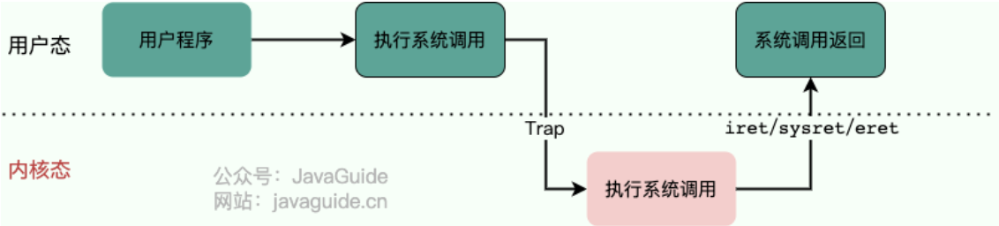

## 进程管理

### 进程和线程

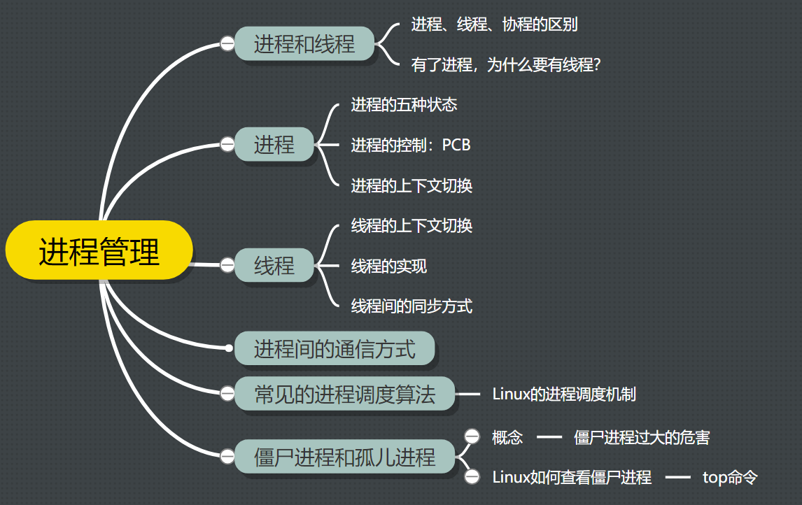

#### 进程、线程、协程的区别

- **进程**：进程是操作系统中进行资源分配和调度的基本单位，它拥有自己的独立内存空间和系统资源。

  每个进程都**有独立的堆和栈，不与其他进程共享**。进程间通信需要通过特定的机制，如管道、消息队列、信号量等。

  由于进程拥有独立的内存空间，因此其稳定性和安全性相对较高，但同时**上下文切换的开销也较大，因为需要保存和恢复整个进程的状态**。

- **线程**：线程是进程内的一个执行单元，也是CPU调度和分派的基本单位。

  与进程不同，线程共享进程的内存空间，包括堆和全局变量。线程之间通信更加高效，因为它们可以直接读写共享内存。

  线程的上下文切换开销较小，因为**只需要保存和恢复线程的上下文，而不是整个进程的状态**。

  然而，由于多个线程共享内存空间，因此存在数据竞争和线程安全的问题，需要通过同步和互斥机制来解决。

- **协程**：协程是一种用户态的轻量级线程，**其调度完全由用户程序控制，而不需要内核的参与**。

  协程拥有自己的寄存器上下文和栈，但与其他协程共享堆内存。

  协程的切换开销非常小，因为**只需要保存和恢复协程的上下文，而无需进行内核级的上下文切换**。这使得协程在处理大量并发任务时具有非常高的效率。

  然而，协程需要程序员显式地进行调度和管理，相对于线程和进程来说，其编程模型更为复杂。

#### 有了进程，为什么还要有线程？

- 进程**切换**是一个开销很大的操作，线程切换的成本较低。

- 线程更轻量，**一个进程可以创建多个线程**。同一进程内的线程**共享内存和文件**，因此它们之间**相互通信无须调用内核**

- 多个线程可以**并发处理**不同的任务，更有效地利用了多处理器和多核计算机。

  而进程只能在一个时间干一件事，如果在执行过程中遇到阻塞问题比如 IO 阻塞就会挂起直到结果返回。

### 进程

#### 进程的五种状态及变迁过程：

一个完整的进程状态的变迁如下图：

进程五种状态的变迁

再来详细说明一下进程的状态变迁：

- *NULL -> 创建状态*：一个新进程被创建时的第一个状态；
- *创建状态 -> 就绪状态*：当进程被创建完成并初始化后，一切就绪准备运行时，变为就绪状态，这个过程是很快的；
- *就绪态 -> 运行状态*：处于就绪状态的进程被操作系统的进程调度器选中后，就分配给 CPU 正式运行该进程；
- *运行状态 -> 结束状态*：当进程已经运行完成或出错时，会被操作系统作结束状态处理；
- *运行状态 -> 就绪状态*：处于运行状态的进程在运行过程中，由于分配给它的运行时间片用完，操作系统会把该进程变为就绪态，接着从就绪态选中另外一个进程运行；
- *运行状态 -> 阻塞状态*：当进程请求某个事件且必须等待时，例如请求 I/O 事件；
- *阻塞状态 -> 就绪状态*：当进程要等待的事件完成时，它从阻塞状态变到就绪状态

#### 进程的控制：

**PCB：**在操作系统中，是用**进程控制块**（*process control block，PCB*）数据结构来描述进程的。

**PCB 是进程存在的唯一标识**，这意味着一个进程的存在，必然会有一个 PCB，如果进程消失了，那么 PCB 也会随之消失。

通常通过**链表**的方式进行组织，把具有**相同状态的进程链在一起，组成各种队列**。比如：

- 将所有处于就绪状态的进程链在一起，称为**就绪队列**；
- 把所有因等待某事件而处于等待状态的进程链在一起就组成各种**阻塞队列**；

****

**进程的创建，终止，阻塞，唤醒：**

1. 创建进程的过程如下：

   - 申请一个空白的 PCB，并向 PCB 中填写一些控制和管理进程的信息，比如进程的唯一标识等；

   - 为该进程分配运行时所必需的资源，比如内存资源；

   - 将 PCB 插入到就绪队列，等待被调度运行；

2. 终止进程的过程如下：

   - 查找需要终止的进程的 PCB；
   - 如果处于执行状态，则立即终止该进程的执行，然后将 CPU 资源分配给其他进程；
   - 如果其还有子进程，则应将该进程的子进程交给 1 号进程接管；
   - 将该进程所拥有的全部资源都归还给操作系统；
   - 将其从 PCB 所在队列中删除；

3. 阻塞进程的过程如下：

   - 找到将要被阻塞进程标识号对应的 PCB；
   - 如果该进程为运行状态，则保护其现场，将其状态转为阻塞状态，停止运行；
   - 将该 PCB 插入到阻塞队列中去；

4. 唤醒进程的过程如下：

   - 在该事件的阻塞队列中找到相应进程的 PCB；
   - 将其从阻塞队列中移出，并置其状态为就绪状态；
   - 把该 PCB 插入到就绪队列中，等待调度程序调度；

****

#### 进程的上下文切换：

进程是由内核管理和调度的，所以**进程的切换只能发生在内核态**。

假设：当前运行的是进程 A，发生进程调度，OS 想切换到进程 B

- 中断发生，当前进程 A 的用户态转入内核态
- 保存当前进程 A 的上下文到 PCB
- 调度器选择新的进程 B
- 从进程 B 的 PCB 恢复上下文
- OS 从 B 的上下文中跳回，继续执行 B 上次暂停的地方（B 完全接管 CPU，A 已暂停）

**总结：**

- 进程上下文切换 = 保存旧进程的上下文到 PCB + 加载新进程PCB中的上下文+ 重新开始执行新进程
- 整个过程由内核调度器完成，只能在内核态发生。

### 线程

#### 线程的上下文切换：

- 当两个线程**不是属于同一个进程**，则切换的过程就跟进程上下文切换一样
  - 属于不同进程时，就得像进程切换那样，开销大很多（由线程控制块TCB参与）
- 当两个线程**是属于同一个进程**，因为虚拟内存是共享的，所以在切换时，虚拟内存这些资源就保持不动，只需要切换线程的私有数据、寄存器等不共享的数据
  - 线程属于同一进程时，上下文切换只换寄存器 + 栈

#### 线程的实现：

- **用户线程**：在用户空间实现的线程，不是由内核管理的线程，是由用户态的线程库来完成线程的管理

  - 用户线程是基于用户态的线程管理库来实现的，那么**线程控制块TCB** 也是在库里面来实现的，

    对于操作系统而言是看不到这个 TCB 的，它只能看到整个进程的 PCB。

  - **用户线程的整个线程管理和调度，操作系统是不直接参与的，而是由用户级线程库函数来完成线程的管理，包括线程的创建、终止、同步和调度等**

- **内核线程**：在内核中实现的线程，是由内核管理的线程；

  - **内核线程是由操作系统管理的，线程对应的 TCB 自然是放在操作系统里的**，这样线程的创建、终止和管理都是由操作系统负责。

- **轻量级进程LWP**：在内核中来支持用户线程；

  - **轻量级进程是内核支持的用户线程**，一个进程可有一个或多个 LWP，**每个 LWP 是跟内核线程一对一映射的，也就是 LWP 都是由一个内核线程支持**，而且 LWP 是由内核管理并像普通进程一样被调度。
  - 用户线程：LWP = M：N，而内核线程：LWP = 1：1

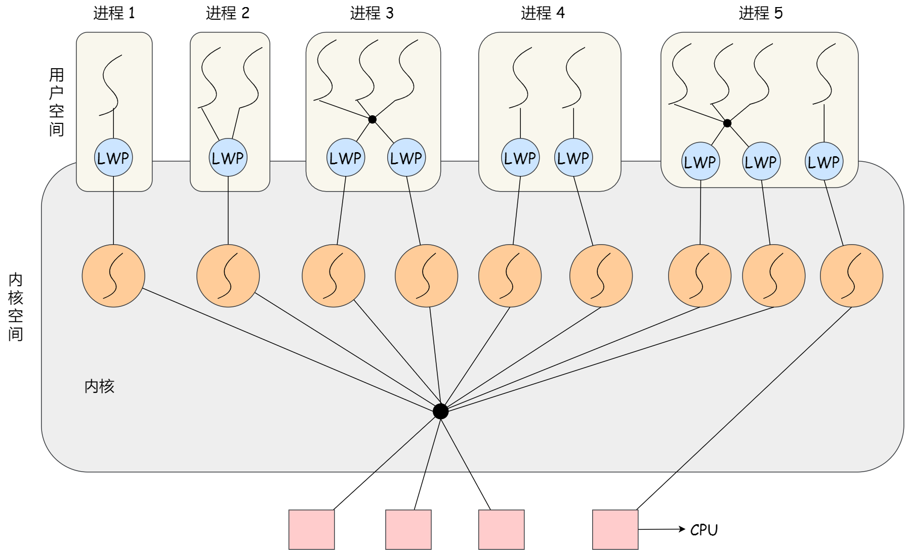

#### 线程间同步的方式

1. **互斥锁**：采用互斥对象机制，只有拥有互斥对象的线程才有访问公共资源的权限。因为互斥对象只有一个，所以可以保证公共资源不会被多个线程同时访问，比如 ：`sync.Mutex`
2. **读写锁** ：允许多个线程同时读取共享资源，但只有一个线程可以对共享资源进行写操作。
3. **信号量** ：它允许同一时刻多个线程访问同一资源，但是需要控制同一时刻访问此资源的最大线程数量，比如：`chan struct{}` 模拟
4. **屏障** ：屏障是一种同步原语，用于等待多个线程到达某个点再一起继续执行。当一个线程到达屏障时，它会停止执行并等待其他线程到达屏障，直到所有线程都到达屏障后，它们才会一起继续执行，比如：`sync.WaitGroup` 模拟
5. **事件** :Wait/Notify：通过通知操作的方式来保持多线程同步，还可以方便的实现多线程优先级的比较操作，比如：`sync.Cond`

### 进程间的通信方式

1. **管道**：不管是匿名管道还是命名管道，进程写入的数据都是缓存在内核中，另一个进程读取数据时候自然也是从内核中获取，同时通信数据都遵循**先进先出**原则；
   1. **对于匿名管道，它的通信范围是存在父子关系的进程**
      -  系统调用`int pipe(int fd[2])`创建匿名管道，`fd[0]`管道的读取端描述符 ，`fd[1]`管道的写入端描述符
      - 匿名管道没有实体，也就是没有管道文件，只能通过 `fork()` 来复制父进程 `fd` 文件描述符，来达到通信的目的。
   2. **对于命名管道，它可以在不相关的进程间也能相互通信**。
      - 命令 `mkfifo `提前创建了一个类型为管道的设备文件，在进程里只要使用这个设备文件，就可以相互通信。

2. **消息队列**：管道的通信效率低，因此管道不适合进程间频繁地交换数据解决。**消息队列解决管道通信效率低的问题**

   A 进程要给 B 进程发送消息，A 进程把数据放在对应的消息队列后正常返回，B 进程需要的时候再去读取数据。

   - **消息队列是保存在内核中的消息链表**，在发送数据时，会分成一个一个独立的数据单元，也就是消息体（数据块），消息体是用户自定义的数据类型，消息的发送方和接收方要约定好消息体的数据类型，所以**每个消息体都是固定大小的存储块，不像管道是无格式的字节流数据**。如果进程从消息队列中读取了消息体，内核就会把这个消息体删除。

   - **消息队列不适合比较大数据的传输**，因为在内核中每个消息体都有一个最大长度的限制，同时所有队列所包含的全部消息体的总长度也是有上限。

   - **消息队列通信过程中，存在用户态与内核态之间的数据拷贝开销**，因为进程写入数据到内核中的消息队列时，会发生从用户态拷贝数据到内核态的过程，同理另一进程读取内核中的消息数据时，会发生从内核态拷贝数据到用户态的过程

3. **共享内存**：共享内存**解决了**：消息队列的用户态与内核态之间的消息拷贝的**开销问题**

   - 共享内存，就是拿出一块虚拟地址空间来，映射到相同的物理内存中

4. **信号量**：为了防止多进程竞争共享资源，而造成的数据错乱：**通过信号量，使得任意时刻只能被一个进程访问**

   - 信号量其实是一个整型的计数器，主要用于实现进程间的互斥与同步，而不是用于缓存进程间通信的数据

   - 控制信号量的方式有两种原子操作：

     -  **P 读操作**，这个操作会把信号量减去 1，相减后如果信号量 < 0，则表明资源已被占用，进程需阻塞等待；相减后如果信号量 >= 0，则表明还有资源可使用，进程可正常继续执行

     - **V 写操作**，这个操作会把信号量加上 1，相加后如果信号量 <= 0，则表明当前有阻塞中的进程，于是会将该进程唤醒运行；相加后如果信号量 > 0，则表明当前没有阻塞中的进程

   - 信号量实现多进程同步的过程：

     - 如果进程 B 比进程 A 先执行了，那么执行到 P 操作时，由于信号量初始值为 0，故信号量会变为 -1，表示进程 A 还没生产数据，于是进程 B 就阻塞等待；
     - 接着，当进程 A 生产完数据后，执行了 V 操作，就会使得信号量变为 0，于是就会唤醒阻塞在 P 操作的进程 B；
     - 最后，进程 B 被唤醒后，意味着进程 A 已经生产了数据，于是进程 B 就可以正常读取数据了

5. **信号**：对于异常情况下的工作模式，就需要用「信号」的方式来通知进程

   - 信号是**异步通信机制**，可以在任何时候发送信号给某一进程
   - 有信号产生，用户进程对信号的处理方式有三种：1.执行默认操作 2.捕捉信号，执行自定义的信号处理函数 3.忽略信号

6. **套接字**： 跨网络与不同主机上的进程之间通信，就需要 Socket 通信

   - Socket 实际上不仅用于不同的主机进程间通信，还可以用于本地主机进程间通信

   - 根据创建 Socket 的类型不同，分为三种常见的通信方式:

     1.基于 TCP 协议的通信方式，2.基于 UDP 协议的通信方式，3.本地进程间通信方式

### 常见的进程调度算法

- **先到先服务调度算法(FCFS，First Come, First Served)** : 

  - 从就绪队列中选择一个最先进入该队列的进程为之分配资源，使它立即执行并一直执行到完成或发生某事件而被阻塞放弃占用 CPU 时再重新调度。
  - 适用于 CPU 繁忙型作业的系统，而不适用于 I/O 繁忙型作业的系统

- **最短作业优先的调度算法(SJF，Shortest Job First)** :

  -  从就绪队列中选出一个估计运行时间最短的进程为之分配资源，使它立即执行并一直执行到完成或发生某事件而被阻塞放弃占用 CPU 时再重新调度。
  - 对长作业不利，很容易造成一种极端现象

- **响应比优先调度算法 （Highest Response Ratio Next, HRRN）**：

  - 每次进行进程调度时，先计算「响应比优先级」，然后把「响应比优先级」最高的进程投入运行

    

- **时间片轮转调度算法（RR，Round-Robin）**:

  - 每个进程被分配一个时间段，称作它的时间片，即该进程允许运行的时间；让所有的进程同等重要，大家的运行时间都一样
  - 如果时间片用完，进程还在运行，那么将会把此进程从 CPU 释放出来，并把 CPU 分配另外一个进程；
  - 如果该进程在时间片结束前阻塞或结束，则 CPU 立即进行切换；

- **最高优先级调度算法（Priority）**：为每个流程分配优先级，首先执行具有最高优先级的进程，依此类推。

  有两种处理优先级高的方法，非抢占式和抢占式

  - 非抢占式：当就绪队列中出现优先级高的进程，运行完当前进程，再选择优先级高的进程。
  - 抢占式：当就绪队列中出现优先级高的进程，当前进程挂起，调度优先级高的进程运行。

- **多级反馈队列调度算法（Multilevel Feedback Queue）**：时间片轮转算法」和「最高优先级算法」的综合和发展

  - 设置了多个队列，赋予每个队列不同的优先级，每个**队列优先级从高到低**，同时**优先级越高时间片越短**；

  - 新的进程会被放入到第一级队列的末尾，按先来先服务的原则排队等待被调度，

    如果在第一级队列规定的时间片没运行完成，则将其转入到第二级队列的末尾，以此类推，直至完成；

  - 当较高优先级的队列为空，才调度较低优先级的队列中的进程运行；

  - 如果进程运行时，有新进程进入较高优先级的队列，则停止当前运行的进程并将其移入到原队列末尾，接着让较高优先级的进程运行

### 僵尸进程和孤儿进程

- 子进程通常是通过 fork()系统调用创建的，该调用会创建一个新的进程，该进程是原有进程的一个副本。子进程和父进程的运行是相互独立的，它们各自拥有自己的 PCB，即使父进程结束了，子进程仍然可以继续运行。
- 当一个进程调用 exit()系统调用结束自己的生命时，内核会释放该进程的所有资源，包括打开的文件、占用的内存等，但是该进程对应的 PCB 依然存在于系统中。这些信息**只有在父进程调用 wait()或 waitpid()系统调用时才会被释放，以便让父进程得到子进程的状态信息。**

1. **僵尸进程**：没有被父进程及时回收的子进程PCB

   - 子进程已经终止，但是其父进程仍在运行，且父进程没有调用 wait()或 waitpid()等系统调用来获取子进程的状态信息，释放子进程占用的资源，导致子进程的 PCB 依然存在于系统中，但无法被进一步使用。这种情况下，子进程被称为“僵尸进程”。

   - **避免僵尸进程的产生，父进程需要及时调用 wait()或 waitpid()系统调用来回收子进程。**

2. **孤儿进程**：父进程结束，没法被正常回收的子进程
   - 一个进程的父进程已经终止或者不存在，但是该（子）进程仍在运行。这种情况下，该进程就是孤儿进程。孤儿进程通常是由于父进程意外终止或未及时调用 wait()或 waitpid()等系统调用来回收子进程导致的。
   - **为了避免孤儿进程占用系统资源，操作系统会将孤儿进程的父进程设置为 init 进程（进程号为 1），由 init 进程来回收孤儿进程的资源。**

#### 僵尸进程过多会导致什么？

僵尸进程太多会导致**操作系统的进程数目过多，从而占满了OS的进程表；进而导致无法创建新进程，致使OS崩溃**。

 僵尸进程几乎不占资源，它没有可执行代码，也不能被调度，但是它占据着进程表中的一个位置，记载着该进程的PCB信息。

## 锁

### 死锁

#### 死锁及其发生的四个条件

**死锁（Deadlock）**：多个进程/线程同时被阻塞，阻塞原因：它们中的一个或者全部都在等待某个资源被释放；由于进程/线程被无限期地阻塞，因此程序无法正常终止

**死锁只有同时满足以下四个条件才会发生：**

- 互斥条件：多个线程不能同时使用同一个资源
- 持有并等待条件：一个进程至少占有一个资源，并等待另一资源，而该资源被其他进程所占有
- 非抢占条件：当线程已经持有了资源 ，该资源不能被抢占。只能在持有该资源的进程完成任务后，该资源才会被释放。
- 环路（循环）等待条件：在死锁发生的时候，**两个线程获取资源的顺序构成了环形链**

#### 怎么避免死锁发生？

**解决方案：使用资源有序分配法，让：进程按顺序，访问相同顺序的资源，来破环环路等待条件**

**资源有序分配法**：线程 A 和 线程 B 获取资源的顺序要一样，当线程 A 是先尝试获取资源 A，然后尝试获取资源 B 的时候，线程 B 同样也是先尝试获取资源 A，然后尝试获取资源 B。也就是说，**线程 A 和 线程 B 总是以相同的顺序申请自己想要的资源**。

可以使用**银行家算法**，实现资源有序分配

#### 银行家算法

**安全状态 与 非安全状态：**

安全序列一定不会发生死锁，但没有死锁不一定是安全序列

**银行家算法的原理：**

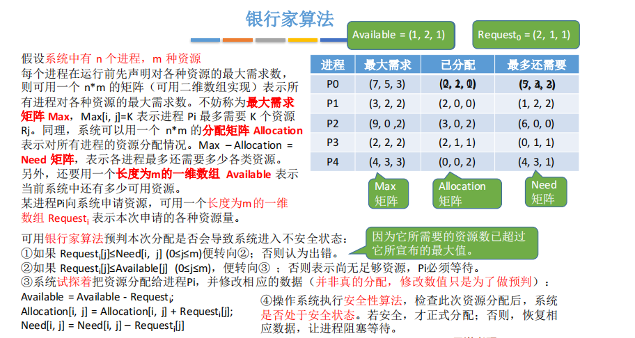

**银行家算法总结：**

1. 预判：**分配给进程资源前，首先判断这个进程的安全性：本次申请的资源量，是否小于 还需要的资源量 和 能分配的资源量**

   试探执行：如果系统当前资源能满足其执行，则尝试分配，如果不满足则让该进程等待。

2. 安全性算法检验：**通过不断检查剩余可用资源是否满足某个进程的最大需求，如果可以则加入安全序列，并把该进程当前持有的资源回收；不断重复这个过程，看最后能否实现让所有进程都加入安全序列**。

### 乐观锁和悲观锁

**乐观锁：**

- 基本思想：乐观锁**假设多个事务之间很少发生冲突，因此在读取数据时不会加锁**，而是**在更新数据时检查数据的版本**（如使用版本号或时间戳），**如果版本匹配则执行更新操作，否则认为发生了冲突**。
- 使用场景：乐观锁适用于读多写少的场景，可以减少锁的竞争，提高并发性能。例如，数据库中的乐观锁机制可以用于处理并发更新同一行数据的情况。

**悲观锁：**

- 基本思想：悲观锁**假设多个事务之间会频繁发生冲突，因此在读取数据时会加锁**，防止其他事务对数据进行修改，**直到当前事务完成操作后才释放锁**。
- 使用场景：悲观锁适用于写多的场景，通过加锁保证数据的一致性。例如，数据库中的行级锁机制可以用于处理并发更新同一行数据的情况。

**乐观锁适用于读多写少的场景，通过版本控制来处理冲突；而悲观锁适用于写多的场景，通过加锁来避免冲突。**

## 内存管理

### 基础知识

#### 虚拟内存/地址 与 物理内存/内存

- **虚拟内存：是操作系统为每个进程提供的一个连续的虚拟地址空间，并且可以扩展到硬盘空间**

  **虚拟地址**：程序认为自己使用的地址，是**CPU 发出的地址；

  - **虚拟内存大小：** 通过 虚拟内存可以让 **程序可以拥有超过系统物理内存大小的可用内存空间**。

- **物理内存：** 物理内存是 **计算机实际存在的内存**，是计算机中的实际硬件部件。

  **物理地址**：内存真正的地址，是 **内存芯片上的实际位置**

#### 虚拟内存 与 物理内存 的 映射关系/分配方式

- **虚拟内存的分配/虚拟地址映射到物理地址的方式：** 非连续内存管理

  - 页式内存管理：将 **虚拟地址空间和物理内存空间** 都划分成 **固定大小的“页”**，然后通过“页表”实现映射关系；

    虚拟内存上连续的内存页，映射到物理内存上 **不连续的地址**

  - 段式内存管理：将 **程序内存划分为若干功能性段（段是逻辑区域）**，通过 "段表" 实现映射关系；

    虚拟内存上的不同段，可以映射到物理内存上 **非连续/连续的地址**

  - 段业式：段表中包含页表

- **物理内存的分配：** 连续内存管理

  - 伙伴算法

  - Slab 分配器

### 内存管理方式

#### 非连续内存管理/映射方式

##### 段式内存管理

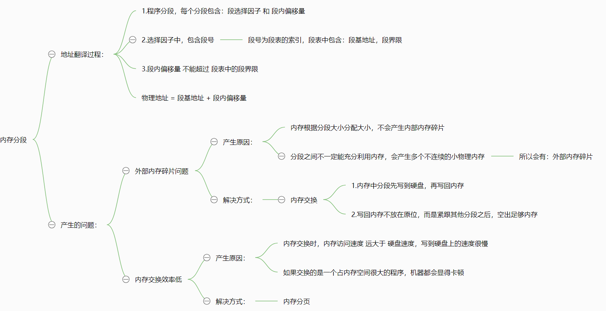

 

##### 业式内存管理

**缺页异常：**当 **CPU 要访问某个虚拟地址**，而该地址所对应的**虚拟页不在物理内存中**，就会触发一次**缺页异常**（Page Fault）。

**缺页异常的处理过程**：

1. 定位虚拟地址

   - 判断是哪一个进程、哪一段内存（如栈/堆/mmap 区）；

   - 如果非法访问，直接报错（如 Segmentation Fault）。

2. 分配物理页帧

   - 用 伙伴系统 从空闲页中找一块物理页（通常 4KB）；

   - 若内存不足，则可能要换出旧页面来腾出空间-----页面置换算法

3. 页面来源特殊：

   - 如果页面来自磁盘映射（即：`mmap` 文件映射），需从磁盘读数据；
     - 内核从文件所在的 **磁盘** 中读取相应内容，填入一个新分配的物理页帧中；然后更新页表。

   - 如果页面来自程序堆/栈的增长（`brk` 增长堆或栈自动增长），直接清零初始化即可
     - 分配一个新的物理页帧；用 **0 清空初始化**（避免脏数据）；然后更新页表。

4. 更新页表

   - 把虚拟地址 ➜ 新物理页帧 的映射写入页表；

   - 刷新 TLB，防止用旧的页表缓存。

5. 恢复执行
   - 回到用户态，重新执行触发异常的那条指令。

**页面置换算法**：当**发生缺页异常时，如果当前内存中并没有空闲的页面**，操作系统就必须在内存选择一个页面将其移出内存，以便为即将调入的页面让出空间。**用来选择淘汰哪一页的规则叫做页面置换算法**：

- **OPT 页面置换算法（最佳页面置换算法）** ：被淘汰页面是以后永不使用的，或者是在最长时间内不再被访问的页面
- **FIFO（First In First Out） 页面置换算法（先进先出页面置换算法）** : 总是淘汰最先进入内存的页面
- **LRU （Least Currently Used）页面置换算法（最近最久未使用页面置换算法）** 
- **LFU （Least Frequently Used）页面置换算法（最少使用页面置换算法）**

##### 段业式内存管理

- 第一次访问段表，得到页表起始地址；
- 第二次访问页表，得到物理页号；
- 第三次将物理页号与页内位移组合，得到物理地址。

#### 连续内存管理（了解即可）

### Linux 内存管理

#### Linux 虚拟内存：

##### 虚拟内存的内存布局

1. 每个进程分配的**虚拟内存分为：用户空间，内核空间**；

   进程间的**用户空间独立，内核空间共用**关联的相同的物理内存

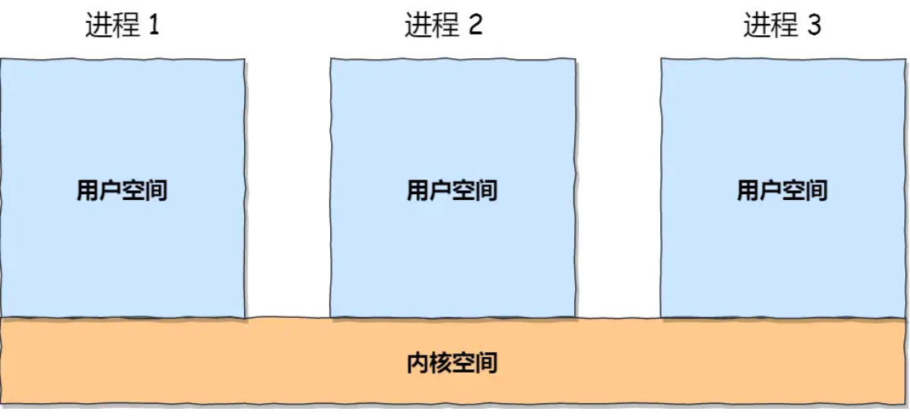

2. **用户空间的分布：**代码段，数据段，BSS段，堆段，文件映射段，栈段

   **内核空间的分布：**直接映射区，动态内存映射区，永久内存映射区，固定内存映射区

   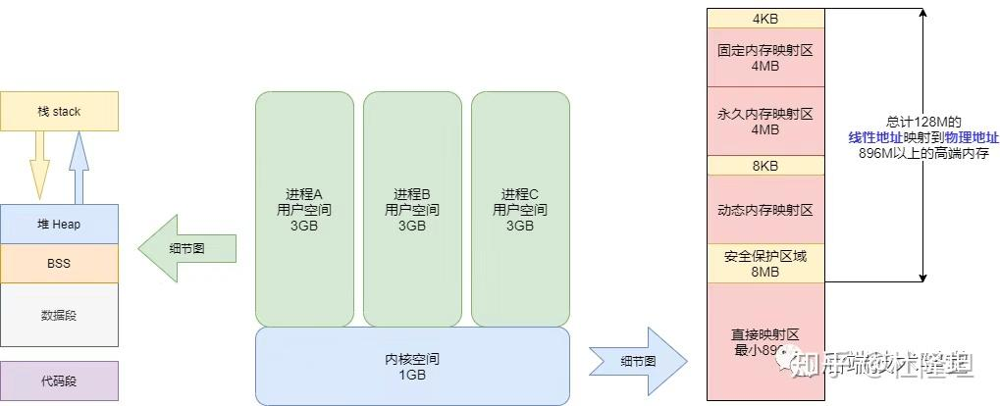

3. **内核空间 与 物理内存的映射划分：**

​	直接映射区（连续映射）：虚拟地址连续，分配的物理地址也连续

​        动态映射区（非连续映射）：虚拟地址连续，分配的物理地址不连续

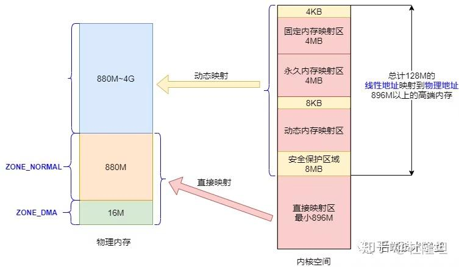

##### 映射方式：业式内存管理 

操作系统使用 **分页机制（Paging）**，将 **虚拟地址空间** 分割成一个个页（Page），并通过 **页表（Page Table）** 将这些虚拟页映射到实际的 **物理内存页框（Page Frame）** 上

1. **Linux的映射过程**

用户空间访问虚拟地址 → CPU 认为它是线性地址（因为段基址为 0）→ 查询页表（Page Table） → 得到对应物理地址

2. **舍弃分段：**Linux在设计上几乎完全放弃了分段机制，只使用分页机制

| 项           | Linux 选择                         |
| ------------ | ---------------------------------- |
| 段基址       | 全部设为 0（Base=0）               |
| 段限长       | 设为最大值（32位为例，Limit=4GB）  |
| 段寄存器     | 仅用于区分用户态和内核态的权限控制 |
| 实际地址转换 | 全靠分页来完成                     |

Linux 的分段机制 仅用于**权限隔离**，区分用户态和内核态，即：用户态的代码段/数据段无法访问内核空间的地址

3. **分页机制：**

- 把虚拟地址空间按照固定大小（4KB）分页为连续的内存页；
- 将每一页映射到实际物理内存对应的页框，允许不连续映射（即虚拟空间连续，物理地址可以跳跃）；

##### 虚拟内存的分配：

1. **用户空间内存分配：**

`malloc` 用于申请用户空间的虚拟内存

- 当申请小于 `128KB` 的内存时：会通过调用 **`sbrk()` / `brk()`** 分配虚拟地址，
  - 分配到的虚拟地址在 **用户空间的heap**；
- 当申请大于 `128KB` 的内存时：会通过调用 **`mmap()`**分配虚拟地址， 
  - 分配的虚拟地址通常在进程的 **`mmap` 区域（位于用户空间的 heap 与 stack 之间）；**

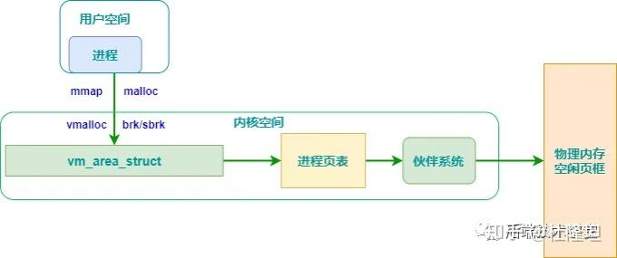

2. **内核空间内存分配：**

- `kmalloc()` 分配的虚拟地址在内核空间的「**直接内存映射区」**；一般用于分配小块内存；**`kmalloc` 是基于slab 分配器的**
- `vmalloc` 分配的虚拟地址在内核空间的**「动态内存映射区」**；一般分配大块内存

#### Linux 物理内存：

- 当用户访问虚拟地址时（第一次访问触发缺页异常）：
- 内核为该虚拟地址分配一个实际的 **物理页帧**（page frame）；物理页帧的分配依赖于：
  - **伙伴系统（buddy system）**：用于分配**连续物理页**；
  - **slab/slub 分配器**：对小块内存进行缓存与优化；

##### 物理内存分配 与 虚拟内存分配的映射

1. 用户空间的内存分配（`brk`小内存 / `mmap`大内存）：**延迟分配**

   - 用户通过 `brk` 或 `mmap` 在**用户空间**申请虚拟内存；
   - **初次访问虚拟地址，触发缺失异常时，分配物理内存；**

   - 物理内存分配逻辑依赖：
     - **伙伴系统（Buddy System）**：分配较大、连续的物理内存；
     -  **Slab / Slub 分配器**：优化小块内存的管理与缓存。

2. 内核空间的内存分配(`kmalloc`/`vmalloc`)：**立即分配**

   - 使用 `kmalloc` 申请的小块内存，也从**直接映射区**分配物理页帧；
     -  `kmalloc` ：直接映射区，通过伙伴算法，映射到物理内存

   -  使用 `vmalloc` 申请的大块内存，则来自**动态映射区**：
     - `vmalloc`：动态映射区，通过伙伴算法，映射到物理内存

| 操作类型  | 虚拟地址属于谁 | 分配时机       | 是否触发缺页异常 | 物理页分配器 | 虚拟地址来源       |
| --------- | -------------- | -------------- | ---------------- | ------------ | ------------------ |
| `brk`     | 用户空间       | 延迟（缺页时） | ✅ 是             | 伙伴系统     | heap区             |
| `mmap`    | 用户空间       | 延迟（缺页时） | ✅ 是             | 伙伴系统     | heap区~stack区之间 |
| `kmalloc` | 内核空间       | 立即分配       | ❌ 否             | 伙伴系统     | 直接映射区         |
| `vmalloc` | 内核空间       | 立即分配       | ❌ 否             | 伙伴系统     | 动态映射区         |

##### 页框管理/**伙伴算法：解决外部内存碎片**

内存页 频繁的分配与回收物理页导致大量的小块内存夹杂在已分配页面中间，形成外部碎片

引入**伙伴算法：把相同2^k大小的页框块用链表串起来，得到空闲页框块的链表数组，解决外部碎片**

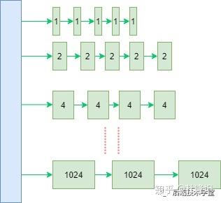

**伙伴算法的分配过程**：假设需要分配大小为 `S` 的内存块；

1. 计算最小的 `2^k` ≥ `S`，在空闲链表中查找对应的块；
2. 如果 `2^k` 的块不存在：
   - 找更大的块（如 `2^{k+1}`、`2^{k+2}`...）；
   - 一直向上直到找到；
   - 将该大块**一分为二**（称为 **split**），直到得到 `2^k` 的块；
   - 多余的块放回更小的空闲链表中；
3. 返回一块大小为 `2^k` 的内存块

**伙伴算法的释放过程**：假设回收的块大小为 `2^k`；

1. 系统计算它的“**伙伴块**”（Buddy）：
   - 若当前块地址为 `A`，则伙伴地址为：`B = A ⊕ 2^k`，进行异或运算
2. 如果它的伙伴块 空闲，且大小相同：
   - 将它们合并成一个 `2^{k+1}` 的大块；
   - 继续计算伙伴块，向上尝试**递归合并**，最多合并到最大块（整个物理空间）大小；
3. 如果它的伙伴块不空闲，或者大小不相同：
   - 释放的块 `A` 就**直接挂入当前层（`2^k`）的空闲链表**；

##### **Slab 分配器：解决内部碎片**

对于小对象，程序运行的实际使用空间 小于 分配页框的大小，就会产生内部内存碎片

引入 **`slab` 分配器：通过将内存页划分为多个大小一致的对象块，解决内部碎片问题**

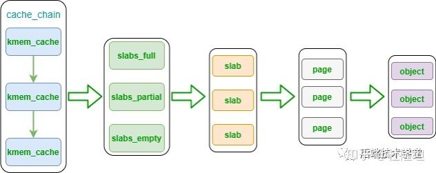

`slab` 分配流程概述：

1. **内存页初始化：**`slab` 分配器首先会从**伙伴系统**申请一个或多个连续页面（通常是一组 `2^k` 页）作为内存池。
2. **内存页划分：**获得页面后，`slab` 将其**划分为若干个大小相同的对象单元**（如每个 64B、128B 等），形成一个 slab。
3. **分配slab：**用户在申请小对象时，直接从该 slab 中分配一个空闲对象指针
4. **空间耗尽时的扩展**： 如果当前 slab 中没有可用对象，分配器会：
   - 尝试从同类对象缓存池中复用其他 slab；
   - 若仍不足，则再次向伙伴系统申请新的页面，创建新的 slab。
