# 计算机网络

## OSI 七层模型 和 TCP/IP 4层模型

**OSI 七层模型：**

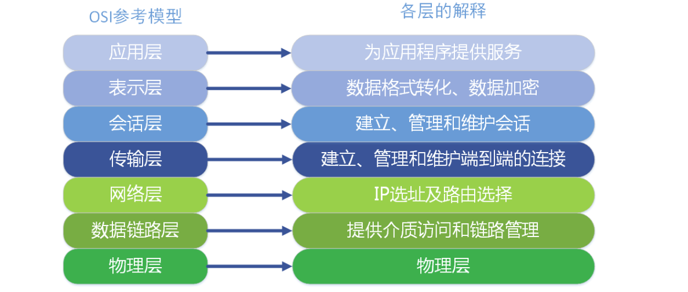

**TCP/IP 4层模型：**

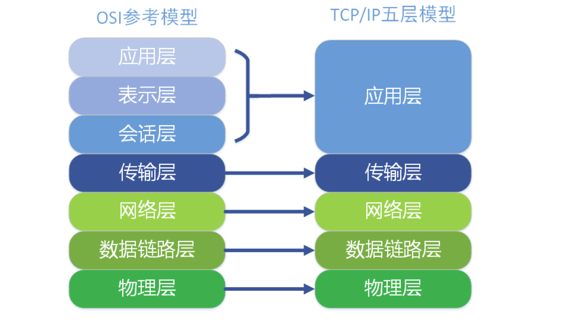

- **应用层：** 

  - 手机和电脑的应用都在应用层实现；
  - 应用层专门提供应用功能：HTTP、FTP、Telnet、DNS、SMTP 等；
  - 当两个不同设备的应用需要通信的时候，应用就把应用数据传给下一层，也就是传输层；
  - **应用层是工作在操作系统中的用户态，传输层及以下则工作在内核态。**

- **传输层：**

  - 应用层的数据包会传给传输层，传输层是为应用层提供网络支持的

  - 传输层会有两个传输协议，分别是 TCP 和 UDP。

    - TCP 保证数据包能可靠地传输给对方；但传输速度慢
    - UDP 传输速度快； 只负责发送数据包，不保证数据包是否能抵达对方

  - 当传输层的数据包大小超过 **MSS（最大报文段长度）** ，就要将数据包分块，

    这样即使中途有一个分块丢失或损坏了，只需要重新发送这一个分块，而不用重新发送整个数据包。

    在 TCP 协议中，我们把每个分块称为一个 **TCP 段**

  - 当设备作为接收方时，传输层则要负责把数据包传给应用，应用的编号就是 **端口**。

- **网络层：**

  - 传输层作为应用间数据传输的媒介，帮助实现应用到应用的通信，而实际的传输功能就交给下一层，也就是 **网络层**

  - 网络层使用的是 IP 协议，IP 协议会将传输层的报文作为数据部分，再加上 IP 包头（**IP头20~40字节**）组装成 IP 报文，

    如果 IP 报文大小超过 **MTU（数据包最大长度，一般为 1500 字节）** 就会 **再次进行分片**，得到一个即将发送到网络的 IP 报文。

  - IP 协议的两个功能：

    - 寻址：IP 地址给设备进行编号， IP 地址分成两种意义：

      - 一个是 **网络号**，负责标识该 IP 地址是属于哪个「子网」的；
      - 一个是 **主机号**，负责标识同一「子网」下的不同主机；

      在寻址的过程中，先匹配到相同的网络号（表示要找到同一个子网），才会去找对应的主机。

    - 路由：两台设备并不是用一条网线连接起来的，而是通过很多网关、路由器、交换机等众多网络设备连接起来的，

      那么就会形成很多条网络的路径，因此当数据包到达一个网络节点，就需要通过路由算法决定下一步走哪条路径。

​		IP 协议的寻址作用是告诉我们去往下一个目的地该朝哪个方向走，路由则是根据「下一个目的地」选择路径。

- **网络接口层：**
  - 在以太网的世界中，通过 IP 协议寻址是不可行的；
  - 在以太网进行通讯要用到 MAC 地址；
  - MAC 头部是以太网使用的头部，它包含了接收方和发送方的 MAC 地址等信息，我们可以 **通过 ARP 协议获取对方的 MAC 地址**。
  - MAC头 占14个字节；MAC 地址 占 8 个字节


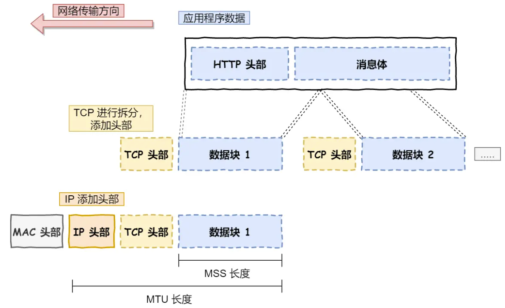

## 访问网络的全过程


1. 在浏览器中输入指定网页的 URL。
   - URL解析
2. 浏览器通过 DNS 协议，获取域名对应的 IP 地址。
   - DNS域名解析
3. 浏览器根据 IP 地址和端口号，向目标服务器发起一个 TCP 连接请求。
   - TCP建立连接的三次握手
4. 浏览器在 TCP 连接上，向服务器发送一个 HTTP 请求报文，请求获取网页的内容。
   - http 和 https 区别 ---- https 加密过程
   - http 常见状态码
5. 服务器收到 HTTP 请求报文后，处理请求，并返回 HTTP 响应报文给浏览器。
6. 浏览器收到 HTTP 响应报文后，解析响应体中的 HTML 代码，渲染网页的结构和样式，同时根据 HTML 中的其他资源的 URL（如图片、CSS、JS 等），再次发起 HTTP 请求，获取这些资源的内容，直到网页完全加载显示。
7. 浏览器在不需要和服务器通信时，可以主动关闭 TCP 连接，或者等待服务器的关闭请求。
   - TCP关闭连接的四次挥手

**URL：** 

URL（Uniform Resource Locators），即统一资源定位器。网络上的所有资源都靠 URL 来定位，每一个文件就对应着一个 URL。


由 协议，域名，端口，资源路径，参数，锚点 构成 URL

****


## DNS

**DNS 域名系统，是：将域名转化为对应IP地址的分布式系统。**

域名由来：设备的IP地址作为一串数字不好记忆，通过域名代替方便记忆。

### 域名的层次关系

域名通过句点来区分层级，例如 `www.example.com`，越靠右层级关系越高。

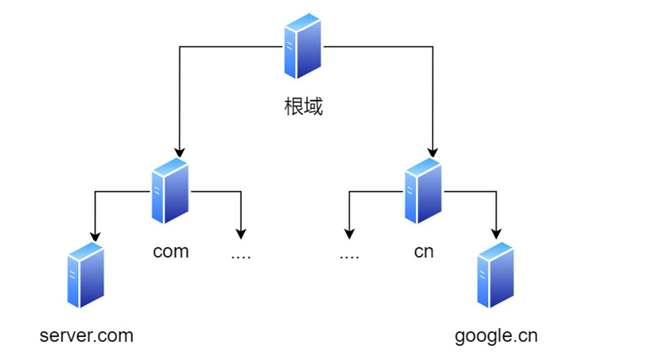

- 根 DNS 服务器：根 DNS 服务器提供 TLD 服务器的 IP 地址，不存储IP地址

- 顶级域 DNS 服务器（TLD 服务器）：`.com` 或 `.cn` 等 ；TLD 服务器提供了权威 DNS 服务器的 IP 地址，不存储IP地址

- 权威 DNS 服务器：`example.com`；存储 DNS 与 IP 地址 映射关系的记录

- 本地 DNS 服务器：每个 ISP（互联网服务提供商）都有一个自己的本地 DNS 服务器。

  **当主机发出 DNS 请求时，该请求被发往本地 DNS 服务器，它起着代理的作用，并将该请求转发到 DNS 层次结构中。**

  严格说来，不属于 DNS 层级结构。

### DNS解析过程

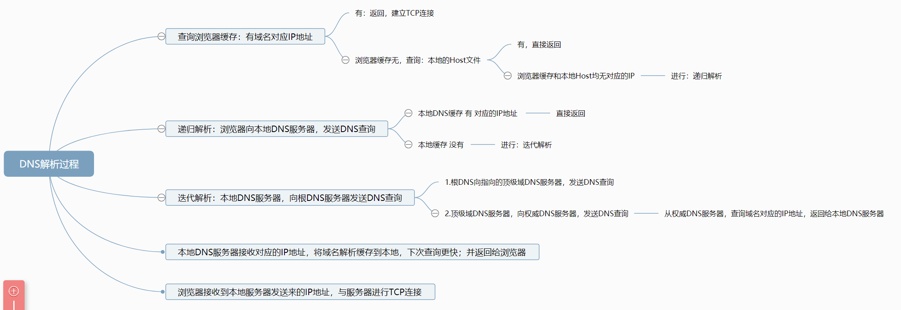


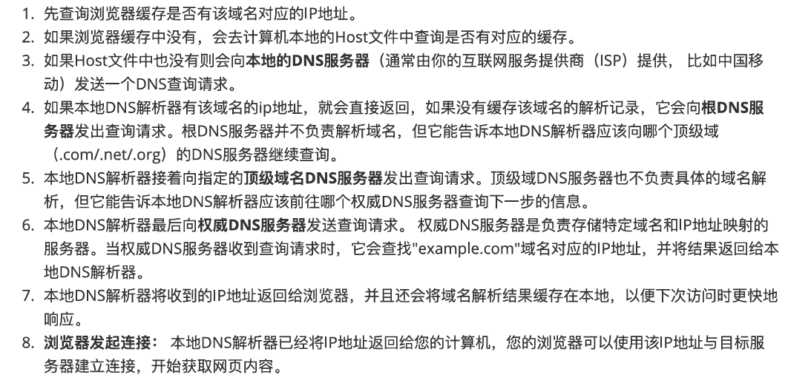

### 两种DNS查询：递归和迭代


- 相同：向上层DNS服务器，发送DNS查询请求
- 不同：递归要求完整的解析结构，迭代不要求直接提供结构
- 递归查询适合客户端；迭代查询适合DNS服务器之间通信。

**关于DNS解析过程：从请求主机到本地 DNS 服务器的查询是递归的，其余的查询时迭代的。**


## WebSocket

**WebSocket 是一种基于 TCP 连接的全双工通信协议，即客户端和服务器可以同时发送和接收数据。**

目的：实现，客户端和服务器之间都要互相主动发大量数据的场景。

### WebSocket工作原理

1. 连接：客户端与服务器通过一次 HTTP Upgrade 握手后，建立一条持久的 TCP 连接

   客户端向服务器发送一个 HTTP 请求，请求头中包含 `Upgrade: websocket` 和 `Sec-WebSocket-Key` 等字段，表示要求升级协议为 WebSocket；

   服务器收到这个请求后，会进行升级协议的操作，如果支持 WebSocket，它将回复一个 HTTP 101 状态码，响应头中包含 `Connection: Upgrade`和 `Sec-WebSocket-Accept: xxx` 等字段、表示成功升级到 WebSocket 协议。

2. 通信：客户端和服务器之间建立了一个 WebSocket 连接，可以进行双向的数据传输。

   **数据以帧（frames）的形式进行传送**，WebSocket 的每条消息可能会被切分成多个数据帧（最小单位）；

   **发送端会将消息切割成多个帧发送给接收端，接收端接收消息帧，并将关联的帧重新组装成完整的消息。**

3. 关闭：客户端或服务器可以**主动发送一个关闭帧，表示要断开连接。另一方收到后，也会回复一个关闭帧**，然后双方关闭 TCP 连接。

### WebSocket的消息格式

数据包在WebSocket中被叫做**帧**

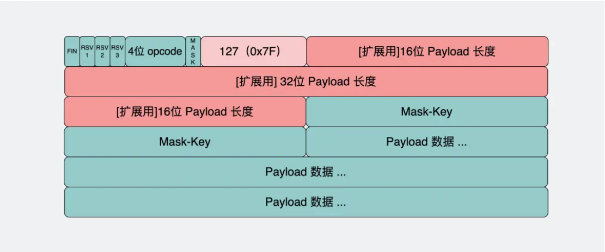

- **opcode字段**：用来标志这是个**什么类型**的数据帧
- **payload字段**：存放的是我们**真正想要传输的数据的长度**，单位是**字节**
- **payload data字段**：存放真正要传输的数据；在知道payload长度后，就可以根据这个值去截取对应的数据

WebSocket的数据格式，同http，也是**数据头（内含payload长度） + payload data** 的形式。


### WebSocket 和 HTTP/1.1  区别？

- **WebSocket 是一种双向实时通信协议，而 HTTP 是一种单向通信协议。**并且，HTTP 协议下的通信只能由客户端发起，服务器无法主动通知客户端。

- WebSocket 使用 ws:// 或 wss://（使用 SSL/TLS 加密后的协议，类似于 HTTP 和 HTTPS 的关系） 作为**协议前缀**，HTTP 使用 http:// 或 https:// 作为协议前缀。

- WebSocket **可以支持扩展**，用户可以扩展协议，实现部分自定义的子协议，如支持压缩、加密等。

- WebSocket 通信数据格式比较轻量，用于协议控制的数据包头部相对较小，**网络开销小**；

  而 HTTP 通信每次都要携带完整的头部，网络开销较大。

### WebSocket 与短轮询、长轮询的区别

这三种方式，都是为了解决“**客户端如何及时获取服务器最新数据，实现实时更新**”的问题。

**1.短轮询（Short Polling）**

- **原理**：客户端每隔固定时间（如 5 秒）发起一次 HTTP 请求，询问服务器是否有新数据，**服务器收到请求后立即响应**。
- **优点**：实现简单，兼容性好，直接用常规 HTTP 请求即可。
- 缺点：
  - **实时性一般**：消息可能在两次轮询间到达，用户需等到下次请求才知晓。
  - **资源浪费大**：反复建立/关闭连接，且大多数请求收到的都是“无新消息”，极大增加服务器和网络压力。

**2.长轮询（Long Polling）**

- **原理**：客户端发起请求后，**若服务器暂时无新数据，则会保持连接，直到有新数据或超时才响应**。客户端收到响应后立即发起下一次请求，实现“伪实时”。
- 优点：
  - **实时性较好**：一旦有新数据可立即推送，无需等待下次定时请求。
  - **空响应减少**：减少了无效的空响应，提升了效率。
- 缺点：
  - **服务器资源占用高**：需长时间维护大量连接，消耗服务器线程/连接数。
  - **资源浪费大**：每次响应后仍需重新建立连接，且依然基于 HTTP 单向请求-响应机制。

**3. WebSocket**

- **原理**：客户端与服务器通过一次 HTTP Upgrade 握手后，建立一条持久的 TCP 连接。之后，双方可以随时、主动地发送数据，实现真正的全双工、低延迟通信。
- 优点：
  - **实时性强**：数据可即时双向收发，延迟极低。
  - **资源效率高**：连接持续，无需反复建立/关闭，减少资源消耗。
  - **功能强大**：支持服务端主动推送消息、客户端主动发起通信。
- 缺点：
  - **使用限制**：需要服务器和客户端都支持 WebSocket 协议。
  - **实现麻烦**：对连接管理有一定要求（如心跳保活、断线重连等），实现起来比短轮询和长轮询要更麻烦一些。

### SSE 与 WebSocket 有什么区别？

SSE (Server-Sent Events) 和 WebSocket 都是用来**实现服务器向浏览器实时推送消息**的技术，让网页内容能自动更新，而不需要用户手动刷新。虽然目标相似，但它们在工作方式和适用场景上有几个关键区别：

1. 通信方式:
   - **SSE:** **单向通信**。只有服务器能向客户端（浏览器）发送数据。客户端不能通过同一个连接向服务器发送数据（需要发起新的 HTTP 请求）。
   - **WebSocket:** **双向通信 (全双工)**。客户端和服务器可以随时互相发送消息，实现真正的实时交互。
2. 底层协议:
   - **SSE:** 基于**标准的 HTTP/HTTPS 协议**。它本质上是一个“长连接”的 HTTP 请求，服务器保持连接打开并持续发送事件流。不需要特殊的服务器或协议支持，现有的 HTTP 基础设施就能用。
   - **WebSocket:** 使用**独立的 ws:// 或 wss:// 协议**。它需要通过一个特定的 HTTP "Upgrade" 请求来建立连接，并且服务器需要明确支持 WebSocket 协议来处理连接和消息帧。
3. 实现复杂度和成本:
   - **SSE:** **实现相对简单**，主要在服务器端处理。浏览器端有标准的 EventSource API，使用方便。开发和维护成本较低。
   - **WebSocket:** **稍微复杂一些**。需要服务器端专门处理 WebSocket 连接和协议，客户端也需要使用 WebSocket API。如果需要考虑兼容性、心跳、重连等，开发成本会更高。
4. 断线重连:
   - **SSE:** **浏览器原生支持**。EventSource API 提供了自动断线重连的机制。
   - **WebSocket:** **需要手动实现**。开发者需要自己编写逻辑来检测断线并进行重连尝试。
5. 数据类型:
   - **SSE:** **用来传输文本** (UTF-8 编码)。如果需要传输二进制数据，需要先进行 Base64 等编码转换成文本。
   - **WebSocket:** **原生支持传输文本和二进制数据**，无需额外编码。


## http && RPC

### 裸tcp的粘包问题

纯裸 TCP 收发字节流数据是**没有任何边界**的，你根本不知道到哪个地方才算一条完整消息。

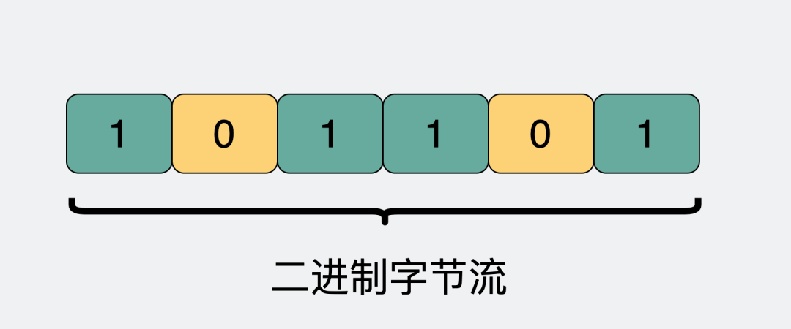

正因为这个没有**任何边界**的特点，所以当我们选择使用 TCP 发送"夏洛"和"特烦恼"的时候：

- 接收端收到的就是"夏洛特烦恼"，
- 但接收端没发区分你是想要表达"夏洛"+"特烦恼"还是"夏洛特"+"烦恼"。

纯裸 TCP 是不能直接拿来用的，你需要在这个基础上**加入一些自定义的规则，用于区分消息边界**。

**TCP 是传输层的协议**，而基于 TCP 造出来的 HTTP 和**各类** RPC 协议，它们都只是**定义了不同消息格式**的**应用层协议**而已。

### RPC 与 RPC协议

**RPC**（**R**emote **P**rocedure **C**all），又叫做**远程过程调用**。它本身并不是一个具体的协议，而是**一个完整的远程调用方案**，

它包括了：接口规范+序列化反序列化规范+通信协议等。

为了像调用本地服务器的方法一样，调用远程服务器端方法：

```text
 res = remoteFunc(req)
```

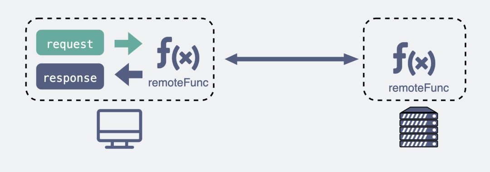

基于这个思路，大佬们造出了非常多款式的 RPC 协议，比如：`gRPC`，`thrift`

虽然大部分 RPC 协议底层使用 TCP，但实际上**它们不一定非得使用 TCP，改用 UDP 或者 HTTP，其实也可以做到类似的功能。**


### http 与 rpc 区别：有http，为什么有RPC?

#### 传输的内容(核心)

基于 TCP 传输的消息，说到底，无非都是**消息头 Header 和消息体 Body。**

**Header** 是用于标记一些特殊信息，其中最重要的是**消息体长度**。

**Body** 则是放我们真正需要传输的内容，转化为字节流由TCP传输：

- 数字，字符串 直接转化为 二进制
- 结构体 需要经过 序列号 转化为 二进制数组；接收时，再反序列化为结构体；常用方案：`json，protobuf`


如果采用HTTP协议，消息头每次都需要包含完整的头部，经常内容冗余；

如果我们用PRC，就可以自定义传输协议：采用体积更小的 Protobuf 或其他序列化协议去保存结构体数据，

同时也不需要像 HTTP 那样考虑各种浏览器行为，比如 302 临时重定向等，简化了传输的内容；

**因此性能也会更好一些，这也是在公司内部微服务中抛弃 HTTP，选择使用 RPC 的最主要原因。**


#### 服务发现


#### 底层连接形式


### HTTP/1.1

#### 报文结构


#### 拆包过程

- 当客户端发送一个HTTP请求时，会在请求头中添加"Content-Length"字段，该字段的值表示请求正文的字节数。
- 服务器在接收到请求后，会根据"Content-Length"字段的值来确定请求的长度，**并从请求中读取相应数量的字节，直到读取完整个请求内容**。

这种基于"Content-Length"字段的拆包机制可以确保服务器正确接收到完整的请求，避免了请求的丢失或截断问题。


#### 断点续传

1. 客户端开始下载一个1024K的文件，服务端发送Accept-Ranges: bytes来告诉客户端，其支持带Range的请求

2. 假如客户端下载了其中512K时候网络突然断开了，过了一会网络可以了，客户端再下载时候，需要在HTTP头中申明本次需要续传的片段：Range:bytes=512000-：通知服务端从文件的512K位置开始传输文件，直到文件内容结束

3. 服务端收到断点续传请求，从文件的512K位置开始传输，并且在HTTP头中增加：

   Content-Range:bytes 512000-/1024000,Content-Length: 512000；

   并且此时服务端返回的HTTP状态码应该是206 Partial Content。如果客户端传递过来的Range超过资源的大小,则响应416 Requested Range Not Satisfiable

断点续传中4个HTTP头不可少的，**分别是Range头（断点时进度）、Content-Range头（重传时下载进度）、Accept-Ranges头、Content-Length头**。

其中第一个Range头是客户端发过来的，后面3个头需要服务端发送给客户端。下面是它们的说明：

- **Accept-Ranges: bytes：**这个值声明了可被接受的每一个范围请求, 大多数情况下是字节数 bytes

- **Range: bytes=开始位置-结束位置：**Range是浏览器告知服务器所需分部分内容范围的消息头。

  


### HTTP/2.0

#### HTTP/2.0 vs HTTP/1.1

- **头部压缩**：HTTP/2 会**压缩头**（Header）如果你同时发出多个请求，他们的头是一样的或是相似的，那么，协议会帮你**消除重复的部分**。这就是所谓的 HPACK 算法：在客户端和服务器同时维护一张头信息表，所有字段都会存入这个表，生成一个索引号，以后就不发送同样字段了，只发送索引号，这样就**提高速度**了。
- **二进制格式**：HTTP/2 不再像 HTTP/1.1 里的纯文本形式的报文，而是全面采用了**二进制格式**，头信息和数据体都是二进制，并且统称为帧（frame）：**头信息帧（Headers Frame）和数据帧（Data Frame）**。这样虽然对人不友好，但是对计算机非常友好，因为计算机只懂二进制，那么收到报文后，**无需再将明文的报文转成二进制，而是直接解析二进制报文**，这**增加了数据传输的效率**。
- **并发传输**：引出了 Stream 概念，多个 Stream 复用在一条 TCP 连接。解决了HTTP/1.1 队头阻塞的问题：
- **服务器主动推送资源**：HTTP/2 还在一定程度上改善了传统的「请求 - 应答」工作模式，服务端不再是被动地响应，可以**主动**向客户端发送消息。


#### 二进制协议 vs  基于文本的协议

不论是二进制协议还是文本协议，底层都是以二进制（0 和 1）传输。

区别在于：**是否为了人类可读性而设计，还是为了机器高效解析而设计**。

**基于文本的协议：**

- 通过文本，如：`ASCII`，进行传输。**这些字符包括数字，大小写字母、百分号，还有回车(\r)，换行(\n)以及空格等**
- 文本协议设计的目的就是方便人们理解，读懂
- 但为了便于解析，文本协议不得不添加一些冗余的字符用于分隔命令，降低了传输的效率

**二进制协议：**

- 按 **固定字节结构** ，通过字节流传输数据（比如 Protobuf、gRPC 的自定义协议）
- 对机器友好，传输紧凑；没有多余字符，传输效率高
- 但不方便人类阅读，可读性差（抓包看到一堆 0、1）


## http的常见状态码

HTTP 状态码可分为 5 大类：

- 1XX：消息状态码
  - 100：Continue 继续；客户端应继续其请求
  - 101：Switching Protocols 切换协议，服务器根据客户端的请求切换协议。只能切换到更高级的协议
- 2XX：成功状态码
  - 200：OK 请求成功。一般用于 GET 与 POST 请求。
  - 201：Created 已创建。成功请求并创建了新的资源。
  - 202：Accepted 已接受。已经接受请求，但未处理完成。
  - 203：Non-Authoritative Information   非授权信息。请求成功，但返回的 meta 信息不在原始的服务器，而是一个副本。
  - 204：No Content 无内容。服务器成功处理，但未返回内容。
  - 205：Reset Content   重置内容。服务器处理成功，用户终端（例如：浏览器）应重置文档视图。
  - 206：Partial Content   部分内容。服务器成功处理了部分 GET 请求。
- 3XX：重定向状态码
  - **301 Moved Permanently**：资源被永久重定向了。比如你的网站的网址更换了。
  - **302 Found**：资源被临时重定向了。比如你的网站的某些资源被暂时转移到另外一个网址
- 4XX：客户端错误状态码
  - **400 Bad Request**：发送的 HTTP 请求存在问题。比如请求参数不合法、请求方法错误。
  - **401 Unauthorized**：未认证却请求需要认证之后才能访问的资源。
  - 403 Forbidden：直接拒绝 HTTP 请求，不处理。一般用来针对非法请求。
  - **404 Not Found：你请求的资源未在服务端找到**。比如你请求某个用户的信息，服务端并没有找到指定的用户。
  - 409 Conflict：表示请求的资源与服务端当前的状态存在冲突，请求无法被处理。
- 5XX：服务端错误状态码
  - **500：Internal Server Error** 服务器内部错误，无法完成请求。
  - 501：Not Implemented 服务器不支持请求的功能，无法完成请求。
  - **502：Bad Gateway** 作为网关或者代理工作的服务器尝试执行请求时，从远程服务器接收到了一个无效的响应。
  - 503：Service Unavailable 由于超载或系统维护，服务器暂时的无法处理客户端的请求。
  - **504：Gateway Time-out** 充当网关或代理的服务器，未及时从远端服务器获取请求。
  - 505：HTTP Version not supported 服务器不支持请求的HTTP协议的版本，无法完成处理。


## http vs https

- **端口号**：HTTP 默认是 80，HTTPS 默认是 443。
- **URL 前缀**：HTTP 的 URL 前缀是 `http://`，HTTPS 的 URL 前缀是 `https://`。
- **安全性和资源消耗**：
  - HTTP 协议运行在 TCP 之上，所有传输的内容都是明文，客户端和服务器端都无法验证对方的身份。**HTTPS 是运行在 SSL/TLS 之上的 HTTP 协议，SSL/TLS 运行在 TCP 之上，TCP三次握手后，仍需要SSL/TLS握手**。
  - **所有传输的内容都经过加密，加密采用对称加密，但对称加密的密钥用服务器方的证书进行了非对称加密。**所以说，HTTP 安全性没有 HTTPS 高，但是 HTTPS 比 HTTP 耗费更多服务器资源。


## https 的加密过程

**通过 非对称加密 + 对称加密 + 数字证书 实现 混合加密**

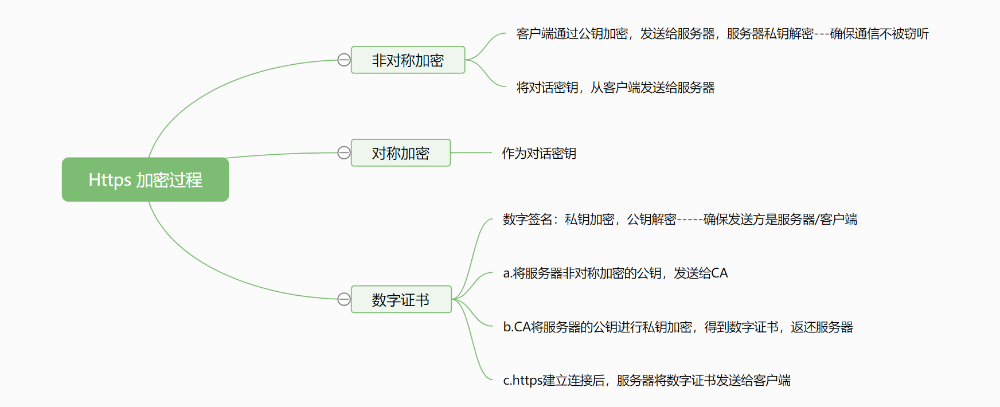

### **https 加密过程：**

1. 客户端向服务器发送 HTTPS 请求。
2. 服务器将公钥证书发送给客户端。
3. 客户端验证服务器的证书。
4. 如果验证通过，客户端生成一个用于会话的对称密钥。
5. 客户端使用服务器的公钥对对称密钥进行加密，并将加密后的密钥发送给服务器。
6. 服务器使用私钥对客户端发送的加密密钥进行解密，得到对称密钥。
7. 服务器和客户端使用对称密钥进行加密和解密数据传输。

****

### **设计原理：**

HTTP **S** 在 HTTP 与 TCP 层之间加入了 `SSL/TLS` 协议，可以很好的解决了：

- 窃听危机（通信不安全）：采用 非对称加密+对称加密 实现 **信息加密**
- 篡改危机（服务器被篡改）：采用  摘要算法+数字签名 实现 **校验**
- 冒充危机（服务器被冒充）：采用  数字签名+数字证书 实现 **身份证书**

#### **非对称加密+对称加密：**

- 通信建立前：非对称加密交换 客户端生成的用于对话的对称密钥

- 通信过程中：对称加密 交换 通信数据

- **为什么采用 非对称加密+对称加密？**

  - 对称加密：使用一个密钥，运算速度快，但无法保证密钥交换时是否泄漏；

  - 非对称加密：使用两个密钥，公钥加密，私钥解密，解决了密钥交换的安全性问题；但速度慢。

非对称加密的两种用法：

- **公钥加密，私钥解密**。这个目的是为了 **保证内容传输的安全**，因为被公钥加密的内容，其他人是无法解密的，只 **有持有私钥的人，才能解密出实际的内容**；
- **私钥加密，公钥解密**。这个目的是为了 **保证消息不会被冒充**，因为私钥是不可泄露的，如果公钥能正常解密出私钥加密的内容，就能证明这个 **消息是来源于持有私钥身份的人发送的**。

****

#### **数字签名：用于 CA 校验服务器身份**

- 先通过 **摘要算法（哈希函数）来计算出内容的哈希值**，这个哈希值是唯一的，且无法通过哈希值推导出内容。
- 通过 **「私钥加密，公钥解密」的方式，即数字签名**，对 **内容的哈希值加密**。
- **将 哈希值 和 数字签名 一起发送** 给服务器，比较解密后的数字签名 和 哈希值 是否相同
  - 相同，说明数据没有被篡改
  - 不相同，说明被篡改

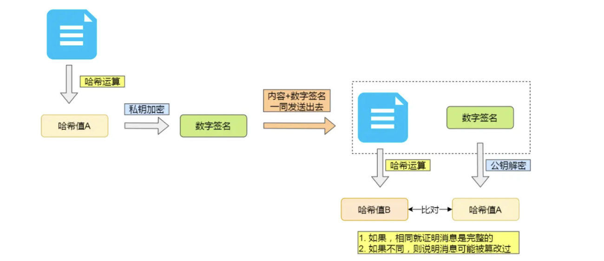

#### **身份证书：**

**中间人冒充(用自己的公钥和私钥，偷取客户端生成的对称密钥)：**

1. 某网站有用于非对称加密的公钥 A、私钥 A’。
2. 浏览器向网站服务器请求，服务器把公钥 A 明文给传输浏览器。
3. **中间人劫持到公钥 A，保存下来，把数据包中的公钥 A 替换成自己伪造的公钥 B（它当然也拥有公钥 B 对应的私钥 B’）**。
4. 浏览器生成一个用于对称加密的密钥 X，用 **公钥 B**（浏览器无法得知公钥被替换了）加密后传给服务器。
5. **中间人劫持后用私钥 B’解密得到密钥 X，再用公钥 A 加密后传给服务器**。
6. 服务器拿到后用私钥 A’解密得到密钥 X。

为了防止中间人冒充，我们需要确认服务器的真伪，采用数字证书 +数字签名

**数字证书的工作流程：**

1. 服务器将公钥注册到 CA（数字证书颁发机构）

2. **CA 用自己的私钥加密服务器的公钥得到数字签名，并颁发数字证书**

3. **客户端拿到服务器的数字证书后，用 CA 的公钥确认服务器的真伪**

   - 引入校验机制：对服务器端的数据进行数字签名，确保是服务器端发送的数据

4. 从数字证书的服务器公钥，对客户端请求加密发送给服务器

   

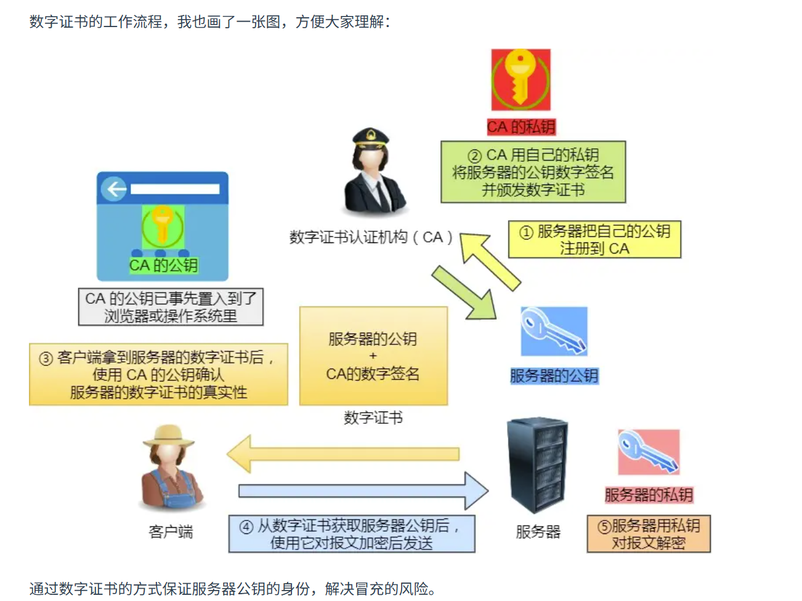


## HTTPS四次（TLS）握手

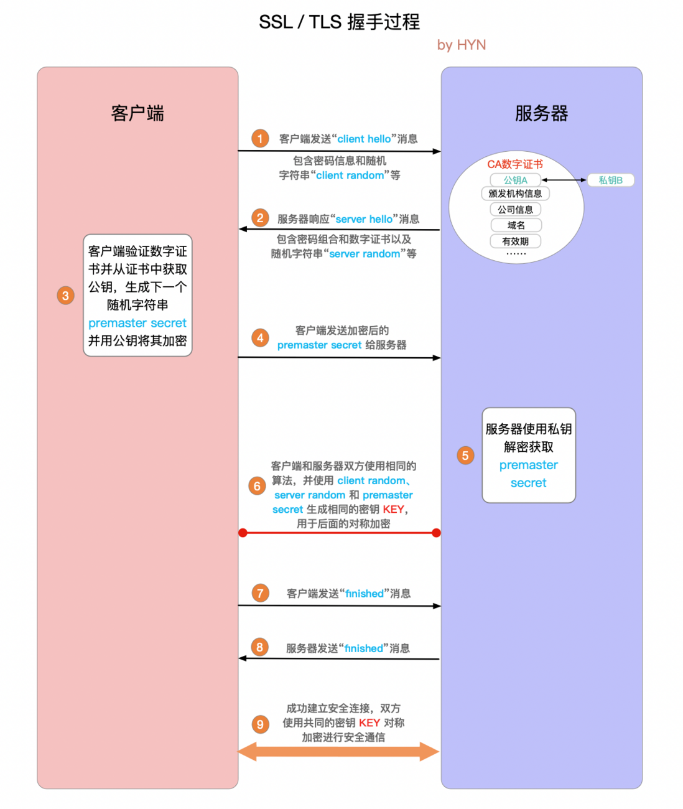

SSL / TLS 握手详细过程

1. **"client hello"消息：**客户端通过发送"client hello"消息向服务器发起握手请求，该消息包含了客户端所支持的 TLS 版本和密码组合以供服务器进行选择，还有一个"client random"随机字符串。
2. **"server hello"消息：**服务器发送"server hello"消息对客户端进行回应，该消息包含了数字证书，服务器选择的密码组合和"server random"随机字符串。
3. **验证：**客户端对服务器发来的证书进行验证，确保对方的合法身份，验证过程可以细化为以下几个步骤：
   1. 检查数字签名
   2. 验证证书链：证书链，也称为证书路径，是用于认证实体合法身份的证书列表；HTTPS 通信中，为了验证服务器的合法身份。
   3. 检查证书的有效期
   4. 检查证书的撤回状态 (撤回代表证书已失效)
4. **"premaster secret"字符串：**客户端向服务器发送另一个随机字符串"premaster secret (预主密钥)"，这个字符串是经过服务器的公钥加密过的，只有对应的私钥才能解密。
5. **使用私钥：**服务器使用私钥解密"premaster secret"。
6. **生成共享密钥**：客户端和服务器均使用 client random，server random 和 premaster secret，并通过相同的算法生成相同的共享密钥 **KEY**。
7. **客户端就绪：**客户端发送经过共享密钥 **KEY**加密过的"finished"信号。
8. **服务器就绪：**服务器发送经过共享密钥 **KEY**加密过的"finished"信号。
9. **达成安全通信：**握手完成，双方使用对称加密进行安全通信。


## TCP 三次握手


### 三次握手流程：


**一次握手**: 客户端发送带有 SYN（SEQ = x） 标志的数据包 -> 服务端，然后客户端进入 **SYN_SEND** 状态，等待服务端的确认；

**二次握手**: 服务端发送带有 SYN+ACK(SEQ = y, ACK = x+1) 标志的数据包 –> 客户端, 然后服务端进入 **SYN_RECV** 状态；

**三次握手**: 客户端发送带有 ACK(ACK = y+1) 标志的数据包 –> 服务端，然后客户端和服务端都进入 **ESTABLISHED** 状态，完成 TCP 三次握手。

SYN 报文 发送的是 客户端/服务器 随机生成的序列号；通过 ACK 确认的方式，保证：客户端向服务器 或者 服务器向客户端 通信 正常


### 为什么要三次握手？

**三次握手最主要的目的就是双方确认自己与对方的发送与接收是正常的。**

**第一次握手**：Client 什么都不能确认；Server 确认了对方发送正常，自己接收正常

**第二次握手**：Client 确认了：自己发送、接收正常，对方发送、接收正常；Server 确认了：对方发送正常，自己接收正常

**第三次握手**：Client 确认了：自己发送、接收正常，对方发送、接收正常；Server 确认了：自己发送、接收正常，对方发送、接收正常


### 为什么不能是二次握手，或者四次握手？

**四次握手：**


将第一次握手：

- A 生成序列号发送同步信号 SYN，将 SYN 报文发送给服务器；----客户端发送正常
- 等待服务器接收与发送；------服务器接收正常

分为两步，可以合并成一步。

**两次握手：**


**缺少 客户端向服务器发送 ACK 报文，服务器无法确认：自己的发送正常，对方的接收正常。** 无法确保 TCP 连接的双向通信


### 什么是半连接队列和全连接队列？

在 TCP 三次握手过程中，Linux 内核会维护两个队列来管理 TCP 连接请求：

第一个是「半连接队列」，存放那些收到 SYN 后等待最后确认 ACK 的连接（状态 SYN_RECV）；

当收到客户端 ACK 后，连接会移动到「全连接队列」，等待应用层 `accept()` 取出连接。

1. **半连接队列**（也称 SYN Queue）：
   - 当服务端收到客户端的 **SYN** 报文后，就会在内核中为这个请求分配一个**半连接控制块**，并放到半连接队列中。
   - 这时连接的状态是 `SYN_RECV`（服务端收到 SYN，发出 SYN+ACK，等待客户端最后的 ACK）。
   - 如果客户端迟迟不发 ACK，或者丢包，就会一直停留在半连接队列里，并且服务端会进行重传（指数退避）。
2. **全连接队列**（也称 Accept Queue）：
   - 当服务端收到客户端最终的 **ACK** 报文后，三次握手完成，连接正式建立。
   - 此时，内核会把这个连接从半连接队列转移到 **全连接队列**（也叫 Accept 队列）。
   - 应用层通过调用 `accept()` 函数来从全连接队列中取出一个已建立好的连接。


## TCP 四次挥手

### 四次挥手流程：


**第一次挥手**：客户端发送一个 FIN（SEQ=x） 标志的数据包->服务端，用来关闭客户端到服务端的数据传送。

然后客户端进入 **FIN-WAIT-1** 状态。

**第二次挥手**：服务端收到这个 FIN（SEQ=X） 标志的数据包，它发送一个 ACK （ACK=x+1）标志的数据包->客户端 。

然后服务端进入 **CLOSE-WAIT** 状态，客户端进入 **FIN-WAIT-2** 状态。

**第三次挥手**：服务端发送一个 FIN (SEQ=y)标志的数据包->客户端，请求关闭连接，然后服务端进入 **LAST-ACK** 状态。

**第四次挥手**：客户端发送 ACK (ACK=y+1)标志的数据包->服务端，然后客户端进入**TIME-WAIT**状态，服务端在收到 ACK (ACK=y+1)标志的数据包后进入 CLOSE 状态。此时**如果客户端等待 2MSL 后依然没有收到回复，就证明服务端已正常关闭，随后客户端也可以关闭连接了，进入CLOSE状态**。

### 为什么进行四次挥手：

**TCP 是全双工通信，可以双向传输数据。**

- **任何一方都可以在数据传送结束后发出连接释放的通知，待对方确认后进入半关闭状态；----第一次FIN-ACK**
- **当另一方也没有数据再发送的时候，则发出连接释放通知，对方确认后就完全关闭了 TCP 连接----第二次FIN-AC**K

举个例子：A 和 B 打电话，通话即将结束后。

1. **第一次挥手**：A 说“我没啥要说的了”
2. **第二次挥手**：B 回答“我知道了”，但是 B 可能还会有要说的话，A 不能要求 B 跟着自己的节奏结束通话
3. **第三次挥手**：于是 B 可能又巴拉巴拉说了一通，最后 B 说“我说完了”
4. **第四次挥手**：A 回答“知道了”，这样通话才算结束


### 为什么不能把服务端发送的 ACK 和 FIN 合并起来，变成三次挥手？

因为服务端收到客户端断开连接的请求时，可能还有一些数据没有发完，这时先回复 ACK，表示接收到了断开连接的请求。

等到数据发完之后再发 FIN，断开服务端到客户端的数据传送。


### 如果第二次挥手时服务端的 ACK 没有送达客户端，会怎样？

客户端没有收到 ACK 确认，会重新发送 FIN 请求。


### 为什么第四次挥手客户端需要等待 2*MSL时间后才进入 CLOSED 状态？

第四次挥手时，客户端发送给服务端的 ACK 有可能丢失，如果服务端因为某些原因而没有收到 ACK 的话，服务端就会重发 FIN，如果客户端在 2*MSL 的时间内收到了 FIN，就会重新发送 ACK 并再次等待 2MSL，**防止 Server 没有收到 ACK 而不断重发 FIN**

> **MSL(Maximum Segment Lifetime)** 报文段最长寿命: 一个片段在网络中最大的存活时间，2MSL 就是一个发送和一个回复所需的最大时间。如果直到 2MSL，Client 都没有再次收到 FIN，那么 Client 推断 ACK 已经被成功接收，则结束 TCP 连接。


### 为什么要有TIME_WAIT状态？


## TCP && UDP

### TCP 与 UDP 区别

**TCP（传输控制协议）：**

- **面向连接**：TCP是面向连接的协议。**在发送数据之前，必须先建立一个连接**。
- **可靠**：TCP提供可靠的传输，通过三次握手建立连接，**通过确认和重传机制保障数据的完整性和有序性**
  - **有序性**：TCP**保证数据包按发送顺序传输，并在接收端按相同顺序重组**。

- **基于字节流：**  **面向字节流的协议；每个TCP连接都有一个数据包大小限制（MSS，最大报文段大小）**
  - TCP 头部占20 个字节以上
- **滑动窗口**：TCP**具备流量控制和拥塞控制机制，确保网络不被过载**。
- **传输速度：**较慢，因需要三次握手建立连接，并为了确保可靠性，存在重传和确认机制。
- **应用场景：**适用于对数据传输可靠性和准确性要求较高的应用，如网页浏览、文件传输（FTP）、电子邮件（SMTP）、数据库同步等。


**UDP（用户数据报协议）：**

- **无连接**：**UDP是无连接的**协议，在发送数据之前无需建立连接。
- **不可靠**：UDP提供**不可靠的数据传输**，**不保证数据的完整性和顺序。**
- **基于报文：** **面向报文的协议；支持数据包，但每个UDP数据报的大小通常应在网络最大传输单元（MTU）范围内**
  - UDP头部占8个字节
- **无流量控制**：UDP不具备流量控制和拥塞控制机制，发送方可以毫无节制地发送数据。
- **传输速度：**较快，无需建立连接，亦没有重传和确认机制，适合实时应用。
- **应用场景：**适用于对传输速度和效率要求较高，但对可靠性要求较低的应用，如实时视频、音频流（VoIP）、在线游戏、DNS查询等


### TCP 思维导图

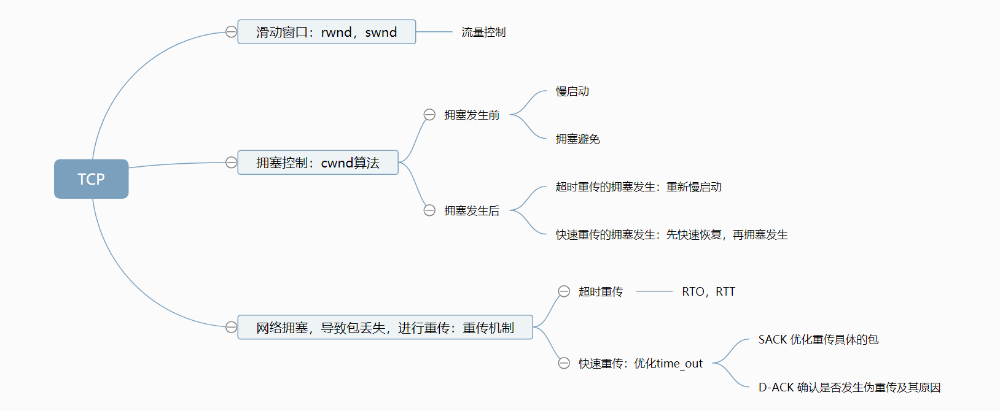

### TCP 重传机制

TCP 常见的重传机制分为：超时重传，快速重传，SACK，D-SACK

而所有重传的机制都需要依赖通过序列号Seq与确认应答ACK。

在 TCP 中，当发送端的数据到达接收主机时，接收端主机会返回一个确认应答消息，表示已收到消息。

- Seq 序列号：本报文第一个字节在发送发字节流中的序号
- Ack 确认号：表示「我已经顺序收到了 **从第一个字节开始，直到 Ack-1** 的所有数据」，下一个希望收到的字节是 Ack。
- Seq Ack 原因：TCP 是面向 **字节流** 的协议，要保**证数据顺序正确、完整、无丢失，就需要对每个字节编号**

****

#### 超时重传

发送端发了1,2,3,4,5一共五份数据，接收端收到了1，2，于是回ack 3，然后收到了4（注意此时3还没收到），此时的TCP会怎么办？

**超时重传的处理方式：**接收端上次ack与本地seq不同时，会不再回复ack；发送端死等ack，当发送端发现ack超时后，会重传对应的ack

**TCP 会在以下两种情况发生超时重传：** ----- D-SACK 判断具体触发情况

- 数据包丢失
- 确认应答丢失

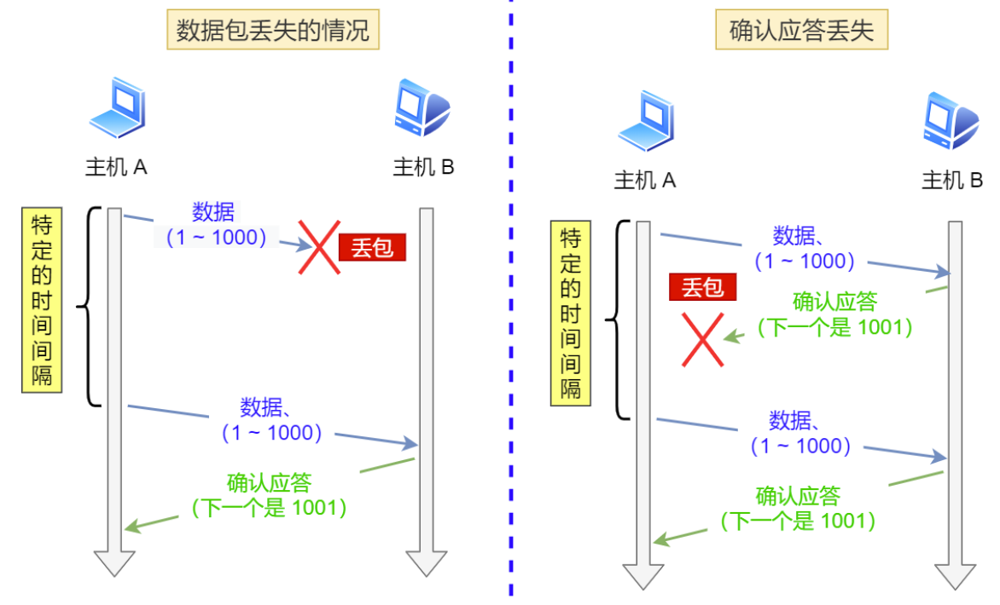

**超时时间：**

RTT 报文往返时间：**数据从网络一端传送到另一端所需的时间**


RTO 超时重传时间：**超时重传时间 RTO 的值应该略大于报文往返 RTT 的值**


如果超时重发的数据，再次超时的时候，又需要重传的时候，TCP 的策略是**超时间隔加倍。**

即：**每当遇到一次超时重传的时候，都会将下一次超时时间间隔设为先前值的两倍。两次超时，就说明网络环境差，不宜频繁反复发送。**


**超时重传存在的问题是：**超时周期可能相对较长。 「快速重传」机制来解决超时重发的时间等待。

****

#### 快速重传


**快速重传的处理方式：**接收端如果没有收到期望的数据，而收到后续乱序的包，也给客户端回复 ACK，只不过是重复的 ACK，回复相同的ACK三次以后触发快速重传。

也就是说，**如果：接收方包没有连续到达，就ack最后那个可能被丢了的包；如果发送方连续收到3次相同的ack，就重传。**


**快速重传存在的问题：**快速重传解决的超时时间比较长的问题；但没有解决：**重传之前的一个还是重传所有的问题---->SACK解决**

****

#### SACK 选择性确认

SACK（Selective Acknowledgment）：

**在快速重传的基础上，ACK 返回最近收到的报文段的序列号范围**；这样客户端就知道，哪些数据包已经到达服务器了。


**接收缓冲区如何保证接收有序:**

- 发送方每发一段数据，都会标一个 **Seq（序列号）**，表示这段数据在整个字节流中的相对位置；

- 接收方根据 **序列号**，知道这块数据该拼在哪里，是否缺块、是否乱序

- 接收方的 TCP 模块维护一个**接收缓冲区**，用来「缓存乱序到达的段」，并等待把它们拼成完整、有序的字节流

- TCP 收到数据后并不会「立即」交给应用层，而是先放到接收缓冲区中；

  应用层通过 `read()` 或 `recv()` 等系统调用从缓冲区中「取」；

  当没有新的有序数据可读时，应用层调用会阻塞（或返回 EAGAIN，取决于是否非阻塞）。

****

#### D-SACK 重复SACK

D-SACK：在 SACK 的基础上，**发送给接收方的ACK额外携带信息：接收方哪些数据包重复接收了**。

**D-SACK 的目的**是：帮助发送方判断，**是否发生了伪重传及其原因：包失序、ACK 丢失、包重复**

> **伪重传：**发送方**以为对方没收到数据，所以又重发了数据，其实接收方已经收到了**
>
> 包重复：**发送方**只发了一次，但**接收方收到了多次**，这是 **网络层** 出现了包复制
>
> 包失序：由于 IP 层并不能保证数据包的有序性，每个数据包的发送都可能会选择当前情况传输速度最快的链路。
>
> 所以很有可能出现发送了 A - > B -> C 的三个数据包，到达接收端的数据包顺序是 C -> A -> B 或者 B -> C -> A 等等。
>
> **伪重传发生原因：**
>
> 
>
> - 包失序：发送方 和 接收方 都 1次
> - ACK丢失：发送方 发送多次，接收方接收多次
> - 包重复：发送发 发送 1 次，接收方接收多次

D-SACK 的 好处：

1. 可以让「发送方」知道，是数据包丢失，还是接收方回应的 ACK 丢失;
2. 可以知道是不是「发送方」的数据包被网络延迟了;
3. 可以知道网络中是不是把「发送方」的数据包给复制了;

**ACK丢失/数据包丢失：**

发送方发生超时重传：

- 接收方：接收到重复数据 ------  ACK 丢失
- 接收方：第一次数据 ----- 数据包丢失


**网络延时：**


### TCP 滑动窗口

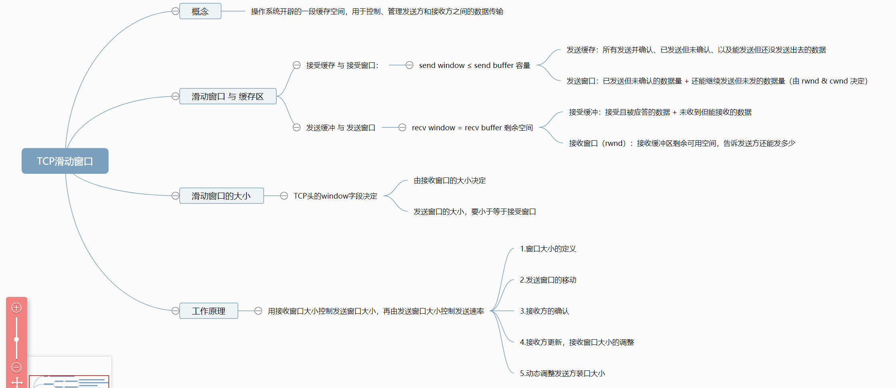

**概念：**操作系统开辟的一段缓冲空间，用于**控制、管理发送方和接收方之间的数据传输**

**滑动窗口与缓冲区：**

- **发送窗口与发送缓冲区：**

  发送缓冲区：由1~3组成

  发送窗口：由2~3组成

  

- **接收窗口与接收缓冲区：**

  接收缓冲区：由1~2组成

  接收窗口：2组成

  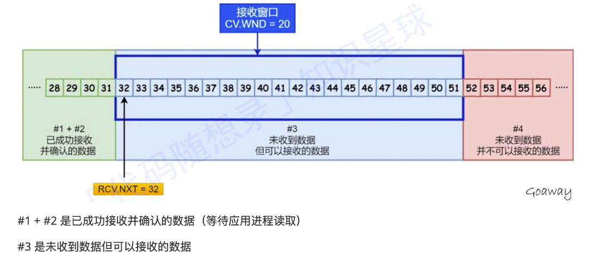

**滑动窗口的大小：**


**滑动窗口的工作原理：**

1. 建立连接，定义窗口大小：
   - 双方协商「接收窗口大小 rwnd」（指接收缓冲区容量）。
   - 设置初始「拥塞窗口 cwnd」。
   - 发送窗口 swnd = min(rwnd, cwnd)。
2. 发送数据时，发送窗口前移：
   - 发送方发送数据段，收到 ACK 后「滑动窗口」前移，已确认的数据不再占用窗口。
3. 发送方返回接收确认号：
   - 接收方根据报文段序列号，确认哪些字节收到了。
   - 返回 **ACK 确认号**，表示期望收到的下一个字节号。
4. 发送方返回窗口大小：
   - 接收方根据缓冲区剩余，动态更新「接收窗口大小」。
   - 在 ACK 包里告知发送方新的窗口大小。
5. 接收方动态调整：
   - 接收窗口大 ➜ 发送方可多发数据。
   - 接收窗口小 ➜ 发送方必须减少发送量，防止接收方被撑爆。

### TCP 流量控制  && 拥塞控制

#### TCP 流量控制

TCP使用窗口机制来实现流量控制的。

**流量控制的原理**是：

- 在通信过程中，接收方根据自己接收缓存的大小，动态调整发送方的发送窗口大小，

  即TCP报文段首部中的“窗口”字段rwnd,来限制发送方向网络注入报文的速率。

- 同时，发送方根据其对当前网络拥塞程序的估计确定一个拥塞窗口cwnd，最终A发送的窗口的实际大小是min(rwnd,cwnd)值

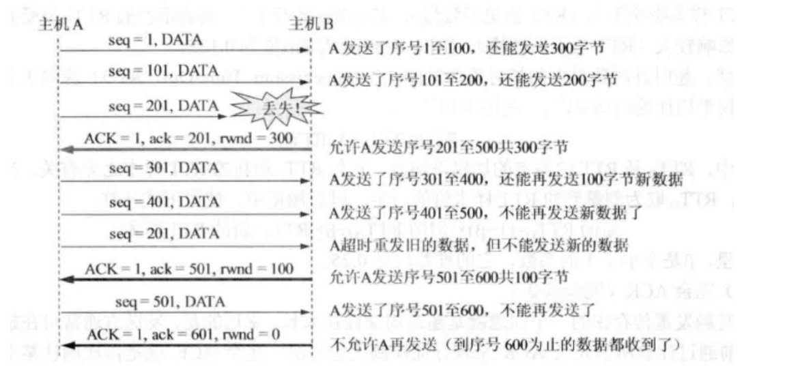

####  拥塞控制

**拥塞控制目的：**防止过多的数据注入网络中，这样可以使网络中的路由器或链路不致过载


****

**维护拥塞窗口的四种算法：** 慢启动，拥塞避免，拥塞发生，快速恢复

**慢启动：**

TCP刚建立连接，先令拥塞窗口cwnd=1；

- `cwnd < 阈值ssthresh`：cwnd采用慢启动算法
  - 发送方每收到一个ACK，就将cwnd加1；
  - 即：每经过一个传输轮次（即往返RTT)，拥塞窗口cwnd就会加倍，即呈指数形式增加
- `cwnd >=  阈值ssthresh`：cwnd采用拥塞避免算法

**拥塞避免：**

`cwnd >=  阈值ssthresh`，cwnd采用拥塞避免算法：

- 发送方每收到一个ACK，就会将cwnd 加 $1/cwnd$ 个
- 即：cwnd每经过一个往返RTT，按线性规律缓慢增长

改用拥塞避免后，网络拥塞逐渐发生，会发生丢包现象，导致网络重传。

触发重传后，cwnd会采用拥塞发生算法

**拥塞发生：**

发生网络阻塞，会导致数据包重传，重传可以用用两种方式：

- 超时重传的拥塞发生

  cwnd采用乘法减少+慢启动：

  - `新阙值ssthresh = 原cwnd/2 `

  - `新cwnd = 1`

    重新进行一轮：慢启动+拥塞避免

  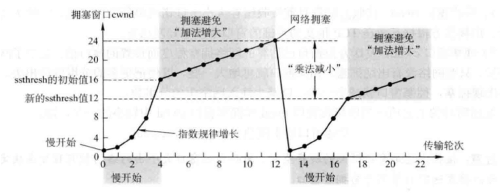

- 快速重传的拥塞发生

   cwnd采用快速恢复算法：乘法减法 + 拥塞避免

  - `新阙值ssthresh = 新cwnd= 原cwnd/2`

  - `新cwnd = 原cwnd/2`

    cwnd在快速恢复后，采用拥塞避免

    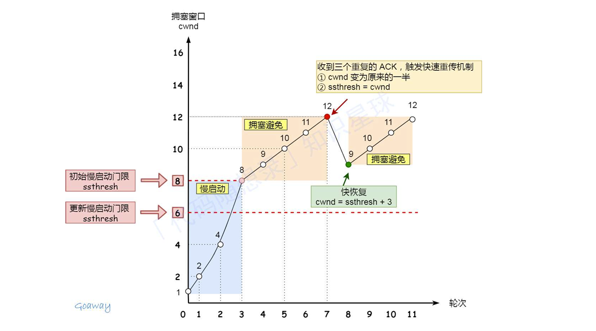


**快速恢复：**

快重传和快恢复算法一般同时使用

1. 快重传
   当发送方连续收到三个重复的ACK报文，直接重传对方尚未收到的报文段，而不必等待那个报文段设置的重传计时器超时。
2. 快恢复
   


## ARP协议

ARP 协议的全称是 `Address Resolution Protocol(地址解析协议)`，

它是一个通过**用于实现从 IP 地址到 MAC 地址的映射，即询问目标 IP 对应的 MAC 地址** 的一种协议

**MAC 地址有一个特殊地址：FF-FF-FF-FF-FF-FF（全 1 地址），该地址表示广播地址**

解决的是网络层地址和链路层地址之间的转换问题。因为一个 IP 数据报在物理上传输的过程中，总是需要知道下一跳（物理上的下一个目的地）该去往何处，但 **IP 地址属于逻辑地址，而 MAC 地址才是物理地址，ARP 协议解决了 IP 地址转 MAC 地址的一些问题**。

#### ARP协议的工作原理

ARP 协议工作时有一个大前提，那就是 **ARP 表**。

在一个局域网内，**每个网络设备都自己维护了一个 ARP 表，ARP 表记录了某些其他网络设备的 IP 地址-MAC 地址映射关系，该映射关系以 `<IP, MAC, TTL>` 三元组的形式存储**。其中，TTL 为该映射关系的生存周期，典型值为 20 分钟，超过该时间，该条目将被丢弃。

ARP 的工作原理将分两种场景讨论： **「广播问 MAC，单播告诉 MAC」**

1. **同一局域网内的 MAC 寻址**：直接广播要找目标主机 MAC
2. **从一个局域网到另一个局域网中的网络设备的寻址**：先广播找网关 MAC，再在网关中由目标IP找目标MAC

ARP 分组有两类：一种是查询分组，另一种是响应分组；

它们具有相同的格式，均包含了发送和接收的 IP 地址、发送和接收的 MAC 地址。


**同一局域网内的MAC地址查询：**

- 主机 A 想发 IP 数据给主机 B，只知道 B 的 IP，不知道 B 的 MAC

- 查询本地 ARP 表，没有就发出 **ARP 请求（广播）**

  - 主机 A 将构造一个 ARP 查询分组，并将其广播到所在的局域网中

  - 查询分组中：发送的 IP 地址，即为主机 A 的 IP 地址，接收的 IP 地址即为主机 B 的 IP 地址；

  - 发送的 MAC 地址也是主机 A 的 MAC 地址，但接收的 MAC 地址绝不会是主机 B 的 MAC 地址，

    而是一个特殊值——`FF-FF-FF-FF-FF-FF`；该 MAC 地址是广播地址，查询分组将广播给该局域网内的所有设备。

- 同网段所有主机收到请求，只有 IP 匹配的 B 回复 **ARP 响应（单播）**

  - ARP 响应分组：发送IP：B的IP，接收IP：A的IP
  - 发送的 MAC 地址为B本身，目标 MAC 地址为查询分组的发送者A
  - ARP 响应分组只有一个目的地，单播而非广播。

- 主机 A 收到响应后，更新 ARP 表，保存 B 的 IP ↔ MAC 映射

- 后续就能直接通过 MAC 单播发送数据了

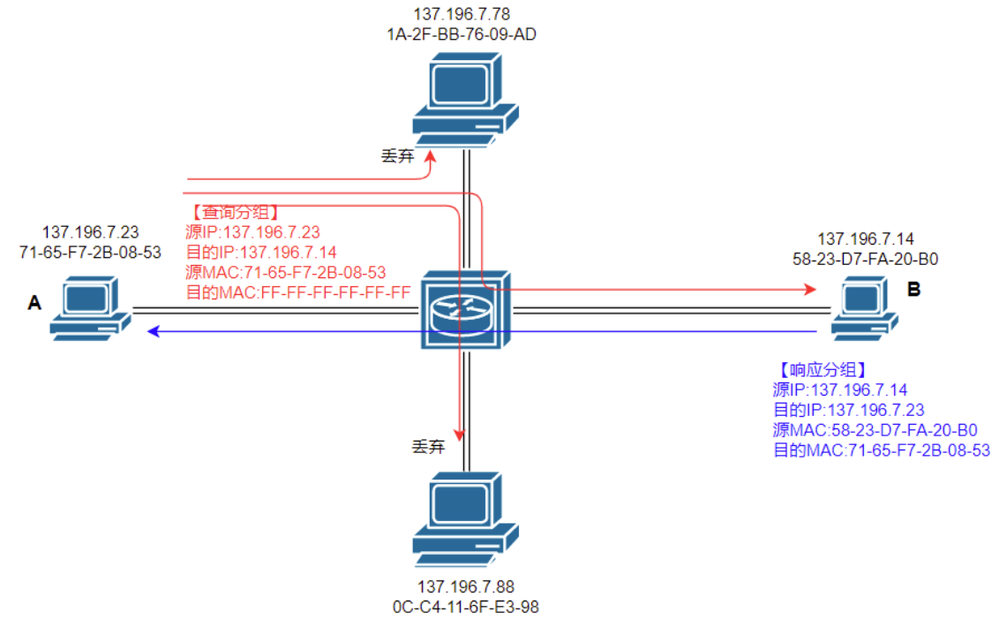

**不同局域网内的MAC地址查询：**

- A 查询自己的 ARP 表，看看有没有 目标路由器的MAC地址
  - 目标路由器指的是，根据目的主机 B 的 IP 地址，分析出 B 所在的子网，能够把报文转发到 B 所在子网的那个路由器。
- 没有就发送 ARP 请求（**同样是广播，但只在本子网内有效**），问询到该 MAC 地址
  - 由于目标接口与主机 A 在同一个子网内，该过程与同一局域网内的 MAC 寻址相同。
- 得到网关接口的 MAC 后，A 构造 **IP 数据报**：源 IP = A，目的 IP = B
- 同时封装 **链路层帧**：源 MAC = A，目的 MAC = 网关接口的 MAC，**单播发给路由器**
- 路由器收到后，**根据 B 的 IP 查找路由表，找到 B 所在子网**
- 在 B 子网内，路由器接口查 ARP 表，看有没有 B 的 MAC
- 如果没有，再次 ARP 请求（此时是路由器接口的子网本地广播）
- **获取后再重新封装链路层帧**，目的 MAC = A 的 MAC，单播给 A


